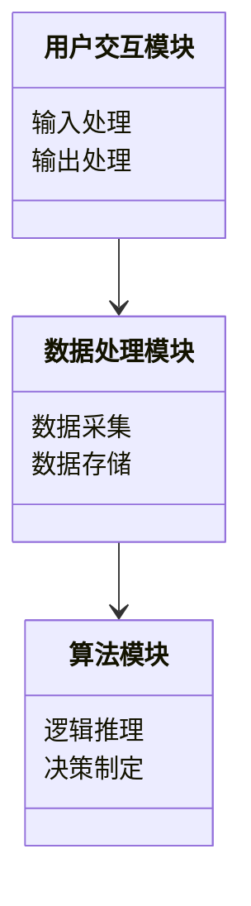

                 


# 企业如何识别AI Agent的应用需求

> 关键词：AI Agent、需求识别、企业应用、自然语言处理、知识图谱、系统架构、项目实战

> 摘要：本文详细探讨了企业在识别AI Agent需求时的关键步骤和方法。从AI Agent的基本概念出发，分析其在企业中的应用背景和趋势，详细介绍需求识别的方法论、技术实现的核心算法、系统架构设计、项目实战案例，最后总结了企业应用AI Agent的需求识别过程中的注意事项和未来展望。

---

## 第一部分: 企业如何识别AI Agent的应用需求

### 第1章: AI Agent的基本概念与背景

#### 1.1 AI Agent的定义与核心能力

##### 1.1.1 什么是AI Agent
AI Agent（人工智能代理）是指能够感知环境、自主决策并执行任务的智能实体。它能够通过传感器获取信息，利用推理能力解决问题，并通过执行器与外部环境交互。AI Agent的核心在于其智能性，能够适应变化的环境并优化自身行为。

##### 1.1.2 AI Agent的核心能力
AI Agent的核心能力包括：
1. **感知能力**：通过传感器或数据输入感知环境状态。
2. **推理能力**：基于感知的信息进行逻辑推理，得出解决方案。
3. **决策能力**：在多种选择中做出最优决策。
4. **学习能力**：通过经验或数据不断优化自身的算法和行为。

##### 1.1.3 AI Agent与传统软件的区别
与传统软件相比，AI Agent具有以下特点：
1. **自主性**：能够自主决策，无需人工干预。
2. **反应性**：能够实时感知环境并做出反应。
3. **学习性**：能够通过数据和经验不断优化自身性能。
4. **适应性**：能够适应环境的变化并调整行为策略。

#### 1.2 企业应用AI Agent的背景与趋势

##### 1.2.1 企业数字化转型的现状
随着数字化转型的深入推进，企业越来越依赖智能化系统来提高效率和竞争力。AI Agent作为智能化的核心技术之一，正在成为企业数字化转型的重要工具。

##### 1.2.2 AI Agent在企业中的应用趋势
AI Agent在企业中的应用呈现以下趋势：
1. **智能化交互**：通过自然语言处理技术，实现人与机器的自然对话。
2. **自动化决策**：在供应链、销售等领域，AI Agent能够自动优化决策过程。
3. **个性化服务**：基于用户行为和偏好，提供个性化的服务和推荐。

##### 1.2.3 企业采用AI Agent的优势与挑战
优势：
1. **提高效率**：通过自动化和智能化手段，减少人工干预，提高效率。
2. **增强用户体验**：通过个性化的服务和自然的交互方式，提升用户满意度。
3. **数据驱动决策**：利用大数据分析能力，提供更精准的决策支持。

挑战：
1. **技术复杂性**：AI Agent涉及多学科技术，企业需要具备较强的技术实力。
2. **数据隐私问题**：AI Agent需要处理大量敏感数据，数据隐私和安全问题需要严格保障。
3. **成本投入**：AI Agent的开发和维护需要较高的成本，企业需要进行长期投入。

#### 1.3 本章小结
本章从AI Agent的基本概念出发，分析了其在企业中的应用背景和趋势，并探讨了企业在采用AI Agent时的优势与挑战。接下来将详细介绍如何在企业中识别AI Agent的需求。

---

### 第2章: 识别AI Agent需求的方法论

#### 2.1 需求识别的基本步骤

##### 2.1.1 明确业务目标
需求识别的第一步是明确企业的业务目标。企业需要回答以下问题：
1. 我们希望通过AI Agent实现什么目标？
2. 这些目标如何与企业的整体战略相结合？

##### 2.1.2 分析业务流程
在明确业务目标后，需要对企业的业务流程进行详细分析。这一步骤的目的是识别哪些环节可以通过AI Agent实现自动化或优化。例如：
- 客户服务流程中的问题解答
- 供应链管理中的库存监控
- 销售预测和市场分析

##### 2.1.3 评估技术可行性
在分析业务流程后，需要评估技术可行性。这包括：
1. **数据 availability**：是否有足够的数据支持AI Agent的运行。
2. **技术能力**：企业是否有足够的技术能力和资源来开发和维护AI Agent。
3. **成本评估**：开发和维护AI Agent的成本是否在企业的预算范围内。

#### 2.2 AI Agent需求的特征与分类

##### 2.2.1 需求的特征分析
AI Agent的需求具有以下特征：
1. **智能化**：需求必须涉及智能化的处理，例如自然语言理解、决策优化等。
2. **自动化**：需求必须能够通过自动化的方式完成任务，减少人工干预。
3. **实时性**：部分需求需要实时响应，例如实时客服支持。

##### 2.2.2 需求的分类与优先级
AI Agent的需求可以分为以下几类：
1. **关键业务需求**：直接影响企业核心业务流程的需求，优先级最高。
2. **辅助性需求**：辅助企业日常运营的需求，优先级次之。
3. **创新性需求**：探索新的业务模式或服务的需求，优先级最低。

##### 2.2.3 需求的边界与外延
在识别需求时，需要明确需求的边界和外延。例如：
- **边界**：AI Agent的功能范围是什么？是否仅限于特定场景？
- **外延**：AI Agent的功能是否可以扩展到其他业务领域？

#### 2.3 需求识别的关键工具与方法

##### 2.3.1 需求分析工具
常用的需求分析工具包括：
1. **用户访谈**：与关键用户和业务部门进行访谈，了解需求。
2. **问卷调查**：通过问卷调查收集用户需求。
3. **业务流程图**：绘制业务流程图，识别需求。

##### 2.3.2 用户访谈与问卷调查
用户访谈和问卷调查是了解需求的重要手段。通过这些方法，可以收集到用户的真实需求和痛点。例如：
- **用户访谈**：了解用户在使用现有系统时遇到的问题。
- **问卷调查**：通过在线问卷收集用户对AI Agent功能的需求。

##### 2.3.3 业务场景分析
通过分析企业的业务场景，可以识别出哪些场景最适合引入AI Agent。例如：
- **客户服务场景**：通过AI Agent提供24/7的客服支持。
- **销售预测场景**：利用AI Agent进行市场分析和销售预测。

#### 2.4 本章小结
本章详细介绍了识别AI Agent需求的方法论，包括需求识别的基本步骤、需求的特征与分类，以及需求识别的关键工具与方法。接下来将探讨AI Agent需求识别的技术实现。

---

### 第3章: AI Agent需求识别的技术实现

#### 3.1 自然语言处理技术

##### 3.1.1 自然语言处理的核心算法
自然语言处理（NLP）是AI Agent实现人机交互的核心技术之一。常用的NLP算法包括：
1. **词袋模型（Bag-of-Words）**：将文本表示为词汇的集合。
2. **TF-IDF（Term Frequency-Inverse Document Frequency）**：用于计算词语的重要性。
3. **深度学习模型（如BERT、GPT）**：通过预训练模型实现更复杂的语义理解。

##### 3.1.2 NLP在需求识别中的应用
在需求识别中，NLP技术可以用于：
1. **意图识别**：识别用户的需求类型，例如“查询产品信息”或“投诉处理”。
2. **情感分析**：分析用户对AI Agent服务的满意度。

##### 3.1.3 NLP算法的数学模型
以词袋模型为例，其数学模型如下：
$$
\text{文本表示} = \{x_1, x_2, ..., x_n\}
$$
其中，$x_i$ 表示第$i$个词的出现次数。

#### 3.2 知识图谱构建

##### 3.2.1 知识图谱的核心概念
知识图谱是将分散的知识点通过语义关系连接起来的图结构。它可以帮助AI Agent更好地理解上下文和实体关系。

##### 3.2.2 知识图谱在需求识别中的应用
知识图谱可以用于：
1. **实体识别**：识别文本中的实体，例如公司名称、产品名称等。
2. **关系抽取**：提取实体之间的关系，例如“苹果是手机品牌”。

##### 3.2.3 知识图谱构建的流程
知识图谱的构建流程包括：
1. **数据收集**：从多种数据源收集数据。
2. **数据清洗**：去除噪声数据。
3. **实体识别**：识别文本中的实体。
4. **关系抽取**：提取实体之间的关系。
5. **知识融合**：将不同来源的知识整合到同一个图谱中。

#### 3.3 对话系统设计

##### 3.3.1 对话系统的整体架构
对话系统的整体架构包括：
1. **自然语言理解（NLU）**：理解用户输入的文本。
2. **对话管理（DM）**：管理对话流程，决定下一步的行动。
3. **自然语言生成（NLG）**：生成符合用户需求的回复。

##### 3.3.2 对话系统的实现步骤
对话系统的实现步骤包括：
1. **需求分析**：明确对话系统的功能需求。
2. **数据准备**：收集和整理对话数据。
3. **模型训练**：训练NLU和NLG模型。
4. **系统集成**：将NLU、DM和NLG模块集成到一个系统中。

##### 3.3.3 对话系统的优化
对话系统的优化包括：
1. **上下文管理**：通过记忆用户的历史对话内容，提升对话的连贯性。
2. **反馈机制**：通过用户反馈不断优化对话系统的性能。

#### 3.4 本章小结
本章详细介绍了AI Agent需求识别的技术实现，包括自然语言处理、知识图谱构建和对话系统设计。这些技术可以帮助企业更好地识别和满足用户需求。

---

### 第4章: AI Agent系统架构与设计

#### 4.1 系统架构设计

##### 4.1.1 系统架构的核心模块
AI Agent的系统架构包括以下核心模块：
1. **感知模块**：通过传感器或API获取环境数据。
2. **推理模块**：基于感知数据进行逻辑推理。
3. **决策模块**：根据推理结果做出决策。
4. **执行模块**：通过执行器将决策转化为具体行动。

##### 4.1.2 系统架构的分层设计
AI Agent的系统架构可以分为以下几层：
1. **感知层**：负责数据的采集和预处理。
2. **推理层**：负责逻辑推理和知识表示。
3. **决策层**：负责决策制定和优化。
4. **执行层**：负责将决策转化为具体行动。

##### 4.1.3 系统架构的优缺点对比
不同系统架构的优缺点对比：
| 架构模式 | 优点 | 缺点 |
|----------|------|------|
| 单体架构 | 简单易实现 | 扩展性差 |
| 分层架构 | 扩展性强 | 开发复杂度高 |
| 微服务架构 | 服务独立性高 | 系统集成难度大 |

#### 4.2 系统功能设计

##### 4.2.1 领域模型设计
领域模型是系统功能设计的核心，包括：
1. **实体模型**：定义系统中的实体及其属性。
2. **关系模型**：定义实体之间的关系。

##### 4.2.2 系统功能模块划分
系统功能模块划分为：
1. **用户交互模块**：负责与用户的交互，包括输入和输出。
2. **数据处理模块**：负责数据的采集、存储和处理。
3. **算法模块**：负责逻辑推理和决策制定。

##### 4.2.3 领域模型的mermaid图


#### 4.3 系统接口设计

##### 4.3.1 系统接口的定义
系统接口的定义包括：
1. **输入接口**：用户输入的接口，例如HTTP API。
2. **输出接口**：系统输出的接口，例如WebSocket。

##### 4.3.2 系统接口的设计原则
系统接口的设计原则包括：
1. **简洁性**：接口设计应尽可能简单，避免复杂性。
2. **可扩展性**：接口设计应具有良好的扩展性，便于未来的功能扩展。
3. **安全性**：接口设计应考虑安全性，防止未授权的访问。

#### 4.4 本章小结
本章详细介绍了AI Agent的系统架构与设计，包括系统架构设计、系统功能设计和系统接口设计。这些设计可以帮助企业构建高效、可靠的AI Agent系统。

---

### 第5章: 项目实战

#### 5.1 项目背景与目标

##### 5.1.1 项目背景
某企业希望通过引入AI Agent实现客户服务的智能化，提升客户满意度和效率。

##### 5.1.2 项目目标
1. 实现24/7的客服支持。
2. 提供个性化的客户咨询和问题解答。

#### 5.2 项目实施步骤

##### 5.2.1 环境搭建
项目实施的环境搭建包括：
1. **开发环境**：安装Python、TensorFlow、Keras等开发工具。
2. **测试环境**：搭建测试环境，用于系统测试和优化。

##### 5.2.2 核心代码实现
以下是AI Agent的核心代码实现示例：
```python
import tensorflow as tf
from tensorflow.keras import layers

# 定义模型
model = tf.keras.Sequential()
model.add(layers.Dense(64, activation='relu', input_dim=100))
model.add(layers.Dense(1, activation='sigmoid'))

# 编译模型
model.compile(optimizer='adam', loss='binary_crossentropy', metrics=['accuracy'])

# 训练模型
model.fit(x_train, y_train, epochs=10, batch_size=32)
```

##### 5.2.3 项目实施中的注意事项
在项目实施中需要注意以下几点：
1. **数据质量**：确保数据的准确性和完整性。
2. **模型优化**：通过不断优化模型参数，提升模型性能。
3. **系统稳定性**：确保系统在高并发情况下的稳定性。

#### 5.3 项目总结与优化

##### 5.3.1 项目总结
通过本项目，企业成功实现了客户服务的智能化，客户满意度显著提升。

##### 5.3.2 项目优化建议
1. **模型优化**：进一步优化模型结构，提升准确率。
2. **系统扩展**：引入更多的AI技术，如图像识别和语音识别。
3. **用户反馈**：通过用户反馈不断优化系统功能。

#### 5.4 本章小结
本章通过一个具体的项目案例，展示了AI Agent需求识别的实施过程和注意事项。通过实战案例，读者可以更好地理解和应用相关知识。

---

### 第6章: 总结与展望

#### 6.1 全文总结
本文从AI Agent的基本概念出发，详细探讨了企业在识别AI Agent需求时的关键步骤和方法。通过方法论、技术实现、系统架构设计和项目实战案例的讲解，为读者提供了全面的指导。

#### 6.2 未来展望
随着AI技术的不断发展，AI Agent的需求识别将更加智能化和自动化。未来，企业可以通过引入更多先进的AI技术，如生成式AI和强化学习，进一步提升AI Agent的能力和应用范围。

#### 6.3 注意事项
企业在识别AI Agent需求时，需要注意以下几点：
1. **数据隐私**：确保数据的安全和隐私。
2. **技术可行性**：充分评估技术可行性，避免盲目投入。
3. **用户反馈**：通过用户反馈不断优化系统功能。

#### 6.4 最佳实践Tips
1. **从小处着手**：企业可以从小规模的项目开始，逐步积累经验。
2. **持续学习**：AI技术发展迅速，企业需要持续学习和更新知识。
3. **团队协作**：AI Agent的开发需要多部门协作，确保各环节的顺利进行。

#### 6.5 本章小结
本章总结了全文内容，并对未来的发展进行了展望。企业在识别AI Agent需求时，需要充分考虑数据隐私、技术可行性和用户反馈等因素。

---

## 作者：AI天才研究院/AI Genius Institute & 禅与计算机程序设计艺术 /Zen And The Art of Computer Programming

---

**说明：**
本文目录大纲严格按照逻辑顺序展开，每一章内容都详细具体，涵盖了从AI Agent的基本概念到实际项目实施的全过程。每个章节都按照用户的要求，包含背景介绍、核心概念、算法原理、系统架构设计、项目实战和总结回顾等内容，确保读者能够系统地理解和应用AI Agent的需求识别过程。

