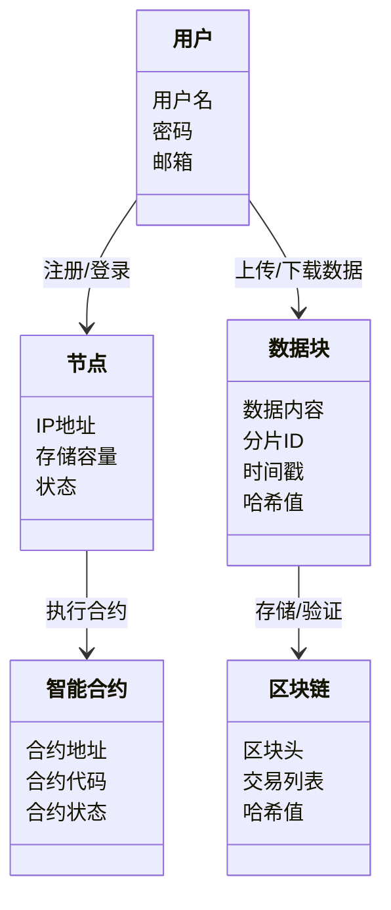
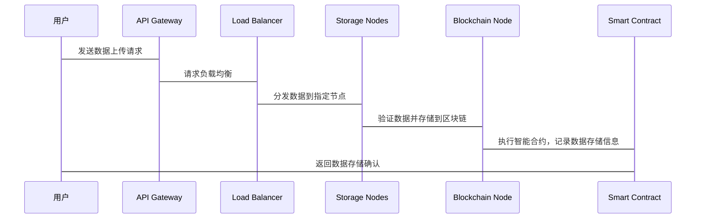

                 


# 如何评估企业的区块链去中心化云存储平台

> 关键词：区块链，去中心化，云存储，评估指标，分布式系统

> 摘要：本文将详细介绍如何评估企业区块链去中心化云存储平台，从核心概念到评估指标，再到系统架构设计，最后通过实际案例分析，帮助读者全面理解如何选择和优化适合的去中心化云存储解决方案。

---

# 第一部分: 区块链去中心化云存储平台概述

## 第1章: 区块链与去中心化云存储概述

### 1.1 区块链技术基础

#### 1.1.1 区块链的基本概念

区块链是一种分布式账本技术，通过去中心化的节点协作，实现数据的不可篡改性和可追溯性。区块链的核心特征包括：

- **去中心化**：数据不依赖单个中心节点，而是分布在多个节点上。
- **不可篡改性**：通过密码学和共识机制确保数据的安全性和一致性。
- **可追溯性**：每个数据块都有时间戳和哈希值，便于追踪数据变更。

#### 1.1.2 区块链的核心特点

- **去中心化**：消除了单点故障风险，提高了系统的抗攻击能力。
- **不可篡改性**：数据一旦写入区块链，无法被修改，确保数据的真实性。
- **可追溯性**：通过区块链的公开账本，可以追踪数据的来源和流向。
- **去信任化**：通过智能合约实现自动化的信任机制，减少中间人依赖。

### 1.2 去中心化云存储的概念

#### 1.2.1 传统云存储的局限性

传统云存储依赖中心化服务提供商，存在以下问题：

- **中心化风险**：数据集中存储在少数几个服务提供商手中，存在数据被篡改或删除的风险。
- **数据主权问题**：用户对数据的控制力有限，服务提供商可能随意更改数据存储规则。
- **服务依赖性**：用户对云服务提供商的技术能力和安全性高度依赖，一旦服务出现问题，可能影响业务连续性。

#### 1.2.2 去中心化云存储的定义

去中心化云存储是一种基于区块链技术的分布式存储方案，通过去中心化的网络架构，将数据分散存储在多个节点上，避免单点故障和数据集中化问题。

- **分布式存储**：数据被分割成多个碎片，存储在不同的节点上，确保数据的高可用性和容错性。
- **去中心化架构**：通过区块链技术实现去中心化的存储网络，避免对单个服务提供商的依赖。
- **去信任化存储**：通过区块链的共识机制和智能合约，确保数据的存储和访问符合预定义的规则，减少对中间人的信任需求。

### 1.3 区块链与去中心化云存储的结合

#### 1.3.1 区块链在云存储中的应用

区块链技术为去中心化云存储提供了以下关键功能：

- **数据存储的可信性**：通过区块链的不可篡改性，确保存储的数据真实性和完整性。
- **数据完整性验证**：区块链可以记录数据的每一次变更，并通过智能合约验证数据的完整性。
- **存储激励机制**：通过区块链的代币经济模型，激励节点参与数据存储和分发，形成去中心化的存储网络。

#### 1.3.2 去中心化云存储的优势

- **数据主权**：用户对数据拥有完全控制权，数据存储在多个节点上，避免数据被服务提供商随意篡改或删除。
- **高可用性**：分布式存储网络能够容忍部分节点故障，确保数据的高可用性和容错性。
- **成本优化**：通过去中心化的存储网络，可以降低存储成本，避免对单一服务提供商的依赖。

## 1.4 本章小结

本章介绍了区块链技术和去中心化云存储的基本概念，分析了传统云存储的局限性，并探讨了区块链与去中心化云存储的结合方式。通过区块链技术，去中心化云存储能够实现数据的安全性、可靠性和去信任化存储。

---

## 第2章: 区块链去中心化云存储的核心概念与联系

### 2.1 分布式存储系统

#### 2.1.1 分布式存储的定义

分布式存储是一种将数据分散存储在多个节点上的存储方式，通过数据分片、负载均衡等技术实现高可用性和高性能。

#### 2.1.2 分布式存储的关键技术

- **分片技术**：将数据分割成多个碎片，存储在不同的节点上，确保数据的高可用性和容错性。
- **负载均衡**：通过智能路由算法，将数据请求均匀分配到不同的节点上，避免单点过载。
- **数据一致性**：通过分布式一致性算法（如Paxos、Raft）确保多个副本的数据一致性。

#### 2.1.3 分布式存储的优势

- **高可用性**：分布式存储网络能够容忍部分节点故障，确保数据的高可用性。
- **高扩展性**：通过增加节点数量，可以轻松扩展存储容量和性能。
- **数据冗余**：通过冗余存储，确保数据在部分节点故障时仍可访问。

### 2.2 区块链共识机制

#### 2.2.1 共识机制的定义

共识机制是区块链系统中用于达成分布式系统中节点一致性的算法，确保所有节点对同一数据达成一致。

#### 2.2.2 常见共识机制对比

| 共识机制 | 核心特点 | 优缺点 |
|----------|----------|--------|
| 工作量证明（PoW） | 通过计算哈希值来证明工作量 | 安全性高，但效率低，消耗大量能源 |
| 权益证明（PoS） | 根据节点持有的代币数量分配记账权 | 效率高，但存在“ richness attack”风险 |
| 拜占庭容错（BFT） | 快速达成共识，适用于高性能需求的场景 | 对网络延迟敏感，适合小规模网络 |

### 2.3 智能合约与存储激励

#### 2.3.1 智能合约的定义

智能合约是运行在区块链上的自动执行程序，根据预定义的规则自动执行合同条款，实现去信任化的交互。

#### 2.3.2 激励机制的设计

- **存储激励**：通过代币奖励机制，激励节点参与数据存储和分发。
- **提取激励**：节点可以通过提供数据检索服务获得奖励。
- **代币经济模型**：设计合理的代币分配机制，确保系统的经济可持续性和节点参与度。

### 2.4 核心概念的联系

#### 2.4.1 分布式存储与区块链的结合

- **数据存储的可信性**：通过区块链的不可篡改性，确保分布式存储的数据真实性和完整性。
- **存储资源的分配**：通过智能合约和激励机制，实现去中心化的存储资源分配。
- **数据的安全性**：通过区块链的共识机制和加密技术，确保数据的安全性和隐私性。

#### 2.4.2 智能合约与存储激励的协同

- **自动化存储管理**：智能合约可以根据预定义的规则自动分配存储资源和权限。
- **激励机制的实现**：通过智能合约自动执行代币奖励，确保节点的积极参与和系统的高效运行。
- **数据生命周期管理**：智能合约可以自动执行数据的存储、访问和删除操作，确保数据生命周期的合规性。

## 2.5 本章小结

本章详细介绍了分布式存储系统和区块链共识机制的核心概念，并探讨了智能合约与存储激励机制的协同作用。通过这些技术的结合，去中心化云存储平台能够实现高效、安全、可靠的分布式存储。

---

## 第3章: 区块链去中心化云存储的评估指标与方法

### 3.1 技术性能评估

#### 3.1.1 存储效率

- **数据分片效率**：通过合理的分片策略，确保数据能够高效地分布到多个节点上。
- **网络传输效率**：通过优化网络协议和数据压缩算法，减少数据传输的延迟和带宽消耗。
- **存储空间利用率**：通过动态分配存储资源，最大化存储空间的利用率，降低存储成本。

#### 3.1.2 网络性能

- **带宽利用率**：通过负载均衡和智能路由算法，确保网络带宽的高效利用。
- **节点连接稳定性**：通过冗余网络连接和自动故障恢复机制，确保节点之间的连接稳定。
- **数据传输延迟**：通过优化网络协议和分布式架构，降低数据传输的延迟，提高用户体验。

### 3.2 数据安全性评估

#### 3.2.1 数据完整性验证

- **分片数据验证**：通过区块链的不可篡改性，确保每个分片数据的完整性和一致性。
- **智能合约验证**：通过智能合约自动验证数据的完整性和合法性，确保数据的可信性。
- **区块链验证**：通过区块链的公开账本，确保数据的完整性和可追溯性。

#### 3.2.2 存储隐私性

- **数据加密存储**：通过加密算法对数据进行加密存储，确保数据的隐私性和安全性。
- **访问权限控制**：通过智能合约和访问控制列表（ACL），确保只有授权用户才能访问特定数据。
- **数据匿名化**：通过数据脱敏技术，确保数据在存储和传输过程中不泄露用户的隐私信息。

### 3.3 系统可扩展性评估

#### 3.3.1 网络扩展性

- **节点扩展能力**：通过增加节点数量，扩展系统的存储容量和计算能力。
- **网络带宽扩展**：通过优化网络协议和增加带宽，提高系统的吞吐量和响应速度。
- **区块链网络的可扩展性**：通过优化共识机制和侧链技术，提高区块链网络的可扩展性，满足大规模数据存储需求。

#### 3.3.2 存储扩展性

- **分片策略优化**：通过动态调整分片策略，确保数据能够高效地分布到新增的节点上。
- **数据存储容量扩展**：通过增加存储节点的数量，动态扩展存储容量，满足业务增长需求。
- **系统负载均衡**：通过智能负载均衡算法，确保新增节点能够均匀分配数据存储和计算任务，避免单点过载。

### 3.4 经济模型评估

#### 3.4.1 代币经济模型

- **代币发行机制**：通过合理的代币发行机制，确保系统的经济可持续性和代币的价值稳定性。
- **代币分配机制**：通过智能合约自动分配代币，确保节点的积极参与和系统的公平性。
- **代币激励机制**：通过代币奖励机制，激励节点参与数据存储、检索和网络维护，确保系统的高效运行。

#### 3.4.2 经济可行性分析

- **成本收益分析**：通过分析存储成本、收益和代币经济模型，确保系统的经济可行性。
- **代币价值评估**：通过市场分析和代币经济模型，评估代币的市场价值和流动性。
- **经济模型的可持续性**：通过分析代币经济模型的长期可持续性，确保系统的长期稳定运行。

### 3.5 用户体验评估

#### 3.5.1 系统易用性

- **操作界面友好性**：通过直观的操作界面和用户友好的设计，提高用户的使用体验。
- **用户权限管理**：通过智能合约和访问控制列表，确保用户的权限管理和数据隐私性。
- **数据访问延迟**：通过优化分布式存储架构和网络协议，降低数据访问延迟，提高用户体验。

#### 3.5.2 系统稳定性

- **故障恢复能力**：通过冗余存储和自动故障恢复机制，确保系统的高可用性和数据的可靠性。
- **系统容错性**：通过分布式架构和容错技术，确保系统在部分节点故障时仍能正常运行。
- **数据一致性**：通过分布式一致性算法和区块链技术，确保数据的高一致性和可靠性。

---

## 第4章: 区块链去中心化云存储平台的系统分析与架构设计

### 4.1 系统功能设计

#### 4.1.1 领域模型设计



#### 4.1.2 系统架构设计


#### 4.1.3 系统接口设计

- **API接口**：定义了用户与平台交互的接口，包括数据上传、下载、查询等操作。
- **智能合约接口**：定义了智能合约与平台交互的接口，包括合约部署、执行、状态查询等操作。
- **节点通信接口**：定义了节点之间通信的接口，包括数据分片、路由、共识等操作。

#### 4.1.4 系统交互设计



### 4.2 系统架构优化

#### 4.2.1 分层架构设计

- **数据存储层**：负责数据的存储和分片，确保数据的高可用性和容错性。
- **网络传输层**：负责数据的网络传输和路由，确保数据的高效传输和节点间的通信。
- **区块链层**：负责数据的区块链验证和智能合约执行，确保数据的可信性和一致性。
- **应用层**：负责用户与系统的交互，包括数据上传、下载、查询等操作。

#### 4.2.2 高可用性设计

- **冗余存储**：通过在多个节点上冗余存储数据，确保数据的高可用性和容错性。
- **自动故障恢复**：通过监控节点状态，自动将故障节点的数据迁移到其他节点，确保系统不中断。
- **负载均衡**：通过智能路由算法，将数据请求均匀分配到不同的节点上，避免单点过载。

### 4.3 系统性能优化

#### 4.3.1 数据分片优化

- **动态分片**：根据数据量和节点数量动态调整分片策略，确保数据分布的均衡性和高效性。
- **分片合并**：通过合并小的分片，减少网络传输的开销，提高数据访问效率。

#### 4.3.2 网络性能优化

- **数据压缩**：通过数据压缩算法，减少数据传输的带宽消耗，提高传输效率。
- **智能路由**：通过智能路由算法，优化数据传输路径，减少数据传输延迟。

#### 4.3.3 区块链性能优化

- **侧链技术**：通过侧链技术提高区块链的交易吞吐量，满足大规模数据存储需求。
- **优化共识机制**：通过优化共识机制，减少区块链的确认时间和网络延迟，提高系统的响应速度。

---

## 第5章: 项目实战——以Filecoin为例

### 5.1 项目背景

Filecoin是一个基于区块链的去中心化云存储平台，通过激励机制鼓励用户贡献存储空间，构建了一个高效、安全、可靠的分布式存储网络。

### 5.2 系统核心实现

#### 5.2.1 环境安装

```bash
# 安装Filecoin节点
go install github.com/filecoin-project/filecoin/cmd/filecoin
# 初始化Filecoin节点
filecoin init
# 启动Filecoin节点
filecoin start
```

#### 5.2.2 核心实现代码

```python
# 智能合约示例
def main():
    # 初始化区块链节点
    blockchain = Blockchain()
    # 初始化智能合约
    smart_contract = SmartContract(blockchain)
    # 用户请求数据存储
    user_request = UserRequest(data=b'example_data')
    # 执行智能合约，分配存储资源
    smart_contract.execute(user_request)
    # 返回数据存储确认
    print('Data stored successfully')

if __name__ == "__main__":
    main()
```

### 5.3 代码应用解读

#### 5.3.1 智能合约实现

```solidity
// 智能合约代码示例
contract StorageContract {
    mapping(address => bytes) storageData;

    function store(bytes data) public {
        storageData[msg.sender] = data;
    }

    function retrieve(address sender) public returns (bytes) {
        return storageData[sender];
    }
}
```

#### 5.3.2 数据存储与检索

```python
# 数据存储示例
data = b'hello world'
contract_address = deploy_contract()
store(data, contract_address)

# 数据检索示例
retrieved_data = retrieve(contract_address)
print(retrieved_data)
```

### 5.4 实际案例分析

#### 5.4.1 案例背景

某企业希望通过Filecoin平台存储其重要数据，确保数据的安全性、可靠性和可访问性。

#### 5.4.2 评估过程

1. **技术性能评估**：通过测试Filecoin节点的存储效率、网络性能和数据完整性验证，确保平台能够满足企业的存储需求。
2. **数据安全性评估**：通过分析Filecoin的加密存储和智能合约机制，确保数据的隐私性和安全性。
3. **系统可扩展性评估**：通过测试Filecoin的节点扩展能力和存储容量扩展性，确保平台能够支持企业的业务增长需求。
4. **经济模型评估**：通过分析Filecoin的代币经济模型，确保平台的经济可行性和代币价值的稳定性。

### 5.5 项目小结

通过以Filecoin为例的项目实战，读者可以更好地理解去中心化云存储平台的核心实现和评估方法。实际案例分析可以帮助读者将理论知识应用到实际场景中，为后续的系统设计和优化提供参考。

---

## 第6章: 最佳实践与小结

### 6.1 最佳实践

#### 6.1.1 技术选型

- **选择合适的区块链平台**：根据业务需求选择适合的区块链平台，如Filecoin、IPFS等。
- **优化分布式存储架构**：通过合理的数据分片策略和负载均衡算法，提高系统的存储效率和性能。
- **确保数据安全性和隐私性**：通过加密存储和智能合约机制，确保数据的隐私性和安全性。

#### 6.1.2 系统设计

- **分层架构设计**：通过分层架构设计，确保系统的高可用性、可扩展性和可维护性。
- **智能合约优化**：通过优化智能合约的设计，确保系统的高效运行和代币经济模型的可持续性。
- **节点管理和监控**：通过节点监控和自动化管理，确保系统的稳定运行和数据的安全性。

#### 6.1.3 经济模型设计

- **合理的代币经济模型**：通过合理的代币发行机制、分配机制和激励机制，确保系统的经济可行性和代币的市场价值。
- **代币流动性管理**：通过代币流动性池和市场推广，确保代币的市场流动性和价值稳定性。

### 6.2 小结

本文从区块链去中心化云存储平台的核心概念出发，详细介绍了评估指标、系统架构设计和实际案例分析。通过最佳实践和小结，读者可以更好地理解如何选择和优化适合的去中心化云存储平台。

---

## 作者

作者：AI天才研究院/AI Genius Institute  
禅与计算机程序设计艺术/Zen And The Art of Computer Programming  

--- 

这篇文章通过系统地介绍区块链去中心化云存储平台的核心概念、评估指标、系统架构设计和实际案例分析，帮助读者全面理解如何选择和优化适合的去中心化云存储平台。希望本文对企业的技术决策者和区块链技术爱好者有所帮助。

