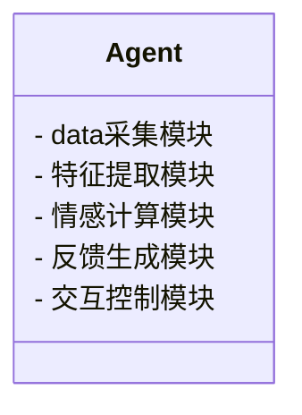
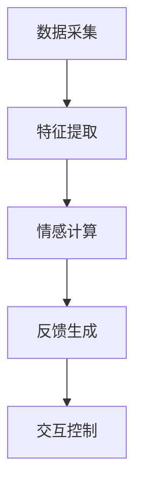
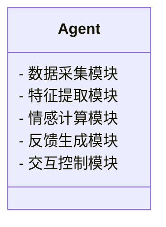
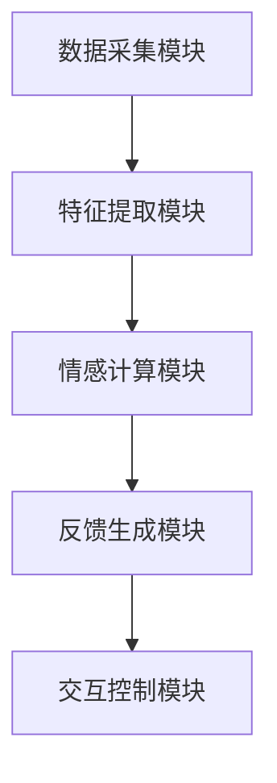
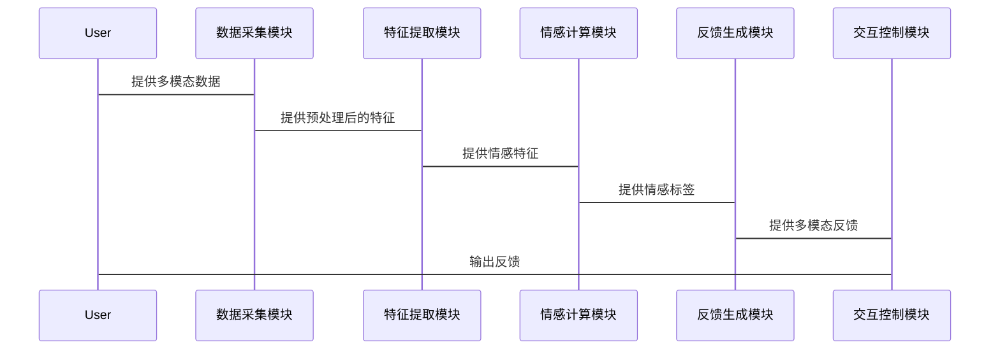

                 


# 开发具有多模态情感交互能力的AI Agent

---

## 关键词：多模态情感交互，AI Agent，深度学习，情感计算，人机交互

---

## 摘要：  
本文详细探讨了开发具有多模态情感交互能力的AI Agent的关键技术与实现方法。文章首先介绍了多模态情感交互的背景与核心概念，分析了现有AI Agent的局限性与多模态情感交互的需求。接着，深入讲解了情感计算的原理、多模态数据融合的方法以及相关的算法实现。然后，从系统架构的角度，设计了一个支持多模态情感交互的AI Agent框架，并通过实际项目案例展示了如何实现这一系统。最后，总结了开发过程中需要注意的问题，并提出了改进建议。

---

# 第一部分: 多模态情感交互AI Agent的背景与概念

## 第1章: 多模态情感交互AI Agent的背景与问题背景

### 1.1 多模态情感交互的定义与背景

多模态情感交互是一种结合了多种感官数据（如视觉、听觉、语言等）来理解用户情感并进行反馈的技术。通过多模态数据的融合，AI Agent能够更准确地捕捉用户的情感状态，从而提供更智能化、个性化的交互体验。这种技术在智能助手、情感陪聊机器人、教育辅助系统等领域具有广泛的应用潜力。

### 1.2 问题背景与问题描述

传统的AI Agent主要依赖单一的交互方式（如文本或语音），难以全面理解用户的情感状态。例如，文本交互只能通过文字分析情感，而忽略了用户的面部表情、语气等重要信息。这种单模态的交互方式导致AI Agent在情感理解和反馈上存在局限性，无法提供更自然、更贴近人类情感交流的体验。

多模态情感交互的目标是通过整合多种感官数据，提升AI Agent对用户情感的理解能力，并通过多模态反馈增强交互体验。然而，这一技术的实现面临诸多挑战，包括多模态数据的采集、融合、分析以及系统的实时性要求等。

### 1.3 多模态情感交互的核心要素

多模态情感交互的核心要素包括：

1. **多模态数据的采集**：通过摄像头、麦克风、传感器等多种设备获取用户的视觉、听觉、语言等信息。
2. **情感计算**：基于多模态数据，分析用户的情感状态，如快乐、悲伤、愤怒等。
3. **多模态数据融合**：将不同感官数据进行融合，提升情感计算的准确性和鲁棒性。
4. **AI Agent的交互能力**：基于情感理解，生成多模态的反馈，如表情、语气、动作等，以增强交互体验。

### 1.4 本章小结

本章介绍了多模态情感交互的定义、背景以及核心要素，分析了传统AI Agent的局限性，并提出了通过多模态数据融合来提升情感交互能力的目标。

---

## 第2章: 多模态情感交互的核心概念与联系

### 2.1 情感计算的核心原理

情感计算（Affective Computing）是通过计算机技术来识别、理解和模拟人类情感的过程。其核心原理包括以下几个步骤：

1. **数据采集**：通过传感器、摄像头、麦克风等设备获取用户的情感相关数据。
2. **特征提取**：对采集到的数据进行预处理，提取出与情感相关的特征，如面部表情特征、语音特征等。
3. **情感分类**：基于提取的特征，利用机器学习或深度学习算法对用户的情感状态进行分类。
4. **情感反馈**：根据情感分类结果，生成相应的反馈，如改变语气、表情等。

#### 情感计算的数学模型

情感计算的分类任务可以看作是一个典型的分类问题，常用的支持向量机（SVM）或深度学习模型（如卷积神经网络CNN、循环神经网络RNN）可以用于情感分类。以下是一个简单的二分类情感计算模型的数学表达：

$$ P(y|x) = \frac{P(x|y=1)P(y=1)}{P(x)} $$

其中，$P(y|x)$ 是后验概率，表示在输入$x$的情况下，情感类别$y$的概率。

### 2.2 多模态数据的融合方法

多模态数据融合是指将来自不同感官的数据进行整合，以提升情感计算的准确性和鲁棒性。常见的多模态数据融合方法包括：

1. **特征级融合**：在特征提取阶段，将不同模态的特征向量进行融合，如将面部表情特征和语音特征拼接成一个超维向量。
2. **决策级融合**：在情感分类结果的基础上，将不同模态的情感分类结果进行融合，如通过加权投票的方式生成最终的情感判断。
3. **注意机制融合**：利用注意力机制，动态地调整不同模态特征的权重，以突出对情感计算更重要的模态。

#### 基于注意机制的多模态融合算法

以下是一个基于注意机制的多模态融合算法的伪代码：

```python
def multi_modal_fusion(visual_features, audio_features):
    # 计算注意权重
    attention_weights = softmax(Dense([visual_features, audio_features]))
    # 加权融合
    fused_features = attention_weights * visual_features + (1 - attention_weights) * audio_features
    return fused_features
```

### 2.3 多模态情感交互的系统架构

多模态情感交互系统通常包括以下几个模块：

1. **数据采集模块**：负责采集用户的多模态数据，如面部表情、语音、语言输入等。
2. **特征提取模块**：对采集到的数据进行预处理和特征提取。
3. **情感计算模块**：基于提取的特征，计算用户的情感状态。
4. **反馈生成模块**：根据情感计算结果，生成多模态的反馈，如表情、语气、动作等。
5. **交互控制模块**：协调各模块之间的交互，确保系统的实时性和稳定性。

#### 系统架构的领域模型类图



### 2.4 核心概念与联系的总结

本章详细介绍了情感计算的核心原理、多模态数据的融合方法以及多模态情感交互系统的架构设计。通过这些内容，我们可以更好地理解多模态情感交互技术的实现过程及其在AI Agent中的应用。

### 2.5 本章小结

本章总结了多模态情感交互的核心概念与联系，分析了情感计算的数学模型和多模态数据融合的方法，并通过类图展示了系统的整体架构。

---

## 第3章: 多模态情感交互的算法原理

### 3.1 情感计算的算法实现

情感计算的算法实现主要包括特征提取、情感分类和情感反馈三个步骤。以下是具体的实现细节：

1. **特征提取**：对于视觉数据，可以使用OpenCV库提取面部表情特征，如眼睛的开合度、嘴角的偏移量等；对于语音数据，可以使用 librosa 库提取语音特征，如音调、能量、音长等。
2. **情感分类**：使用深度学习模型（如LSTM、CNN）对提取的特征进行分类，生成情感标签。
3. **情感反馈**：根据情感标签生成相应的反馈，如改变语气、表情等。

#### 情感分类的数学模型

以下是一个基于LSTM的情感分类模型的数学表达：

$$ f(x) = LSTM(x) \cdot W + b $$

其中，$x$ 是输入特征，$W$ 是权重矩阵，$b$ 是偏置项。

### 3.2 多模态数据融合的算法

多模态数据融合的算法可以通过以下步骤实现：

1. **数据预处理**：对多模态数据进行归一化处理，确保各模态数据在相同的尺度范围内。
2. **特征融合**：将不同模态的特征向量进行融合，如使用加权平均的方式生成融合特征。
3. **情感计算**：基于融合特征，利用情感计算模型生成情感标签。
4. **反馈生成**：根据情感标签生成多模态的反馈。

#### 基于注意力机制的多模态融合算法

以下是一个基于注意力机制的多模态融合算法的Python代码示例：

```python
import tensorflow as tf

def attention Mechanism(visual_features, audio_features):
    # 计算注意权重
    attention_weights = tf.nn.softmax(tf.matmul(tf.concat([visual_features, audio_features], axis=1), tf.Variable(tf.random.truncated_normal([input_dim, num_classes])))
    # 加权融合
    fused_features = attention_weights * visual_features + (1 - attention_weights) * audio_features
    return fused_features
```

### 3.3 多模态情感交互的算法流程

多模态情感交互的算法流程如下：

1. **数据采集**：通过摄像头、麦克风等设备采集用户的多模态数据。
2. **特征提取**：对采集到的数据进行预处理，提取出与情感相关的特征。
3. **情感计算**：基于提取的特征，利用情感计算模型生成情感标签。
4. **反馈生成**：根据情感标签生成多模态的反馈，如表情、语气等。
5. **交互控制**：协调各模块之间的交互，确保系统的实时性和稳定性。

#### 算法流程图



### 3.4 本章小结

本章详细讲解了多模态情感交互的算法实现，包括情感计算的数学模型、多模态数据融合的方法以及算法流程的设计。

---

## 第4章: 多模态情感交互系统的架构与设计

### 4.1 系统功能设计

多模态情感交互系统的主要功能包括：

1. **数据采集**：通过摄像头、麦克风等设备采集用户的视觉、听觉数据。
2. **特征提取**：对采集到的数据进行预处理，提取出与情感相关的特征。
3. **情感计算**：基于提取的特征，利用情感计算模型生成情感标签。
4. **反馈生成**：根据情感标签生成多模态的反馈，如表情、语气等。
5. **交互控制**：协调各模块之间的交互，确保系统的实时性和稳定性。

#### 系统功能的领域模型类图



### 4.2 系统架构设计

多模态情感交互系统的架构设计包括以下几个部分：

1. **数据采集模块**：负责采集用户的多模态数据，如面部表情、语音等。
2. **特征提取模块**：对采集到的数据进行预处理和特征提取。
3. **情感计算模块**：基于提取的特征，计算用户的情感状态。
4. **反馈生成模块**：根据情感计算结果，生成多模态的反馈。
5. **交互控制模块**：协调各模块之间的交互，确保系统的实时性和稳定性。

#### 系统架构的 Mermaid 图



### 4.3 系统接口设计

多模态情感交互系统的接口设计包括：

1. **数据输入接口**：接收用户的多模态数据，如图像、语音等。
2. **数据输出接口**：输出系统的反馈，如表情、语气等。
3. **控制接口**：协调各模块之间的交互，确保系统的实时性和稳定性。

#### 系统接口的 Mermaid 序列图



### 4.4 系统交互设计

多模态情感交互系统的交互设计包括：

1. **用户输入**：用户通过摄像头、麦克风等设备输入多模态数据。
2. **系统处理**：系统对用户的输入进行处理，生成情感标签。
3. **系统反馈**：系统根据情感标签生成多模态反馈，如表情、语气等。
4. **用户反馈**：用户对系统的反馈进行评价，系统根据用户的评价调整交互策略。

#### 系统交互的 Mermaid 序列图


### 4.5 本章小结

本章详细讲解了多模态情感交互系统的架构与设计，包括系统的功能设计、架构设计、接口设计以及交互设计。

---

## 第5章: 多模态情感交互的项目实战

### 5.1 环境配置与依赖管理

开发多模态情感交互系统的环境配置包括：

1. **开发工具**：安装Python、TensorFlow、PyTorch等开发工具。
2. **数据集**：选择合适的情感数据集，如AffectNet、IEMOCAP等。
3. **库的安装**：安装必要的库，如OpenCV、librosa、scikit-learn等。

#### 环境配置示例

```bash
pip install numpy
pip install tensorflow
pip install keras
pip install opencv-python
pip install librosa
```

### 5.2 系统核心实现源代码

以下是一个简单的多模态情感交互系统的Python实现示例：

```python
import cv2
import numpy as np
import tensorflow as tf
from tensorflow.keras import layers

# 数据采集模块
def capture_image():
    cap = cv2.VideoCapture(0)
    while True:
        ret, frame = cap.read()
        cv2.imshow('Capture', frame)
        if cv2.waitKey(1) & 0xFF == ord('q'):
            break
    cap.release()
    cv2.destroyAllWindows()
    return frame

# 特征提取模块
def extract_features(image):
    # 简单的特征提取，如面部关键点检测
    gray = cv2.cvtColor(image, cv2.COLOR_BGR2GRAY)
    # 使用OpenCV的面部检测器
    face_cascade = cv2.CascadeClassifier('haarcascade_frontalface_default.xml')
    faces = face_cascade.detectMultiScale(gray, 1.3, 5)
    return faces

# 情感计算模块
def emotional_analysis(features):
    # 假设features是面部特征
    model = tf.keras.Sequential([
        layers.Dense(64, activation='relu'),
        layers.Dense(1, activation='sigmoid')
    ])
    model.compile(optimizer='adam', loss='binary_crossentropy', metrics=['accuracy'])
    # 假设我们有预训练好的模型
    prediction = model.predict(features)
    return prediction

# 反馈生成模块
def generate_feedback(prediction):
    if prediction[0] > 0.5:
        return "开心"
    else:
        return "不开心"

# 交互控制模块
def interaction_control(feedback):
    print("系统反馈：", feedback)

# 主程序
if __name__ == "__main__":
    image = capture_image()
    features = extract_features(image)
    prediction = emotional_analysis(features)
    feedback = generate_feedback(prediction)
    interaction_control(feedback)
```

### 5.3 代码的功能解读与分析

1. **数据采集模块**：通过摄像头采集用户的面部图像。
2. **特征提取模块**：使用OpenCV检测用户的面部区域。
3. **情感计算模块**：利用简单的DNN模型对提取的特征进行情感分类。
4. **反馈生成模块**：根据情感分类结果生成反馈。
5. **交互控制模块**：输出系统的反馈。

### 5.4 实际案例分析与详细讲解

以下是一个实际案例的分析：

1. **用户输入**：用户通过摄像头输入面部图像。
2. **特征提取**：系统检测到用户的面部区域。
3. **情感计算**：系统预测用户的情感状态为“开心”。
4. **反馈生成**：系统生成“开心”的反馈。
5. **用户反馈**：用户对系统的反馈进行评价，系统根据用户的评价调整交互策略。

### 5.5 项目小结

本章通过实际项目案例展示了如何实现一个多模态情感交互系统，详细讲解了系统的实现步骤以及核心代码的实现。

---

## 第6章: 总结与展望

### 6.1 总结

本文详细探讨了开发具有多模态情感交互能力的AI Agent的关键技术与实现方法。通过背景介绍、核心概念、算法原理、系统架构以及项目实战的讲解，我们了解了多模态情感交互技术的实现过程及其在AI Agent中的应用。

### 6.2 展望

未来，随着人工智能技术的不断发展，多模态情感交互技术将更加智能化和个性化。我们可以期待以下几点发展：

1. **更高效的情感计算算法**：如基于Transformer的模型在情感计算中的应用。
2. **更自然的多模态反馈**：如实时表情生成、个性化语气调节等。
3. **更广泛的应用场景**：如教育、医疗、娱乐等领域的智能化服务。

### 6.3 最佳实践 tips

1. **数据采集**：确保数据的多样性和代表性，提高情感计算的准确性。
2. **算法优化**：不断优化情感计算和数据融合的算法，提升系统的性能。
3. **用户体验**：注重用户的交互体验，确保系统的易用性和友好性。

### 6.4 本章小结

本章总结了全文的主要内容，并展望了未来的发展方向，同时给出了一些实用的建议和注意事项。

---

## 第7章: 拓展阅读与深入思考

### 7.1 拓展阅读

1. **《Deep Learning for Affective Computing》**：探讨深度学习在情感计算中的应用。
2. **《Multi-modal Data Fusion for Human-Computer Interaction》**：研究多模态数据融合在人机交互中的应用。
3. **《Practical Deep Learning for Coders》**：提供深度学习的实践指南。

### 7.2 深入思考

多模态情感交互技术的实现不仅需要扎实的技术基础，还需要对人类情感的理解和洞察。未来的研究可以结合心理学、社会学等多学科知识，进一步提升系统的智能化和人性化。

### 7.3 本章小结

本章提供了拓展阅读的建议，并引导读者进行更深入的思考，以更好地理解和应用多模态情感交互技术。

---

## 作者：AI天才研究院/AI Genius Institute & 禅与计算机程序设计艺术 /Zen And The Art of Computer Programming

---

通过以上内容，我们详细探讨了开发具有多模态情感交互能力的AI Agent的关键技术与实现方法。希望本文能够为相关领域的研究和实践提供有价值的参考。

