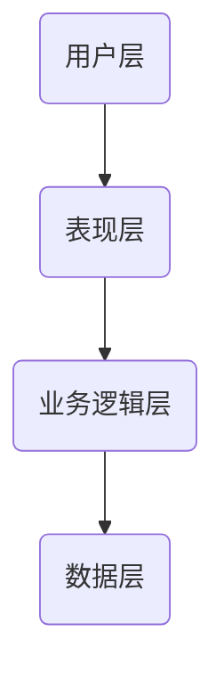
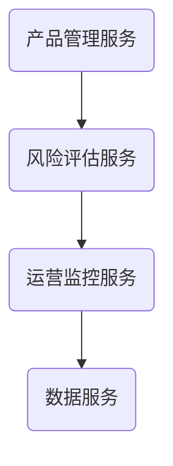
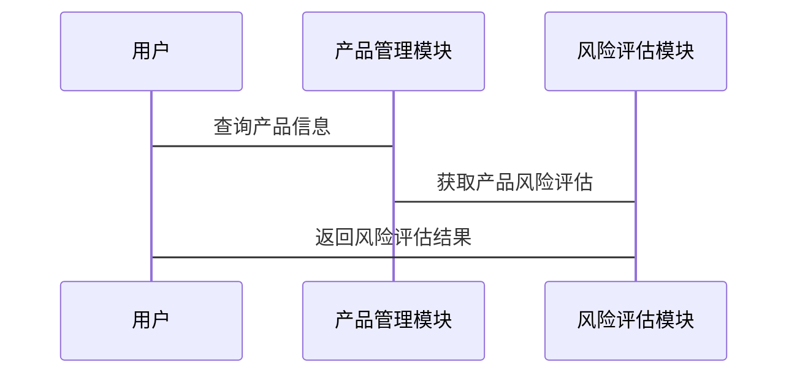

                 


# 开发智能化的金融产品生命周期管理平台

> 关键词：金融产品生命周期管理，人工智能，智能化管理，金融数据分析，风险控制

> 摘要：随着金融行业的快速发展，金融产品的生命周期管理变得日益复杂。为了提高效率和准确性，开发智能化的金融产品生命周期管理平台成为必然趋势。本文将详细介绍如何利用人工智能技术，构建一个智能化的金融产品生命周期管理平台，涵盖从需求分析到系统架构设计的各个方面，深入探讨相关技术和实现细节。

---

# 第1章: 金融产品生命周期管理平台的背景与目标

## 1.1 金融产品生命周期管理的背景

### 1.1.1 传统金融产品管理的痛点
金融产品的生命周期管理涉及产品设计、审批、发行、运营和退市等多个阶段。传统的管理方式依赖人工操作，存在以下痛点：
- **效率低下**：人工处理大量数据和文档，耗时且易出错。
- **风险控制不足**：难以实时监控产品风险，导致潜在问题未能及时发现。
- **个性化不足**：难以快速响应市场需求，产品创新缓慢。

### 1.1.2 智能化管理的需求驱动
随着人工智能和大数据技术的快速发展，金融机构开始寻求智能化解决方案：
- **提高效率**：通过自动化流程减少人工干预。
- **增强风险控制**：利用AI实时监控和预测风险。
- **支持创新**：快速分析市场需求，支持个性化产品设计。

### 1.1.3 金融行业数字化转型的必然性
数字化转型已成为金融行业的重要趋势。智能化金融产品生命周期管理平台能够帮助金融机构更好地应对市场变化，提高竞争力。

## 1.2 平台开发的核心目标

### 1.2.1 提高产品管理效率
通过自动化和智能化手段，减少人工操作，提高管理效率。

### 1.2.2 实现智能化风险控制
利用AI技术实时监控产品风险，提前预警潜在问题。

### 1.2.3 支持个性化产品创新
通过数据分析和预测，支持金融机构快速推出符合市场需求的个性化产品。

## 1.3 平台的价值与意义

### 1.3.1 对金融机构的价值
- 提高管理效率，降低成本。
- 增强风险控制能力，保障产品安全。
- 支持快速创新，提升市场竞争力。

### 1.3.2 对金融用户的价值
- 提供个性化产品推荐，满足多样化需求。
- 实时监控产品状态，保障投资安全。

### 1.3.3 对金融行业发展的推动作用
推动金融行业的数字化转型，促进金融创新，提升整体行业竞争力。

## 1.4 本章小结
本章介绍了金融产品生命周期管理平台的背景、核心目标和价值，为后续章节的展开奠定了基础。

---

# 第2章: 金融产品生命周期管理的核心概念

## 2.1 金融产品生命周期的定义与特点

### 2.1.1 产品生命周期的四个阶段
金融产品的生命周期通常包括以下四个阶段：
1. **设计阶段**：产品需求分析、设计和开发。
2. **审批阶段**：产品方案的审核和批准。
3. **运营阶段**：产品的市场推广、销售和售后服务。
4. **退市阶段**：产品终止运营或更新换代。

### 2.1.2 每个阶段的核心任务
- **设计阶段**：需求分析、产品设计、风险评估。
- **审批阶段**：方案审核、合规性检查。
- **运营阶段**：市场推广、客户支持、监控评估。
- **退市阶段**：产品终止、资产清算。

### 2.1.3 生命周期管理的关键要素
- **产品信息**：产品名称、类型、功能等。
- **时间轴**：产品的各个阶段的时间节点。
- **风险管理**：识别、评估和控制风险。
- **合规性**：确保产品符合相关法规和政策。

## 2.2 智能化管理的核心技术

### 2.2.1 AI在金融产品管理中的应用
- **自然语言处理**：用于金融文档的自动分类和摘要。
- **机器学习**：用于风险预测和产品推荐。
- **深度学习**：用于复杂模式识别和图像处理。

### 2.2.2 大数据技术的作用
- **数据采集**：从多个来源收集产品和市场数据。
- **数据存储**：使用大数据平台存储和管理海量数据。
- **数据分析**：通过数据挖掘和统计分析，提取有价值的信息。

### 2.2.3 区块链技术的潜在价值
- **数据安全性**：通过区块链技术确保数据不可篡改。
- **透明性**：实现产品信息的透明共享，提高信任度。
- **自动化操作**：通过智能合约实现自动化的审批和操作。

## 2.3 平台的功能架构

### 2.3.1 核心功能模块
- **产品设计模块**：支持产品需求分析和设计文档生成。
- **风险评估模块**：基于AI进行风险预测和评估。
- **运营监控模块**：实时监控产品运营状态和市场反馈。
- **退市管理模块**：管理产品退市流程和资产清算。

### 2.3.2 支持功能模块
- **用户管理模块**：管理平台用户权限和角色。
- **数据管理模块**：支持数据的采集、存储和分析。
- **报表生成模块**：生成各种统计报表和分析报告。

### 2.3.3 扩展功能模块
- **个性化推荐模块**：基于用户行为推荐相关产品。
- **市场分析模块**：提供市场趋势和竞争对手分析。
- **知识库模块**：存储和管理金融领域的知识和经验。

## 2.4 本章小结
本章详细介绍了金融产品生命周期管理的核心概念和智能化管理的关键技术，为后续章节的系统设计奠定了理论基础。

---

# 第3章: 智能化金融产品管理平台的核心技术与算法原理

## 3.1 AI驱动的金融数据分析

### 3.1.1 机器学习在金融预测中的应用
机器学习广泛应用于金融预测，例如股票价格预测、风险评估等。常用算法包括线性回归、支持向量机（SVM）和随机森林。

#### 示例：股票价格预测的线性回归模型
```python
import pandas as pd
import numpy as np
from sklearn.linear_model import LinearRegression

# 数据加载与预处理
data = pd.read_csv('stock_prices.csv')
X = data[['开盘价', '收盘价']]
y = data['最高价']

# 模型训练
model = LinearRegression()
model.fit(X, y)

# 预测
predicted_price = model.predict(X)
```

### 3.1.2 深度学习在金融模式识别中的作用
深度学习在金融模式识别中表现优异，例如通过卷积神经网络（CNN）进行图像识别，或通过循环神经网络（RNN）进行时间序列分析。

#### 示例：RNN用于时间序列预测
```python
import tensorflow as tf
from tensorflow.keras.layers import LSTM, Dense

# 数据准备
time_series = np.array([1, 2, 3, 4, 5], dtype='float32')
time_series = time_series.reshape((1, 5, 1))

# 模型构建
model = tf.keras.Sequential()
model.add(LSTM(50, input_shape=(5, 1)))
model.add(Dense(1))
model.compile(optimizer='adam', loss='mean_squared_error')

# 训练
model.fit(time_series, np.array([3.5]), epochs=100, verbose=0)
```

### 3.1.3 自然语言处理在金融文本分析中的应用
自然语言处理（NLP）技术用于分析金融新闻、财报等文本数据，提取情感倾向和关键词。

#### 示例：情感分析模型
```python
from transformers import pipeline

# 加载预训练模型
sentiment_analyzer = pipeline("sentiment-analysis")

# 文本分析
result = sentiment_analyzer("The company's revenue increased significantly.")
print(result)
```

## 3.2 基于知识图谱的产品关系网络

### 3.2.1 知识图谱的构建方法
知识图谱通过实体识别、关系抽取和数据整合，构建金融产品之间的关系网络。

#### 示例：知识图谱构建流程
1. **数据采集**：从多种数据源收集产品信息。
2. **实体识别**：识别产品、公司、市场等实体。
3. **关系抽取**：识别实体之间的关系，如“产品A依赖于市场B”。
4. **数据整合**：将抽取的关系整合到知识图谱中。

### 3.2.2 产品关系网络的分析与应用
通过分析产品关系网络，可以发现产品之间的依赖关系，优化产品组合和风险控制。

#### 示例：知识图谱查询
```python
# 查询产品A的相关产品
products = knowledge_graph.query_related_products("产品A")
print(products)
```

### 3.2.3 知识图谱的更新与维护
定期更新知识图谱，确保数据的准确性和时效性。

## 3.3 风险控制的算法模型

### 3.3.1 风险评估的数学模型
风险评估模型通常基于统计学方法，例如线性回归、逻辑回归等。

#### 示例：信用评分模型
```python
import pandas as pd
from sklearn.linear_model import LogisticRegression

# 数据加载与预处理
data = pd.read_csv('credit_risk.csv')
X = data[['收入', '负债', '信用历史']]
y = data['违约率']

# 模型训练
model = LogisticRegression()
model.fit(X, y)

# 预测
predicted_risk = model.predict(X)
```

### 3.3.2 基于机器学习的风险预测算法
机器学习算法如随机森林、梯度提升树（GBDT）等常用于风险预测。

#### 示例：随机森林风险预测
```python
from sklearn.ensemble import RandomForestClassifier

# 数据准备
X_train = ...  # 特征数据
y_train = ...  # 标签数据

# 模型训练
model = RandomForestClassifier(n_estimators=100)
model.fit(X_train, y_train)

# 预测
predicted_risk = model.predict(X_test)
```

### 3.3.3 算法的优化与调优
通过参数调整、特征选择和模型集成等方法优化算法性能。

---

## 3.4 本章小结
本章详细介绍了AI驱动的金融数据分析、知识图谱构建和风险控制算法的核心技术与实现方法，为后续章节的系统设计提供了技术支持。

---

# 第4章: 系统架构与设计

## 4.1 系统架构设计概述

### 4.1.1 分层架构的设计理念
分层架构将系统划分为多个层次，每个层次负责特定的功能，例如数据层、业务逻辑层和表现层。

### 4.1.2 微服务架构的优势
微服务架构将系统功能分解为多个独立的服务，提高了系统的灵活性和可扩展性。

### 4.1.3 高可用性与扩展性的设计原则
通过负载均衡、容错设计和水平扩展等技术，确保系统的高可用性和扩展性。

## 4.2 系统功能设计

### 4.2.1 核心功能模块
- **产品管理模块**：支持产品信息录入、编辑和查询。
- **风险评估模块**：基于AI进行风险预测和评估。
- **运营监控模块**：实时监控产品运营状态和市场反馈。

### 4.2.2 支持功能模块
- **用户管理模块**：管理平台用户权限和角色。
- **数据管理模块**：支持数据的采集、存储和分析。
- **报表生成模块**：生成各种统计报表和分析报告。

## 4.3 系统架构设计

### 4.3.1 分层架构图


### 4.3.2 微服务架构图


## 4.4 系统接口设计

### 4.4.1 API接口设计
- **产品信息查询接口**
  ```http
  GET /api/products?name=股票
  ```

- **风险评估接口**
  ```http
  POST /api/risk_assessment
  ```

### 4.4.2 接口交互流程图


## 4.5 本章小结
本章详细介绍了系统架构设计和接口设计，为后续章节的项目实施提供了指导。

---

# 第5章: 项目实战

## 5.1 环境搭建

### 5.1.1 开发环境
- **编程语言**：Python 3.8+
- **框架**：Django或Flask
- **工具**：Jupyter Notebook、PyCharm

### 5.1.2 数据库选择
- **关系型数据库**：MySQL
- **非关系型数据库**：MongoDB

## 5.2 核心模块实现

### 5.2.1 产品管理模块
```python
from django.shortcuts import render, redirect
from .models import Product

def product_management(request):
    if request.method == 'POST':
        name = request.POST['name']
        type = request.POST['type']
        product = Product(name=name, type=type)
        product.save()
        return redirect('product_management')
    products = Product.objects.all()
    return render(request, 'product_management.html', {'products': products})
```

### 5.2.2 风险评估模块
```python
from sklearn.ensemble import RandomForestClassifier
import pandas as pd

def risk_assessment(data):
    model = RandomForestClassifier()
    model.fit(data[['收入', '负债']], data['违约率'])
    return model.predict(data[['收入', '负债']])
```

## 5.3 代码解读与分析

### 5.3.1 产品管理模块代码解读
- **功能**：实现产品信息的录入、查询和管理。
- **实现方式**：使用Django框架，通过视图函数和模

