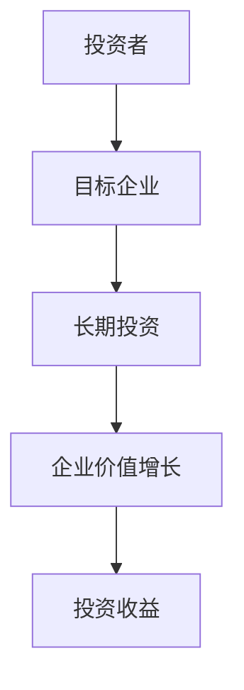
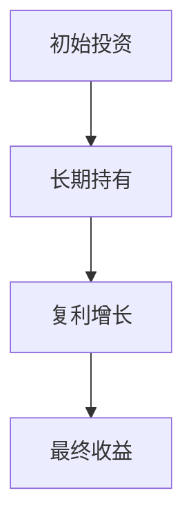
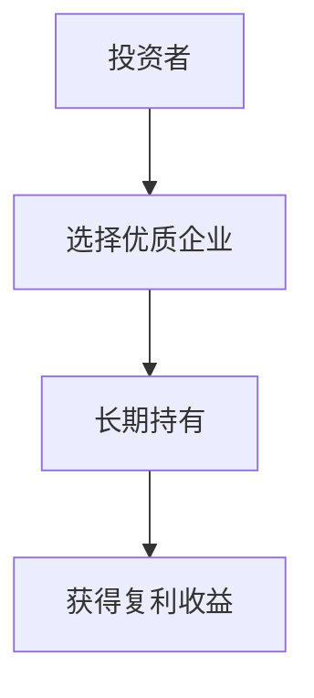
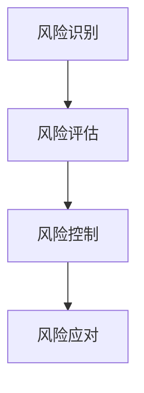
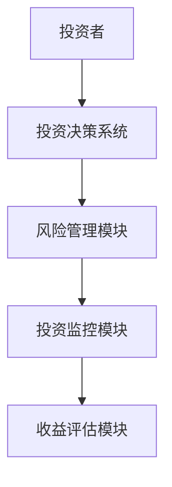

                 


# 彼得林奇的"耐心资本"在颠覆性创新企业中的重要性

> 关键词：耐心资本，彼得·林奇，颠覆性创新，投资策略，长期价值

> 摘要：本文探讨了彼得·林奇提出的“耐心资本”概念在颠覆性创新企业中的应用与重要性。通过分析耐心资本的核心理念、数学模型、算法原理以及在实际投资中的应用案例，本文揭示了耐心资本如何在长期价值创造中发挥关键作用，并为颠覆性创新企业的投资者提供了实用的策略和建议。

---

# 第一部分: 彼得林奇的“耐心资本”概述

# 第1章: 耐心资本的定义与背景

## 1.1 彼得·林奇与耐心资本的起源

### 1.1.1 彼得·林奇的生平简介
彼得·林奇（Peter Lynch）是美国著名的职业基金经理人，曾管理富达麦哲伦基金（Fidelity Magellan Fund）长达13年，创造了年均29%的回报率。他以独特的投资风格闻名，尤其是对中小企业的关注和对市场趋势的敏锐洞察。林奇提出的“耐心资本”理念，强调长期投资和对企业的深入理解，是其投资哲学的核心。

### 1.1.2 耐心资本的定义与核心理念
耐心资本（Patient Capital）是指投资者在投资过程中，愿意给予被投资企业足够的时间和空间，不因短期市场波动而改变投资决策。其核心理念在于：通过长期持有优质资产，获得复利效应带来的超额收益。

### 1.1.3 耐心资本与传统投资策略的区别
与传统投资策略相比，耐心资本更注重企业的长期价值，而非短期市场波动。传统投资策略可能频繁交易，试图通过短期价格波动获利，而耐心资本则强调对企业基本面的深入分析和长期持有。

### 1.1.4 耐心资本的核心要素对比表
| 要素       | 耐心资本             | 传统投资策略       |
|------------|----------------------|---------------------|
| 投资期限   | 长期（5年以上）       | 短期（1年以内）     |
| 投资目标   | 企业长期价值创造     | 短期价格波动获利   |
| 风险承受能力 | 较高                 | 较低               |
| 交易频率   | 低                   | 高                 |

### 1.1.5 耐心资本的ER实体关系图


## 1.2 耐心资本在投资领域的背景

### 1.2.1 投资领域的基本概念
投资领域涉及多种策略和工具，包括股票、债券、基金、房地产等。投资者的目标通常是通过合理配置资产，实现财富的保值和增值。

### 1.2.2 耐心资本的兴起与发展趋势
随着全球市场的波动加剧，越来越多的投资者意识到，短期交易难以获得稳定的收益。耐心资本的兴起，反映了市场对长期价值投资的需求。

### 1.2.3 耐心资本与颠覆性创新企业的契合点
颠覆性创新企业通常具有高增长潜力，但初期可能面临市场不确定性。耐心资本能够为这类企业提供持续的资金支持和战略指导，帮助其度过发展瓶颈。

## 1.3 耐心资本的核心要素

### 1.3.1 耐心资本的属性特征对比表
| 属性       | 特征                 |
|------------|----------------------|
| 投资期限   | 长期                 |
| 风险承受能力 | 较高                 |
| 投资目标   | 长期价值创造         |
| 交易频率   | 低                   |

### 1.3.2 耐心资本的数学模型与公式
耐心资本的回报可以通过以下公式计算：
$$ R = \frac{P_{final} - P_{initial}}{P_{initial}} $$
其中，$R$ 是回报率，$P_{final}$ 是最终价值，$P_{initial}$ 是初始价值。

### 1.3.3 耐心资本的长期投资策略
耐心资本的长期投资策略可以表示为：


---

# 第2章: 耐心资本的理论基础

## 2.1 耐心资本的数学模型与公式

### 2.1.1 投资回报的数学模型
$$ R = \frac{P_{final} - P_{initial}}{P_{initial}} $$

### 2.1.2 耐心资本的时间价值公式
$$ TV = P \times (1 + r)^t $$
其中，$P$ 是本金，$r$ 是年化收益率，$t$ 是投资时间。

### 2.1.3 耐心资本的风险评估模型
$$ R = \sqrt{\sigma^2 + \mu^2} $$
其中，$\sigma$ 是标准差，$\mu$ 是期望收益。

## 2.2 耐心资本的算法原理

### 2.2.1 耐心资本的长期投资策略
耐心资本的长期投资策略可以通过以下步骤实现：


### 2.2.2 耐心资本的风险管理策略
耐心资本的风险管理策略包括：


## 2.3 耐心资本的核心算法实现

### 2.3.1 投资组合优化算法
耐心资本的投资组合优化算法可以表示为：
```python
def patience_capital_strategy(prices, window=5):
    # 计算移动平均线
    ma = []
    for i in range(len(prices)):
        if i < window:
            ma.append(sum(prices[:i+1]) / (i+1))
        else:
            ma.append(sum(prices[i-window:i+1]) / window)
    return ma
```

---

# 第3章: 耐心资本在颠覆性创新企业中的应用

## 3.1 颠覆性创新企业的特点

### 3.1.1 颠覆性创新企业的定义
颠覆性创新企业是指通过创新技术或商业模式，对现有市场格局产生根本性改变的企业。

### 3.1.2 颠覆性创新企业的成功要素
颠覆性创新企业的成功要素包括技术创新、市场定位和持续创新能力。

### 3.1.3 颠覆性创新企业与传统企业的区别
| 要素       | 颠覆性创新企业         | 传统企业           |
|------------|------------------------|---------------------|
| 技术创新   | 高                   | 低                 |
| 市场定位   | 革新性                 | 稳定性             |
| 增长潜力   | 高                   | 中                 |

## 3.2 耐心资本在颠覆性创新企业中的应用

### 3.2.1 长期投资策略
耐心资本通过长期持有颠覆性创新企业的股票，可以获得其高速成长带来的收益。

### 3.2.2 风险管理策略
耐心资本通过分散投资和风险评估，降低投资风险。

### 3.2.3 价值评估策略
耐心资本通过对企业基本面的深入分析，选择具有长期增长潜力的企业。

## 3.3 颠覆性创新企业的数学模型与公式

### 3.3.1 企业价值评估公式
$$ V = \sum_{t=1}^{n} \frac{CF_t}{(1 + r)^t} $$
其中，$V$ 是企业价值，$CF_t$ 是第 $t$ 年的现金流，$r$ 是折现率。

### 3.3.2 投资回报率公式
$$ ROI = \frac{净收益}{投资成本} \times 100\% $$

---

# 第4章: 耐心资本与颠覆性创新企业的结合

## 4.1 耐心资本对颠覆性创新企业的支持

### 4.1.1 长期资金支持
耐心资本为颠覆性创新企业提供长期的资金支持，帮助企业度过发展初期的资金短缺问题。

### 4.1.2 战略指导
耐心资本通过提供战略建议，帮助企业制定长期发展规划。

### 4.1.3 风险分担
耐心资本与企业共同承担风险，增强企业的抗风险能力。

## 4.2 颠覆性创新企业对耐心资本的依赖

### 4.2.1 高增长潜力
颠覆性创新企业具有高增长潜力，能够为耐心资本带来超额收益。

### 4.2.2 长期合作
颠覆性创新企业需要与耐心资本建立长期合作关系，确保资金的稳定性。

### 4.2.3 技术创新
颠覆性创新企业的技术创新能力，是吸引耐心资本的关键因素。

## 4.3 耐心资本与颠覆性创新企业的数学模型

### 4.3.1 耐心资本的风险评估模型
$$ R = \sqrt{\sigma^2 + \mu^2} $$

### 4.3.2 颠覆性创新企业的价值评估模型
$$ V = \sum_{t=1}^{n} \frac{CF_t}{(1 + r)^t} $$

---

# 第5章: 耐心资本的挑战与解决方案

## 5.1 耐心资本面临的挑战

### 5.1.1 市场波动
市场的短期波动可能对耐心资本的投资决策造成干扰。

### 5.1.2 信息不对称
投资者与企业之间可能存在信息不对称，影响投资决策的准确性。

### 5.1.3 风险控制
耐心资本需要在长期投资中平衡风险与收益。

## 5.2 耐心资本的解决方案

### 5.2.1 风险控制策略
耐心资本通过分散投资和风险评估，降低投资风险。

### 5.2.2 信息透明化
通过加强信息披露，减少投资者与企业之间的信息不对称。

### 5.2.3 长期激励机制
建立长期激励机制，鼓励企业与投资者共同成长。

## 5.3 颠覆性创新企业的挑战

### 5.3.1 市场竞争
颠覆性创新企业需要应对现有企业的竞争压力。

### 5.3.2 技术风险
技术创新可能面临技术失败或被模仿的风险。

### 5.3.3 资金链断裂
企业可能因资金链断裂而无法继续发展。

## 5.4 耐心资本的解决方案

### 5.4.1 长期资金支持
耐心资本为颠覆性创新企业提供长期资金支持。

### 5.4.2 战略合作
通过战略合作，增强企业的市场竞争力。

### 5.4.3 风险分担机制
建立风险分担机制，降低投资风险。

---

# 第6章: 耐心资本的系统分析与架构设计

## 6.1 系统架构设计

### 6.1.1 系统功能设计
耐心资本的系统功能包括投资决策支持、风险管理、投资监控和收益评估。

### 6.1.2 系统架构图


### 6.1.3 系统接口设计
耐心资本的系统接口包括数据输入、数据处理和结果输出。

### 6.1.4 系统交互图


## 6.2 系统实现

### 6.2.1 环境安装
耐心资本系统的环境安装包括操作系统、编程语言和开发工具的安装。

### 6.2.2 核心代码实现
耐心资本系统的核心代码实现包括数据处理、算法实现和结果输出。

### 6.2.3 系统测试
耐心资本系统的测试包括单元测试、集成测试和性能测试。

---

# 第7章: 耐心资本的项目实战

## 7.1 项目介绍

### 7.1.1 项目背景
本项目旨在通过耐心资本的理念，选择具有长期增长潜力的颠覆性创新企业进行投资。

### 7.1.2 项目目标
通过长期投资，实现资产的保值和增值。

## 7.2 核心代码实现

### 7.2.1 环境安装
```bash
pip install numpy pandas matplotlib
```

### 7.2.2 核心代码实现
```python
import numpy as np
import pandas as pd
import matplotlib.pyplot as plt

# 计算移动平均线
def calculate_ma(prices, window=5):
    ma = []
    for i in range(len(prices)):
        if i < window:
            ma.append(sum(prices[:i+1]) / (i+1))
        else:
            ma.append(sum(prices[i-window:i+1]) / window)
    return ma

# 绘制移动平均线图
prices = [100, 110, 90, 120, 130, 110, 140, 150]
window = 3
ma = calculate_ma(prices, window)
plt.plot(prices, label='Prices')
plt.plot(ma, label='Moving Average')
plt.legend()
plt.show()
```

## 7.3 案例分析

### 7.3.1 案例背景
选择一家具有长期增长潜力的颠覆性创新企业进行投资。

### 7.3.2 投资策略
采用耐心资本的长期投资策略，持有该企业的股票。

### 7.3.3 投资结果
通过长期持有，获得稳定的收益。

## 7.4 项目总结

### 7.4.1 投资收益
耐心资本的投资策略带来了稳定的收益。

### 7.4.2 经验总结
耐心资本的核心在于长期投资和深入分析。

---

# 第8章: 耐心资本的最佳实践

## 8.1 最佳实践

### 8.1.1 长期投资
耐心资本的成功关键在于长期投资。

### 8.1.2 风险管理
通过风险管理，降低投资风险。

### 8.1.3 深入分析
深入分析企业基本面，选择优质企业。

## 8.2 小结

### 8.2.1 本章总结
耐心资本在颠覆性创新企业中的应用，为投资者带来了长期稳定的收益。

### 8.2.2 未来展望
随着市场的发展，耐心资本的应用将更加广泛。

## 8.3 注意事项

### 8.3.1 投资风险
投资者需注意投资风险，合理配置资产。

### 8.3.2 市场波动
市场波动可能影响投资决策。

### 8.3.3 信息透明化
加强信息披露，减少信息不对称。

## 8.4 拓展阅读

### 8.4.1 相关书籍
- 《彼得·林奇的投资哲学》
- 《长期投资的艺术》

### 8.4.2 网络资源
- 投资论坛
- 专业投资网站

---

# 作者：AI天才研究院/AI Genius Institute & 禅与计算机程序设计艺术 /Zen And The Art of Computer Programming

---

通过本文的分析，我们可以看到，彼得·林奇的“耐心资本”理念在颠覆性创新企业中的重要性不可忽视。耐心资本不仅为投资者提供了长期投资的策略，也为企业的成长提供了强有力的支持。未来，随着市场的不断发展，耐心资本的应用将更加广泛，为投资者和企业带来更多的机遇和挑战。

