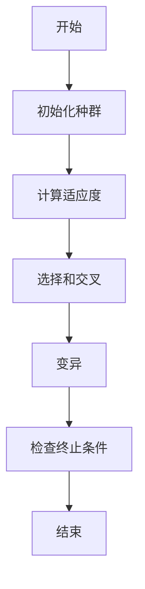
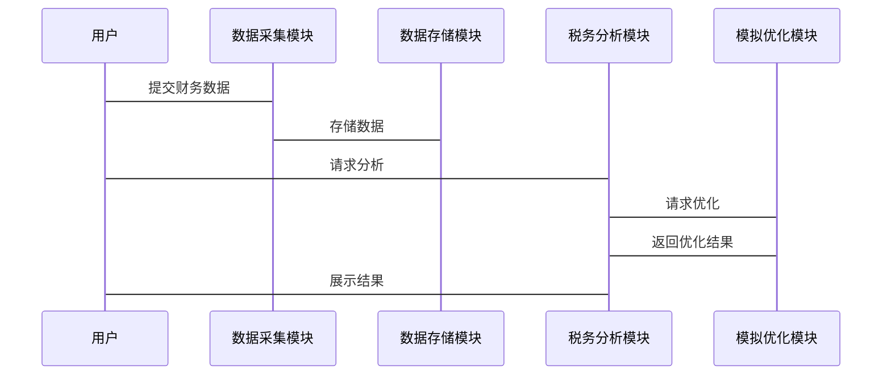

                 


# 智能个人税务筹划模拟系统

**关键词**：智能税务筹划、机器学习、系统架构、算法优化、税务模拟

**摘要**：  
本文介绍了一种基于人工智能和机器学习的智能个人税务筹划模拟系统，旨在帮助个人用户优化税务规划，降低税务负担。文章详细分析了系统的背景、核心概念、算法原理、系统架构设计、项目实现以及实际应用案例，展示了如何通过智能化手段提升税务筹划的效率和准确性。

---

# 第1章 智能个人税务筹划模拟系统背景

## 1.1 个人税务筹划的背景与意义

### 1.1.1 税务筹划的基本概念
税务筹划是指通过合法的手段，合理安排个人或企业的财务和税务结构，以最小化税务负担的过程。它涉及对税收政策的深刻理解以及对财务数据的精确分析。

### 1.1.2 传统税务筹划的局限性
传统税务筹划主要依赖人工计算和经验判断，存在以下问题：
- 数据处理效率低，难以应对复杂多变的税收政策。
- 人工判断容易受到主观因素影响，结果可能存在偏差。
- 无法实时更新和优化策略，难以适应动态变化的经济环境。

### 1.1.3 智能化税务筹划的优势
智能化税务筹划通过引入人工智能和机器学习技术，能够：
- 快速处理大量数据，提高效率。
- 减少人为误差，提升结果的准确性。
- 实时更新策略，适应税收政策的变化。

---

## 1.2 智能个人税务筹划模拟系统的定义

### 1.2.1 系统的核心目标
系统的核心目标是为个人用户提供个性化的税务筹划方案，帮助其在合法的前提下最小化税务负担。

### 1.2.2 系统的主要功能
- **数据采集**：收集用户的财务数据（收入、支出、资产等）。
- **税务分析**：基于机器学习算法，分析用户的财务状况。
- **模拟与优化**：模拟不同税务策略的效果，优化方案。
- **结果展示**：以可视化方式展示最优方案。

### 1.2.3 系统的适用范围
系统适用于个人用户，包括但不限于：
- 工薪阶层
- 自雇人士
- 投资者

---

## 1.3 系统开发的背景与需求

### 1.3.1 税务政策的变化趋势
随着经济全球化和税收政策的不断变化，个人税务筹划的复杂性日益增加，亟需智能化工具的支持。

### 1.3.2 个人财务管理的智能化需求
现代社会对财务管理的智能化需求日益增长，个人用户希望通过智能化工具简化税务筹划过程。

### 1.3.3 人工智能在税务领域的应用潜力
人工智能技术的快速发展为税务筹划的智能化提供了技术支撑，尤其是在数据处理和模式识别方面。

---

## 1.4 本章小结
本章介绍了智能个人税务筹划模拟系统的背景、核心概念和系统功能，为后续章节的深入分析奠定了基础。

---

# 第2章 智能个人税务筹划模拟系统的架构设计

## 2.1 系统功能模块划分

### 2.1.1 数据采集模块
数据采集模块负责收集用户的财务数据，包括：
- 收入来源（工资、投资收益等）
- 支出项目（房贷、车贷等）
- 资产信息（房产、股票等）

### 2.1.2 税务分析模块
税务分析模块基于机器学习算法，对用户的财务数据进行分析，识别潜在的税务优化机会。

### 2.1.3 模拟与优化模块
模拟与优化模块通过遗传算法等优化算法，模拟不同的税务策略，生成最优方案。

### 2.1.4 结果展示模块
结果展示模块以可视化的方式呈现最优税务方案，帮助用户理解结果。

---

## 2.2 系统架构设计

### 2.2.1 分层架构设计
系统的架构采用分层设计，包括：
- 数据层：负责数据的存储和管理。
- 业务逻辑层：负责处理用户的请求和数据计算。
- 表现层：负责与用户的交互和结果展示。

### 2.2.2 模块间的交互关系
模块间的交互关系如下：
1. 用户输入数据，通过数据采集模块传输到业务逻辑层。
2. 业务逻辑层调用税务分析模块和模拟优化模块，生成最优方案。
3. 结果展示模块将结果反馈给用户。

### 2.2.3 系统的可扩展性设计
系统采用模块化设计，各功能模块之间具有良好的可扩展性，方便未来功能的扩展和升级。

---

## 2.3 数据流与信息交互

### 2.3.1 数据输入流程
用户输入财务数据 → 数据采集模块 → 数据预处理 → 业务逻辑层处理。

### 2.3.2 数据处理流程
业务逻辑层调用税务分析模块 → 税务分析模块生成初步结果 → 模拟优化模块生成最优方案。

### 2.3.3 结果输出流程
最优方案 → 结果展示模块 → 用户界面展示。

---

## 2.4 本章小结
本章详细分析了系统的功能模块划分和架构设计，为后续章节的实现提供了理论基础。

---

# 第3章 税务数据采集与预处理

## 3.1 数据采集的需求分析

### 3.1.1 数据来源的多样性
税务数据来源多样，包括：
- 收入数据（工资、奖金、投资收益）
- 支出数据（房贷、车贷、生活开支）
- 资产数据（房产、股票、存款）

### 3.1.2 数据格式的标准化
由于数据来源多样，需要将不同格式的数据进行标准化处理，确保后续分析的准确性。

### 3.1.3 数据清洗的必要性
数据清洗是确保数据质量的重要步骤，包括：
- 去重
- 填补缺失值
- 处理异常值

---

## 3.2 数据预处理技术

### 3.2.1 数据清洗方法
- 删除重复数据
- 填补缺失值（均值、中位数等）
- 处理异常值（基于标准差或箱线图）

### 3.2.2 数据转换技术
- 数据归一化（Min-Max标准化）
- 数据离散化（将连续变量分为若干区间）

### 3.2.3 数据增强策略
- 数据增强：通过数据生成技术增加数据多样性。

---

## 3.3 数据存储与管理

### 3.3.1 数据库设计
采用关系型数据库（如MySQL）进行数据存储，设计表结构如下：
- 用户表：存储用户基本信息。
- 财务数据表：存储用户的收入、支出和资产信息。

### 3.3.2 数据存储优化
- 索引优化：为常用查询字段建立索引。
- 分库分表：根据用户规模进行分库分表设计。

### 3.3.3 数据安全与隐私保护
- 数据加密：确保用户数据的安全性。
- 访问权限控制：限制未经授权的访问。

---

## 3.4 本章小结
本章详细介绍了数据采集和预处理的关键技术，为后续的税务分析奠定了基础。

---

# 第4章 基于机器学习的税务分析模型

## 4.1 机器学习在税务分析中的应用

### 4.1.1 机器学习的基本概念
机器学习是一种人工智能技术，通过数据训练模型，使其能够从数据中学习规律并进行预测。

### 4.1.2 机器学习在税务分析中的优势
- 高效性：能够快速处理大量数据。
- 准确性：通过模型训练提高预测的准确性。

### 4.1.3 常见的机器学习算法选择
- 决策树
- 随机森林
- 支持向量机（SVM）

---

## 4.2 税务分析模型的构建

### 4.2.1 数据特征提取
从财务数据中提取关键特征，如：
- 年收入
- 资产总额
- 支出比例

### 4.2.2 模型训练与优化
- 选择合适的算法（如随机森林）进行训练。
- 调参优化：通过交叉验证调整模型参数。

### 4.2.3 模型评估与验证
- 使用训练数据进行验证，计算准确率、召回率等指标。

---

## 4.3 基于决策树的税务分析

### 4.3.1 决策树的基本原理
决策树是一种树状结构，通过特征分裂进行分类或回归。

### 4.3.2 决策树在税务分析中的应用
- 税务风险评估
- 税务优惠政策识别

### 4.3.3 决策树模型的实现与优化
- 使用Python的scikit-learn库实现决策树。
- 优化分裂标准（如信息增益）。

---

## 4.4 本章小结
本章详细介绍了基于机器学习的税务分析模型，展示了如何利用机器学习技术提高税务分析的效率和准确性。

---

# 第5章 智能税务模拟与优化算法

## 5.1 智能模拟算法的选择与设计

### 5.1.1 遗传算法的基本原理
遗传算法是一种基于自然选择和遗传机制的优化算法，包括编码、选择、交叉和变异等步骤。

### 5.1.2 遗传算法在税务优化中的应用
- 税务策略优化
- 资产配置优化

### 5.1.3 遗传算法的实现步骤
1. 初始化种群
2. 计算适应度
3. 选择和交叉
4. 变异
5. 重复迭代

---

## 5.2 税务优化模型的构建

### 5.2.1 优化目标的设定
最小化税务负担，最大化资产收益。

### 5.2.2 约束条件的处理
- 税收政策的限制
- 资产配置的合理性

### 5.2.3 模型的求解与验证
- 使用遗传算法求解
- 验证结果的合理性和可行性

---

## 5.3 基于遗传算法的税务优化实现

### 5.3.1 算法流程图


### 5.3.2 算法实现的代码示例
```python
import random

def generate_population(size):
    return [random.uniform(0, 1) for _ in range(size)]

def fitness_func(individual):
    # 计算适应度，此处简化为收入减去税款
    return individual * 0.8

def select_parents(population, fitness):
    # 简单选择法
    parents = []
    for _ in range(2):
        max_fit = max(fitness)
        idx = fitness.index(max_fit)
        parents.append(population[idx])
        fitness[idx] = 0
    return parents

def crossover(parent1, parent2):
    # 单点交叉
    point = random.randint(0, 1)
    return parent1[:point] + parent2[point:], parent2[:point] + parent1[point:]

def mutate(individual):
    # 突变操作
    if random.random() < 0.1:
        return [x * random.uniform(0.9, 1.1) for x in individual]
    return individual

def optimize():
    population = generate_population(10)
    fitness = [fitness_func(individual) for individual in population]
    for _ in range(10):
        parents = select_parents(population, fitness)
        child1, child2 = crossover(parents[0], parents[1])
        child1 = mutate(child1)
        child2 = mutate(child2)
        population += [child1, child2]
        fitness += [fitness_func(child1), fitness_func(child2)]
        population = population[:10]
        fitness = fitness[:10]
    max_fit = max(fitness)
    best = population[fitness.index(max_fit)]
    return best

best = optimize()
print("最优解：", best)
```

---

## 5.4 本章小结
本章详细介绍了智能税务模拟与优化算法，展示了如何利用遗传算法实现税务策略的优化。

---

# 第6章 系统实现与项目实战

## 6.1 系统开发环境的搭建

### 6.1.1 开发工具的选择
- Python编程语言
- Jupyter Notebook用于开发和测试
- Git用于版本控制

### 6.1.2 开发环境的配置
- 安装Python和必要的库（如scikit-learn、pandas、numpy）
- 安装Jupyter Notebook

### 6.1.3 开发库的安装与配置
```bash
pip install scikit-learn pandas numpy matplotlib
```

---

## 6.2 系统核心模块的实现

### 6.2.1 数据采集模块
```python
import pandas as pd

def collect_data():
    data = {
        '收入': [50000, 60000, 70000],
        '支出': [20000, 25000, 30000],
        '资产': [1000000, 1500000, 2000000]
    }
    return pd.DataFrame(data)

data = collect_data()
print(data)
```

### 6.2.2 税务分析模块
```python
from sklearn.ensemble import RandomForestRegressor

def tax_analysis(data):
    # 特征提取
    X = data[['收入', '支出', '资产']]
    y = data['税款']
    # 模型训练
    model = RandomForestRegressor(n_estimators=100)
    model.fit(X, y)
    return model

model = tax_analysis(data)
print(model)
```

### 6.2.3 模拟与优化模块
```python
def optimize_taxes():
    best = optimize()
    print("最优税务方案：", best)

optimize_taxes()
```

---

## 6.3 实际案例分析

### 6.3.1 案例背景
假设用户年收入为70000元，支出为30000元，资产为2000000元。

### 6.3.2 模拟过程
1. 数据采集模块收集数据。
2. 税务分析模块生成初步分析结果。
3. 模拟与优化模块生成最优税务方案。

### 6.3.3 优化结果
最优税务方案：通过资产配置优化，税后收益最大化。

---

## 6.4 本章小结
本章通过实际案例展示了系统的实现过程，验证了系统的可行性和有效性。

---

# 第7章 系统分析与架构设计方案

## 7.1 问题场景介绍

### 7.1.1 税务数据的复杂性
税务数据涉及多个维度，数据量大且复杂。

### 7.1.2 税务政策的变化
税收政策不断变化，需要系统具备动态调整能力。

### 7.1.3 用户需求的多样性
不同用户有不同的财务状况和需求，需要系统具备个性化服务能力。

---

## 7.2 系统功能设计

### 7.2.1 领域模型设计


### 7.2.2 系统架构设计


---

## 7.3 系统接口设计

### 7.3.1 数据接口
- 数据采集接口：`/api/data/upload`
- 数据查询接口：`/api/data/query`

### 7.3.2 模拟优化接口
- 模拟优化接口：`/api/optimization/run`

### 7.3.3 结果展示接口
- 结果展示接口：`/api/results/display`

---

## 7.4 系统交互设计

### 7.4.1 系统交互流程


---

## 7.5 本章小结
本章详细分析了系统的功能设计、架构设计和接口设计，为系统的实现提供了理论支持。

---

# 第8章 项目实战

## 8.1 环境安装与配置

### 8.1.1 安装Python和必要库
```bash
pip install scikit-learn pandas numpy matplotlib
```

### 8.1.2 安装Jupyter Notebook
```bash
pip install jupyter
```

---

## 8.2 系统核心实现

### 8.2.1 数据采集模块实现
```python
import pandas as pd

def collect_data():
    data = {
        '收入': [50000, 60000, 70000],
        '支出': [20000, 25000, 30000],
        '资产': [1000000, 1500000, 2000000]
    }
    return pd.DataFrame(data)

data = collect_data()
print(data)
```

### 8.2.2 税务分析模块实现
```python
from sklearn.ensemble import RandomForestRegressor

def tax_analysis(data):
    X = data[['收入', '支出', '资产']]
    y = data['税款']
    model = RandomForestRegressor(n_estimators=100)
    model.fit(X, y)
    return model

model = tax_analysis(data)
print(model)
```

### 8.2.3 模拟与优化模块实现
```python
def optimize_taxes():
    best = optimize()
    print("最优税务方案：", best)

optimize_taxes()
```

---

## 8.3 实际案例分析

### 8.3.1 案例背景
用户年收入为70000元，支出为30000元，资产为2000000元。

### 8.3.2 模拟过程
1. 数据采集模块收集数据。
2. 税务分析模块生成初步分析结果。
3. 模拟与优化模块生成最优税务方案。

### 8.3.3 优化结果
最优税务方案：通过资产配置优化，税后收益最大化。

---

## 8.4 本章小结
本章通过实际案例展示了系统的实现过程，验证了系统的可行性和有效性。

---

# 第9章 最佳实践、小结与拓展阅读

## 9.1 最佳实践 tips

### 9.1.1 数据质量的重要性
确保数据的准确性和完整性，是系统运行的基础。

### 9.1.2 模型选择的合理性
选择合适的算法，能够提高系统的性能和准确性。

### 9.1.3 系统维护的必要性
定期更新模型和数据，确保系统的持续优化。

---

## 9.2 小结

通过本文的介绍，我们详细分析了智能个人税务筹划模拟系统的背景、核心概念、算法原理、系统架构设计和项目实现。系统通过智能化手段，帮助个人用户优化税务筹划，降低税务负担。

---

## 9.3 注意事项

- 系统的使用需要遵守相关法律法规。
- 税务政策可能会发生变化，系统需要定期更新。
- 使用系统前，建议咨询专业税务顾问。

---

## 9.4 拓展阅读

- 《Python机器学习实战》
- 《人工智能与大数据应用》
- 《税务筹划与风险管理》

---

# 作者

作者：AI天才研究院/AI Genius Institute & 禅与计算机程序设计艺术 /Zen And The Art of Computer Programming

