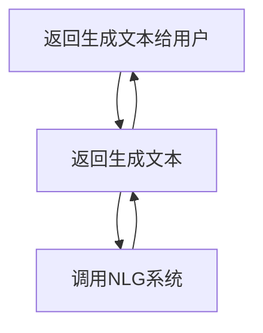

                 


# 自然语言生成（NLG）：优化AI Agent的表达能力

## 关键词：自然语言生成、AI Agent、生成模型、NLP、深度学习

## 摘要：  
自然语言生成（NLG）作为人工智能领域的重要技术，旨在让机器能够生成自然流畅的人类语言。随着深度学习技术的快速发展，NLG技术在AI Agent中的应用越来越广泛，但其表达能力的优化仍面临诸多挑战。本文将从NLG的核心概念、算法原理、系统架构到实际项目案例，全面解析如何优化AI Agent的表达能力。通过对比分析不同生成模型的优缺点，结合实际场景需求，提出优化策略，为AI Agent的自然语言交互提供理论支持和实践指导。

---

# 第一部分: 自然语言生成（NLG）基础

## 第1章: 自然语言生成（NLG）概述

### 1.1 自然语言生成（NLG）的定义与背景  
自然语言生成（Natural Language Generation, NLG）是指将结构化数据或信息转化为自然流畅的文本的技术。它在人机交互、智能对话系统、内容生成等领域具有重要应用。随着AI Agent的普及，NLG技术成为优化其表达能力的关键技术。  

#### 1.1.1 自然语言生成的基本概念  
自然语言生成是人工智能的一个重要分支，旨在让计算机能够像人类一样生成有意义的文本。其核心目标是将数据或信息转化为自然语言表达，满足用户的信息需求。  

#### 1.1.2 NLG技术的发展历程  
NLG技术经历了从基于规则的方法到统计模型，再到深度学习模型的演变。早期的规则-based系统依赖手动编写规则，生成能力有限。随着机器学习的兴起，统计模型和深度学习模型逐渐成为主流，生成质量显著提升。  

#### 1.1.3 NLG技术的核心问题与挑战  
- **生成多样性**：如何生成多样化且自然的文本。  
- **生成可控制性**：如何根据需求调整生成内容的风格、语气等。  
- **生成可解释性**：如何让用户理解生成内容的逻辑和依据。  

### 1.2 自然语言生成的关键技术  
自然语言生成技术可以分为以下几类：  
1. **基于规则的生成模型**：通过预定义的规则生成文本，适用于特定场景。  
2. **基于统计的生成模型**：利用概率统计方法生成文本，如n-gram模型。  
3. **基于深度学习的生成模型**：如RNN、LSTM、Transformer等，能够生成高质量的文本。  

#### 1.2.1 基于规则的生成模型  
基于规则的生成模型通过预定义的语法规则生成文本，适用于简单场景。  
- 优点：生成结果可控，适合特定领域。  
- 缺点：生成内容缺乏灵活性，难以应对复杂场景。  

#### 1.2.2 NLG与NLP的关系  
自然语言生成是自然语言处理（NLP）的重要组成部分。NLP关注从文本到信息的处理，而NLG关注从信息到文本的生成。两者相辅相成，共同推动人机交互的进步。  

#### 1.2.3 NLG在AI Agent中的作用  
AI Agent需要通过自然语言与用户交互，NLG技术是其实现语言表达的核心技术。通过NLG，AI Agent能够生成自然流畅的文本，提升用户体验。  

### 1.3 自然语言生成的应用场景  
自然语言生成技术广泛应用于以下场景：  
1. **机器翻译**：将一种语言翻译成另一种语言。  
2. **聊天机器人**：与用户进行自然对话。  
3. **文本摘要与总结**：将长文本压缩成关键信息。  
4. **生成式内容创作**：自动生成文章、广告文案等。  

---

## 第2章: 自然语言生成的核心概念  

### 2.1 自然语言生成的生成模型  
自然语言生成的生成模型可以分为以下几类：  
1. **基于规则的生成模型**：通过预定义规则生成文本。  
2. **基于统计的生成模型**：利用概率统计方法生成文本。  
3. **基于深度学习的生成模型**：如Transformer、GPT等。  

#### 2.1.1 基于规则的生成模型  
基于规则的生成模型通过预定义的语法规则生成文本，适用于简单场景。  
- 优点：生成结果可控，适合特定领域。  
- 缺点：生成内容缺乏灵活性，难以应对复杂场景。  

#### 2.1.2 基于统计的生成模型  
基于统计的生成模型利用概率统计方法生成文本，如n-gram模型。  
- 优点：能够捕捉语言的统计规律，生成多样化的内容。  
- 缺点：生成结果缺乏语义理解，容易产生语法错误。  

#### 2.1.3 基于深度学习的生成模型  
基于深度学习的生成模型是目前最主流的生成模型，如Transformer、GPT等。  
- 优点：能够捕捉语言的深层结构，生成高质量的文本。  
- 缺点：训练需要大量数据和计算资源，生成速度较慢。  

### 2.2 自然语言生成的生成过程  
自然语言生成的生成过程可以分为以下几个步骤：  
1. **输入处理**：将输入数据转化为模型可以处理的形式。  
2. **编码器-解码器结构**：将输入数据编码为隐层表示，解码器将其转化为目标语言的文本。  
3. **注意机制**：在解码过程中，模型关注输入数据的重要部分，生成更准确的输出。  

#### 2.2.1 编码器-解码器结构  
编码器-解码器结构是基于Transformer的生成模型的核心结构。编码器将输入数据编码为隐层表示，解码器将其解码为目标语言的文本。  

#### 2.2.2 注意机制  
注意机制允许模型在解码过程中关注输入数据的重要部分，从而生成更准确的输出。  

#### 2.2.3 解码策略  
解码策略决定了生成文本的方式，常见的解码策略包括贪心解码和束搜索解码。  

### 2.3 自然语言生成的关键问题  
自然语言生成的关键问题包括生成的可控性、生成的可解释性和生成的多样性。  

#### 2.3.1 生成的可控性  
生成的可控性是指模型能够根据需求调整生成内容的风格、语气等。  

#### 2.3.2 生成的可解释性  
生成的可解释性是指用户能够理解生成内容的逻辑和依据。  

#### 2.3.3 生成的多样性  
生成的多样性是指模型能够生成多样化的文本，避免重复内容。  

### 2.4 自然语言生成的核心要素对比  
以下是不同生成模型的优缺点对比：

| 模型类型       | 优点                           | 缺点                           |
|----------------|--------------------------------|--------------------------------|
| 基于规则的模型 | 生成结果可控，适合特定领域     | 生成内容缺乏灵活性，难以应对复杂场景 |
| 基于统计的模型 | 能够捕捉语言的统计规律，生成多样化内容 | 生成结果缺乏语义理解，容易产生语法错误 |
| 基于深度学习的模型 | 能够捕捉语言的深层结构，生成高质量的文本 | 训练需要大量数据和计算资源，生成速度较慢 |

### 2.5 自然语言生成的ER实体关系图  
以下是自然语言生成的ER实体关系图：

```mermaid
er
actor: User
agt: AI Agent
nlg: NLG System
message: Generated Text

actor -[发起请求]-> agt
agt -[调用NLG]-> nlg
nlg -[生成文本]-> message
message -[返回给User]-> actor
```

---

## 第3章: 自然语言生成的算法原理  

### 3.1 基于Transformer的生成模型  

#### 3.1.1 Transformer模型的基本结构  
Transformer模型由编码器和解码器组成，编码器将输入数据编码为隐层表示，解码器将其解码为目标语言的文本。  

#### 3.1.2 解码器的生成过程  
解码器在生成文本时，会利用注意机制关注输入数据的重要部分，生成更准确的输出。  

#### 3.1.3 多头注意力机制  
多头注意力机制允许模型在不同子空间中关注不同的信息，从而生成更丰富的文本。  

#### 3.1.4 解码器的实现代码  
以下是基于Transformer的解码器实现代码：

```python
import torch
import torch.nn as nn
import torch.nn.functional as F

class Decoder(nn.Module):
    def __init__(self, d_model, nhead, d_hid, dropout):
        super(Decoder, self).__init__()
        self.decoder_layer = nn.TransformerDecoderLayer(d_model=d_model, nhead=nhead, 
                                                          d_hid=d_hid, dropout=dropout)
        self.output_layer = nn.Linear(d_model, target_vocab_size)
        
    def forward(self, x, memory, tgt_mask=None):
        x = x.permute(1, 0, 2)  # 增加序列维度
        output = self.decoder_layer(x, memory.permute(1, 0, 2), tgt_mask=tgt_mask)
        output = output.permute(1, 0, 2)  # 恢复原始维度
        output = self.output_layer(output)
        return output
```

#### 3.1.4 解码过程的数学模型  
解码过程的数学模型如下：

$$
\text{解码器输出} = \text{多头注意力}(\text{解码器输入}, \text{编码器输出}) + \text{前馈网络}(\text{解码器输入})
$$

### 3.2 GPT系列模型的生成原理  

#### 3.2.1 GPT模型的基本结构  
GPT模型由一个自回归的解码器组成，通过逐词生成文本。  

#### 3.2.2 GPT模型的训练过程  
GPT模型通过无监督学习方式训练，模型在大量文本数据上进行预训练，学习语言的分布规律。  

#### 3.2.3 GPT模型的生成过程  
GPT模型通过自回归的方式生成文本，每一步生成一个词，直到生成完整的文本。  

#### 3.2.4 GPT模型的实现代码  
以下是GPT模型的实现代码：

```python
class GPT(nn.Module):
    def __init__(self, vocab_size, d_model, nhead, d_hid, dropout):
        super(GPT, self).__init__()
        self.embedding = nn.Embedding(vocab_size, d_model)
        self.transformer = nn.Transformer(d_model=d_model, nhead=nhead, 
                                           d_hid=d_hid, dropout=dropout)
        self.output_layer = nn.Linear(d_model, vocab_size)
        
    def forward(self, input, target=None):
        input_embedding = self.embedding(input)
        output = self.transformer(input_embedding)
        output = self.output_layer(output)
        
        if target is not None:
            loss = F.cross_entropy(output.view(-1, output.size(-1)), 
                                    target.view(-1))
            return output, loss
        else:
            return output
```

#### 3.2.5 GPT模型的数学模型  
GPT模型的数学模型如下：

$$
P(y|x) = \prod_{i=1}^{n} P(y_i | y_{i-1}, \ldots, y_1)
$$

其中，$x$ 是输入，$y$ 是生成的文本。

### 3.3 扩散模型的生成原理  

#### 3.3.1 扩散模型的基本概念  
扩散模型是一种基于概率的生成模型，通过逐步添加噪声并学习如何恢复原始数据。  

#### 3.3.2 扩散模型的训练过程  
扩散模型在训练阶段通过最大化数据的似然，学习如何逐步恢复原始数据。  

#### 3.3.3 扩散模型的生成过程  
扩散模型在生成阶段通过逐步去噪，生成高质量的文本。  

#### 3.3.4 扩散模型的实现代码  
以下是扩散模型的实现代码：

```python
import torch
import torch.nn as nn
import torch.nn.functional as F

class Diffusion(nn.Module):
    def __init__(self, d_model, nhead, d_hid, dropout):
        super(Diffusion, self).__init__()
        self.transformer = nn.Transformer(d_model=d_model, nhead=nhead, 
                                           d_hid=d_hid, dropout=dropout)
        self.noise_schedule = torch.linspace(0, 1, 100)
        
    def forward(self, x):
        t = torch.randint(0, 100, (x.size(0),))
        noise = torch.randn_like(x)
        x = x + noise * self.noise_schedule[t]
        output = self.transformer(x)
        return output
```

#### 3.3.5 扩散模型的数学模型  
扩散模型的数学模型如下：

$$
q(x_t|x_{t-1}) = \mathcal{N}(x_t; \mu_\theta(x_{t-1}), \sigma^2)
$$

其中，$x_t$ 是第 $t$ 步的生成结果，$\mu_\theta$ 是模型的参数。

---

## 第4章: 自然语言生成的系统架构  

### 4.1 问题场景介绍  
自然语言生成系统需要能够根据输入生成自然流畅的文本，适用于多种场景，如聊天机器人、文本摘要等。  

### 4.2 系统功能设计  

#### 4.2.1 领域模型设计  
以下是自然语言生成系统的领域模型：

```mermaid
classDiagram
    class User {
        + id: int
        + name: string
        + request: string
    }
    class NLGSystem {
        + model: Transformer
        + vocab: Vocab
        + output: string
    }
    class AIAssistant {
        + nlg: NLGSystem
        + response: string
    }
    User -> NLGSystem: 请求生成文本
    NLGSystem -> AIAssistant: 返回生成文本
```

### 4.3 系统架构设计  

#### 4.3.1 系统架构图  
以下是自然语言生成系统的架构图：


### 4.4 系统接口设计  

#### 4.4.1 系统接口图  
以下是自然语言生成系统的接口图：

```mermaid
sequenceDiagram
    actor User
    system AI Agent
    User -> AI Agent: 请求生成文本
    AI Agent -> NLG System: 调用NLG接口
    NLG System -> AI Agent: 返回生成文本
    AI Agent -> User: 返回生成文本
```

### 4.5 系统交互过程  

#### 4.5.1 系统交互流程图  
以下是自然语言生成系统的交互流程图：



---

## 第5章: 项目实战  

### 5.1 项目环境安装  

#### 5.1.1 安装Python和相关库  
需要安装Python 3.8及以上版本，以及以下库：  
- `torch`  
- `transformers`  
- `mermaid`  

#### 5.1.2 安装命令  
```bash
pip install torch transformers mermaid
```

### 5.2 系统核心实现  

#### 5.2.1 系统核心代码  
以下是自然语言生成系统的实现代码：

```python
import torch
from transformers import AutoTokenizer, AutoModelForSeq2Seq

class NLGSystem:
    def __init__(self, model_name):
        self.tokenizer = AutoTokenizer.from_pretrained(model_name)
        self.model = AutoModelForSeq2Seq.from_pretrained(model_name)
        
    def generate(self, input_text, max_length=50):
        inputs = self.tokenizer.encode(input_text, return_tensors='pt')
        outputs = self.model.generate(inputs, max_length=max_length)
        return self.tokenizer.decode(outputs[0], skip_special_tokens=True)

# 示例使用
nlg = NLGSystem("facebook/c刀te-nmt-en-ru")
response = nlg.generate("Hello, how are you?")
print(response)
```

#### 5.2.2 代码实现解读  
- **NLGSystem类**：封装了自然语言生成系统的实现，包括模型加载和生成过程。  
- **generate方法**：实现生成文本的功能，支持最大长度参数。  

### 5.3 代码应用解读与分析  
通过代码实现，我们可以看到自然语言生成系统的核心在于模型的选择和生成过程的控制。不同的模型和参数设置会影响生成结果的质量和多样性。  

### 5.4 实际案例分析  

#### 5.4.1 案例分析  
以下是使用GPT模型生成文本的案例：

```python
model = GPT(vocab_size=30000, d_model=512, nhead=8, d_hid=1024, dropout=0.1)
input = torch.randint(0, 30000, (1, 1))
output, loss = model(input, target=torch.randint(0, 30000, (1, 1)))
print(output.argmax(dim=-1).item())
```

#### 5.4.2 案例总结  
通过案例分析，我们可以看到自然语言生成系统的实现需要选择合适的模型和参数，同时需要根据具体场景调整生成策略。  

---

## 第6章: 最佳实践、小结、注意事项、拓展阅读  

### 6.1 最佳实践  
- **选择合适的模型**：根据具体需求选择适合的生成模型。  
- **优化生成策略**：通过调整生成参数提升生成质量。  
- **结合领域知识**：将领域知识融入生成模型，提升生成结果的准确性。  

### 6.2 小结  
自然语言生成技术是优化AI Agent表达能力的核心技术。通过选择合适的生成模型和优化生成策略，可以显著提升生成文本的质量和多样性。  

### 6.3 注意事项  
- **生成结果的可控性**：确保生成内容符合用户需求。  
- **生成结果的可解释性**：让用户理解生成内容的逻辑和依据。  
- **生成结果的多样性**：避免生成重复内容，提升用户体验。  

### 6.4 拓展阅读  
- **《Deep Learning》—— Ian Goodfellow  
- **《生成式AI：人工智能新范式》—— Andrew Ng  
- **《Transformers in Action》—— Dr. Jürgen Schmidhuber  

---

## 作者：AI天才研究院/AI Genius Institute & 禅与计算机程序设计艺术 /Zen And The Art of Computer Programming

