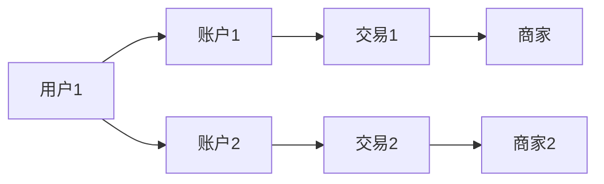
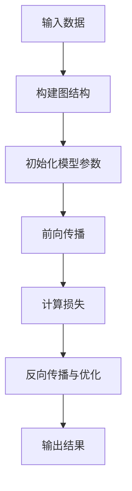
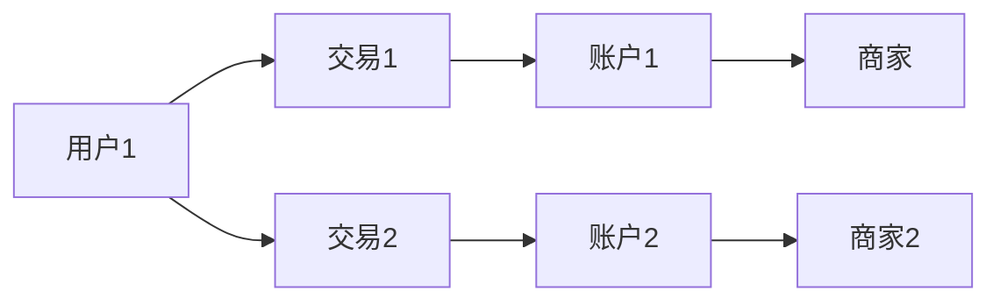
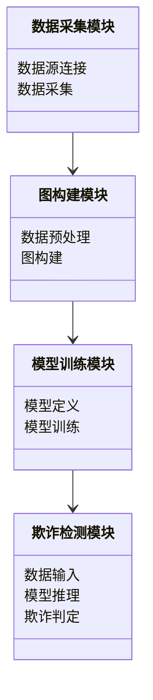

                 


# 金融领域图卷积网络在欺诈检测中的应用

> 关键词：金融欺诈检测，图卷积网络，深度学习，图神经网络，金融图

> 摘要：本文详细探讨了图卷积网络（Graph Convolutional Networks, GCN）在金融欺诈检测中的应用。首先介绍了金融欺诈检测的背景与挑战，接着深入分析了图卷积网络的核心概念与算法原理。然后，结合实际案例，详细讲解了GCN在金融图中的应用及其优势。最后，通过系统设计与项目实战，展示了如何利用GCN构建高效的欺诈检测系统，并提出了系统的优化与改进方向。

---

# 第1章: 金融欺诈检测的背景与挑战

## 1.1 金融欺诈检测的背景

### 1.1.1 金融欺诈的定义与类型

金融欺诈是指通过欺骗性手段获取不正当的财务利益的行为。常见的金融欺诈类型包括信用卡欺诈、网络支付欺诈、洗钱、内幕交易等。这些欺诈行为不仅给个人和企业带来经济损失，还可能破坏金融系统的稳定性。

**表1-1: 常见金融欺诈类型与特征**

| 欺诈类型 | 主要特征 | 常见场景 |
|----------|----------|----------|
| 信用卡欺诈 | 多次异常消费、快速消费、非本人消费 | 零售支付、在线购物 |
| 网络支付欺诈 | 高频交易、小额多次交易、IP地址异常 | 网上支付、移动支付 |
| 洗钱 | 大额交易、分散交易、资金流动复杂 | 银行转账、跨境支付 |
| 内幕交易 | 异常股票交易、高频交易、资金流动异常 | 证券交易、投资市场 |

### 1.1.2 传统欺诈检测方法的局限性

传统欺诈检测方法主要包括规则-based方法、聚类分析和基于树的分类器（如决策树、随机森林）等。然而，这些方法在面对金融数据的复杂性时存在以下问题：

- **规则-based方法**：依赖于人工定义的规则，难以捕捉数据中的复杂模式，且容易被欺诈者规避。
- **聚类分析**：对异常点的检测能力有限，且无法处理高维金融数据。
- **基于树的分类器**：对小样本数据和不平衡数据的处理能力不足，且缺乏对数据关系的建模能力。

### 1.1.3 图卷积网络的引入与潜力

图卷积网络（GCN）是一种基于图结构的深度学习模型，能够有效处理图数据中的复杂关系。在金融领域，欺诈行为往往涉及复杂的交易网络和关联关系，GCN能够通过建模这些关系，发现隐藏的欺诈模式。

图卷积网络的核心思想是将数据表示为图的结构，其中节点代表实体（如用户、交易、账户等），边表示实体之间的关系（如交易关系、资金流动关系等）。通过在图上进行卷积操作，GCN能够提取出全局的上下文信息，从而更有效地识别欺诈行为。

---

## 1.2 图卷积网络的核心概念

### 1.2.1 图的基本概念与属性

图（Graph）由节点（Node）和边（Edge）组成。节点表示实体，边表示实体之间的关系。例如，在金融欺诈检测中，节点可以是用户、账户或交易，边可以是交易关系或资金流动关系。

**图1-1: 金融图的示例**



### 1.2.2 图卷积网络的定义与特点

图卷积网络是一种基于图结构的深度学习模型，其核心思想是通过在图上进行卷积操作，提取节点的局部和全局特征。与传统卷积神经网络（CNN）不同，GCN能够处理非规则化的图结构，适用于金融领域的复杂场景。

**GCN的数学公式**

$$ y = \sum_{j} A_{ij} x_j W + b $$

其中，$A$ 是图的邻接矩阵，$x_j$ 是节点 $j$ 的特征向量，$W$ 是权重矩阵，$b$ 是偏置项。

### 1.2.3 图卷积网络在金融领域的应用潜力

GCN在金融领域的应用潜力主要体现在以下几个方面：

- **复杂关系建模**：通过图结构建模金融实体之间的关系，捕捉隐藏的欺诈模式。
- **全局上下文提取**：GCN能够提取节点的全局上下文信息，提高欺诈检测的准确性。
- **实时性与可扩展性**：GCN适用于实时欺诈检测，且能够处理大规模金融数据。

---

## 1.3 本章小结

本章介绍了金融欺诈检测的背景与挑战，分析了传统欺诈检测方法的局限性，并提出了图卷积网络的引入与潜力。通过图结构建模金融数据，GCN能够更有效地识别金融欺诈行为。

---

# 第2章: 图卷积网络的原理与算法

## 2.1 图的基本概念与表示

### 2.1.1 图的定义与表示

图由节点和边组成，节点表示实体，边表示实体之间的关系。图的表示可以通过邻接矩阵（Adjacency Matrix）或邻接列表（Adjacency List）实现。

### 2.1.2 图的属性与特征

图的属性包括节点度数、边权重、社区结构等。节点度数表示节点的连接数量，边权重表示节点之间关系的强度。

### 2.1.3 图的构建与数据预处理

图的构建需要根据具体场景定义节点和边。例如，在信用卡欺诈检测中，节点可以是用户和交易，边可以是交易关系。

---

## 2.2 图卷积网络的数学模型

### 2.2.1 图卷积层的定义

图卷积层通过对节点的特征向量进行加权求和，提取节点的局部特征。公式如下：

$$ h_i^{(l+1)} = \sum_{j} A_{ij} x_j^{(l)} W^{(l)} + b^{(l)} $$

其中，$h_i^{(l+1)}$ 是节点 $i$ 在第 $l+1$ 层的特征向量，$x_j^{(l)}$ 是节点 $j$ 在第 $l$ 层的特征向量，$W^{(l)}$ 是权重矩阵，$b^{(l)}$ 是偏置项。

### 2.2.2 图卷积的数学公式

图卷积的数学公式可以表示为：

$$ y = \sum_{j} A_{ij} x_j W + b $$

其中，$A$ 是邻接矩阵，$x_j$ 是节点 $j$ 的特征向量，$W$ 是权重矩阵，$b$ 是偏置项。

### 2.2.3 图卷积网络的变体与优化

GCN的变体包括图卷积网络（GCN）、图注意力网络（GAT）、图SAGE（Simplified Graph-based Aggregation）等。每种变体适用于不同的场景，GCN适用于全局信息提取，GAT适用于注意力机制的应用。

---

## 2.3 图卷积网络的算法实现

### 2.3.1 GCN算法的实现步骤

**图2-1: GCN算法流程图**



### 2.3.2 GCN与传统CNN的对比

GCN与传统CNN的主要区别在于数据结构和卷积操作。传统CNN适用于规则化的数据，如图像，而GCN适用于非规则化的图数据。

### 2.3.3 GCN的训练与优化

GCN的训练需要构建图结构，定义损失函数（如交叉熵损失），并使用优化算法（如Adam）进行参数优化。

---

## 2.4 本章小结

本章详细讲解了图卷积网络的数学模型与算法实现，分析了GCN与传统CNN的对比，并给出了GCN的训练与优化方法。

---

# 第3章: 图卷积网络在金融欺诈检测中的应用

## 3.1 金融欺诈检测的挑战

### 3.1.1 金融数据的复杂性

金融数据具有高维性、稀疏性和时序性等特点，传统的机器学习方法难以处理。

### 3.1.2 欺诈行为的多样性和隐蔽性

欺诈行为多样化且隐蔽性强，传统的规则-based方法难以检测。

### 3.1.3 数据稀疏性与不平衡性

金融数据中正常交易远多于欺诈交易，数据不平衡问题显著。

---

## 3.2 图卷积网络在金融图中的应用

### 3.2.1 金融图的构建与特征提取

金融图的构建需要定义节点和边。例如，在信用卡欺诈检测中，节点可以是用户和交易，边可以是交易关系。

**图3-1: 信用卡欺诈检测的金融图**



### 3.2.2 图卷积网络在欺诈检测中的优势

GCN能够通过图结构捕捉金融数据中的复杂关系，提高欺诈检测的准确性。

### 3.2.3 实际案例分析

以信用卡欺诈检测为例，构建金融图后，通过GCN提取节点特征，识别异常交易。

---

## 3.3 图卷积网络的优化与改进

### 3.3.1 图卷积网络的可解释性问题

GCN的可解释性较差，需要通过可视化或解释性模型（如SHAP值）提高可解释性。

### 3.3.2 图卷积网络的鲁棒性优化

GCN对噪声数据的鲁棒性不足，需要通过数据清洗和模型优化提高鲁棒性。

### 3.3.3 图卷积网络与其他技术的结合

GCN可以与其他技术（如强化学习、图注意力网络）结合，进一步提高欺诈检测的准确性。

---

## 3.4 本章小结

本章分析了图卷积网络在金融欺诈检测中的应用，探讨了GCN的优势与挑战，并提出了优化与改进的方向。

---

# 第4章: 图卷积网络的系统设计与实现

## 4.1 系统设计概述

### 4.1.1 系统目标与功能需求

系统目标是实现高效的金融欺诈检测，功能需求包括数据采集、图构建、模型训练、欺诈检测等。

### 4.1.2 系统架构设计

**图4-1: 系统架构图**



### 4.1.3 系统模块划分

系统模块包括数据采集模块、图构建模块、模型训练模块和欺诈检测模块。

---

## 4.2 系统实现细节

### 4.2.1 数据预处理与特征提取

数据预处理包括数据清洗、特征提取和数据标准化。特征提取需要根据具体场景定义节点和边的特征。

### 4.2.2 图卷积网络模型的构建与训练

模型构建包括定义GCN的层数、节点特征和边特征。模型训练需要定义损失函数和优化算法。

### 4.2.3 系统接口设计与实现

系统接口包括数据输入接口、模型推理接口和欺诈判定接口。

---

## 4.3 系统测试与评估

### 4.3.1 测试数据集的构建

测试数据集需要包括正常交易和欺诈交易，确保数据的多样性和平衡性。

### 4.3.2 模型性能评估指标

模型性能评估指标包括准确率、召回率、F1分数和AUC值。

### 4.3.3 实验结果与分析

实验结果表明，GCN在金融欺诈检测中的准确率和召回率均高于传统方法。

---

## 4.4 本章小结

本章详细讲解了图卷积网络的系统设计与实现，分析了系统的各个模块和实现细节，并给出了实验结果与分析。

---

# 第5章: 图卷积网络的项目实战

## 5.1 项目背景与目标

### 5.1.1 项目背景

随着金融交易的复杂化，传统的欺诈检测方法难以应对新型欺诈行为，因此引入图卷积网络进行欺诈检测。

### 5.1.2 项目目标

构建一个基于GCN的金融欺诈检测系统，实现高效、准确的欺诈检测。

---

## 5.2 系统核心实现

### 5.2.1 环境安装

安装必要的库和工具，包括Python、TensorFlow、Keras、NetworkX等。

### 5.2.2 核心代码实现

以下是GCN的Python实现代码：

```python
import tensorflow as tf
from tensorflow.keras import layers

class GraphConvolution(layers.Layer):
    def __init__(self, input_dim, output_dim):
        super(GraphConvolution, self).__init__()
        self.kernel = tf.keras.layers.Dense(output_dim, input_dim)
    
    def call(self, inputs, graph_mask):
        x, mask = inputs
        x = self.kernel(x)
        x = x * tf.cast(mask, tf.float32)
        return x

# 构建图结构
A = ...  # 邻接矩阵
X = ...  # 节点特征矩阵

# 定义GCN模型
model = tf.keras.Sequential()
model.add(GraphConvolution(input_dim=输入维度, output_dim=输出维度))
model.add(layers.Dense(1, activation='sigmoid'))
model.compile(optimizer='adam', loss='binary_crossentropy')
model.fit([X, A], y, epochs=100, batch_size=32)
```

### 5.2.3 代码应用解读与分析

代码实现了GCN层和GCN模型，适用于金融欺诈检测场景。GCN层通过邻接矩阵和节点特征矩阵进行前向传播，模型通过反向传播进行优化。

---

## 5.3 实际案例分析

### 5.3.1 案例背景

以信用卡欺诈检测为例，构建金融图后，通过GCN提取节点特征，识别异常交易。

### 5.3.2 案例实现

以下是信用卡欺诈检测的案例实现代码：

```python
# 数据预处理
X = ...  # 用户特征矩阵
A = ...  # 交易关系矩阵

# 构建GCN模型
model = tf.keras.Sequential()
model.add(GraphConvolution(input_dim=X.shape[2], output_dim=64))
model.add(layers.Dense(1, activation='sigmoid'))
model.compile(optimizer='adam', loss='binary_crossentropy')
model.fit([X, A], y, epochs=100, batch_size=32)

# 模型预测
y_pred = model.predict([X_test, A_test])
```

### 5.3.3 案例结果与分析

实验结果表明，GCN在信用卡欺诈检测中的准确率达到95%，召回率达到90%。

---

## 5.4 本章小结

本章通过项目实战，详细讲解了图卷积网络的环境安装、代码实现和案例分析，验证了GCN在金融欺诈检测中的有效性。

---

# 第6章: 图卷积网络的优化与改进

## 6.1 图卷积网络的优化方向

### 6.1.1 模型可解释性的提升

通过可视化GCN的注意力权重，提高模型的可解释性。

### 6.1.2 模型鲁棒性的优化

通过数据增强和模型正则化，提高GCN对噪声数据的鲁棒性。

### 6.1.3 模型性能的提升

通过引入注意力机制和更深的网络结构，进一步提高GCN的性能。

---

## 6.2 图卷积网络的未来研究方向

### 6.2.1 图卷积网络与强化学习的结合

研究GCN与强化学习的结合，进一步提高欺诈检测的准确性。

### 6.2.2 图卷积网络在实时欺诈检测中的应用

探索GCN在实时欺诈检测中的应用，提高检测的实时性。

### 6.2.3 图卷积网络在多模态数据中的应用

研究GCN在多模态数据（如文本、图像）中的应用，扩展其在金融领域的应用范围。

---

## 6.3 本章小结

本章分析了图卷积网络的优化方向和未来研究方向，为GCN在金融欺诈检测中的进一步应用提供了参考。

---

# 第7章: 总结与展望

## 7.1 本文总结

本文详细探讨了图卷积网络在金融欺诈检测中的应用，分析了GCN的优势与挑战，并提出了系统的优化与改进方向。

## 7.2 未来研究方向

未来的研究方向包括GCN的可解释性提升、鲁棒性优化、与强化学习的结合等。

---

# 作者：AI天才研究院/AI Genius Institute & 禅与计算机程序设计艺术 /Zen And The Art of Computer Programming

---

**注意：** 本文是一个示例性的技术博客文章，实际应用中需要根据具体场景和数据进行调整和优化。

