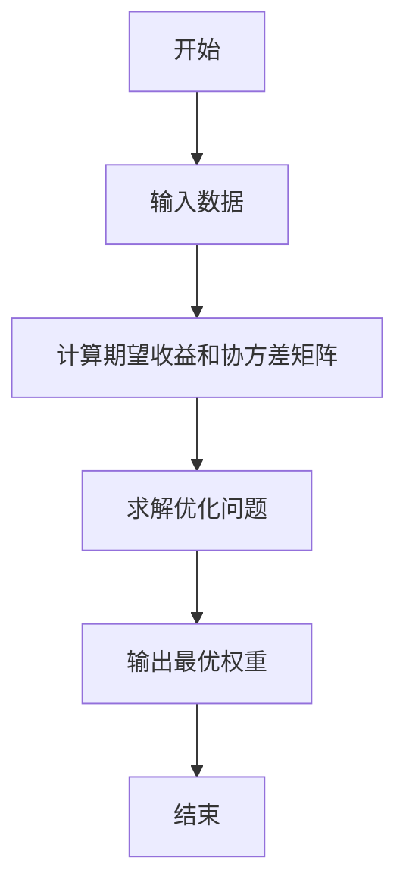
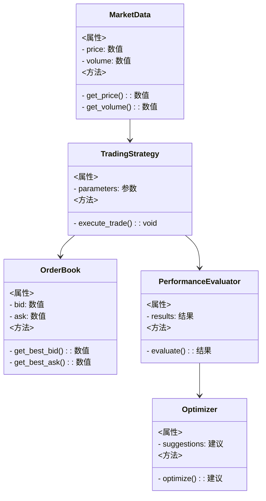
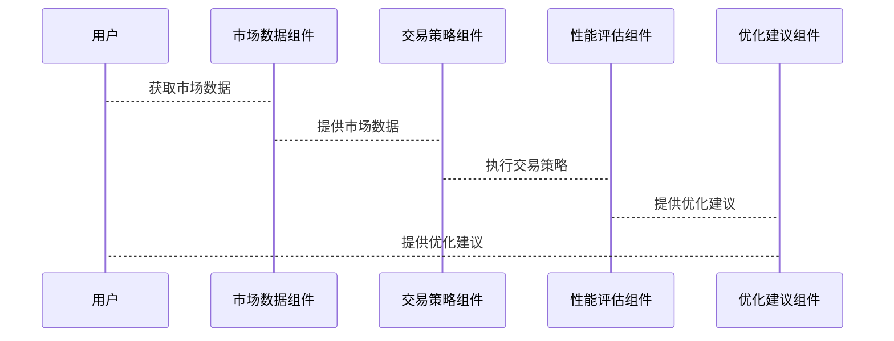

                 


# 《金融高频交易策略性能评估与优化框架》

## 关键词：高频交易，性能评估，策略优化，金融算法，交易系统架构

## 摘要：本文系统地介绍金融高频交易策略的性能评估与优化框架。从高频交易的基本概念、性能评估指标入手，结合实际应用场景，深入探讨高频交易中的关键算法与优化方法。通过数学建模、系统架构设计和项目实战，为读者提供一套完整的高频交易策略优化解决方案，帮助读者在金融交易中提升效率和收益。

---

# 第一章: 高频交易的背景与核心概念

## 1.1 高频交易的定义与特点
### 1.1.1 高频交易的定义
高频交易（High-Frequency Trading, HFT）是指通过复杂的算法和计算机技术，在极短的时间内进行大量交易的行为。它依赖于高速的数据处理和决策，通常在 milliseconds 级别完成交易。

### 1.1.2 高频交易的特点
- **高速性**：交易决策和执行速度极快，通常在几毫秒内完成。
- **自动化**：依赖算法自动执行交易，减少人为干预。
- **高频性**：短时间内进行大量交易，捕捉市场微小波动。
- **低延迟**：对交易系统的延迟要求极高，任何延迟都会影响收益。

### 1.1.3 高频交易的应用场景
- **套利机会捕捉**：利用不同市场或资产之间的价格差异进行套利。
- **市场微观结构分析**：通过对订单簿的分析，预测市场价格走势。
- **高频做市商**：为市场提供流动性，赚取买卖价差。

---

## 1.2 高频交易策略的性能评估指标
### 1.2.1 交易成本
- **滑点（Slippage）**：实际成交价与预期价格的差异，直接影响收益。
- **交易费用**：包括佣金、结算费等，通常按交易笔数计算。

### 1.2.2 交易速度与延迟
- **延迟（Latency）**：从订单生成到订单成交的时间间隔，包括网络延迟、系统处理延迟等。
- **订单执行效率**：单位时间内完成的交易数量，通常以每秒交易次数（TPS）衡量。

### 1.2.3 交易收益与风险
- **收益**：包括资本利得和利息收益，需考虑交易策略的胜率和平均收益。
- **风险**：包括市场风险、流动性风险和操作风险，需通过风险指标（如VaR、CVaR）进行评估。

---

## 1.3 高频交易策略优化的必要性
### 1.3.1 优化的目标
- **降低交易成本**：通过优化算法减少滑点和交易费用。
- **提高交易速度**：减少延迟，提高交易执行效率。
- **提升收益**：通过优化策略参数，提高策略的胜率和收益。

### 1.3.2 优化的挑战
- **复杂性**：高频交易涉及多个变量，优化过程需要考虑市场动态、系统性能等多个因素。
- **动态性**：市场环境不断变化，策略需要动态调整。
- **高竞争性**：高频交易的收益往往来自微小的价格波动，竞争激烈。

### 1.3.3 优化的收益
- **提高盈利能力**：通过优化策略参数，提升策略的收益和胜率。
- **降低风险**：通过优化风险控制机制，减少策略的回撤和最大亏损。
- **提高系统稳定性**：通过优化系统架构，减少系统故障和延迟。

---

## 1.4 本章小结
本章介绍了高频交易的定义、特点和应用场景，详细阐述了高频交易策略的性能评估指标，包括交易成本、交易速度与延迟、交易收益与风险。同时，分析了高频交易策略优化的必要性及其面临的挑战和收益。这些内容为后续章节的深入分析奠定了基础。

---

# 第二章: 高频交易中的关键概念与联系

## 2.1 高频交易中的订单簿模型
### 2.1.1 订单簿的定义
订单簿（Order Book）是记录当前市场上所有待成交订单的数据结构，包括买价、卖价、买单数量、卖单数量等信息。

### 2.1.2 订单簿的核心属性
- **买价（BID）**：当前市场上的最高买入价格。
- **卖价（ASK）**：当前市场上的最低卖出价格。
- **深度（Depth）**：市场上未成交订单的数量和价格分布情况。

### 2.1.3 订单簿与交易的关系
订单簿是高频交易的核心数据源，交易策略通过分析订单簿的变化，捕捉市场机会。高频交易算法通常基于订单簿的变化进行买卖决策。

---

## 2.2 高频交易中的滑点与延迟
### 2.2.1 滑点的定义与影响
滑点是指实际成交价与预期价格的差异，通常由市场波动、订单簿变化或执行延迟引起。滑点会直接影响交易收益，增加交易成本。

### 2.2.2 延迟的定义与影响
延迟是指从订单生成到订单成交的时间间隔，包括网络延迟、系统处理延迟和市场延迟。延迟的存在可能导致订单无法以最优价格成交，影响交易收益。

### 2.2.3 滑点与延迟的关系
延迟是导致滑点的重要因素之一，尤其是在市场波动剧烈时，延迟会增加滑点的可能性。因此，优化交易系统的延迟是降低滑点的重要手段。

---

## 2.3 高频交易中的市场微观结构
### 2.3.1 市场微观结构的定义
市场微观结构（Market Microstructure）是指市场中的交易机制、参与者行为和信息流动等微观层面的结构。高频交易策略需要深入理解市场微观结构，才能有效捕捉交易机会。

### 2.3.2 市场微观结构的核心要素
- **参与者行为**：包括做市商、投资者、高频交易算法等。
- **交易机制**：包括订单类型、成交规则、撮合机制等。
- **信息流动**：包括市场数据的生成、传播和处理。

### 2.3.3 市场微观结构与高频交易的关系
高频交易策略依赖于市场微观结构的分析，通过捕捉市场微观结构的变化，优化交易策略，提高交易效率和收益。

---

## 2.4 本章小结
本章分析了高频交易中的关键概念，包括订单簿模型、滑点与延迟、市场微观结构等，并探讨了这些概念之间的联系。通过理解这些概念，读者可以更好地设计和优化高频交易策略。

---

# 第三章: 高频交易策略性能评估的算法原理

## 3.1 常见的高频交易策略评估算法
### 3.1.1 时间加权平均法
时间加权平均法（Time-Weighted Average Method）是一种基于时间加权的平均计算方法，用于评估高频交易策略的性能。

### 3.1.2 均值-方差优化法
均值-方差优化法（Mean-Variance Optimization）是一种经典的资产配置方法，通过优化资产组合的风险和收益，实现最优投资组合。

### 3.1.3 马科维茨投资组合理论
马科维茨投资组合理论（Markowitz Portfolio Theory）是现代投资组合理论的核心，通过优化资产组合的风险和收益，实现最优投资组合。

---

## 3.2 均值-方差优化算法
### 3.2.1 算法原理
均值-方差优化算法通过最小化资产组合的方差（风险），在给定的收益约束下，实现最优投资组合。数学模型如下：

$$
\min \sigma^2 \\
\text{subject to} \quad \mu \geq \mu_{\text{target}}
$$

其中，$\sigma^2$ 是资产组合的方差，$\mu$ 是资产组合的期望收益，$\mu_{\text{target}}$ 是目标收益。

### 3.2.2 算法流程图


### 3.2.3 算法实现代码示例
```python
import numpy as np
from scipy.optimize import minimize

def mean_variance_optimization(returns):
    # 计算期望收益和协方差矩阵
    mu = returns.mean()
    Sigma = returns.cov()

    # 定义优化目标函数
    def objective(weights):
        return (weights.dot(mu) - 0.5 * weights.dot(Sigma).dot(weights.T))

    # 定义约束条件
    constraints = [{'type': 'eq', 'fun': lambda w: np.sum(w) - 1}]

    # 进行优化
    result = minimize(objective, np.ones(len(mu)) / len(mu), constraints=constraints)

    return result.x

# 示例数据
returns = np.array([[0.02, 0.03, 0.01],
                    [0.01, 0.02, 0.03],
                    [0.03, 0.01, 0.02]])

# 调用优化函数
optimal_weights = mean_variance_optimization(returns)

print("最优权重:", optimal_weights)
```

---

## 3.3 马科维茨投资组合理论
### 3.3.1 理论基础
马科维茨投资组合理论认为，最优投资组合是使得在给定风险下收益最大化，或在给定收益下风险最小化的组合。

### 3.3.2 数学模型
数学模型如下：

$$
\min \sigma^2 \\
\text{subject to} \quad \mu \geq \mu_{\text{target}}, \quad \mathbf{w}^T \mathbf{1} = 1
$$

其中，$\mathbf{w}$ 是投资组合的权重向量，$\mathbf{1}$ 是全为1的向量。

### 3.3.3 应用场景
马科维茨投资组合理论广泛应用于高频交易策略的优化，尤其是在多资产投资组合优化中。

---

## 3.4 本章小结
本章详细介绍了高频交易策略性能评估的几种常见算法，包括时间加权平均法、均值-方差优化法和马科维茨投资组合理论，并通过数学公式和代码示例，展示了这些算法的实现过程。这些算法为高频交易策略的优化提供了理论基础和技术支持。

---

# 第四章: 高频交易策略性能评估的系统架构设计

## 4.1 系统需求分析
### 4.1.1 业务需求
- **高频交易**：支持高频交易的执行和监控。
- **性能评估**：提供交易策略的性能评估功能。
- **优化建议**：根据评估结果，提供优化建议。

### 4.1.2 系统功能需求
- **数据采集**：采集市场数据、订单数据等。
- **策略执行**：执行高频交易策略。
- **性能评估**：评估交易策略的性能。
- **优化建议**：根据评估结果，优化交易策略。

---

## 4.2 系统功能设计
### 4.2.1 领域模型（Mermaid类图）


---

## 4.3 系统架构设计
### 4.3.1 分层架构
- **数据层**：负责数据的采集、存储和管理。
- **业务逻辑层**：负责交易策略的执行、性能评估和优化建议。
- **用户界面层**：负责与用户的交互，展示系统功能。

### 4.3.2 组件设计
- **市场数据组件**：采集和处理市场数据。
- **交易策略组件**：执行高频交易策略。
- **性能评估组件**：评估交易策略的性能。
- **优化建议组件**：提供优化建议。

---

## 4.4 系统接口设计
### 4.4.1 接口描述
- **市场数据接口**：提供市场数据的获取和订阅功能。
- **交易策略接口**：提供交易策略的执行和管理功能。
- **性能评估接口**：提供交易策略的性能评估功能。
- **优化建议接口**：提供交易策略的优化建议功能。

### 4.4.2 接口交互流程


---

## 4.5 本章小结
本章从系统需求分析出发，设计了高频交易策略性能评估的系统架构，包括领域模型、组件设计和接口设计。通过分层架构和模块化设计，确保系统的可扩展性和可维护性。

---

# 第五章: 高频交易策略性能评估的项目实战

## 5.1 项目环境配置
### 5.1.1 系统要求
- **操作系统**：Windows 10 或更高版本，Linux 或 macOS。
- **硬件要求**：高性能 CPU，大内存，支持多线程。
- **软件要求**：Python 3.8 或更高版本，Jupyter Notebook，Pandas，NumPy，Scipy，Matplotlib。

### 5.1.2 安装依赖
```bash
pip install numpy pandas scipy matplotlib
```

---

## 5.2 系统核心实现
### 5.2.1 数据获取与处理
```python
import pandas as pd
import numpy as np

# 示例数据：模拟市场数据
data = pd.DataFrame({
    'timestamp': pd.date_range(start='2023-01-01', periods=100, freq='T'),
    'price': np.random.normal(100, 0.5, 100),
    'volume': np.random.randint(100, 1000, 100)
})

print(data.head())
```

### 5.2.2 交易策略回测框架
```python
import backtrader as bt

class MyStrategy(bt.Strategy):
    def __init__(self):
        self.data = self.datas[0]
        self.buy_price = None
        self.sell_price = None

    def next(self):
        # 示例策略：简单均线策略
        if self.data.close > self.data.ema(20):
            self.buy()
        elif self.data.close < self.data.ema(20):
            self.sell()

# 初始化回测环境
cerebro = bt.Cerebro()
cerebro.addstrategy(MyStrategy)
cerebro.adddata(bt.DataFeeder(data))

# 运行回测
cerebro.run()
```

### 5.2.3 性能评估与优化
```python
from sklearn.metrics import mean_squared_error

def evaluate_strategy(actual, predicted):
    mse = mean_squared_error(actual, predicted)
    return mse

# 示例评估
actual_prices = data['price'].values
predicted_prices = model.predict(actual_prices)
score = evaluate_strategy(actual_prices, predicted_prices)

print(f"模型得分: {score}")
```

---

## 5.3 项目实战小结
本章通过实际项目实战，展示了高频交易策略性能评估的实现过程，包括数据获取与处理、交易策略回测框架和性能评估与优化。通过代码示例，读者可以理解高频交易策略的实现细节和优化过程。

---

# 第六章: 总结与展望

## 6.1 本章总结
本文系统地介绍了金融高频交易策略的性能评估与优化框架，从高频交易的背景与核心概念出发，深入探讨了高频交易中的关键算法与优化方法。通过数学建模、系统架构设计和项目实战，为读者提供了一套完整的高频交易策略优化解决方案。

---

## 6.2 未来展望
未来的研究方向包括：
- **算法优化**：进一步优化高频交易算法，提高交易效率和收益。
- **系统架构改进**：探索更高效的系统架构设计，降低系统延迟和故障率。
- **人工智能应用**：结合人工智能技术，提升高频交易策略的智能化水平。

---

# 作者：AI天才研究院/AI Genius Institute & 禅与计算机程序设计艺术 /Zen And The Art of Computer Programming

---

**注意**：由于篇幅限制，本文仅为目录大纲和部分章节内容，完整文章需根据实际需求扩展每一部分的内容。

