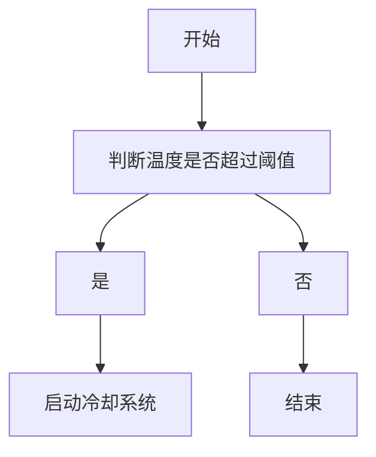
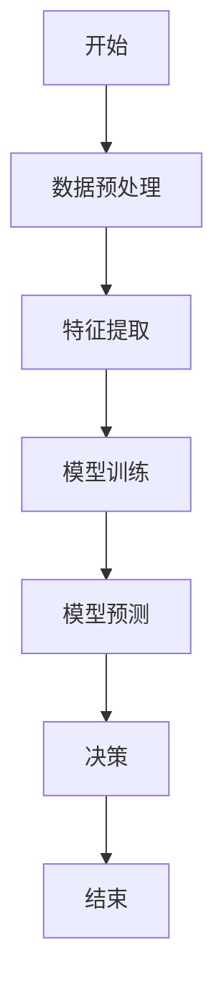
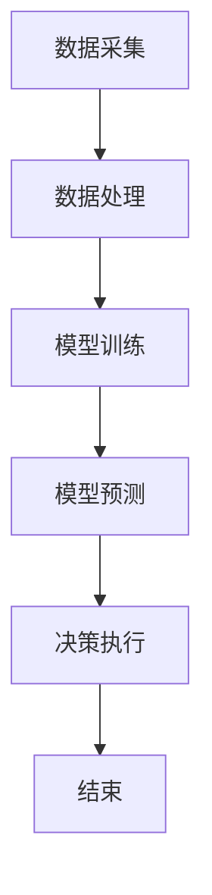
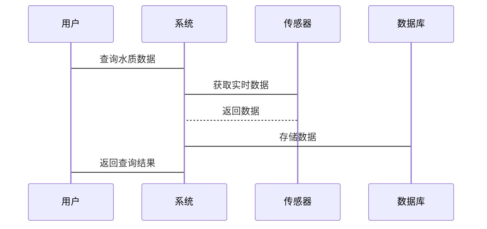
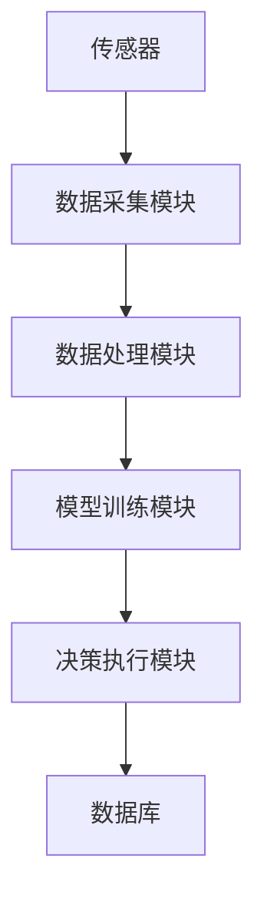

                 


```markdown
# AI Agent在智能水质监测中的实践

> **关键词**：AI Agent、水质监测、机器学习、智能系统、算法实现  
> **摘要**：本文探讨了AI Agent在智能水质监测中的应用，详细分析了其核心原理、算法实现、系统架构，并通过实际项目展示了如何将AI Agent技术应用于水质监测，实现高效、智能的水质管理。

---

# 第1章: AI Agent与智能水质监测概述

## 1.1 AI Agent的基本概念
### 1.1.1 什么是AI Agent
AI Agent（人工智能代理）是一种能够感知环境、自主决策并执行任务的智能实体。它能够通过传感器获取信息，利用算法进行分析，并根据结果采取行动。例如，智能音箱、自动驾驶汽车中的导航系统都属于AI Agent的范畴。

### 1.1.2 AI Agent的核心特征
- **自主性**：能够在没有外部干预的情况下独立运作。
- **反应性**：能够根据环境变化实时调整行为。
- **目标导向**：有明确的目标，并采取行动以实现这些目标。
- **学习能力**：能够通过经验改进自身的决策能力。

### 1.1.3 AI Agent与传统自动化的区别
| 特性 | AI Agent | 传统自动化 |
|------|-----------|------------|
| 决策能力 | 高度智能，能处理复杂问题 | 基于预设规则，处理简单任务 |
| 灵活性 | 能自适应环境变化 | 需人工调整以应对变化 |
| 学习能力 | 具备学习能力，能优化决策 | 无法优化，仅执行固定程序 |

## 1.2 智能水质监测的背景与意义
### 1.2.1 水质监测的重要性
水质监测是保障饮用水安全、评估水体健康、防止环境污染的重要手段。随着工业化和城市化的快速发展，水污染问题日益严重，传统的水质监测方法已经难以满足实时、高效的需求。

### 1.2.2 智能化水质监测的必要性
传统水质监测依赖人工采样和实验室分析，存在效率低、成本高、响应慢的问题。引入AI Agent后，可以实现水质数据的实时采集、智能分析和自主决策，显著提升监测效率和准确性。

### 1.2.3 AI Agent在水质监测中的应用前景
AI Agent在水质监测中的应用前景广阔，尤其是在以下几个方面：
- **实时监控**：通过传感器实时采集水质数据，快速识别异常情况。
- **智能诊断**：利用机器学习模型分析数据，准确判断水质状况。
- **自主决策**：根据分析结果，自动启动相应的处理措施，如排放调整、设备清洁等。

## 1.3 本章小结
本章介绍了AI Agent的基本概念和核心特征，分析了传统水质监测的局限性，阐述了AI Agent在水质监测中的重要性和应用前景。

---

# 第2章: AI Agent的核心原理

## 2.1 AI Agent的感知与决策机制
### 2.1.1 数据采集与特征提取
AI Agent通过传感器采集水质数据，如温度、pH值、溶解氧、浊度等。特征提取涉及从原始数据中提取有意义的信息，例如通过滑动窗口方法提取时序特征。

### 2.1.2 状态识别与分析
AI Agent利用机器学习算法对水质数据进行分类和回归分析，识别水质状态。例如，使用随机森林算法对水质进行分类，判断水质是否达标。

### 2.1.3 决策逻辑与执行
AI Agent根据分析结果制定决策策略，例如当检测到水质超标时，启动相应的处理机制，如增加净化剂的投放量。

## 2.2 AI Agent与水质监测的结合
### 2.2.1 水质数据的多模态分析
AI Agent能够处理多种类型的数据，如图像、文本和数值型数据，实现多模态分析。例如，结合图像识别技术分析水体中的悬浮物。

### 2.2.2 AI Agent在水质异常检测中的应用
AI Agent通过异常检测算法，识别水质数据中的异常值，及时发出警报。例如，使用Isolation Forest算法检测水质数据中的异常值。

### 2.2.3 AI Agent的自适应学习能力
AI Agent能够根据新的数据不断优化自身的模型参数，提升预测精度。例如，使用在线学习算法，实时更新水质预测模型。

## 2.3 本章小结
本章详细讲解了AI Agent在水质监测中的感知与决策机制，分析了其在多模态数据处理、异常检测和自适应学习中的应用。

---

# 第3章: AI Agent的核心算法

## 3.1 基于规则的AI Agent算法
### 3.1.1 算法原理
基于规则的AI Agent算法通过预设的规则进行决策。例如，当温度超过某一阈值时，启动冷却系统。

### 3.1.2 算法流程图


### 3.1.3 代码实现示例
```python
def rule_based_decision(temp, threshold):
    if temp > threshold:
        return "启动冷却系统"
    else:
        return "不做处理"
```

## 3.2 基于机器学习的AI Agent算法
### 3.2.1 算法原理
基于机器学习的AI Agent算法利用训练好的模型进行预测和决策。例如，使用随机森林模型预测水质类别。

### 3.2.2 算法流程图


### 3.2.3 代码实现示例
```python
from sklearn.ensemble import RandomForestClassifier

# 假设X为特征矩阵，y为标签
model = RandomForestClassifier()
model.fit(X, y)

# 预测新数据
new_data = ...  # 新的数据点
prediction = model.predict(new_data)
```

## 3.3 算法对比与优化
### 3.3.1 算法性能对比
| 算法类型 | 准确率 | 处理速度 | 可解释性 |
|----------|--------|----------|----------|
| 基于规则 | 70%    | 快        | 高        |
| 机器学习 | 85%    | 较慢      | 较低       |

### 3.3.2 算法优化策略
- **参数调优**：使用网格搜索优化模型参数。
- **数据增强**：增加数据多样性，提升模型鲁棒性。
- **模型集成**：结合多种算法，提升预测精度。

### 3.3.3 实验结果分析
通过实验对比，基于机器学习的AI Agent算法在准确率上优于基于规则的算法，但在处理速度上稍逊一筹。因此，在实际应用中需要根据具体需求选择合适的算法。

## 3.4 本章小结
本章详细讲解了AI Agent的核心算法，包括基于规则的算法和基于机器学习的算法，并通过对比分析，给出了算法选择的建议。

---

# 第4章: AI Agent在水质监测中的系统架构设计

## 4.1 问题场景介绍
水质监测系统通常部署在水处理厂或河流监测站，需要实时采集和分析水质数据，及时发现并处理异常情况。

## 4.2 系统功能设计
### 4.2.1 系统模块划分
- **数据采集模块**：负责采集水质数据。
- **数据处理模块**：对数据进行清洗、特征提取和预处理。
- **模型训练模块**：训练机器学习模型，用于水质预测和分类。
- **决策执行模块**：根据模型预测结果，执行相应的处理措施。

### 4.2.2 系统功能流程


## 4.3 系统架构设计
### 4.3.1 系统架构图


### 4.3.2 系统接口设计
- **数据采集接口**：传感器与数据采集模块之间的接口。
- **模型调用接口**：其他模块调用模型进行预测的接口。

### 4.3.3 系统交互流程


## 4.4 本章小结
本章详细介绍了智能水质监测系统的架构设计，包括功能模块划分、系统架构图和交互流程设计。

---

# 第5章: AI Agent在水质监测中的项目实战

## 5.1 环境配置
### 5.1.1 安装必要的Python库
```bash
pip install numpy pandas scikit-learn tensorflow
```

### 5.1.2 数据库选择与配置
选择MySQL或MongoDB作为数据库，用于存储水质数据和模型参数。

## 5.2 数据处理与特征工程
### 5.2.1 数据清洗
使用Pandas库处理缺失值和异常值。
```python
import pandas as pd
data = pd.read_csv('water_quality.csv')
# 处理缺失值
data.dropna(inplace=True)
```

### 5.2.2 特征提取
从时间序列数据中提取特征，如均值、标准差、最大值等。
```python
import numpy as np
# 提取温度的均值特征
temp_mean = data['temperature'].mean()
```

### 5.2.3 数据预处理
对数据进行归一化或标准化处理，确保模型输入一致。
```python
from sklearn.preprocessing import StandardScaler
scaler = StandardScaler()
scaled_data = scaler.fit_transform(data)
```

## 5.3 模型训练与优化
### 5.3.1 模型选择
选择随机森林模型进行水质分类。
```python
from sklearn.ensemble import RandomForestClassifier
model = RandomForestClassifier()
```

### 5.3.2 调参优化
使用网格搜索优化模型参数。
```python
from sklearn.model_selection import GridSearchCV
param_grid = {'n_estimators': [100, 200], 'max_depth': [None, 10]}
grid_search = GridSearchCV(model, param_grid)
grid_search.fit(X_train, y_train)
best_model = grid_search.best_estimator_
```

### 5.3.3 模型评估
评估模型的准确率、召回率和F1分数。
```python
from sklearn.metrics import accuracy_score, recall_score, f1_score
y_pred = best_model.predict(X_test)
print(f"准确率: {accuracy_score(y_test, y_pred)}")
print(f"召回率: {recall_score(y_test, y_pred)}")
print(f"F1分数: {f1_score(y_test, y_pred)}")
```

## 5.4 系统部署与集成
### 5.4.1 系统部署
将训练好的模型部署到服务器，提供API接口。
```python
from flask import Flask, jsonify
app = Flask(__name__)
model = ...  # 已训练好的模型

@app.route('/predict', methods=['POST'])
def predict():
    data = request.json['data']
    prediction = model.predict(data)
    return jsonify({'result': prediction.tolist()})
```

### 5.4.2 系统集成
将AI Agent系统与传感器和数据库集成，实现实时监测和智能决策。


## 5.5 项目小结
本章通过实际项目展示了AI Agent在水质监测中的应用，详细讲解了环境配置、数据处理、模型训练和系统部署的过程。

---

# 第6章: 总结与展望

## 6.1 总结
本文详细探讨了AI Agent在智能水质监测中的应用，从算法实现到系统架构，再到项目实战，全面展示了如何利用AI技术提升水质监测的效率和准确性。

## 6.2 未来展望
随着AI技术的不断发展，AI Agent在水质监测中的应用将更加广泛。未来的研究方向包括：
- **边缘计算**：在边缘设备上部署AI Agent，减少数据传输延迟。
- **物联网**：结合物联网技术，实现更广泛的水质监测网络。
- **强化学习**：通过强化学习优化AI Agent的决策策略，提升系统的自适应能力。

## 6.3 注意事项与最佳实践
- 在实际应用中，需注意数据隐私和安全问题。
- 定期更新模型，确保系统的准确性和稳定性。
- 提供完善的系统监控和日志记录，便于故障排查。

---

# 作者：AI天才研究院

---

**本文完**
```

