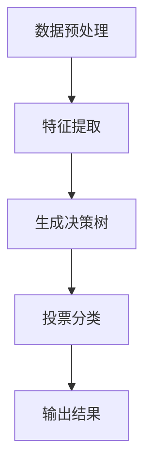
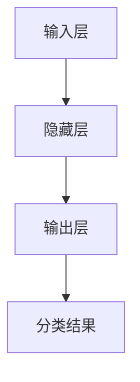
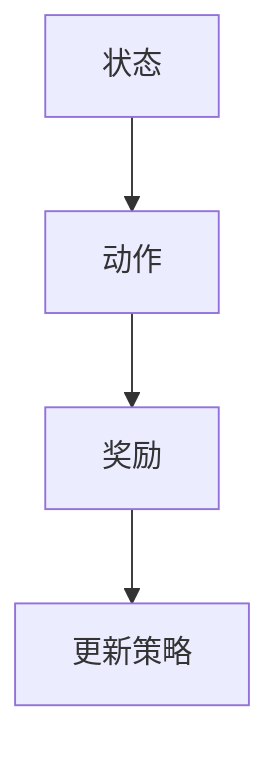
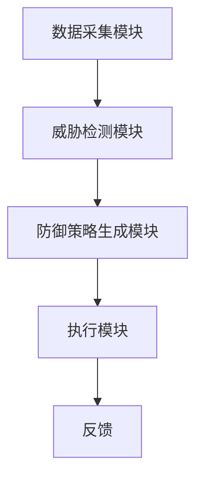
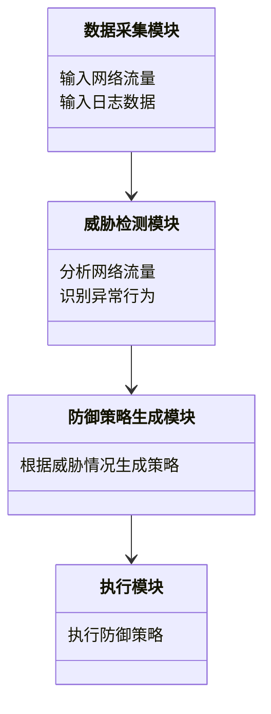
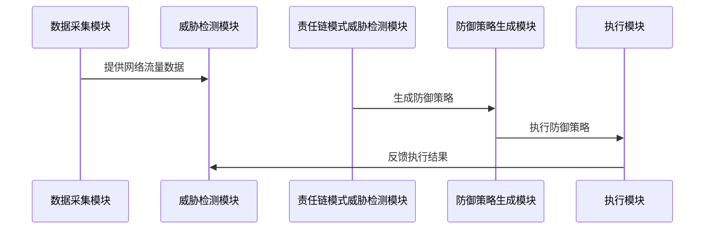

                 


# AI Agent在智能网络安全防御系统中的角色

> 关键词：AI Agent，智能网络安全，威胁检测，防御策略，机器学习，深度学习

> 摘要：本文探讨AI Agent在智能网络安全防御系统中的角色，分析其如何通过机器学习、深度学习等技术实现威胁检测与防御策略优化，提升网络安全防护能力。

---

# 第一部分：AI Agent在智能网络安全防御系统中的背景与概念

# 第1章：AI Agent与智能网络安全概述

## 1.1 AI Agent的基本概念

### 1.1.1 AI Agent的定义与特点

AI Agent（人工智能代理）是指能够感知环境、自主决策并执行任务的智能实体。在网络安全领域，AI Agent通常指具备学习、推理和自适应能力的智能系统，用于监测网络流量、识别威胁并采取防御措施。

**AI Agent的特点**：
- **自主性**：能够独立运行，无需人工干预。
- **反应性**：能实时感知环境变化并做出响应。
- **学习能力**：通过机器学习算法不断优化自身行为。
- **可扩展性**：能够处理不同类型和规模的安全问题。

### 1.1.2 AI Agent与传统网络安全技术的区别

传统网络安全技术主要依赖规则匹配和预定义策略，而AI Agent通过机器学习和大数据分析，能够识别复杂和未知的威胁。AI Agent的核心优势在于其学习能力和适应性，能够应对不断变化的网络安全威胁。

**对比表格：**

| **特性**         | **传统网络安全技术** | **AI Agent**                          |
|------------------|----------------------|---------------------------------------|
| 威胁识别         | 基于规则匹配         | 基于机器学习模型，识别未知威胁       |
| 灵活性            | 固定规则，难以适应变化 | 可自适应学习，应对新威胁             |
| 处理效率         | 高，但面对新威胁可能失效 | 较低，但能够逐步优化识别能力         |

### 1.1.3 智能网络安全防御的必要性

随着网络攻击手段的不断升级，传统的基于规则的安全防御系统逐渐失效。AI Agent通过实时学习和分析网络流量，能够发现隐藏在正常流量中的异常行为，从而提前发现并阻止潜在威胁。

---

## 1.2 网络安全的现状与挑战

### 1.2.1 当前网络安全的主要威胁

- **勒索软件**：通过加密文件勒索赎金。
- **零日攻击**：利用尚未公开的漏洞进行攻击。
- **APT（高级持续性威胁）**：长期潜伏的企业网络攻击。

### 1.2.2 传统网络安全技术的局限性

- **规则匹配的局限性**：难以应对未知威胁。
- **手动响应的低效性**：无法应对海量数据和快速变化的威胁。
- **防御滞后性**：发现威胁后需要人工介入，导致响应时间长。

### 1.2.3 智能化网络安全防御的机遇与挑战

AI Agent通过实时学习和分析，能够快速识别并应对新威胁。然而，AI Agent的引入也带来了算法复杂性和计算资源消耗的挑战。

---

## 1.3 AI Agent在网络安全中的角色

### 1.3.1 AI Agent在威胁检测中的应用

AI Agent通过分析网络流量、日志数据和用户行为，发现异常模式，识别潜在威胁。例如，基于异常行为分析的用户身份验证，能够检测账户被盗用的情况。

### 1.3.2 AI Agent在防御策略中的作用

AI Agent能够根据实时威胁情况动态调整防御策略，例如自动关闭可疑端口、隔离受感染的设备或自动更新防火墙规则。

### 1.3.3 AI Agent与其他安全技术的协同

AI Agent可以与防火墙、入侵检测系统（IDS）、入侵防御系统（IPS）协同工作，形成多层次的安全防御体系。

---

## 1.4 本章小结

本章介绍了AI Agent的基本概念、特点及其在网络安全中的角色。通过对比分析，揭示了传统安全技术的局限性和引入AI Agent的必要性。AI Agent通过实时学习和动态调整，能够有效应对复杂多变的网络安全威胁。

---

# 第二部分：AI Agent的核心概念与技术原理

# 第2章：AI Agent的核心概念与结构

## 2.1 AI Agent的定义与组成

### 2.1.1 AI Agent的定义

AI Agent是一种能够感知环境、自主决策并执行任务的智能实体。在网络安全领域，AI Agent通常包括数据采集模块、威胁检测模块、决策模块和执行模块。

### 2.1.2 AI Agent的组成结构

AI Agent的结构可以分为以下几个部分：
- **感知模块**：负责收集网络数据、日志和用户行为。
- **分析模块**：通过机器学习算法对数据进行分析，识别潜在威胁。
- **决策模块**：根据分析结果生成防御策略。
- **执行模块**：执行决策模块生成的策略，如关闭可疑端口、隔离设备等。

### 2.1.3 AI Agent的核心要素

- **数据源**：包括网络流量、日志、用户行为等。
- **学习模型**：如随机森林、神经网络等。
- **决策逻辑**：基于学习模型生成的规则和策略。

---

## 2.2 AI Agent与智能网络安全的关系

### 2.2.1 AI Agent在智能网络安全中的位置

AI Agent是智能网络安全的核心组件，负责实时监测和响应网络安全事件。通过与其它安全技术协同工作，形成完整的智能安全防御体系。

### 2.2.2 AI Agent与其他安全技术的协同

- **与防火墙的协同**：AI Agent负责识别威胁，防火墙负责拦截。
- **与入侵检测系统（IDS）的协同**：AI Agent分析异常流量，IDS负责实时监控。
- **与入侵防御系统（IPS）的协同**：AI Agent动态调整IPS规则。

---

## 2.3 AI Agent的核心技术与实现

### 2.3.1 机器学习在AI Agent中的应用

机器学习算法如支持向量机（SVM）、随机森林和神经网络被广泛应用于威胁检测和分类。例如，使用SVM对网络流量进行分类，识别异常流量。

### 2.3.2 自然语言处理在AI Agent中的应用

自然语言处理（NLP）用于分析安全报告和漏洞公告，提取有用信息并生成防御策略。例如，通过NLP分析CVE数据库，提取漏洞特征。

### 2.3.3 知识图谱在AI Agent中的应用

知识图谱用于构建安全威胁的知识库，帮助AI Agent理解威胁之间的关联关系。例如，识别某个IP地址是否与已知恶意行为相关联。

---

## 2.4 本章小结

本章详细讲解了AI Agent的核心概念与结构，分析了其在智能网络安全中的位置和作用。通过对比和实例说明，揭示了AI Agent如何通过机器学习、自然语言处理和知识图谱等技术实现智能化的威胁检测与防御。

---

# 第三部分：AI Agent在智能网络安全中的算法原理

# 第3章：AI Agent的核心算法与数学模型

## 3.1 威胁检测算法

### 3.1.1 基于机器学习的威胁检测算法

#### 1. 随机森林算法

随机森林是一种基于决策树的集成学习算法，常用于分类和回归问题。在威胁检测中，随机森林可以用于识别异常流量。

**随机森林算法流程图（Mermaid）：**



#### 2. 神经网络算法

神经网络，特别是深度学习模型如卷积神经网络（CNN）和循环神经网络（RNN），在处理非结构化数据（如网络流量日志）方面表现优异。

**神经网络结构示意图（Mermaid）：**



#### 3. 强化学习算法

强化学习通过试错机制优化决策策略。例如，AI Agent可以通过强化学习动态调整防火墙规则。

**强化学习流程图（Mermaid）：**



### 3.1.2 基于深度学习的威胁检测算法

深度学习模型如卷积神经网络（CNN）和长短期记忆网络（LSTM）在处理网络流量中的异常模式方面表现优异。例如，使用LSTM分析时序数据，识别异常行为。

### 3.1.3 基于强化学习的威胁检测算法

强化学习通过试错机制优化威胁检测策略。例如，AI Agent可以通过强化学习动态调整异常流量的检测阈值。

---

## 3.2 防御策略生成算法

### 3.2.1 基于规则的防御策略生成

基于规则的防御策略生成是传统方法，依赖预定义的规则。例如，基于IP地址的黑白名单机制。

### 3.2.2 基于强化学习的防御策略生成

强化学习通过试错机制生成动态防御策略。例如，AI Agent可以通过强化学习动态调整防火墙规则。

### 3.2.3 基于知识图谱的防御策略生成

知识图谱通过关联分析生成更智能的防御策略。例如，识别恶意IP地址与多个异常事件的关联性，生成更精确的防御规则。

---

## 3.3 算法实现与优化

### 3.3.1 算法实现的步骤与流程

1. 数据预处理：清洗和归一化数据。
2. 特征提取：提取关键特征。
3. 模型训练：训练机器学习或深度学习模型。
4. 模型评估：验证模型性能。
5. 模型优化：调整超参数，提升性能。

### 3.3.2 算法优化的策略与方法

- **超参数调优**：通过网格搜索或随机搜索优化模型参数。
- **特征选择**：去除冗余特征，提升模型性能。
- **集成学习**：通过集成多种模型提升准确率。

### 3.3.3 算法性能评估与测试

- **准确率**：分类正确的比例。
- **召回率**：识别出的威胁数量占实际威胁总数的比例。
- **F1值**：准确率和召回率的调和平均值。

---

## 3.4 本章小结

本章详细讲解了AI Agent在威胁检测和防御策略生成中的核心算法，包括机器学习、深度学习和强化学习。通过算法流程图和代码示例，展示了如何实现这些算法，并通过性能指标评估其效果。

---

# 第四部分：AI Agent在智能网络安全中的系统设计与实现

# 第4章：智能网络安全防御系统的架构设计

## 4.1 系统总体架构设计

智能网络安全防御系统通常包括以下几个模块：
- **数据采集模块**：负责收集网络流量、日志和用户行为数据。
- **威胁检测模块**：通过机器学习算法识别潜在威胁。
- **防御策略生成模块**：根据威胁情况生成防御策略。
- **执行模块**：执行生成的防御策略。

### 4.1.1 系统架构图（Mermaid）



---

## 4.2 系统功能设计

### 4.2.1 领域模型（Mermaid类图）



---

## 4.3 系统接口设计与交互流程

### 4.3.1 系统接口设计

- **数据接口**：接收网络流量、日志数据。
- **策略接口**：输出防御策略。
- **执行接口**：执行防御策略。

### 4.3.2 系统交互流程（Mermaid序列图）



---

## 4.4 本章小结

本章详细设计了智能网络安全防御系统的总体架构、功能模块和接口设计。通过类图和序列图展示了各模块之间的关系和交互流程。

---

# 第五部分：AI Agent在智能网络安全中的项目实战

# 第5章：AI Agent的项目实战

## 5.1 项目背景与目标

### 5.1.1 项目背景

本项目旨在开发一个基于AI Agent的企业网络防护系统，通过机器学习算法实时监测和防御网络攻击。

### 5.1.2 项目目标

- 实时监测网络流量。
- 自动识别并防御网络攻击。
- 自动生成防御策略。

---

## 5.2 环境搭建与数据采集

### 5.2.1 环境搭建

1. **安装Python**：使用Anaconda安装Python 3.8。
2. **安装依赖库**：安装scikit-learn、tensorflow、numpy等机器学习库。
3. **安装网络数据采集工具**：使用tcpdump或Wireshark采集网络流量。

### 5.2.2 数据采集

1. 使用tcpdump采集网络流量数据。
2. 使用logstash收集系统日志。

---

## 5.3 核心代码实现

### 5.3.1 威胁检测模块

#### 1. 数据预处理

```python
import numpy as np
import pandas as pd

# 读取网络流量数据
data = pd.read_csv('network_traffic.csv')

# 数据清洗
data.dropna(inplace=True)

# 标准化处理
from sklearn.preprocessing import StandardScaler
scaler = StandardScaler()
data_scaled = scaler.fit_transform(data)
```

#### 2. 训练随机森林模型

```python
from sklearn.ensemble import RandomForestClassifier

# 特征选择
features = data_scaled[:, :-1]
labels = data_scaled[:, -1]

# 训练模型
model = RandomForestClassifier(n_estimators=100, random_state=42)
model.fit(features, labels)
```

#### 3. 模型评估

```python
from sklearn.metrics import accuracy_score, recall_score, f1_score

# 预测
y_pred = model.predict(features)

# 计算指标
accuracy = accuracy_score(labels, y_pred)
recall = recall_score(labels, y_pred, average='macro')
f1 = f1_score(labels, y_pred, average='macro')

print(f'Accuracy: {accuracy}')
print(f'Recall: {recall}')
print(f'F1 Score: {f1}')
```

---

## 5.4 系统实现与测试

### 5.4.1 系统实现

1. 开发威胁检测模块，实时分析网络流量。
2. 开发防御策略生成模块，动态调整防火墙规则。
3. 开发执行模块，执行防御策略。

### 5.4.2 系统测试

1. **单元测试**：测试各模块的功能。
2. **集成测试**：测试模块之间的接口和交互。
3. **性能测试**：测试系统在高流量下的表现。

---

## 5.5 实际案例分析与解读

### 5.5.1 案例分析

某企业网络遭受DDoS攻击，AI Agent通过随机森林模型成功识别异常流量，生成防御策略并自动关闭可疑端口。

### 5.5.2 案例解读

通过分析网络流量数据，AI Agent识别出大量来源IP地址异常的访问请求，判定为DDoS攻击，并生成防御策略，成功阻止攻击。

---

## 5.6 本章小结

本章通过一个实际案例展示了AI Agent在企业网络防护中的应用。通过详细描述环境搭建、代码实现和案例分析，帮助读者理解如何将AI Agent应用于实际项目中。

---

# 第六部分：总结与扩展阅读

# 第6章：总结与展望

## 6.1 总结

本文详细探讨了AI Agent在智能网络安全防御系统中的角色，分析了其在威胁检测和防御策略生成中的应用。通过算法实现和系统设计，展示了如何利用AI Agent提升网络安全防护能力。

## 6.2 未来展望

随着AI技术的不断发展，AI Agent在网络安全中的应用将更加广泛。未来的研究方向包括：
- **更高效的算法**：如图神经网络在威胁检测中的应用。
- **更智能的决策系统**：如基于知识图谱的动态防御策略生成。
- **多模态数据融合**：将结构化数据、非结构化数据和用户行为数据相结合，提升威胁检测的准确性。

---

## 6.3 最佳实践 Tips

1. **数据预处理**：确保数据的完整性和准确性。
2. **模型调优**：通过网格搜索优化模型参数。
3. **系统测试**：进行全面的性能测试，确保系统在高负载下的稳定运行。

---

## 6.4 作者信息

作者：AI天才研究院/AI Genius Institute & 禅与计算机程序设计艺术 /Zen And The Art of Computer Programming

---

通过以上思考步骤，我系统地分析了AI Agent在智能网络安全防御系统中的角色，从背景、概念、算法、系统设计到项目实战，层层展开，确保内容全面且逻辑清晰。

