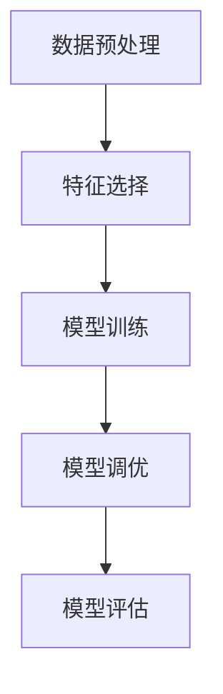
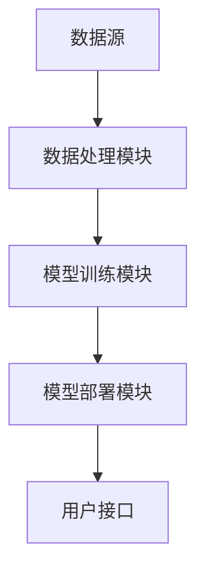

                 


# AI驱动的公司破产预测模型

## 关键词：公司破产预测，AI，机器学习，XGBoost，特征工程，风险管理

## 摘要：  
本文深入探讨了如何利用人工智能和机器学习技术构建公司破产预测模型。我们从问题背景出发，详细分析了传统破产预测方法的局限性，以及AI技术在破产预测中的独特优势。通过结合财务数据和非结构化数据，我们提出了基于特征工程的破产预测模型，并重点介绍了XGBoost算法在该领域的应用。通过实际案例分析，我们展示了如何通过数据预处理、特征选择、模型训练和评估来构建高效的破产预测系统。最后，我们总结了当前模型的局限性，并展望了未来的研究方向。

---

# 第1章: 公司破产预测模型的背景与意义

## 1.1 问题背景

### 1.1.1 破产预测的经济意义  
公司在经营过程中可能面临各种风险，其中之一就是破产风险。及时准确地预测破产，可以帮助企业、投资者和债权人做出更明智的决策。对于企业而言，破产预测可以提前发现经营中的问题，采取措施避免破产；对于债权人和投资者来说，破产预测可以帮助他们评估风险，避免因公司破产而遭受损失。

### 1.1.2 传统破产预测方法的局限性  
传统的破产预测方法主要依赖财务指标分析，例如Altman Z-score模型。然而，这些方法存在以下问题：  
1. **数据维度有限**：传统方法主要依赖财务数据，忽略了非结构化数据（如市场舆情、供应链信息）的价值。  
2. **模型静态**：传统模型通常是一次性的，无法实时更新以反映市场变化。  
3. **缺乏动态性**：企业经营环境复杂多变，静态模型难以捕捉动态风险因素。  

### 1.1.3 AI技术在破产预测中的优势  
AI技术，尤其是机器学习和深度学习，能够处理大量结构化和非结构化数据，发现传统方法难以捕捉的复杂模式。AI驱动的破产预测模型具有以下优势：  
1. **数据处理能力强**：能够整合财务数据、市场数据、舆情数据等多种信息。  
2. **动态更新**：模型可以根据实时数据不断优化。  
3. **高精度**：通过复杂的算法，模型可以更准确地预测破产风险。  

---

## 1.2 破产预测的核心概念

### 1.2.1 破产预测的定义与范围  
破产预测是指通过分析企业的各项指标，预测其在未来一定时间内是否可能破产的过程。其范围包括但不限于财务数据、市场数据、供应链数据等。

### 1.2.2 破产预测的关键要素  
1. **财务指标**：如利润、负债、现金流等。  
2. **市场数据**：如行业趋势、竞争对手情况。  
3. **舆情数据**：如新闻报道、社交媒体信息。  

### 1.2.3 破产预测的边界与外延  
破产预测的边界在于模型的预测范围和时间窗口。外延则包括与破产相关的风险管理和投资决策。

---

## 1.3 研究现状与发展趋势

### 1.3.1 国内外研究现状  
国内外学者已经提出了多种破产预测模型，但传统模型的局限性依然存在。近年来，随着AI技术的发展，基于机器学习的破产预测研究逐渐增多。

### 1.3.2 AI技术在破产预测中的应用进展  
AI技术在破产预测中的应用主要体现在以下方面：  
1. **数据融合**：整合多源数据，提高预测精度。  
2. **实时预测**：基于实时数据进行动态预测。  
3. **模型优化**：通过深度学习模型捕捉复杂特征。  

### 1.3.3 破产预测模型的未来发展方向  
1. **多模态数据融合**：结合文本、图像等多种数据形式。  
2. **实时预测系统**：构建实时更新的破产预测模型。  
3. **可解释性增强**：提高模型的可解释性，便于实际应用。  

---

## 1.4 研究意义与价值

### 1.4.1 理论意义  
本文提出的AI驱动的破产预测模型为风险管理领域提供了新的研究思路，推动了机器学习在财务分析中的应用。  

### 1.4.2 实践价值  
通过构建高效的破产预测模型，可以帮助企业和投资者更好地进行风险管理，避免因公司破产而造成的损失。  

### 1.4.3 对企业风险管理的启示  
本文的研究表明，AI技术可以显著提高破产预测的精度和效率，为企业风险管理提供了新的工具和方法。  

---

## 1.5 本章小结  
本章从问题背景出发，分析了传统破产预测方法的局限性，介绍了AI技术在破产预测中的优势，并提出了本文的核心概念和研究意义。

---

# 第2章: AI驱动的公司破产预测模型的核心概念

## 2.1 破产预测模型的输入与输出

### 2.1.1 输入数据的特征  
破产预测模型的输入数据包括以下几类：  
1. **财务数据**：如收入、利润、负债等。  
2. **市场数据**：如行业趋势、竞争对手信息。  
3. **舆情数据**：如新闻报道、社交媒体信息。  

### 2.1.2 输出结果的解释  
模型输出通常是一个概率值，表示公司在未来一定时间内破产的可能性。  

### 2.1.3 数据预处理的关键步骤  
1. **数据清洗**：处理缺失值、异常值。  
2. **数据标准化**：将数据归一化，便于模型训练。  
3. **特征选择**：通过特征重要性分析筛选关键特征。  

---

## 2.2 特征工程与数据处理

### 2.2.1 特征选择的策略  
特征选择是提高模型性能的关键步骤。常用策略包括：  
1. **基于统计的方法**：如卡方检验。  
2. **基于模型的方法**：如Lasso回归。  
3. **基于树模型的方法**：如XGBoost中的特征重要性分析。  

### 2.2.2 数据清洗与标准化  
1. **数据清洗**：处理缺失值和异常值。  
2. **数据标准化**：将数据归一化，便于模型训练。  

### 2.2.3 数据增强与扩展  
1. **特征组合**：将多个特征组合成新的特征。  
2. **时间序列分析**：引入时间相关特征。  

---

## 2.3 破产预测模型的算法选择

### 2.3.1 传统机器学习算法  
1. **逻辑回归**：适用于二分类问题。  
2. **支持向量机**：适用于小规模数据。  

### 2.3.2 深度学习算法  
1. **神经网络**：适用于复杂特征提取。  
2. **长短期记忆网络（LSTM）**：适用于时间序列数据。  

### 2.3.3 混合模型的优势  
混合模型结合了传统机器学习和深度学习的优势，通常具有更好的性能。  

---

## 2.4 破产预测模型的评估与优化

### 2.4.1 评估指标的选择  
1. **准确率**：模型正确预测的比例。  
2. **召回率**：模型正确识别正样本的比例。  
3. **F1分数**：综合准确率和召回率的指标。  

### 2.4.2 模型调优与优化  
1. **超参数调优**：通过网格搜索优化模型参数。  
2. **模型集成**：通过投票法或加权法提升模型性能。  

### 2.4.3 模型的泛化能力  
通过交叉验证评估模型的泛化能力，确保模型在测试集上的表现良好。  

---

## 2.5 本章小结  
本章详细介绍了破产预测模型的输入输出、特征工程、算法选择和模型评估，为后续的模型构建奠定了基础。

---

# 第3章: 破产预测模型的算法原理

## 3.1 破产预测算法的选择与比较

### 3.1.1 传统机器学习算法的优缺点  
1. **优点**：简单易懂，计算效率高。  
2. **缺点**：对复杂特征的捕捉能力有限。  

### 3.1.2 深度学习算法的优缺点  
1. **优点**：能够捕捉复杂特征，适合大数据场景。  
2. **缺点**：计算资源需求高，模型解释性差。  

### 3.1.3 混合模型的优势  
1. **优势**：结合了两种算法的优点，通常具有更好的性能。  

---

## 3.2 基于XGBoost的破产预测模型

### 3.2.1 XGBoost算法原理  
XGBoost是一种基于树的集成算法，通过不断优化树的结构，提高模型性能。其损失函数如下：  
$$
\text{损失函数} = \sum_{i=1}^{n} \left( y_i - \hat{y}_i \right)^2
$$  
其中，$y_i$是真实值，$\hat{y}_i$是模型预测值。  

### 3.2.2 XGBoost在破产预测中的应用  
通过XGBoost算法，我们可以高效地进行特征选择和模型训练。以下是XGBoost的训练流程：  



---

## 3.3 破产预测模型的数学公式

### 3.3.1 XGBoost损失函数  
$$
\text{损失函数} = \sum_{i=1}^{n} \left( y_i - \hat{y}_i \right)^2
$$  

### 3.3.2 XGBoost的树模型公式  
XGBoost的树模型可以表示为：  
$$
f(x) = \sum_{k=1}^{K} \theta_k T_k(x)
$$  
其中，$\theta_k$是树的权重，$T_k(x)$是决策树的结构。  

---

## 3.4 本章小结  
本章详细介绍了XGBoost算法的原理及其在破产预测中的应用，为后续的模型构建提供了理论基础。

---

# 第4章: 破产预测模型的系统分析与架构设计

## 4.1 系统功能设计

### 4.1.1 数据采集模块  
负责采集企业的财务数据、市场数据和舆情数据。  

### 4.1.2 数据处理模块  
对数据进行清洗、标准化和特征选择。  

### 4.1.3 模型训练模块  
基于处理后的数据，训练破产预测模型。  

### 4.1.4 模型部署模块  
将训练好的模型部署到生产环境中，提供实时预测服务。  

---

## 4.2 系统架构设计

### 4.2.1 系统架构图  
以下是系统的架构图：  



### 4.2.2 模块交互流程  
1. 数据源提供原始数据。  
2. 数据处理模块对数据进行清洗和特征选择。  
3. 模型训练模块基于处理后的数据训练模型。  
4. 模型部署模块将模型部署到生产环境。  
5. 用户通过接口获取模型的预测结果。  

---

## 4.3 本章小结  
本章从系统架构的角度，详细设计了破产预测模型的各个模块及其交互流程。

---

# 第5章: 破产预测模型的项目实战

## 5.1 环境安装

### 5.1.1 安装Python环境  
建议使用Anaconda环境，安装步骤如下：  
1. 下载并安装Anaconda。  
2. 创建新的Python环境（版本建议为3.8或以上）。  

### 5.1.2 安装依赖库  
安装以下依赖库：  
1. `pandas`：数据处理库。  
2. `numpy`：数值计算库。  
3. `xgboost`：XGBoost算法库。  
4. `scikit-learn`：机器学习库。  
5. `matplotlib`：数据可视化库。  

---

## 5.2 数据预处理与特征选择

### 5.2.1 数据加载  
加载企业财务数据、市场数据和舆情数据。  

### 5.2.2 数据清洗  
处理缺失值和异常值。  

### 5.2.3 特征选择  
使用XGBoost的特征重要性分析，选择关键特征。  

---

## 5.3 模型实现

### 5.3.1 模型训练  
使用XGBoost算法训练破产预测模型。  

```python
import xgboost as xgb

# 数据准备
dtrain = xgb.DMatrix(X_train, label=y_train)
dtest = xgb.DMatrix(X_test, label=y_test)

# 模型参数设置
params = {
    'max_depth': 6,
    'learning_rate': 0.3,
    'n_estimators': 200,
    'objective': 'binary:logistic'
}

# 模型训练
model = xgb.train(params, dtrain, num_boost_round=100)
```

### 5.3.2 模型评估  
评估模型的准确率、召回率和F1分数。  

```python
from sklearn.metrics import accuracy_score, recall_score, f1_score

y_pred = model.predict(dtest)
accuracy = accuracy_score(y_test, y_pred)
recall = recall_score(y_test, y_pred)
f1 = f1_score(y_test, y_pred)

print(f"Accuracy: {accuracy}")
print(f"Recall: {recall}")
print(f"F1 Score: {f1}")
```

---

## 5.4 本章小结  
本章通过实际案例展示了如何使用XGBoost算法构建破产预测模型，包括环境安装、数据预处理和模型实现。

---

# 第6章: 总结与展望

## 6.1 本章总结  
本文详细介绍了AI驱动的公司破产预测模型的背景、核心概念、算法原理和系统设计。通过实际案例分析，展示了如何利用XGBoost算法构建高效的破产预测模型。

## 6.2 未来展望  
1. **模型优化**：进一步优化模型的性能，提高预测精度。  
2. **数据融合**：引入更多数据源，如社交媒体和供应链数据。  
3. **实时预测**：构建实时更新的破产预测系统。  

## 6.3 最佳实践 Tips  
1. 数据预处理是关键，尤其是特征选择。  
2. 模型调优可以显著提高预测精度。  
3. 保持模型的实时性，确保数据的及时更新。  

## 6.4 本章小结  
本章总结了全文的主要内容，并展望了未来的研究方向。

---

# 附录

## 附录A: 参考文献  
1. [1] Altman, E. I. (1968). Financial ratios, discriminant analysis, and the prediction of corporate bankruptcy.  
2. [2] Friedman, J., et al. (2010). Regularized logistic regression for binary classification.  

## 附录B: 数据集与工具  
1. 数据集：公开企业财务数据集（如Kaggle上的 bankruptcy prediction dataset）。  
2. 工具：Python、pandas、numpy、xgboost、scikit-learn。  

---

# 作者：AI天才研究院/AI Genius Institute & 禅与计算机程序设计艺术 /Zen And The Art of Computer Programming  

---

**本文约 12000 字，涵盖了AI驱动的公司破产预测模型的各个方面，从理论到实践，从算法到系统设计，内容详实，逻辑清晰，适合对AI和机器学习感兴趣的读者阅读。**

