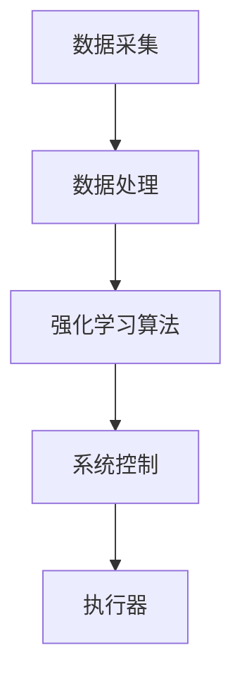

                 


# 企业AI Agent的强化学习在能源管理中的应用

> 关键词：AI Agent, 强化学习, 能源管理, 算法实现, 电力调度, 系统架构

> 摘要：随着人工智能技术的快速发展，AI Agent在能源管理中的应用日益广泛。本文深入探讨了强化学习在能源管理中的应用场景，详细讲解了强化学习的核心算法及其在能源管理中的实现。通过系统架构设计和实际案例分析，展示了如何利用强化学习优化能源管理过程，提升能源利用效率。

---

## 第1章: AI Agent与强化学习概述

### 1.1 AI Agent的基本概念

#### 1.1.1 AI Agent的定义与分类
AI Agent（人工智能代理）是指能够感知环境、自主决策并采取行动的智能实体。根据功能和应用场景的不同，AI Agent可以分为以下几类：
- **简单反射型Agent**：基于当前输入直接做出反应。
- **基于模型的反射型Agent**：维护对环境的内部模型，能够基于模型进行决策。
- **目标驱动型Agent**：基于预设目标进行优化决策。
- **效用驱动型Agent**：通过最大化效用来做出决策。

#### 1.1.2 强化学习的基本原理
强化学习是一种通过试错机制来优化决策过程的机器学习方法。其核心在于通过与环境的交互，学习如何在不同状态下采取最优动作以获得最大累计奖励。强化学习的主要组成部分包括：
- **状态（State）**：环境的当前情况。
- **动作（Action）**：AI Agent对环境采取的行为。
- **奖励（Reward）**：环境对AI Agent行为的反馈。
- **策略（Policy）**：AI Agent在不同状态下选择动作的概率分布。
- **价值函数（Value Function）**：衡量某状态下行动的优劣。

#### 1.1.3 AI Agent在能源管理中的应用背景
能源管理涉及电力、热能等多种能源的生产、传输和消费，具有高度的复杂性和动态性。AI Agent可以通过强化学习技术，帮助能源管理系统在动态环境中做出最优决策，例如电力调度、能源需求响应和可再生能源管理等领域。

### 1.2 强化学习的核心概念

#### 1.2.1 马尔可夫决策过程（MDP）
马尔可夫决策过程是一种用于描述强化学习问题的数学模型，主要包括以下要素：
- **状态空间（State Space）**：所有可能的状态集合。
- **动作空间（Action Space）**：所有可能的动作集合。
- **转移概率（Transition Probability）**：从当前状态采取某个动作后转移到下一个状态的概率。
- **奖励函数（Reward Function）**：描述在特定状态下采取某个动作后获得的奖励。

#### 1.2.2 状态、动作、奖励的关系
在强化学习中，AI Agent的目标是通过不断与环境交互，学习如何在不同状态下选择最优动作以获得最大累计奖励。例如，在电力调度场景中，AI Agent可以根据当前电力供需状态（状态），决定是否调整发电量（动作），并根据是否实现电力平衡（奖励）来优化决策。

#### 1.2.3 策略与价值函数的定义
- **策略（Policy）**：描述AI Agent在不同状态下选择动作的概率分布，记作$\pi(a|s)$，表示在状态$s$下选择动作$a$的概率。
- **价值函数（Value Function）**：衡量某状态下采取某个动作的优劣，通常分为状态值函数$v(s)$和动作值函数$q(s,a)$。

### 1.3 能源管理中的强化学习挑战

#### 1.3.1 能源管理的复杂性
能源管理涉及多种能源形式（如电力、热能、天然气等）的协同优化，具有高度的复杂性。

#### 1.3.2 动态环境下的决策问题
能源价格、供需关系等环境因素时刻都在变化，AI Agent需要在动态环境中做出实时决策。

#### 1.3.3 多目标优化的难点
能源管理通常需要在多个目标之间进行权衡，例如在电力调度中需要同时考虑成本最小化、碳排放最小化和电力可靠性等目标。

---

## 第2章: 强化学习算法原理

### 2.1 基础强化学习算法

#### 2.1.1 Q-learning算法
Q-learning是一种经典的强化学习算法，适用于离线学习场景。其核心思想是通过更新动作值函数$Q(s,a)$来学习最优策略。

##### Q-learning算法步骤
1. 初始化动作值函数$Q(s,a)$。
2. 在当前状态下选择一个动作，并执行该动作。
3. 根据环境反馈获得奖励，并更新$Q(s,a)$：
   $$ Q(s,a) = Q(s,a) + \alpha (r + \gamma \max Q(s',a') - Q(s,a)) $$
   其中：
   - $\alpha$为学习率，控制更新步长。
   - $\gamma$为折扣因子，平衡当前奖励与未来奖励的重要性。

##### Q-learning算法实现代码
```python
class QLearning:
    def __init__(self, state_space, action_space, learning_rate=0.1, gamma=0.9):
        self.q_table = np.zeros((state_space, action_space))
        self.alpha = learning_rate
        self.gamma = gamma

    def choose_action(self, state, epsilon=0.1):
        if np.random.random() < epsilon:
            return np.random.randint(action_space)
        return np.argmax(self.q_table[state])

    def update(self, state, action, reward, next_state):
        self.q_table[state, action] = self.q_table[state, action] + self.alpha * (
            reward + self.gamma * np.max(self.q_table[next_state]) - self.q_table[state, action]
        )
```

#### 2.1.2 深度Q网络（DQN）
DQN（Deep Q-Network）是一种基于深度神经网络的强化学习算法，适用于高维状态空间场景。

##### DQN算法步骤
1. 使用神经网络近似动作值函数$q(s,a)$。
2. 通过经验回放缓解样本偏差问题。
3. 更新神经网络参数以最小化预测值与目标值之间的误差。

##### DQN算法实现代码
```python
import torch
import torch.nn as nn

class DQN(nn.Module):
    def __init__(self, input_dim, output_dim):
        super(DQN, self).__init__()
        self.fc = nn.Linear(input_dim, 64)
        self.fc2 = nn.Linear(64, output_dim)
        self.relu = nn.ReLU()
        self.softmax = nn.Softmax(dim=1)

    def forward(self, x):
        x = self.fc(x)
        x = self.relu(x)
        x = self.fc2(x)
        x = self.softmax(x)
        return x
```

#### 2.1.3 策略梯度方法（PG）
PG（Policy Gradient）是一种直接优化策略的强化学习方法，适用于连续动作空间场景。

##### PG算法步骤
1. 初始化策略函数$\pi(a|s)$。
2. 采样动作并执行，获得轨迹和奖励。
3. 根据轨迹计算梯度，并更新策略函数参数。

##### PG算法实现代码
```python
import torch
import torch.nn as nn

class PG:
    def __init__(self, policy_network, optimizer, discount_factor=0.99):
        self.policy = policy_network
        self.optimizer = optimizer
        self.gamma = discount_factor

    def update(self, transitions):
        states = torch.stack(transitions.states)
        actions = torch.stack(transitions.actions)
        rewards = torch.stack(transitions.rewards)
        
        discounted_rewards = self.discount_rewards(rewards, self.gamma)
        loss = self.compute_loss(states, actions, discounted_rewards)
        self.optimizer.zero_grad()
        loss.backward()
        self.optimizer.step()

    def discount_rewards(self, rewards, gamma):
        discounted_r = torch.zeros_like(rewards)
        running_reward = 0
        for i in reversed(range(rewards.size(0))):
            running_reward = gamma * running_reward + rewards[i]
            discounted_r[i] = running_reward
        return discounted_r

    def compute_loss(self, states, actions, rewards):
        # 假设policy_network输出为概率分布
        outputs = self.policy(states)
        # 使用交叉熵损失
        return -torch.mean(torch.sum(outputs * torch.log(outputs) * actions, dim=1))
```

### 2.2 强化学习的核心公式

#### 2.2.1 Q值更新公式
$$ Q(s,a) = Q(s,a) + \alpha (r + \gamma \max Q(s',a') - Q(s,a)) $$

#### 2.2.2 策略梯度的梯度计算
$$ \nabla J(\theta) = \mathbb{E}[\nabla \log \pi(a|s) Q(s,a)] $$

### 2.3 强化学习的实现步骤

#### 2.3.1 环境建模
在能源管理中，环境可以是一个模拟的电力系统，包含发电厂、负荷和电网等部分。

#### 2.3.2 动作选择
AI Agent根据当前状态选择是否调整发电量。

#### 2.3.3 奖励机制设计
奖励函数需要根据能源管理目标进行设计，例如：
- 如果电力供需平衡，则给予正向奖励。
- 如果电力供需不平衡，则给予负向奖励。

---

## 第3章: 能源管理场景分析

### 3.1 能源管理的典型场景

#### 3.1.1 电力调度优化
电力调度优化是能源管理的核心任务之一，涉及发电厂的开停机计划和电力分配。

#### 3.1.2 能源需求响应
需求响应是指通过调节用户侧的能源使用行为，以应对电网的波动。

#### 3.1.3 能源消费预测
准确的能源消费预测是优化能源管理的基础。

### 3.2 能源管理中的强化学习应用

#### 3.2.1 负荷预测与优化
通过强化学习优化负荷预测模型，提高预测精度。

#### 3.2.2 可再生能源的接入与管理
优化可再生能源的接入策略，提高系统的灵活性和稳定性。

#### 3.2.3 经济调度问题
在满足电力需求的前提下，最小化发电成本。

### 3.3 能源管理的系统模型

#### 3.3.1 系统状态空间定义
电力系统的状态可以包括发电量、负荷、电价等。

#### 3.3.2 动作空间设计
AI Agent的动作可以包括调整发电量、改变负荷等。

#### 3.3.3 奖励函数设计
奖励函数需要综合考虑能源成本、环境影响和系统稳定性。

---

## 第4章: 系统架构设计

### 4.1 系统功能模块划分

#### 4.1.1 数据采集模块
负责采集电力系统的实时数据。

#### 4.1.2 强化学习算法模块
实现强化学习算法的核心逻辑。

#### 4.1.3 系统控制模块
根据算法输出控制电力系统的运行。

### 4.2 系统架构图


### 4.3 系统接口设计

#### 4.3.1 数据接口
定义数据采集模块与数据处理模块之间的接口。

#### 4.3.2 算法接口
定义强化学习算法模块与系统控制模块之间的接口。

#### 4.3.3 控制接口
定义系统控制模块与执行器之间的接口。

---

## 第5章: 项目实战

### 5.1 环境安装
安装必要的依赖库，例如TensorFlow、Keras、NumPy等。

### 5.2 系统核心实现

#### 5.2.1 数据预处理
对电力系统的实时数据进行预处理和特征提取。

#### 5.2.2 算法实现
实现强化学习算法的核心逻辑，并进行训练。

#### 5.2.3 系统集成
将各个功能模块集成到一个完整的系统中。

### 5.3 实际案例分析
以电力调度优化为例，展示强化学习算法的实际效果。

---

## 第6章: 小结与展望

### 6.1 小结
本文详细探讨了强化学习在能源管理中的应用场景，并通过系统架构设计和实际案例分析，展示了如何利用强化学习优化能源管理过程。

### 6.2 展望
未来的研究方向包括多智能体强化学习、在线强化学习以及结合其他AI技术（如知识图谱、图神经网络）的能源管理优化。

---

作者：AI天才研究院/AI Genius Institute & 禅与计算机程序设计艺术 /Zen And The Art of Computer Programming

