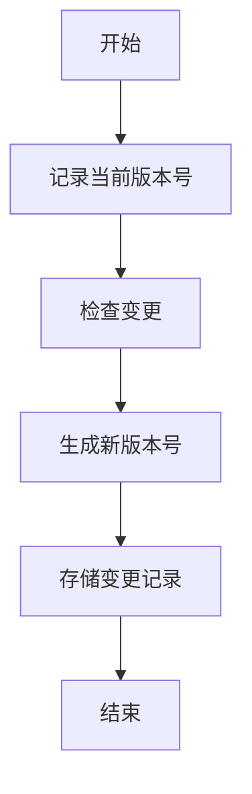
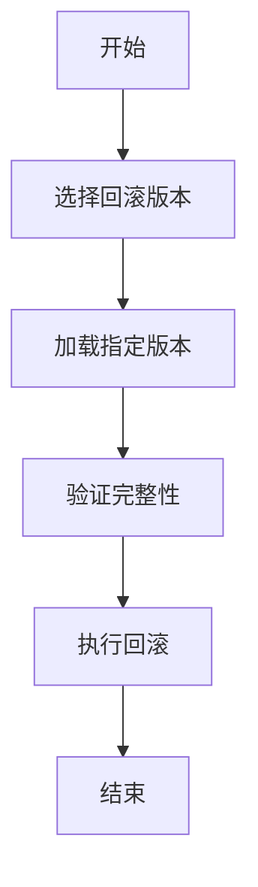
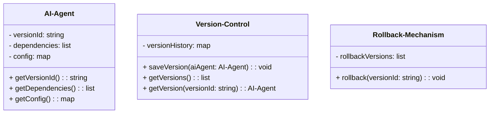
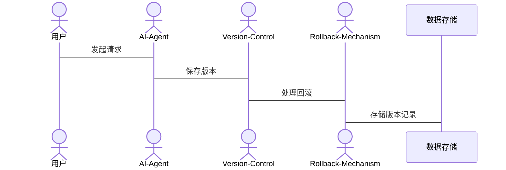

                 


# 企业AI Agent的版本控制与回滚机制设计

## 关键词
企业AI Agent、版本控制、回滚机制、系统架构、算法原理

## 摘要
企业AI Agent的版本控制与回滚机制设计是一项复杂的任务，涉及多个技术领域的深度结合。本文系统地分析了AI Agent在企业环境中的版本控制需求，探讨了版本控制的核心概念与实现原理，并详细讲解了回滚机制的设计与实现。通过实际案例分析，本文展示了如何在企业级系统中实现高效的版本控制与回滚机制，为技术人员提供了实用的设计思路和实现方案。

---

## 第1章: 背景介绍

### 1.1 问题背景
#### 1.1.1 AI Agent在企业中的应用现状
AI Agent（人工智能代理）在企业中的应用越来越广泛。企业通过AI Agent实现自动化任务处理、智能决策支持和复杂业务流程优化。然而，随着AI Agent的复杂性和规模的增加，版本控制和回滚机制的重要性日益凸显。

#### 1.1.2 企业AI Agent版本控制的需求
AI Agent的版本控制需求主要体现在以下方面：
1. **功能迭代**：AI Agent需要不断优化和改进，版本控制是其迭代的基础。
2. **风险管理**：在出现错误或意外行为时，能够快速回滚到稳定版本。
3. **历史追溯**：记录AI Agent的历史变更，便于问题定位和审计。

#### 1.1.3 问题解决的必要性
AI Agent的复杂性和动态性要求其版本控制机制能够支持以下功能：
- **版本标识**：为每个版本分配唯一的标识，便于管理和追溯。
- **依赖管理**：处理版本之间的依赖关系，确保回滚过程的正确性。
- **快速响应**：在出现问题时，能够快速回滚到稳定版本，减少停机时间。

### 1.2 问题描述
#### 1.2.1 AI Agent版本控制的核心问题
AI Agent的版本控制需要解决以下核心问题：
1. **版本标识与存储**：如何为每个版本分配唯一标识，并存储相关变更信息。
2. **版本依赖管理**：如何处理版本之间的依赖关系，确保回滚过程的正确性。
3. **版本回滚策略**：如何制定回滚策略，确保在出现问题时能够快速回滚到稳定版本。

#### 1.2.2 回滚机制的设计挑战
回滚机制的设计面临以下挑战：
1. **依赖关系复杂**：AI Agent的版本可能依赖于多个其他版本，回滚时需要考虑这些依赖关系。
2. **性能优化**：回滚过程需要尽可能快速，减少对业务的影响。
3. **数据一致性**：回滚时需要确保数据的一致性，避免数据丢失或损坏。

#### 1.2.3 边界与外延
AI Agent的版本控制与回滚机制的边界包括：
- **版本范围**：仅处理AI Agent的代码和配置变更。
- **外部依赖**：不处理外部系统的版本控制。
- **回滚范围**：仅支持AI Agent本身的版本回滚，不处理外部系统的回滚。

### 1.3 核心概念与联系
#### 1.3.1 AI Agent的定义与特点
AI Agent是一种能够感知环境、自主决策并执行任务的智能实体。其特点包括：
- **自主性**：能够自主决策和行动。
- **反应性**：能够实时感知环境并做出反应。
- **社会性**：能够与其他系统或人类交互。

#### 1.3.2 版本控制的定义与特点
版本控制是一种记录和管理文件或代码变更的技术。其特点包括：
- **变更记录**：记录每个版本的变更历史。
- **版本标识**：为每个版本分配唯一的标识。
- **依赖管理**：处理版本之间的依赖关系。

#### 1.3.3 回滚机制的定义与特点
回滚机制是一种在出现问题时，将系统恢复到之前稳定状态的技术。其特点包括：
- **快速恢复**：能够在较短时间内恢复到稳定状态。
- **数据一致性**：确保回滚后的系统数据一致。
- **灵活选择**：支持选择回滚到任意指定版本。

---

## 第2章: 核心概念与联系

### 2.1 核心概念原理
#### 2.1.1 AI Agent的版本控制原理
AI Agent的版本控制通过记录每个版本的变更历史和依赖关系，实现对AI Agent的迭代优化和历史追溯。其原理包括：
1. **版本标识**：为每个版本分配唯一的标识，如版本号或哈希值。
2. **变更记录**：记录每个版本的变更内容，如代码修改、配置变更等。
3. **依赖管理**：处理版本之间的依赖关系，确保回滚时的正确性。

#### 2.1.2 回滚机制的实现原理
回滚机制通过恢复到指定版本的变更记录，实现系统状态的恢复。其原理包括：
1. **版本选择**：选择需要回滚的版本。
2. **状态恢复**：根据选定版本的变更记录，恢复系统状态。
3. **数据一致性检查**：确保回滚后的系统数据一致。

#### 2.1.3 版本控制与回滚机制的关联
版本控制和回滚机制密切相关。版本控制记录了每个版本的变更历史，而回滚机制则基于这些记录恢复到指定版本。两者的结合确保了AI Agent的稳定性和可追溯性。

### 2.2 概念属性特征对比表格
以下表格对比了AI Agent、版本控制和回滚机制的核心属性：

| 概念       | 功能               | 属性特征                   |
|------------|--------------------|---------------------------|
| AI Agent   | 执行特定任务       | 自主性、反应性、社会性     |
| 版本控制   | 管理变更历史       | 记录变更、依赖管理、版本标识 |
| 回滚机制   | 恢复到指定状态     | 快速恢复、数据一致性、灵活性 |

### 2.3 ER实体关系图
以下ER图展示了AI Agent、版本控制和回滚机制之间的实体关系：

```mermaid
erd
  actor(AI Agent)
  actor(版本控制)
  actor(回滚机制)
  relation(依赖关系)
```

---

## 第3章: 算法原理讲解

### 3.1 算法原理
#### 3.1.1 版本控制算法
版本控制算法通过记录每个版本的变更历史和依赖关系，实现对AI Agent的版本管理。其流程如下：
1. **记录变更**：将每个版本的变更内容记录下来。
2. **生成版本号**：为每个版本分配唯一的版本号。
3. **存储变更记录**：将变更记录存储到版本控制仓库中。

以下是一个简单的版本控制流程图：



#### 3.1.2 回滚机制算法
回滚机制算法通过恢复到指定版本的变更记录，实现系统状态的恢复。其流程如下：
1. **选择回滚版本**：选择需要回滚的版本。
2. **加载指定版本**：加载选定版本的变更记录。
3. **验证完整性**：确保回滚后的系统状态完整。
4. **执行回滚**：根据变更记录恢复系统状态。

以下是一个简单的回滚机制流程图：



### 3.2 数学模型与公式
#### 3.2.1 版本号递增规则
版本号递增规则如下：
$$v_{n+1} = v_n + 1$$

其中，$v_n$ 表示当前版本号，$v_{n+1}$ 表示下一个版本号。

#### 3.2.2 依赖关系图
依赖关系图表示版本之间的依赖关系：
$$D(v_i, v_j) = true \text{ 当版本 } v_i \text{ 依赖版本 } v_j$$

其中，$D(v_i, v_j)$ 表示版本 $v_i$ 是否依赖版本 $v_j$。

---

## 第4章: 系统分析与架构设计方案

### 4.1 问题场景介绍
#### 4.1.1 AI Agent的版本控制场景
AI Agent的版本控制场景包括：
1. **功能迭代**：开发人员通过版本控制工具管理AI Agent的代码和配置。
2. **历史追溯**：在出现问题时，通过版本控制记录追溯问题原因。
3. **快速回滚**：在出现错误时，快速回滚到稳定版本。

#### 4.1.2 回滚机制的应用场景
回滚机制的应用场景包括：
1. **错误修复**：在AI Agent出现错误时，回滚到稳定版本。
2. **版本验证**：在新版本发布后，验证其稳定性。
3. **应急响应**：在紧急情况下，快速恢复到稳定状态。

### 4.2 系统功能设计
#### 4.2.1 领域模型设计
以下是一个简单的领域模型类图：



#### 4.2.2 系统架构设计
以下是一个简单的系统架构图：

```mermaid
archi
  网络 --> AI-Agent
  AI-Agent --> Version-Control
  Version-Control --> Rollback-Mechanism
  Rollback-Mechanism --> 数据存储
```

#### 4.2.3 接口设计
以下是系统接口设计：



---

## 第5章: 项目实战

### 5.1 环境配置
以下是一个简单的环境配置示例：
```bash
# 安装依赖
pip install mermaid4jupyter
```

### 5.2 核心代码实现
以下是AI Agent版本控制与回滚机制的核心代码实现：

```python
class AI-Agent:
    def __init__(self, versionId, dependencies, config):
        self.versionId = versionId
        self.dependencies = dependencies
        self.config = config

    def getVersionId(self):
        return self.versionId

    def getDependencies(self):
        return self.dependencies

    def getConfig(self):
        return self.config

class Version-Control:
    def __init__(self):
        self.versionHistory = {}

    def saveVersion(self, aiAgent):
        self.versionHistory[aiAgent.getVersionId()] = aiAgent

    def getVersions(self):
        return list(self.versionHistory.keys())

    def getVersion(self, versionId):
        return self.versionHistory.get(versionId, None)

class Rollback-Mechanism:
    def __init__(self):
        self.rollbackVersions = []

    def rollback(self, versionId):
        if versionId in self.rollbackVersions:
            # 恢复到指定版本
            pass
```

### 5.3 代码应用解读与分析
AI Agent类用于表示AI代理，包含版本ID、依赖关系和配置信息。Version-Control类用于管理版本历史，包括保存版本和获取版本信息。Rollback-Mechanism类用于实现回滚机制，记录回滚版本并执行回滚操作。

### 5.4 实际案例分析和详细讲解剖析
以下是一个实际案例分析：

**案例：电商系统的AI推荐Agent**
1. **背景**：电商系统需要通过AI推荐Agent优化用户推荐策略。
2. **版本控制**：每次优化推荐算法后，保存当前版本。
3. **回滚机制**：在新版本出现问题时，回滚到稳定版本。

### 5.5 项目小结
通过实际案例分析，我们可以看到版本控制与回滚机制在企业AI Agent中的重要性。版本控制确保了AI Agent的迭代优化，回滚机制则提供了在出现问题时的快速恢复能力。

---

## 第6章: 最佳实践 tips、小结、注意事项、拓展阅读

### 6.1 tips
1. **版本控制频率**：根据AI Agent的复杂性和变更频率，合理安排版本控制的频率。
2. **回滚策略**：制定合理的回滚策略，确保在出现问题时能够快速回滚。
3. **依赖管理**：仔细管理版本之间的依赖关系，避免回滚时出现依赖冲突。

### 6.2 小结
企业AI Agent的版本控制与回滚机制设计是一项复杂但重要的任务。通过合理的版本控制和回滚机制，可以确保AI Agent的稳定性和可追溯性。

### 6.3 注意事项
1. **数据一致性**：回滚时需要确保数据的一致性，避免数据丢失或损坏。
2. **性能优化**：在回滚过程中需要尽可能优化性能，减少对业务的影响。
3. **日志记录**：记录每次版本变更和回滚操作，便于问题定位和审计。

### 6.4 拓展阅读
1. **《版本控制工具Git权威指南》**
2. **《软件架构设计: 现代系统的构建方法》**
3. **《人工智能系统设计与实现》**

---

## 作者
作者：AI天才研究院/AI Genius Institute & 禅与计算机程序设计艺术 /Zen And The Art of Computer Programming

---

**文章完整结束**

