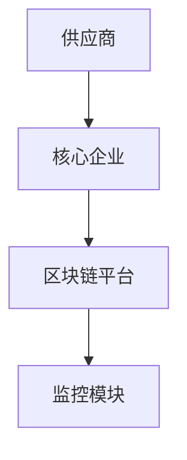
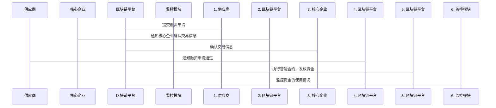

                 


# 企业估值中的区块链供应链金融评估

## 关键词：区块链、供应链金融、企业估值、智能合约、分布式账本、共识机制

## 摘要：  
本文深入探讨区块链技术在供应链金融中的应用，分析其如何提升企业估值。通过区块链的分布式账本、智能合约等技术，解决传统供应链金融中的透明度低、信任度不足等问题。文章结合算法原理、系统架构设计和实际案例，详细阐述区块链供应链金融的实现及其对企业估值的积极影响，为读者提供全面的技术与实践指导。

---

## 第1章：区块链与供应链金融的背景与基础

### 1.1 区块链技术的基本概念  
- 1.1.1 区块链的定义与特点  
  - 分布式账本：数据分布在多个节点，去中心化。  
  - 去中心化：无单一控制点，降低单点故障风险。  
  - 不可篡改：通过密码学确保数据的安全性和不可篡改性。  

- 1.1.2 区块链的核心技术  
  - 分布式账本：记录所有交易的详细信息。  
  - 共识机制：节点通过算法达成一致，如比特币的PoW、以太坊的PoS。  
  - 智能合约：自动执行预设条件的脚本，无需信任第三方。  

- 1.1.3 区块链在供应链管理中的应用潜力  
  - 提高透明度：实时追踪供应链中的每一步操作。  
  - 降低信任成本：通过区块链技术减少中间环节的信任问题。  
  - 提升效率：自动化处理流程，减少人工干预。  

### 1.2 供应链金融的基本概念  
- 1.2.1 供应链金融的定义与特点  
  - 供应链金融：通过整合供应链上下游企业，提供融资支持。  
  - 核心企业：供应链中的核心企业，承担信用背书角色。  
  - 供应商：提供原材料或服务的企业。  

- 1.2.2 供应链金融的传统模式与挑战  
  - 传统模式：核心企业提供担保，银行向供应商提供融资。  
  - 模式问题：信息不对称、融资成本高、效率低。  
  - 潜在风险：供应商信用风险、信息造假、流程复杂。  

- 1.2.3 区块链如何解决供应链金融中的痛点  
  - 提高透明度：通过区块链记录所有交易信息，减少信息不对称。  
  - 降低信任成本：通过智能合约自动执行合同条款，减少中间环节。  
  - 提升效率：自动化处理流程，减少人工干预，提高融资效率。  

### 1.3 区块链供应链金融的背景与意义  
- 1.3.1 企业估值中的供应链金融问题  
  - 传统模式下，供应链金融对企业的估值影响有限。  
  - 区块链技术的应用，可以提升供应链金融的透明度和效率，进而提升企业估值。  

- 1.3.2 区块链技术在供应链金融中的应用前景  
  - 区块链技术的应用，可以降低供应链金融的风险，提高融资效率。  
  - 通过区块链技术，可以实现供应链金融的智能化和自动化。  

- 1.3.3 区块链供应链金融对企业的价值  
  - 提高企业供应链管理的透明度和效率。  
  - 降低企业的融资成本，提高企业的信用评级。  
  - 通过区块链技术，可以实现供应链金融的智能化和自动化。  

---

## 第2章：区块链供应链金融的核心概念与联系  

### 2.1 区块链技术在供应链金融中的核心原理  

#### 2.1.1 区块链的分布式账本原理  
- 分布式账本：数据分布在多个节点，去中心化。  
- 每个节点都有一份完整的账本副本，确保数据一致性。  
- 通过密码学确保账本的安全性和不可篡改性。  

#### 2.1.2 区块链的共识机制  
- 共识机制：节点通过算法达成一致，确保账本的一致性。  
- 常见的共识机制：PoW（工作量证明）、PoS（权益证明）、DPOS（ delegated proof of stake）。  
- 每种共识机制的特点：  
  - PoW：通过计算哈希函数，找到符合条件的区块哈希，耗能较高。  
  - PoS：通过持有代币的数量，获得记账权，耗能较低。  
  - DPOS：通过选举代表节点，获得记账权，效率高。  

#### 2.1.3 区块链的智能合约原理  
- 智能合约：自动执行预设条件的脚本，无需信任第三方。  
- 智能合约的特点：  
  - 自动化：通过预设条件自动执行。  
  - 去中心化：无需第三方干预。  
  - 可编程性：可以根据需求编写不同的智能合约。  

---

### 2.2 区块链供应链金融的核心概念与联系  

#### 2.2.1 区块链技术在供应链金融中的应用模型  
- 核心企业：供应链中的核心企业，提供信用背书。  
- 供应商：提供原材料或服务的企业。  
- 消费者：最终的消费者。  
- 区块链平台：提供区块链技术支持的平台，记录所有交易信息。  

#### 2.2.2 区块链技术在供应链金融中的核心流程  
- 供应商申请融资：通过区块链平台提交融资申请。  
- 核心企业确认：核心企业通过区块链平台确认供应商的交易信息。  
- 智能合约执行：智能合约自动执行融资流程，将资金发放给供应商。  
- 资金监控：区块链平台实时监控资金的使用情况，确保资金用于指定用途。  

---

## 第3章：区块链供应链金融的算法原理  

### 3.1 区块链的共识机制算法  

#### 3.1.1 工作量证明（PoW）算法  
- 工作量证明：通过计算哈希函数，找到符合条件的区块哈希。  
- 例子：比特币网络中，矿工通过计算哈希函数，找到符合条件的区块哈希，获得记账权。  
- 优缺点：  
  - 优点：安全性高，抗攻击性强。  
  - 缺点：耗能高，效率低。  

#### 3.1.2 权益证明（PoS）算法  
- 权益证明：通过持有代币的数量，获得记账权。  
- 例子：以太坊网络中，通过持有以太币的数量，获得记账权。  
- 优缺点：  
  - 优点：耗能低，效率高。  
  - 缺点：安全性较低，存在“富者愈富”的问题。  

#### 3.1.3 代理权益证明（DPOS）算法  
- 代理权益证明：通过选举代表节点，获得记账权。  
- 例子：Steem网络中，通过选举代表节点，获得记账权。  
- 优缺点：  
  - 优点：效率高，抗攻击性强。  
  - 缺点：可能存在中心化风险。  

---

### 3.2 区块链的加密算法  

#### 3.2.1 哈希函数  
- 哈希函数：将任意长度的输入映射为固定长度的输出。  
- 常见哈希函数：MD5、SHA-1、SHA-256。  
- 应用：  
  - 生成区块头哈希。  
  - 验证数据完整性。  

#### 3.2.2 椭圆曲线加密（ECC）  
- 椭圆曲线加密：通过椭圆曲线上的点进行加密。  
- 常见椭圆曲线：secp256k1、secp256r1。  
- 应用：  
  - 生成数字签名。  
  - 验证数字签名。  

---

## 第4章：区块链供应链金融的系统分析与架构设计  

### 4.1 系统功能设计  

#### 4.1.1 系统功能模块  
- 供应商模块：提交融资申请，查询融资状态。  
- 核心企业模块：确认供应商的交易信息，审批融资申请。  
- 区块链平台模块：记录所有交易信息，执行智能合约。  
- 监控模块：实时监控资金的使用情况，确保资金用于指定用途。  

#### 4.1.2 系统功能流程  
1. 供应商提交融资申请：供应商通过区块链平台提交融资申请。  
2. 核心企业确认交易信息：核心企业通过区块链平台确认供应商的交易信息。  
3. 智能合约执行：智能合约自动执行融资流程，将资金发放给供应商。  
4. 资金监控：区块链平台实时监控资金的使用情况，确保资金用于指定用途。  

---

### 4.2 系统架构设计  

#### 4.2.1 系统架构图  


#### 4.2.2 系统接口设计  
- 供应商接口：提交融资申请，查询融资状态。  
- 核心企业接口：确认交易信息，审批融资申请。  
- 区块链平台接口：记录交易信息，执行智能合约。  
- 监控模块接口：监控资金的使用情况，发送警报。  

---

### 4.3 系统交互流程图  

#### 4.3.1 供应商申请融资  


---

## 第5章：区块链供应链金融的项目实战  

### 5.1 环境安装  

#### 5.1.1 开发环境  
- 操作系统：Windows/Mac/Linux  
- 区块链平台：以太坊、Hyperledger Fabric  
- 开发工具：IDE（如IntelliJ IDEA、VS Code）  
- 源代码管理工具：Git  

---

### 5.2 核心代码实现  

#### 5.2.1 智能合约实现  
```solidity
// SPDX-License-Identifier: MIT
pragma solidity ^0.8.0;

contract SupplyChainFinance {
    struct Supplier {
        address payable supplierAddress;
        uint256 amount;
        bool isApproved;
    }

    mapping(address => Supplier) suppliers;

    function requestFunding(address payable _supplierAddress, uint256 _amount) external {
        suppliers[_supplierAddress] = Supplier(_supplierAddress, _amount, false);
    }

    function approveSupplier(address payable _supplierAddress) external {
        suppliers[_supplierAddress].isApproved = true;
    }

    function fundSupplier(address payable _supplierAddress) external payable {
        require(suppliers[_supplierAddress].isApproved, "Supplier not approved");
        uint256 amount = suppliers[_supplierAddress].amount;
        require(msg.value >= amount, "Insufficient funds");
        _supplierAddress.transfer(amount);
    }
}
```

#### 5.2.2 后端代码实现  
```python
from web3 import Web3
from web3.contract import Contract

# 初始化Web3实例
web3 = Web3(Web3.HTTPProvider("http://localhost:8545"))

# 加载智能合约ABI
abi = '''
[
    {
        "constant": false,
        "inputs": [
            {
                "name": "_supplierAddress",
                "type": "address"
            },
            {
                "name": "_amount",
                "type": "uint256"
            }
        ],
        "name": "requestFunding",
        "outputs": [],
        "payable": false,
        "stateMutability": "nonpayable",
        "type": "function"
    },
    // 其他函数ABI...
]
'''

# 加载智能合约实例
contract_address = "0x..."
contract = web3.eth.contract(address=contract_address, abi=abi)

# 提交融资申请
def submit_funding_request(supplier_address, amount):
    try:
        tx_hash = contract.functions.requestFunding(supplier_address, amount).transact()
        return tx_hash
    except Exception as e:
        print(f"Error submitting funding request: {e}")
        return None

# 审批供应商
def approve_supplier(supplier_address):
    try:
        tx_hash = contract.functions.approveSupplier(supplier_address).transact()
        return tx_hash
    except Exception as e:
        print(f"Error approving supplier: {e}")
        return None

# 提供资金
def fund_supplier(supplier_address, amount):
    try:
        tx_hash = contract.functions.fundSupplier(supplier_address).transact(value=amount)
        return tx_hash
    except Exception as e:
        print(f"Error funding supplier: {e}")
        return None
```

---

### 5.3 实际案例分析  

#### 5.3.1 案例背景  
- 核心企业：假设为一家制造企业。  
- 供应商：提供原材料的企业。  
- 融资金额：100万元。  

#### 5.3.2 实施步骤  
1. 供应商提交融资申请：供应商通过区块链平台提交融资申请，金额为100万元。  
2. 核心企业确认交易信息：核心企业通过区块链平台确认供应商的交易信息。  
3. 智能合约执行：智能合约自动执行融资流程，将资金发放给供应商。  
4. 资金监控：区块链平台实时监控资金的使用情况，确保资金用于指定用途。  

---

## 第6章：区块链供应链金融的最佳实践、小结与展望  

### 6.1 最佳实践  

#### 6.1.1 选择合适的区块链平台  
- 根据需求选择适合的区块链平台，如以太坊、Hyperledger Fabric等。  

#### 6.1.2 确保智能合约的安全性  
- 对智能合约进行充分的测试和审计，确保其安全性。  

#### 6.1.3 建立完善的风险控制机制  
- 建立完善的风险控制机制，如设置预警机制、定期审计等。  

---

### 6.2 小结  

- 本文详细介绍了区块链技术在供应链金融中的应用，分析了其核心原理和系统架构设计。  
- 通过实际案例分析，展示了区块链供应链金融的实现过程和应用场景。  
- 总结了区块链供应链金融的优势和挑战，并提出了相应的解决方案。  

---

### 6.3 注意事项  

- 在实施区块链供应链金融时，需要注意数据隐私问题，确保数据的安全性和隐私性。  
- 需要选择合适的区块链平台和智能合约开发框架，确保系统的稳定性和高效性。  
- 建立完善的风险控制机制，确保系统的安全性和可靠性。  

---

### 6.4 拓展阅读  

- 《区块链技术与应用》  
- 《供应链金融的创新与实践》  
- 《智能合约的开发与应用》  

---

## 作者：AI天才研究院/AI Genius Institute & 禅与计算机程序设计艺术 /Zen And The Art of Computer Programming

