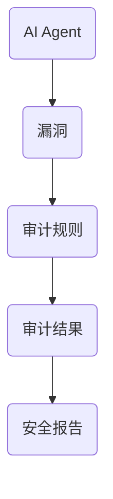
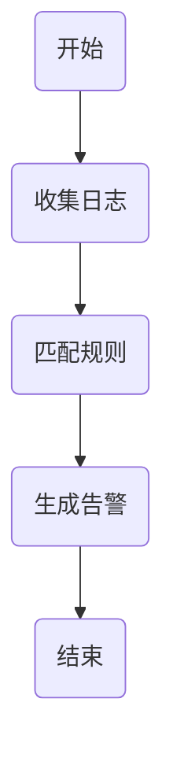
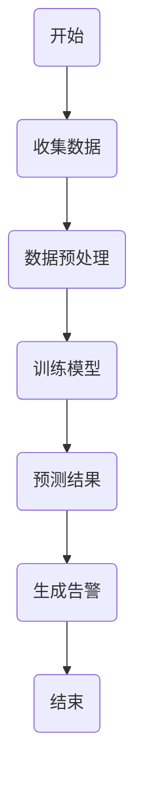
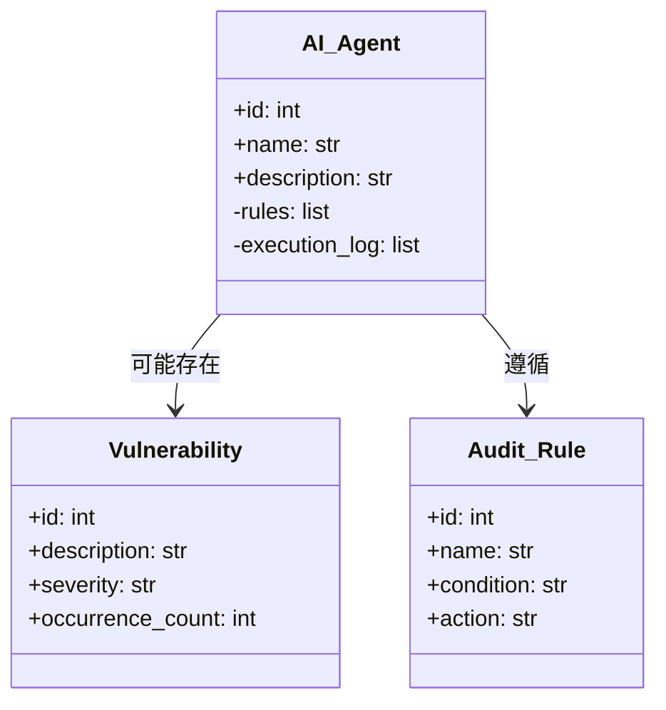
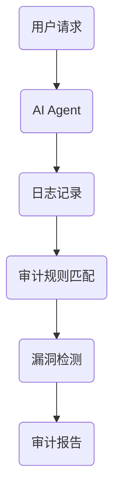

                 


# 安全审计：定期检查AI Agent的安全漏洞

> 关键词：AI安全审计，AI Agent，漏洞检测，安全风险，日志分析

> 摘要：本文深入探讨了AI Agent的安全审计方法，从理论到实践，详细讲解了如何定期检查AI Agent的安全漏洞。通过分析AI Agent的核心功能、安全威胁、审计原理、算法实现、系统架构、项目实战以及最佳实践，为读者提供了一套全面的安全审计解决方案。文章结合实际案例，通过Mermaid图和Python代码示例，帮助读者理解并掌握AI Agent安全审计的关键技术。

---

# 第一部分: 安全审计基础

# 第1章: AI Agent与安全审计概述

## 1.1 AI Agent的基本概念

### 1.1.1 AI Agent的定义
AI Agent（人工智能代理）是一种能够感知环境并采取行动以实现目标的智能实体。它通过传感器获取信息，利用推理能力做出决策，并通过执行器与环境交互。AI Agent可以是软件程序、机器人或其他智能系统。

### 1.1.2 AI Agent的核心功能
1. **感知能力**：通过传感器或数据输入接口获取环境信息。
2. **推理能力**：利用算法对信息进行分析和决策。
3. **执行能力**：根据决策结果执行操作或输出结果。
4. **学习能力**：通过机器学习算法不断优化自身行为。

### 1.1.3 AI Agent的分类与应用场景
1. **简单反射型AI Agent**：基于固定的规则集做出反应，适用于简单的决策任务。
2. **基于模型的AI Agent**：利用内部状态模型进行决策，适用于复杂环境。
3. **目标驱动型AI Agent**：以明确目标为导向，适用于需要长期规划的任务。
4. **实用驱动型AI Agent**：通过最大化效用函数实现目标，适用于资源优化场景。

## 1.2 安全审计的基本概念

### 1.2.1 安全审计的定义
安全审计是对系统或程序的安全性进行检查和评估的过程，旨在发现潜在的安全漏洞、不合规行为或攻击痕迹。它是保障系统安全的重要手段。

### 1.2.2 安全审计的目标与原则
1. **目标**：
   - 检测系统中的安全漏洞。
   - 发现违反安全策略的行为。
   - 评估系统的安全性并提出改进建议。
2. **原则**：
   - 完整性：确保审计过程覆盖所有关键环节。
   - 及时性：及时发现和报告安全问题。
   - 保密性：保护审计过程中获取的信息不被滥用。

### 1.2.3 安全审计的范围与边界
1. **范围**：
   - 操作日志审计。
   - 权限管理审计。
   - 网络行为审计。
2. **边界**：
   - 仅限于系统本身，不涉及其他外部系统。
   - 审计范围需明确，避免越界审计。

## 1.3 AI Agent安全审计的重要性

### 1.3.1 AI Agent面临的常见安全威胁
1. **数据泄露**：敏感数据被非法获取或泄露。
2. **恶意攻击**：通过漏洞入侵系统。
3. **逻辑漏洞**：程序逻辑不严谨导致的安全问题。
4. **配置错误**：不当的配置导致的安全隐患。

### 1.3.2 安全审计在AI Agent中的作用
1. **发现潜在漏洞**：通过系统化的检查发现AI Agent中的安全问题。
2. **评估安全性**：对AI Agent的安全性进行全面评估。
3. **提供改进建议**：根据审计结果提出安全优化建议。

### 1.3.3 安全审计的法律与合规要求
1. **法律法规**：许多国家和地区有明确的网络安全法律，要求企业定期进行安全审计。
2. **行业标准**：如ISO 27001、GDPR等标准对安全审计提出了具体要求。

## 1.4 本章小结
本章介绍了AI Agent的基本概念及其在安全审计中的重要性。通过分析AI Agent的核心功能和常见安全威胁，读者可以理解为什么定期进行安全审计是保障AI Agent安全的关键步骤。

---

# 第二部分: 安全审计的核心概念与联系

# 第2章: 安全审计的核心原理

## 2.1 安全审计的原理与方法

### 2.1.1 基于规则的安全审计
1. **原理**：
   - 预先定义一组安全规则。
   - 检查系统行为是否符合这些规则。
2. **优缺点**：
   - 优点：规则简单明确，易于实现。
   - 缺点：规则覆盖范围有限，难以应对复杂的攻击手段。

### 2.1.2 基于统计的安全审计
1. **原理**：
   - 利用统计学方法分析系统行为。
   - 通过异常检测发现潜在的安全问题。
2. **优缺点**：
   - 优点：能够发现未知的攻击模式。
   - 缺点：需要大量数据支持，计算复杂。

### 2.1.3 基于机器学习的安全审计
1. **原理**：
   - 利用机器学习算法训练模型，识别异常行为。
   - 通过模型预测潜在的安全威胁。
2. **优缺点**：
   - 优点：能够适应复杂的安全威胁。
   - 缺点：需要大量的训练数据和计算资源。

## 2.2 安全审计的核心要素

### 2.2.1 审计日志的收集与分析
1. **日志收集**：
   - 收集系统操作日志、用户行为日志、网络日志等。
   - 使用日志收集工具（如ELK、Prometheus）进行集中化管理。
2. **日志分析**：
   - 对日志进行清洗、归一化处理。
   - 通过关联分析发现异常行为。

### 2.2.2 审计规则的设计与实现
1. **规则设计**：
   - 根据安全需求设计审计规则。
   - 规则应具有可扩展性和灵活性。
2. **规则实现**：
   - 将规则转化为具体的审计条件。
   - 使用正则表达式、条件语句等方式实现规则匹配。

### 2.2.3 审计结果的可视化与报告
1. **结果可视化**：
   - 通过图表、仪表盘等方式展示审计结果。
   - 使用数据可视化工具（如Tableau、 Grafana）进行直观展示。
2. **结果报告**：
   - 生成详细的审计报告，包括问题描述、风险等级、改进建议等。
   - 将报告分发给相关负责人，便于问题处理。

## 2.3 AI Agent安全审计的实体关系图



## 2.4 本章小结
本章详细讲解了安全审计的核心原理和方法，重点分析了基于规则、统计和机器学习的安全审计方法，并通过实体关系图展示了AI Agent安全审计的整体架构。

---

# 第三部分: 安全审计的算法原理

# 第3章: 漏洞检测算法

## 3.1 基于规则的漏洞检测算法

### 3.1.1 算法流程



### 3.1.2 Python实现示例

```python
def rule_based_audit(logs, rules):
    for log in logs:
        for rule in rules:
            if matches(rule, log):
                return f"告警：{rule['description']}"
    return "未发现异常"
```

### 3.1.3 示例分析
假设我们有一个规则：检测重复登录失败的次数是否超过3次。

```python
def matches(rule, log):
    if rule['name'] == '重复登录失败':
        count = 0
        for log_entry in reversed(log):
            if log_entry['action'] == '登录失败':
                count += 1
                if count >= 3:
                    return True
        return False
    return False
```

## 3.2 基于机器学习的漏洞检测算法

### 3.2.1 算法流程



### 3.2.2 算法实现

```python
from sklearn import tree
import pandas as pd

# 数据预处理
data = pd.read_csv('audit_log.csv')
features = data[['feature1', 'feature2', 'feature3']]
target = data['label']

# 训练决策树模型
model = tree.DecisionTreeClassifier()
model.fit(features, target)

# 预测结果
new_log = [[feature1, feature2, feature3]]
prediction = model.predict(new_log)
```

### 3.2.3 数学公式
机器学习模型的训练过程通常涉及优化目标函数：

$$
\text{loss}(y, y') = \sum_{i=1}^{n}(y_i - y'_i)^2
$$

通过最小化损失函数，模型能够更好地拟合训练数据。

---

# 第四部分: 系统分析与架构设计方案

# 第4章: 系统分析与架构设计

## 4.1 项目背景与需求分析

### 4.1.1 项目背景
假设我们正在开发一个企业级的AI Agent系统，用于自动化处理客户服务请求。由于系统的复杂性，需要定期进行安全审计以确保系统的安全性。

### 4.1.2 需求分析
1. **功能需求**：
   - 收集系统日志。
   - 检测安全漏洞。
   - 生成审计报告。
2. **性能需求**：
   - 实时审计能力。
   - 高效的漏洞检测算法。

## 4.2 系统功能设计

### 4.2.1 领域模型设计



### 4.2.2 系统架构设计



### 4.2.3 系统接口设计
1. **日志接口**：
   - 输入：日志数据。
   - 输出：日志存储结果。
2. **审计接口**：
   - 输入：日志数据和审计规则。
   - 输出：漏洞检测结果。

---

# 第五部分: 项目实战

# 第5章: 项目实战

## 5.1 环境安装

### 5.1.1 安装依赖
```bash
pip install elasticsearch python-memcached requests
```

### 5.1.2 配置环境
```bash
# 配置日志收集器
echo "ELASTICSEARCH_HOST=elastic:9200" >> config.ini
```

## 5.2 核心代码实现

### 5.2.1 日志收集模块

```python
import requests
import json

def collect_logs():
    logs = []
    while True:
        try:
            response = requests.get('http://log-server:8080/logs')
            logs.extend(response.json())
            break
        except requests.exceptions.ConnectionError:
            continue
    return logs
```

### 5.2.2 漏洞检测模块

```python
def detect_vulnerabilities(logs, rules):
    vulnerabilities = []
    for log in logs:
        for rule in rules:
            if matches(rule, log):
                vulnerabilities.append({
                    'description': rule['description'],
                    'severity': rule['severity']
                })
                break
    return vulnerabilities
```

## 5.3 案例分析

### 5.3.1 案例背景
假设我们的AI Agent系统是一个客服机器人，负责处理用户的咨询请求。最近发现系统中存在多次未授权访问的情况。

### 5.3.2 检测过程
1. **日志收集**：
   - 收集过去一周的系统日志。
2. **规则匹配**：
   - 匹配未授权访问的规则。
3. **漏洞检测**：
   - 发现多次未授权访问行为，确认存在漏洞。

### 5.3.3 检测结果
- **漏洞描述**：未授权访问。
- **严重性**：高。
- **建议修复**：强化访问控制机制。

---

# 第六部分: 最佳实践与总结

# 第6章: 最佳实践

## 6.1 关键点总结

### 6.1.1 理论部分
- 理解AI Agent的基本原理和安全审计的核心概念。
- 掌握基于规则和机器学习的安全审计方法。

### 6.1.2 实践部分
- 熟练使用日志分析工具。
- 熟悉漏洞检测算法的实现和优化。
- 能够设计和实现安全审计系统架构。

## 6.2 小结

### 6.2.1 问题回顾
- AI Agent的安全性直接关系到系统的稳定性和可靠性。
- 安全审计是保障系统安全的重要手段。

### 6.2.2 解决方案
- 定期进行安全审计，发现和修复潜在漏洞。
- 使用多种安全审计方法，提高审计的全面性。

## 6.3 注意事项

### 6.3.1 审计频率
- 根据系统的敏感性制定审计频率。
- 重要系统应定期进行审计。

### 6.3.2 审计工具
- 选择合适的审计工具，确保审计的高效性。
- 定期更新审计规则和模型。

## 6.4 拓展阅读

### 6.4.1 推荐书籍
1. 《软件安全：深入浅出》
2. 《机器学习实战》

### 6.4.2 推荐博客
1. [ cybersecurity.hub ](https://security.hub)
2. [ AI安全审计技术博客 ](https://aiaudit.tech)

---

作者：AI天才研究院/AI Genius Institute & 禅与计算机程序设计艺术 /Zen And The Art of Computer Programming

