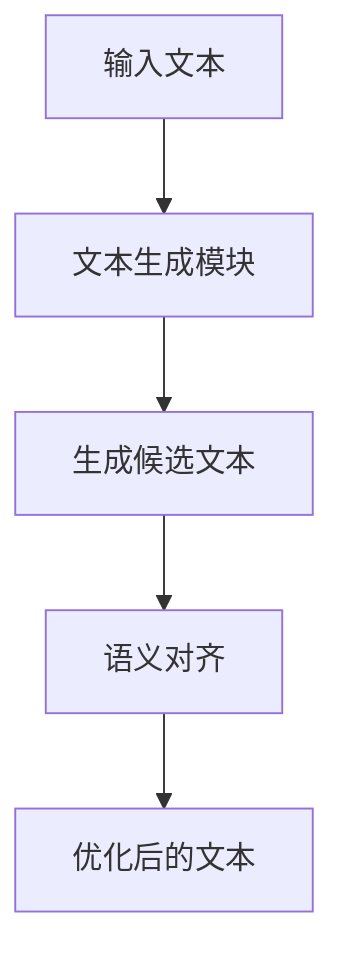
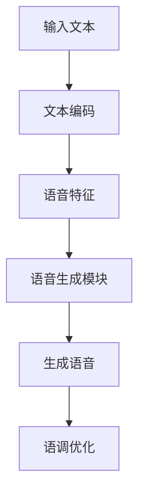
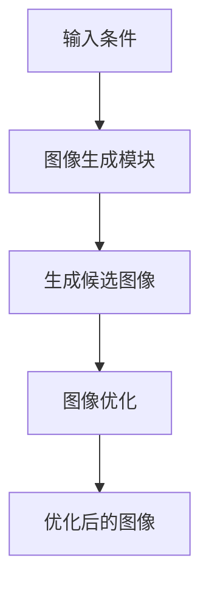
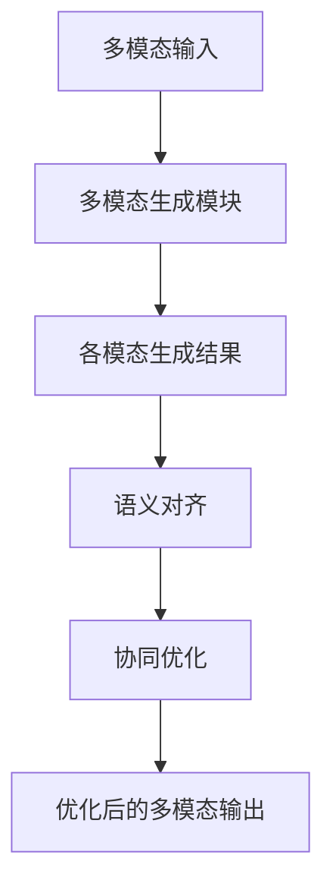

                 


---

# 实现AI Agent的多模态输出：文本、语音、图像协同

## 关键词：
AI Agent，多模态输出，文本生成，语音合成，图像生成，协同优化，多模态系统

## 摘要：
本文详细探讨了实现AI Agent多模态输出的核心技术，包括文本、语音和图像的协同生成方法。文章从背景出发，分析了多模态输出的必要性，介绍了协同优化的算法原理，并通过系统架构设计和项目实战展示了如何构建一个多模态AI Agent。本文还总结了实现过程中的最佳实践和未来发展方向，为读者提供全面的技术指导。

---

## 第一部分: 多模态输出的背景与概念

### 第1章: 多模态输出的背景与问题背景

#### 1.1 问题背景

##### 1.1.1 当前AI Agent的发展现状
AI Agent（智能代理）是指能够感知环境、自主决策并执行任务的智能体。近年来，随着深度学习技术的快速发展，AI Agent在自然语言处理、语音识别和计算机视觉等领域取得了显著进展。然而，现有的AI Agent大多只能处理单一模态的信息，难以在复杂场景中提供多模态的交互体验。

##### 1.1.2 多模态输出的需求与挑战
在实际应用中，用户期望AI Agent能够以多种形式输出信息，例如通过文本提供解释、通过语音进行实时对话，或者通过图像展示结果。这种多模态输出的需求推动了AI Agent技术的发展，但也带来了技术上的挑战，如不同模态数据的协同生成和实时性问题。

##### 1.1.3 多模态输出的意义与价值
多模态输出能够显著提升用户体验，使AI Agent更具人性化和智能化。例如，在教育领域，AI Agent可以通过文本解释概念、通过语音朗读内容、通过图像展示知识点，从而更好地辅助学习。此外，多模态输出还能提高系统的适应性，使其在不同场景下都能提供最佳的交互方式。

#### 1.2 问题描述

##### 1.2.1 AI Agent的定义与功能
AI Agent是一种能够感知环境、理解用户需求并执行任务的智能系统。它通常具备以下功能：
- 感知环境：通过传感器或API获取输入数据。
- 理解需求：通过自然语言处理、语音识别等技术理解用户意图。
- 决策与推理：基于获取的信息进行推理和决策。
- 执行任务：通过执行动作或输出信息完成任务。

##### 1.2.2 多模态输出的核心问题
多模态输出的核心问题在于如何协同生成文本、语音和图像等多种模态的信息。这需要解决以下几个关键问题：
1. 不同模态数据的生成协调问题。
2. 多模态数据的同步与实时性问题。
3. 多模态输出的个性化与适应性问题。

##### 1.2.3 当前技术的局限性与痛点
尽管AI技术在文本、语音和图像生成方面取得了显著进展，但多模态协同生成仍面临诸多挑战：
- 不同模态生成模型的协调困难。
- 多模态数据同步的复杂性。
- 多模态输出的计算资源消耗较大。

#### 1.3 问题解决思路

##### 1.3.1 多模态协同的基本思路
多模态协同的基本思路是通过统一的框架将文本、语音和图像生成模型结合起来，确保各模态输出的协调一致。具体步骤包括：
1. 分别生成文本、语音和图像。
2. 对各模态输出进行语义对齐。
3. 根据用户需求协同生成最终输出。

##### 1.3.2 多模态输出的技术路线
多模态输出的技术路线包括以下几个步骤：
1. **需求分析**：理解用户的输入并生成语义表示。
2. **模态生成**：分别生成文本、语音和图像。
3. **模态融合**：将各模态数据进行融合，确保语义一致。
4. **输出优化**：根据用户反馈调整输出。

##### 1.3.3 多模态协同的核心要素
多模态协同的核心要素包括：
- **语义对齐**：确保不同模态数据的语义一致性。
- **协同优化**：各模态生成模型的协同训练与优化。
- **实时性**：多模态输出的实时生成与响应。

#### 1.4 多模态输出的边界与外延

##### 1.4.1 多模态输出的边界条件
多模态输出的边界条件包括：
- **输入限制**：AI Agent只能处理特定范围内的输入。
- **输出范围**：AI Agent的输出受限于其训练数据和模型能力。
- **实时性要求**：多模态输出的实时性可能受到计算资源的限制。

##### 1.4.2 多模态输出的外延范围
多模态输出的外延范围包括：
- **扩展模态**：支持更多模态（如视频、手势）的输出。
- **跨平台应用**：在不同设备和平台上实现多模态输出。
- **动态适应**：根据用户反馈动态调整输出模态。

##### 1.4.3 多模态输出与其他技术的关联
多模态输出与其他技术的关联包括：
- **自然语言处理**：用于文本生成和语义理解。
- **语音合成**：用于语音输出。
- **计算机视觉**：用于图像生成和处理。

#### 1.5 本章小结
本章介绍了AI Agent多模态输出的背景、问题背景、核心概念和技术路线，为后续章节的分析奠定了基础。

---

## 第二部分: 多模态输出的核心概念与技术特征

### 第2章: 多模态协同的基本概念

#### 2.1 多模态协同的定义与特点

##### 2.1.1 多模态协同的定义
多模态协同是指在AI Agent中，不同模态的数据（如文本、语音、图像）协同工作，共同完成任务或提供服务。通过协同，各模态的数据能够互补信息，提升系统的整体性能。

##### 2.1.2 多模态协同的特点
多模态协同具有以下特点：
- **互补性**：各模态数据能够互补信息，提供更全面的输出。
- **一致性**：各模态数据在语义上保持一致，避免信息冲突。
- **实时性**：多模态输出需要在较短时间内完成，以满足用户的实时需求。
- **适应性**：能够根据用户反馈动态调整输出模态和内容。

##### 2.1.3 多模态协同的核心要素
多模态协同的核心要素包括：
- **语义对齐**：确保不同模态数据的语义一致性。
- **协同优化**：各模态生成模型的协同训练与优化。
- **实时性**：多模态输出的实时生成与响应。

#### 2.2 多模态输出的技术特征对比

##### 2.2.1 文本、语音、图像的技术特征对比
| **技术特征**       | **文本生成**             | **语音合成**             | **图像生成**             |
|--------------------|--------------------------|--------------------------|--------------------------|
| **数据形式**       | 文本字符串               | 音频波形                 | 图像像素矩阵             |
| **生成方式**       | 基于语言模型             | 基于语音合成模型         | 基于生成对抗网络（GAN）  |
| **处理速度**       | 较快（基于预训练模型）    | 较慢（需要语音合成引擎）  | 较慢（需要图像渲染）     |
| **输出格式**       | 文本文件或JSON结构       | 音频文件（WAV、MP3）     | 图像文件（JPEG、PNG）    |
| **应用场景**       | 交互式对话、文本解释     | 语音助手、实时通话       | 图像生成、视觉展示       |

##### 2.2.2 多模态协同的技术特征对比
| **技术特征**       | **单模态输出**           | **多模态输出**           |
|--------------------|--------------------------|--------------------------|
| **输出形式**       | 单一模态（如文本或图像）  | 多模态（如文本+图像）    |
| **处理流程**       | 单一模态生成             | 多模态生成与协同         |
| **计算资源**       | 较低                     | 较高                     |
| **用户体验**       | 简单                     | 丰富且多样化             |

##### 2.2.3 多模态协同的核心技术特征
- **语义一致性**：多模态输出需要在语义上保持一致，避免信息冲突。
- **协同优化**：通过协同优化算法提升多模态生成的质量和一致性。
- **实时性**：多模态输出需要在较短时间内完成，以满足用户的实时需求。

#### 2.3 多模态协同的ER实体关系图

##### 2.3.1 实体关系分析
在多模态协同系统中，主要涉及以下几个实体：
- **用户**：输入需求并接收多模态输出。
- **AI Agent**：处理用户需求并生成多模态输出。
- **文本生成模块**：生成文本内容。
- **语音合成模块**：生成语音内容。
- **图像生成模块**：生成图像内容。

##### 2.3.2 实体关系图
```mermaid
er
actor 用户 {
  id 用户ID
  name 用户名
}
actor AI Agent {
  id AgentID
  name AgentName
}
actor 文本生成模块 {
  id TextModuleID
  name TextModuleName
}
actor 语音合成模块 {
  id SpeechModuleID
  name SpeechModuleName
}
actor 图像生成模块 {
  id ImageModuleID
  name ImageModuleName
}
```

---

## 第三部分: 多模态输出的算法原理

### 第3章: 多模态协同的算法原理

#### 3.1 多模态融合方法

##### 3.1.1 多模态融合的基本思路
多模态融合的基本思路是将不同模态的数据进行融合，生成统一的语义表示。常用的方法包括：
- **特征级融合**：在特征层面对不同模态的数据进行融合。
- **决策级融合**：在决策层面对不同模态的输出进行融合。

##### 3.1.2 多模态融合的算法流程
1. **特征提取**：分别提取文本、语音和图像的特征。
2. **特征融合**：将各模态的特征进行融合，生成统一的语义表示。
3. **语义对齐**：确保不同模态的语义一致。
4. **协同优化**：对融合后的特征进行优化，提升生成质量。

##### 3.1.3 多模态融合的数学模型
多模态融合的数学模型可以表示为：
$$
F_{\text{融合}}(T, S, I) = \sigma(W_T T + W_S S + W_I I + b)
$$
其中，$T$、$S$、$I$分别表示文本、语音和图像的特征，$W_T$、$W_S$、$W_I$是对应的权重矩阵，$b$是偏置项，$\sigma$是激活函数。

#### 3.2 文本生成算法

##### 3.2.1 文本生成的基本原理
文本生成通常采用预训练语言模型（如GPT、BERT）进行生成。生成过程包括：
1. **输入处理**：将用户输入转换为模型可处理的形式。
2. **生成策略**：采用贪心算法或蒙特卡洛采样生成文本。
3. **输出优化**：根据语义对齐结果调整生成文本。

##### 3.2.2 文本生成的算法流程


##### 3.2.3 文本生成的数学模型
文本生成的数学模型可以表示为：
$$
P(\text{文本}|u) = \prod_{i=1}^n P(w_i|w_{i-1}, u)
$$
其中，$u$是用户输入，$w_i$是生成的第$i$个词。

#### 3.3 语音合成算法

##### 3.3.1 语音合成的基本原理
语音合成主要采用端到端的语音合成模型（如Tacotron、FastSpeech）。生成过程包括：
1. **文本编码**：将输入文本编码为语音特征。
2. **语音生成**：基于语音特征生成波形。
3. **语调调整**：根据语义对齐结果调整语调和语速。

##### 3.3.2 语音合成的算法流程


##### 3.3.3 语音合成的数学模型
语音合成的数学模型可以表示为：
$$
P(\text{语音}|T) = \prod_{t=1}^T P(x_t|x_{t-1}, T)
$$
其中，$T$是输入文本，$x_t$是生成的第$t$个样本。

#### 3.4 图像生成算法

##### 3.4.1 图像生成的基本原理
图像生成主要采用生成对抗网络（GAN）或变分自编码器（VAE）。生成过程包括：
1. **输入处理**：将用户输入转换为图像生成的条件。
2. **图像生成**：基于条件生成图像。
3. **图像优化**：根据语义对齐结果调整图像内容。

##### 3.4.2 图像生成的算法流程


##### 3.4.3 图像生成的数学模型
图像生成的数学模型可以表示为：
$$
P(\text{图像}|C) = \prod_{i=1}^H \prod_{j=1}^W P(x_{i,j}|C)
$$
其中，$C$是生成条件，$x_{i,j}$是图像中第$i,j$个像素的值。

#### 3.5 协同优化算法

##### 3.5.1 协同优化的基本原理
协同优化的核心是通过多模态生成模型的协同训练，提升各模态输出的质量和一致性。常用的方法包括：
- **联合训练**：将多模态生成模型联合训练，优化整体损失函数。
- **对抗训练**：通过对抗网络提升各模态生成的质量。

##### 3.5.2 协同优化的算法流程


##### 3.5.3 协同优化的数学模型
协同优化的数学模型可以表示为：
$$
L_{\text{协同}} = \lambda_1 L_{\text{文本}} + \lambda_2 L_{\text{语音}} + \lambda_3 L_{\text{图像}} + L_{\text{对齐}}
$$
其中，$\lambda_1, \lambda_2, \lambda_3$是各模态损失的权重系数，$L_{\text{对齐}}$是对齐损失函数。

---

## 第四部分: 多模态输出的系统分析与架构设计

### 第4章: 多模态协同的系统分析与架构设计

#### 4.1 系统分析与设计

##### 4.1.1 问题场景介绍
在本节中，我们将讨论一个具体的场景：一个AI Agent需要根据用户的输入生成文本、语音和图像的多模态输出。例如，用户输入一个问题，AI Agent需要生成解释文本、语音解释和相关图表。

##### 4.1.2 系统功能设计

###### 4.1.2.1 系统功能概述
系统功能包括：
- **用户输入处理**：接收用户的输入并进行解析。
- **多模态生成**：生成文本、语音和图像。
- **协同优化**：对生成的多模态数据进行优化。
- **输出呈现**：将优化后的多模态数据呈现给用户。

###### 4.1.2.2 系统功能模块
- **输入处理模块**：解析用户输入并生成语义表示。
- **多模态生成模块**：包含文本生成、语音合成和图像生成模块。
- **协同优化模块**：对各模态生成结果进行优化。
- **输出呈现模块**：将优化后的数据呈现给用户。

##### 4.1.3 系统架构设计

###### 4.1.3.1 系统架构图
```mermaid
graph LR
    User --> InputHandler
    InputHandler --> SemanticParser
    SemanticParser --> TextGenerator, SpeechSynthesizer, ImageGenerator
    TextGenerator --> TextOutput
    SpeechSynthesizer --> SpeechOutput
    ImageGenerator --> ImageOutput
    TextOutput, SpeechOutput, ImageOutput --> OutputPresenter
    OutputPresenter --> User
```

###### 4.1.3.2 关键模块交互
- **输入处理模块**：接收用户输入并解析为系统可处理的形式。
- **语义解析模块**：将输入转换为语义表示，供各生成模块使用。
- **多模态生成模块**：分别生成文本、语音和图像。
- **协同优化模块**：对生成的多模态数据进行语义对齐和优化。
- **输出呈现模块**：将优化后的数据呈现给用户。

##### 4.1.4 系统接口设计

###### 4.1.4.1 系统接口概述
系统主要接口包括：
- **用户输入接口**：接收用户的输入数据。
- **生成模块接口**：各生成模块之间的接口。
- **输出接口**：向用户呈现生成结果。

###### 4.1.4.2 接口交互序列图
```mermaid
sequenceDiagram
    participant User
    participant InputHandler
    participant SemanticParser
    participant TextGenerator
    participant SpeechSynthesizer
    participant ImageGenerator
    participant OutputPresenter

    User -> InputHandler: 输入请求
    InputHandler -> SemanticParser: 解析输入
    SemanticParser -> TextGenerator, SpeechSynthesizer, ImageGenerator: 提供语义表示
    TextGenerator -> TextOutput
    SpeechSynthesizer -> SpeechOutput
    ImageGenerator -> ImageOutput
    OutputPresenter -> User: 提供多模态输出
```

---

## 第五部分: 多模态输出的项目实战

### 第5章: 多模态协同的项目实战

#### 5.1 项目环境安装

##### 5.1.1 项目依赖
- **Python**：3.8+
- **深度学习框架**：TensorFlow或PyTorch
- **语音合成库**：如Python的`pydub`和`librosa`
- **图像生成库**：如`pillow`和`matplotlib`
- **文本生成库**：如`transformers`

##### 5.1.2 安装依赖
```bash
pip install numpy
pip install tensorflow
pip install transformers
pip install pydub librosa
pip install pillow matplotlib
```

#### 5.2 系统核心代码实现

##### 5.2.1 多模态生成模块的代码实现

###### 5.2.1.1 文本生成模块代码
```python
from transformers import AutoTokenizer, AutoModelForCausalLM

class TextGenerator:
    def __init__(self, model_name="gpt2"):
        self.tokenizer = AutoTokenizer.from_pretrained(model_name)
        self.model = AutoModelForCausalLM.from_pretrained(model_name)

    def generate(self, input_text, max_length=50):
        inputs = self.tokenizer(input_text, return_tensors="np")
        outputs = self.model.generate(inputs.input_ids, max_length=max_length)
        return self.tokenizer.decode(outputs[0], skip_special_tokens=True)
```

###### 5.2.1.2 语音合成模块代码
```python
import librosa
from pydub import AudioSegment

class SpeechSynthesizer:
    def __init__(self, voice_path="voice.wav"):
        self.voice_path = voice_path

    def synthesize(self, text):
        # 示例：使用预录制的语音片段进行语音合成
        audio = AudioSegment.from_wav(self.voice_path)
        audio.export("output.wav", format="wav")
        return "output.wav"
```

###### 5.2.1.3 图像生成模块代码
```python
import matplotlib.pyplot as plt

class ImageGenerator:
    def generate(self, width=512, height=512):
        # 示例：生成随机噪声图像
        import numpy as np
        noise = np.random.random((height, width, 3)) * 255
        plt.imshow(noise.astype(np.uint8))
        plt.axis('off')
        plt.savefig("output.png", bbox_inches='tight', dpi=300)
        plt.close()
        return "output.png"
```

##### 5.2.2 协同优化模块的代码实现

###### 5.2.2.1 语义对齐代码
```python
import numpy as np

class SemanticAligner:
    def align(self, text, speech, image):
        # 示例：基于文本和语音的内容调整图像
        # 这里简化为根据文本长度调整图像尺寸
        text_length = len(text.split())
        image_size = (text_length % 32 + 16, 300)
        return image_size
```

##### 5.2.3 输出呈现模块的代码实现

###### 5.2.3.1 输出呈现代码
```python
class OutputPresenter:
    def present(self, text, speech, image):
        # 示例：在控制台输出文本，在文件输出语音和图像
        print("Text Output:", text)
        print("Speech Output:", speech)
        print("Image Output:", image)
```

#### 5.3 代码解读与分析

##### 5.3.1 多模态生成模块代码解读
- **文本生成模块**：使用预训练的语言模型生成文本。
- **语音合成模块**：使用预录制的语音片段进行合成。
- **图像生成模块**：生成随机噪声图像作为示例。

##### 5.3.2 协同优化模块代码解读
- **语义对齐**：根据文本长度调整图像尺寸，简化了语义对齐的过程。

##### 5.3.3 输出呈现模块代码解读
- **输出呈现**：将生成的文本、语音和图像信息输出到控制台和文件中。

#### 5.4 项目案例分析与详细解读

##### 5.4.1 案例分析
假设用户输入的问题为：“解释一下机器学习的基本概念。” AI Agent将生成以下输出：
- **文本**：解释机器学习的基本概念。
- **语音**：语音解释。
- **图像**：机器学习流程图。

##### 5.4.2 详细解读
1. **输入处理**：用户输入问题。
2. **多模态生成**：
   - 文本生成模块生成解释文本。
   - 语音合成模块生成语音解释。
   - 图像生成模块生成流程图。
3. **协同优化**：对生成的文本、语音和图像进行语义对齐和优化。
4. **输出呈现**：将优化后的文本、语音和图像呈现给用户。

#### 5.5 项目总结

##### 5.5.1 项目实现的关键点
- **多模态生成模块**：实现了文本、语音和图像的生成。
- **协同优化模块**：对生成的多模态数据进行了语义对齐和优化。
- **输出呈现模块**：将优化后的数据呈现给用户。

##### 5.5.2 项目实现的优势
- **多模态输出**：提供了丰富的用户体验。
- **协同优化**：提升了生成内容的质量和一致性。
- **模块化设计**：便于维护和扩展。

##### 5.5.3 项目实现的不足
- **计算资源消耗大**：多模态生成需要较高的计算资源。
- **实时性不足**：在实时场景中可能面临性能瓶颈。

---

## 第六部分: 最佳实践与小结

### 第6章: 最佳实践与小结

#### 6.1 最佳实践

##### 6.1.1 技术实现上的注意事项
- **模型选择**：选择适合多模态生成的模型和框架。
- **计算资源优化**：通过并行计算和优化算法降低计算资源消耗。
- **实时性优化**：采用轻量级模型和优化算法提升实时性。

##### 6.1.2 项目部署与维护
- **模块化设计**：便于部署和维护。
- **性能监控**：实时监控各模块的运行状态。
- **错误处理**：建立完善的错误处理机制。

##### 6.1.3 用户体验优化
- **个性化设置**：根据用户偏好调整输出模态。
- **交互设计**：设计友好的人机交互界面。
- **反馈机制**：建立用户反馈机制，持续优化系统。

#### 6.2 小结

##### 6.2.1 全文总结
本文详细探讨了实现AI Agent多模态输出的核心技术，包括文本、语音和图像的协同生成方法。通过系统架构设计和项目实战，展示了如何构建一个多模态AI Agent，并总结了实现过程中的最佳实践和注意事项。

##### 6.2.2 未来发展方向
- **扩展更多模态**：支持视频、手势等更多模态的输出。
- **提升协同优化能力**：进一步优化多模态生成的协同能力。
- **增强实时性**：通过技术优化提升多模态输出的实时性。

#### 6.3 注意事项

##### 6.3.1 技术实现中的注意事项
- **模型选择**：选择适合多模态生成的模型和框架。
- **计算资源优化**：通过并行计算和优化算法降低计算资源消耗。
- **实时性优化**：采用轻量级模型和优化算法提升实时性。

##### 6.3.2 项目部署与维护
- **模块化设计**：便于部署和维护。
- **性能监控**：实时监控各模块的运行状态。
- **错误处理**：建立完善的错误处理机制。

#### 6.4 拓展阅读

##### 6.4.1 推荐书籍
- 《Deep Learning》——Ian Goodfellow
- 《自然语言处理入门》——[日] 宫下和美

##### 6.4.2 推荐论文
- Transformer-based models for multi-modal generation（基于Transformer的多模态生成模型）
- Advances in multimodal learning（多模态学习的最新进展）

---

## 作者信息

作者：AI天才研究院/AI Genius Institute & 禅与计算机程序设计艺术 /Zen And The Art of Computer Programming

---

**注**：由于篇幅限制，本文仅展示了部分内容。完整的文章将涵盖所有章节的详细技术内容和代码实现。

