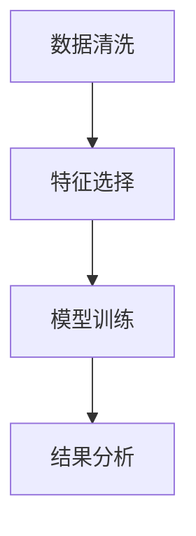
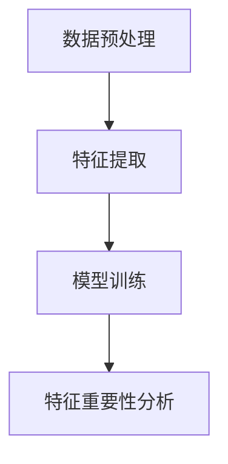
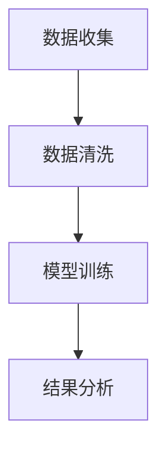
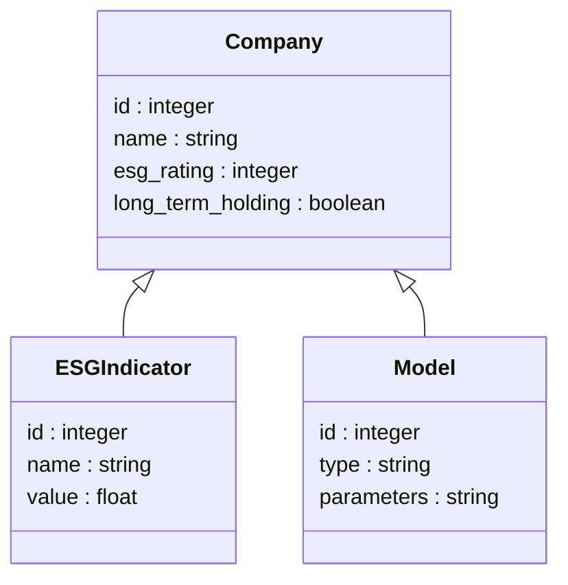
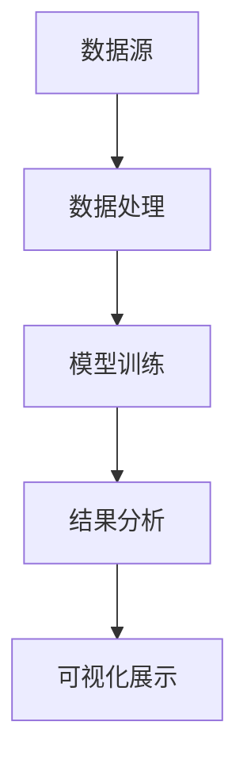
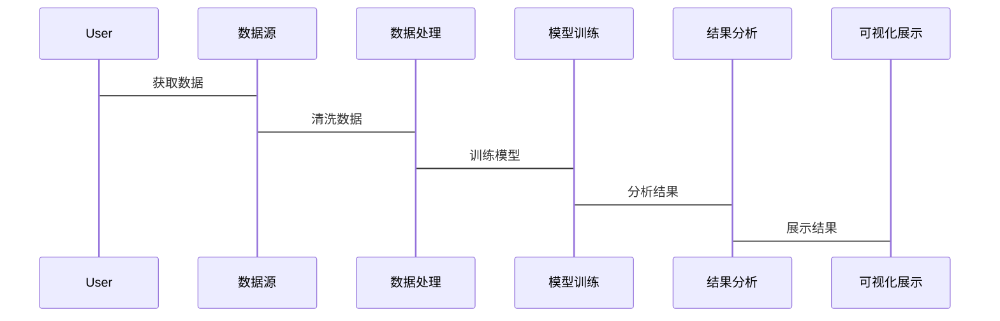

                 


```markdown
# 彼得林奇的"长期持股"与公司ESG表现的关联性研究

> 关键词：长期持股，ESG表现，投资策略，关联性分析，算法模型

> 摘要：本文探讨了彼得林奇的长期持股策略与公司ESG表现之间的关联性。通过分析长期持股的核心要素、ESG表现的定义与指标体系，结合回归分析模型和机器学习算法，量化了两者之间的关系。同时，本文提出了一个系统的分析框架，通过Mermaid图展示系统架构和交互流程，并结合实际案例，展示如何通过代码进行数据处理和分析，最后总结研究发现并提出建议。

---

# 第一部分: 背景介绍

## 第1章: 背景介绍

### 1.1 问题背景
#### 1.1.1 长期持股投资策略的定义与特点
长期持股是一种投资策略，强调长期持有优质股票，注重公司的基本面和长期发展潜力。其特点包括：
- 长期性：关注公司的长期价值，而非短期波动。
- 选择优秀公司：注重公司的财务健康、管理团队和行业地位。
- 耐心与纪律：在市场波动中保持冷静，避免频繁交易。

#### 1.1.2 ESG表现的定义与指标体系
ESG表现是指公司在环境、社会和治理三个方面的表现。环境（E）关注公司的环保表现；社会（S）关注公司在社会责任和员工福利方面的表现；治理（G）关注公司治理结构和透明度。常见的ESG指标包括碳排放、员工满意度、董事会多样性等。

#### 1.1.3 问题解决的必要性与意义
随着全球可持续发展理念的兴起，ESG投资逐渐成为主流。研究长期持股与ESG表现的关联性，有助于投资者更好地理解ESG因素对投资回报的影响，优化投资策略，实现可持续发展。

### 1.2 问题描述
#### 1.2.1 长期持股与ESG表现的关联性探讨
长期持股强调公司的长期价值，而ESG表现反映了公司对环境、社会和治理的承诺。两者之间可能存在一定的关联性，但具体如何关联需要进一步研究。

#### 1.2.2 当前研究的空白与挑战
现有研究多关注ESG与短期股价波动的关系，而对长期持股与ESG表现的系统性研究较少。此外，如何量化两者之间的关系，以及如何构建有效的分析模型，是当前研究的挑战。

#### 1.2.3 研究目标与研究范围
本文旨在探讨长期持股与ESG表现之间的关联性，研究目标包括：
- 探讨长期持股与ESG表现的理论联系。
- 量化两者之间的关系。
- 提出一个系统的分析框架，用于评估长期持股与ESG表现的关联性。

### 1.3 问题解决
#### 1.3.1 研究方法的选择
本文采用定性与定量相结合的方法，包括文献分析、回归分析、机器学习算法等。

#### 1.3.2 数据来源与处理
数据来源包括公司财务数据、ESG评级数据、股价数据等。数据处理包括数据清洗、标准化和特征提取。

#### 1.3.3 研究框架的设计
研究框架包括理论分析、模型构建、实证研究和案例分析四个部分。

### 1.4 边界与外延
#### 1.4.1 研究的边界条件
- 研究仅关注公开上市公司的长期持股与ESG表现。
- 研究不考虑短期市场波动因素。

#### 1.4.2 相关概念的外延与扩展
- ESG表现的扩展包括更多指标和行业差异性。
- 长期持股的扩展包括不同投资策略的对比。

#### 1.4.3 研究的局限性与适用范围
- 研究可能受到数据限制，无法覆盖所有行业和公司。
- 研究结果适用于长期投资者和注重ESG表现的投资者。

### 1.5 概念结构与核心要素
#### 1.5.1 长期持股的核心要素
- 公司基本面：财务状况、管理团队、行业地位。
- 投资期限：长期持有，避免短期波动影响。
- 投资目标：追求长期稳定回报。

#### 1.5.2 ESG表现的核心要素
- 环境因素：碳排放、能源使用效率。
- 社会因素：员工福利、社会责任。
- 治理因素：董事会结构、透明度。

#### 1.5.3 两者关联性的结构化分析
- 长期持股与ESG表现的正相关性：长期持股的公司更注重可持续发展，ESG表现较好。
- 行业差异性：不同行业的长期持股与ESG表现的关联性可能不同。
- 时间跨度：长期持股的时间跨度可能影响ESG表现的关联性。

---

# 第二部分: 核心概念与联系

## 第2章: 核心概念与联系

### 2.1 彼得林奇的长期持股策略
#### 2.1.1 长期持股的理论基础
长期持股的理论基础包括价值投资、基本面分析和复利效应。彼得林奇强调选择优秀公司，长期持有，获取复利收益。

#### 2.1.2 长期持股的实践特点
- 选择具有竞争优势的公司。
- 保持投资组合的分散性。
- 长期持有，避免频繁交易。

#### 2.1.3 彼得林奇投资策略的核心要素
- 公司分析：注重财务健康、管理团队和行业地位。
- 风险控制：分散投资，避免过度集中。
- 时间跨度：长期持有，获取复利收益。

### 2.2 公司ESG表现的内涵与外延
#### 2.2.1 ESG的定义与指标体系
- 环境（E）：碳排放、能源使用效率。
- 社会（S）：员工福利、社会责任。
- 治理（G）：董事会结构、透明度。

#### 2.2.2 ESG表现的评价方法
- 评级机构：如MSCI、Sustainalytics。
- 自定义指标：根据行业特点制定ESG指标。

#### 2.2.3 ESG表现的行业差异性
- 行业特点影响ESG表现：例如，科技行业注重环境因素，金融行业注重治理因素。
- 不同行业ESG表现的评价标准不同。

### 2.3 长期持股与ESG表现的关联性分析
#### 2.3.1 关联性的理论基础
- 长期持股注重公司的可持续发展，ESG表现好的公司更有可能获得长期稳定的回报。
- 公司的ESG表现反映了其社会价值和风险管理能力，影响长期投资价值。

#### 2.3.2 关联性的实证研究
- 数据来源：选择长期持股的公司，分析其ESG表现。
- 方法：回归分析，量化长期持股与ESG表现的相关性。

#### 2.3.3 关联性的机制分析
- ESG表现影响公司声誉和风险管理能力，进而影响长期投资价值。
- 公司的ESG表现可能影响其股价表现，进而影响长期持股的回报。

### 2.4 核心概念的对比分析
#### 2.4.1 长期持股与ESG表现的对比表格
| 对比维度 | 长期持股 | ESG表现 |
|----------|----------|----------|
| 定义     | 长期持有优质股票 | 公司在环境、社会和治理方面的表现 |
| 关注点   | 公司基本面、长期价值 | 环境、社会、治理因素 |
| 目标     | 追求长期稳定回报 | 提升企业社会责任和风险管理能力 |

#### 2.4.2 ESG表现的ER实体关系图
```mermaid
erDiagram
    company {
        key id : integer
        name : string
        industry : string
        esg_rating : integer
        long_term_holding : boolean
    }
    esg_indicator {
        id : integer
        name : string
        value : float
        company_id : integer
    }
    company_note {
        id : integer
        note : string
        company_id : integer
    }
    company <-o> esg_indicator
    company <-o> company_note
```

---

# 第三部分: 算法原理讲解

## 第3章: 算法原理讲解

### 3.1 算法原理
#### 3.1.1 回归分析模型
回归分析用于量化长期持股与ESG表现之间的关系，模型如下：
$$ y = \beta_0 + \beta_1 x_1 + \beta_2 x_2 + \epsilon $$
其中，$y$为长期持股回报率，$x_1$为ESG评分，$x_2$为其他控制变量。

#### 3.1.2 机器学习算法
使用随机森林算法进行特征重要性分析，识别影响长期持股回报率的关键ESG指标。

#### 3.1.3 时间序列分析
分析长期持股回报率的时间序列数据，识别ESG表现的滞后效应。

### 3.2 算法流程图
#### 3.2.1 回归分析模型的mermaid流程图


#### 3.2.2 机器学习算法的mermaid流程图


#### 3.2.3 时间序列分析的mermaid流程图


### 3.3 算法实现
#### 3.3.1 回归分析模型的Python代码示例
```python
import statsmodels.api as sm

# 数据准备
X = df[['esg_rating', 'other_factors']]
y = df['return']

# 模型训练
model = sm.OLS(y, sm.add_constant(X))
results = model.fit()

# 输出结果
print(results.summary())
```

#### 3.3.2 机器学习算法的Python代码示例
```python
from sklearn.ensemble import RandomForestRegressor

# 数据准备
X = df[['esg_rating', 'other_factors']]
y = df['return']

# 模型训练
model = RandomForestRegressor()
model.fit(X, y)

# 特征重要性分析
importances = model.feature_importances_
print(importances)
```

---

# 第四部分: 系统分析与架构设计

## 第4章: 系统分析与架构设计方案

### 4.1 问题场景介绍
分析长期持股与ESG表现的关联性，构建一个系统化的分析框架，用于评估长期持股与ESG表现之间的关系。

### 4.2 项目介绍
项目目标：量化长期持股与ESG表现之间的关系，构建一个分析模型，指导投资决策。

### 4.3 系统功能设计
#### 4.3.1 领域模型mermaid类图


#### 4.3.2 系统架构设计mermaid架构图


#### 4.3.3 系统接口设计
- 数据接口：提供数据清洗和特征提取功能。
- 模型接口：提供回归分析和机器学习模型接口。
- 结果接口：提供结果分析和可视化功能。

#### 4.3.4 系统交互mermaid序列图


---

# 第五部分: 项目实战

## 第5章: 项目实战

### 5.1 环境安装
- Python 3.8+
- statsmodels、scikit-learn、pandas、numpy

### 5.2 系统核心实现源代码
#### 5.2.1 数据处理代码
```python
import pandas as pd
import numpy as np

# 数据清洗
df = pd.read_csv('data.csv')
df = df.dropna()
df = df[ df['long_term_holding'] == True ]
```

#### 5.2.2 模型实现代码
```python
from sklearn.ensemble import RandomForestRegressor

# 特征选择
X = df[['esg_rating', 'revenue_growth', 'net_profit_margin']]
y = df['return']

# 模型训练
model = RandomForestRegressor()
model.fit(X, y)
```

#### 5.2.3 结果分析代码
```python
importances = model.feature_importances_
feature_names = X.columns
importance_df = pd.DataFrame({'feature': feature_names, 'importance': importances})
print(importance_df.sort_values(by='importance', ascending=False))
```

### 5.3 代码应用解读与分析
- 数据处理：选择长期持股的公司，清洗数据。
- 模型实现：使用随机森林算法，选择关键ESG指标。
- 结果分析：分析特征重要性，识别影响长期持股回报率的关键ESG指标。

### 5.4 实际案例分析
#### 5.4.1 案例介绍
选择某行业内的长期持股公司，分析其ESG表现。

#### 5.4.2 案例分析
- 数据获取与清洗
- 模型训练与分析
- 结果解读与策略优化

### 5.5 项目小结
通过案例分析，验证模型的有效性，总结研究发现，并提出改进建议。

---

# 第六部分: 总结与展望

## 第6章: 总结与展望

### 6.1 研究总结
- 研究发现：长期持股与ESG表现之间存在正相关性。
- 关键发现：ESG表现是影响长期持股回报率的重要因素。
- 研究意义：为投资者提供决策支持，促进可持续投资。

### 6.2 研究展望
- 进一步研究不同行业和公司规模的长期持股与ESG表现的差异。
- 探索更多算法和模型，提高关联性分析的准确性。
- 结合更多数据源，如社交媒体数据，丰富研究维度。

---

## 第七章: 最佳实践 Tips、小结、注意事项、拓展阅读

### 7.1 最佳实践 Tips
- 在选择长期持股公司时，注重ESG表现。
- 定期评估投资组合的ESG表现。
- 结合行业特点，灵活调整投资策略。

### 7.2 小结
本文通过理论分析和实证研究，探讨了彼得林奇的长期持股策略与公司ESG表现之间的关联性，提出了系统的分析框架和实践建议。

### 7.3 注意事项
- 数据质量：确保数据准确性和完整性。
- 模型选择：根据研究目标选择合适的模型。
- 结果解读：避免过度解读，注意研究的局限性。

### 7.4 拓展阅读
- 推荐阅读彼得林奇的《投资之道》。
- 关注ESG投资相关的学术论文和行业报告。

---

## 作者：AI天才研究院/AI Genius Institute & 禅与计算机程序设计艺术 /Zen And The Art of Computer Programming
```

