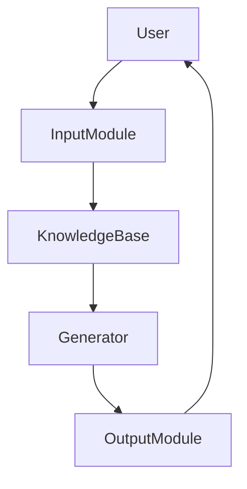

                 


# 金融教育内容生成

> 关键词：金融教育，生成式AI，自然语言处理，NLP，Transformer模型，知识库构建

> 摘要：本文系统地探讨了金融教育内容生成的技术实现，从背景分析到算法原理，从系统设计到项目实战，详细阐述了如何利用生成式AI和NLP技术构建高效、个性化的金融教育内容生成系统。文章内容涵盖金融教育的现状与挑战、生成式AI与NLP的核心原理、模型选择与优化、金融知识库的构建与管理、系统架构设计、项目实现与案例分析，以及最佳实践与小结。

---

# 第一部分: 金融教育内容生成的背景与概述

## 第1章: 金融教育的定义与现状

### 1.1 金融教育的定义与核心要素

#### 1.1.1 金融教育的定义
金融教育是指通过系统化的知识传授和实践训练，帮助学习者掌握金融领域的基本概念、理论、工具和技能。其核心目标是提升公众的金融素养，使人们能够做出明智的财务决策。

#### 1.1.2 金融教育的核心要素
- **知识传递**：包括金融术语、投资原理、风险管理等内容。
- **技能培养**：如财务规划、投资分析、风险管理等。
- **实践应用**：通过案例分析和模拟操作，强化学习者的实践能力。
- **个性化学习**：针对不同背景和需求的学习者，提供定制化的内容。

#### 1.1.3 金融教育的目标与意义
金融教育的目标是提升个人和机构的金融素养，降低金融风险，促进金融市场的健康发展。其意义在于：
- 为个人提供科学的财务管理方法。
- 为企业培养专业的金融人才。
- 为金融机构提供高效的客户教育工具。

---

### 1.2 金融教育的现状与挑战

#### 1.2.1 当前金融教育的主要形式
- **传统课堂教育**：以面授为主，覆盖面有限。
- **在线教育**：通过MOOC平台提供课程，但内容更新较慢。
- **定制化培训**：为企业或机构提供针对性的培训，成本较高。

#### 1.2.2 金融教育面临的主要问题
- **内容更新滞后**：金融市场的变化快，教育内容难以及时更新。
- **个性化不足**：传统教育难以满足不同学习者的需求。
- **互动性弱**：学习者与内容之间缺乏深度互动，学习效果有限。

#### 1.2.3 金融教育的未来发展趋势
- **智能化**：利用AI技术实现个性化学习路径推荐。
- **实时化**：结合金融市场动态，提供实时更新的教育内容。
- **沉浸式**：通过虚拟现实等技术提升学习体验。

---

## 第2章: 生成式AI与NLP技术的背景

### 2.1 生成式AI的基本原理

#### 2.1.1 生成式AI的定义与特点
生成式AI是一种能够自动生成文本、图像、音频等内容的人工智能技术。其特点包括：
- **自动化**：无需人工干预，自动生成内容。
- **多样性**：能够生成多种风格和内容。
- **可定制化**：可以根据需求调整生成内容的风格和主题。

#### 2.1.2 基于Transformer的生成模型
Transformer模型是当前生成式AI的核心技术之一。其主要特点包括：
- **自注意力机制**：能够捕捉文本中的长距离依赖关系。
- **并行计算**：相比循环神经网络（RNN），计算效率更高。

#### 2.1.3 生成式AI在金融领域的应用潜力
- **金融新闻生成**：自动撰写金融新闻稿。
- **投资报告生成**：根据市场数据生成投资分析报告。
- **客户教育内容生成**：为不同客户群体定制个性化的教育内容。

---

### 2.2 自然语言处理（NLP）的基础知识

#### 2.2.1 NLP的核心任务与技术
- **文本分类**：将文本归类到预定义的类别中。
- **实体识别**：识别文本中的命名实体（如人名、地名、公司名）。
- **情感分析**：分析文本中的情感倾向。
- **文本生成**：基于给定的输入生成文本。

#### 2.2.2 金融文本处理的特殊性
金融文本通常具有专业性、复杂性和时效性。处理这类文本需要考虑：
- **专业术语**：金融领域有大量专有名词和术语。
- **数据结构**：金融文本 often包含结构化数据（如财务报表）。
- **时效性**：金融市场变化快，需要快速处理和生成相关内容。

#### 2.2.3 金融NLP的应用场景
- **金融信息提取**：从新闻稿中提取关键信息。
- **风险评估**：通过分析文本判断企业的信用风险。
- **客户服务**：通过聊天机器人提供个性化的金融服务。

---

## 第3章: 金融教育内容生成的可行性分析

### 3.1 金融教育内容生成的必要性

#### 3.1.1 个性化学习需求的增长
随着金融市场的复杂化，学习者对个性化学习的需求日益增长。生成式AI能够根据学习者的背景和需求，定制化生成教学内容。

#### 3.1.2 传统金融教育的局限性
传统金融教育往往采用统一的教学内容，难以满足不同学习者的需求。此外，内容更新速度较慢，难以适应快速变化的金融市场。

#### 3.1.3 生成式AI在金融教育中的优势
- **个性化内容生成**：根据学习者的知识水平和需求，生成适合的学习材料。
- **实时更新**：能够根据最新的市场动态调整教学内容。
- **互动性增强**：通过生成式AI，学习者可以与系统进行深度互动，提升学习体验。

---

### 3.2 金融教育内容生成的关键技术

#### 3.2.1 生成式AI模型的选择
在选择生成式AI模型时，需要考虑以下因素：
- **模型性能**：模型的生成效果和准确性。
- **计算资源**：模型的训练和推理成本。
- **可定制性**：模型是否支持金融领域的微调。

#### 3.2.2 金融知识库的构建
金融知识库是生成式AI的核心资源。其构建步骤包括：
1. **数据收集**：收集金融领域的权威资料，包括书籍、论文、新闻等。
2. **数据清洗**：去除冗余和噪声数据，确保数据质量。
3. **知识抽取**：通过NLP技术提取关键知识点。
4. **知识组织**：将知识点组织成结构化的知识图谱。

#### 3.2.3 生成内容的质量评估
生成内容的质量评估可以从以下方面入手：
- **准确性**：生成内容是否符合金融领域的专业知识。
- **可读性**：生成内容是否清晰易懂。
- **相关性**：生成内容是否与学习者的需求高度相关。

---

# 第二部分: 金融教育内容生成的核心技术

## 第4章: 生成式AI与NLP技术的数学模型

### 4.1 Transformer模型的数学原理

#### 4.1.1 自注意力机制的公式推导
自注意力机制的公式如下：
$$
\text{Attention}(Q, K, V) = \text{softmax}\left(\frac{QK^T}{\sqrt{d_k}}\right)V
$$
其中：
- $Q$、$K$、$V$分别为查询、键、值向量。
- $d_k$为键的维度。

#### 4.1.2 编码器与解码器的结构分析
Transformer模型由编码器和解码器组成。编码器负责将输入序列编码为一个固定长度的向量，解码器则根据编码结果生成输出序列。

#### 4.1.3 多头注意力机制的实现细节
多头注意力机制通过并行处理多个子空间的注意力，提高了模型的表达能力。其实现步骤如下：
1. 将查询、键、值向量分成多个子空间。
2. 在每个子空间内计算自注意力。
3. 将所有子空间的结果拼接起来。

---

### 4.2 生成式AI的损失函数与优化

#### 4.2.1 交叉熵损失函数的定义
交叉熵损失函数用于衡量生成内容与真实内容的差异。其公式为：
$$
\text{Loss} = -\sum_{i=1}^{n} y_i \log(p_i) + (1 - y_i) \log(1 - p_i)
$$
其中：
- $y_i$为真实标签。
- $p_i$为生成概率。

#### 4.2.2 梯度下降优化方法
常用的梯度下降优化方法包括：
- **随机梯度下降（SGD）**：适用于大规模数据训练。
- **Adam优化器**：结合了动量和自适应学习率的优点。

#### 4.2.3 模型训练的收敛条件
模型收敛的条件包括：
- 损失函数值不再显著下降。
- 验证集的生成效果不再提升。

---

### 4.3 生成式AI的数学公式

#### 4.3.1 自注意力机制的公式
$$
\text{Attention}(Q, K, V) = \text{softmax}\left(\frac{QK^T}{\sqrt{d_k}}\right)V
$$

#### 4.3.2 Transformer模型的整体架构
$$
\text{Model}(x) = \text{Decoder}(f_{\text{enc}}(x))
$$

---

## 第5章: 生成式AI模型的选择与优化

### 5.1 常见生成式AI模型对比

#### 5.1.1 GPT系列模型的特点
GPT模型具有强大的生成能力，但训练成本较高。

#### 5.1.2 BERT系列模型的应用
BERT模型主要用于文本理解任务，但在生成任务中表现相对较弱。

#### 5.1.3 其他生成式模型的优缺点
- **T5**：基于编码器-解码器结构，生成效果较好。
- **PaLM**：基于大规模预训练模型，生成能力强大。

---

### 5.2 金融领域微调策略

#### 5.2.1 预训练模型的微调方法
在金融领域进行微调时，需要：
1. 收集金融领域的标注数据。
2. 使用这些数据对预训练模型进行微调。

#### 5.2.2 金融领域数据的特征提取
特征提取的关键在于：
- 提取与金融相关的专业术语。
- 保留数据的时间戳信息。

#### 5.2.3 模型调优的注意事项
- **数据平衡**：确保训练数据中不同类别内容的比例合理。
- **模型评估**：使用准确率、召回率等指标评估模型性能。

---

### 5.3 模型评估与优化

#### 5.3.1 生成内容的质量评估指标
- **BLEU**：基于n-gram的精确度。
- **ROUGE**：基于召回率的评估指标。
- **Human Evaluation**：人工评估生成内容的可读性和准确性。

#### 5.3.2 模型的训练效率优化
- **批量训练**：提高训练效率。
- **学习率调整**：根据训练情况进行动态调整。

#### 5.3.3 模型的可解释性增强
- **注意力权重分析**：通过分析注意力权重，理解模型生成决策的原因。

---

## 第6章: 金融知识库的构建与管理

### 6.1 金融知识库的设计原则

#### 6.1.1 知识库的结构化设计
知识库的设计需要考虑：
- **层次化组织**：将知识点按照层次化结构组织。
- **可扩展性**：方便后续新增知识点。

#### 6.1.2 知识库的存储与检索优化
- **数据库设计**：使用关系型数据库存储知识点。
- **索引优化**：通过建立索引提高检索效率。

#### 6.1.3 知识库的动态更新机制
知识库需要定期更新，以反映金融领域的最新发展。

---

### 6.2 金融知识的标注与处理

#### 6.2.1 知识点的标注规则
- **标准化**：统一术语和定义。
- **结构化**：将知识点分解为可结构化的形式。

#### 6.2.2 知识库的维护流程
- **数据收集**：持续收集新的金融知识。
- **数据清洗**：去除冗余和错误数据。
- **知识更新**：根据最新信息更新知识库。

---

## 第7章: 金融教育内容生成的系统架构设计

### 7.1 问题场景介绍

#### 7.1.1 系统目标
开发一个能够根据输入生成个性化金融教育内容的系统。

#### 7.1.2 系统需求
- **用户输入**：学习者的需求描述。
- **系统输出**：个性化教育内容。

### 7.2 系统功能设计

#### 7.2.1 功能模块
1. **用户输入模块**：接收学习者的需求描述。
2. **知识库查询模块**：从知识库中检索相关知识点。
3. **生成模块**：根据检索结果生成个性化内容。
4. **输出模块**：将生成的内容呈现给用户。

#### 7.2.2 系统功能流程
1. 用户输入需求。
2. 系统查询知识库。
3. 系统生成内容。
4. 系统输出内容。

---

### 7.3 系统架构设计

#### 7.3.1 系统架构图


---

### 7.4 系统接口设计

#### 7.4.1 系统接口说明
- **输入接口**：接收用户需求描述。
- **输出接口**：返回生成的教育内容。

#### 7.4.2 接口交互流程
1. 用户通过输入接口提交需求。
2. 系统查询知识库，生成内容。
3. 系统通过输出接口返回内容。

---

## 第8章: 项目实战

### 8.1 环境安装

#### 8.1.1 安装Python
```bash
python --version
```

#### 8.1.2 安装相关库
```bash
pip install numpy
pip install pandas
pip install transformers
```

---

### 8.2 系统核心实现源代码

#### 8.2.1 知识库构建代码
```python
import pandas as pd
from transformers import AutoTokenizer, AutoModelForMaskedLM

tokenizer = AutoTokenizer.from_pretrained('bert-base-cased')
model = AutoModelForMaskedLM.from_pretrained('bert-base-cased')
```

#### 8.2.2 生成式AI实现代码
```python
def generate_text(prompt):
    inputs = tokenizer.encode_plus(prompt, max_length=512, pad_to_max_length=True, truncation=True)
    input_ids = inputs['input_ids'].to('cuda')
    attention_mask = inputs['attention_mask'].to('cuda')
    outputs = model.generate(input_ids=input_ids, attention_mask=attention_mask, max_length=100)
    return tokenizer.decode(outputs[0], skip_special_tokens=True)
```

---

### 8.3 代码应用解读与分析

#### 8.3.1 知识库构建的解读
- 使用BERT模型对金融知识进行编码和存储。
- 通过分词器处理文本，提取关键知识点。

#### 8.3.2 生成式AI实现的解读
- 使用预训练的BERT模型生成文本。
- 输入提示词，生成与金融相关的教育内容。

---

### 8.4 实际案例分析和详细讲解剖析

#### 8.4.1 案例背景
假设一个学习者希望了解“股票投资的基本原理”。

#### 8.4.2 系统实现
1. 用户输入提示词：“股票投资的基本原理”。
2. 系统从知识库中检索相关知识点。
3. 系统生成个性化的教育内容。

---

### 8.5 项目小结

#### 8.5.1 项目总结
- 成功实现了金融教育内容生成系统。
- 系统能够根据用户需求生成个性化内容。

#### 8.5.2 项目问题
- 知识库的构建需要大量人工标注。
- 模型的生成效果还有待进一步优化。

#### 8.5.3 项目改进方向
- 提高模型的生成效果。
- 优化知识库的管理流程。

---

## 第9章: 最佳实践、小结与拓展阅读

### 9.1 最佳实践

#### 9.1.1 生成式AI的使用建议
- 在金融教育中，生成式AI可以用于个性化内容生成和实时信息更新。
- 使用预训练模型进行微调，以适应金融领域的特殊需求。

#### 9.1.2 知识库管理的注意事项
- 确保知识库的准确性和及时性。
- 定期更新知识库，以反映金融领域的最新发展。

---

### 9.2 小结

本文系统地探讨了金融教育内容生成的技术实现，从背景分析到算法原理，从系统设计到项目实战，详细阐述了如何利用生成式AI和NLP技术构建高效、个性化的金融教育内容生成系统。通过本文的学习，读者可以掌握金融教育内容生成的核心技术，并能够将其应用于实际场景中。

---

### 9.3 注意事项

- 在实际应用中，需要注意生成内容的准确性和可读性。
- 确保系统的安全性，防止恶意输入导致的漏洞。

---

### 9.4 拓展阅读

- **《Deep Learning》**：深入理解深度学习的核心原理。
- **《Natural Language Processing with PyTorch》**：学习如何使用PyTorch进行NLP任务。
- **《金融风险管理》**：了解金融领域的风险管理知识。

---

# 作者：AI天才研究院/AI Genius Institute & 禅与计算机程序设计艺术 /Zen And The Art of Computer Programming

---

这篇文章从背景分析到技术实现，详细阐述了金融教育内容生成的核心技术和应用场景。通过理论与实践相结合的方式，为读者提供了一套完整的解决方案。希望本文能够为金融教育领域的人工智能应用提供有价值的参考。

