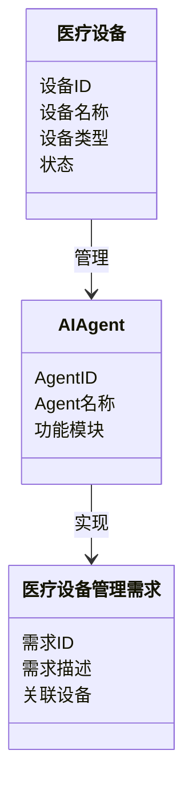
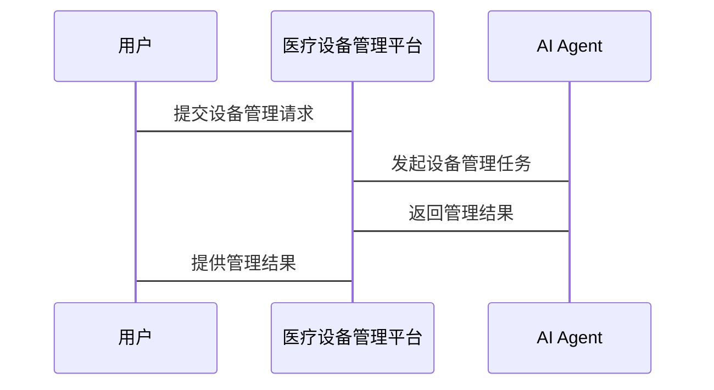

                 


# AI Agent在智能医疗设备管理中的角色

> 关键词：AI Agent, 智能医疗设备, 医疗设备管理, 人工智能, 系统架构设计

> 摘要：随着医疗设备智能化的快速发展，AI Agent（人工智能代理）在智能医疗设备管理中扮演着越来越重要的角色。本文将深入探讨AI Agent在智能医疗设备管理中的核心概念、算法原理、系统架构设计以及实际应用案例。通过分析AI Agent在医疗设备管理中的具体应用场景，揭示其在提高设备管理效率、降低管理成本、提升患者服务质量等方面的重要作用。同时，本文还将结合实际案例，详细阐述AI Agent的实现过程，包括系统功能设计、架构设计、接口设计和交互流程设计。最后，本文将总结AI Agent在智能医疗设备管理中的最佳实践和未来发展方向。

---

## 第1章: 背景介绍

### 1.1 问题背景

#### 1.1.1 智能医疗设备管理的现状与挑战
随着医疗技术的飞速发展，医疗设备的种类和数量不断增加，传统的医疗设备管理模式已经难以满足现代医疗的需求。医疗设备的管理涉及设备的采购、安装、维护、使用和报废等多个环节，传统的管理模式存在以下问题：
- 设备管理效率低下：设备信息分散，缺乏统一的管理平台，导致设备利用率低，维护成本高。
- 数据孤岛问题：医疗设备产生的数据无法有效整合，难以支持医院的决策和患者的服务需求。
- 设备故障响应慢：设备故障无法及时发现和处理，可能导致医疗事故或延误患者治疗。

#### 1.1.2 AI Agent在医疗设备管理中的问题背景
AI Agent（人工智能代理）是一种能够感知环境、自主决策并执行任务的智能体。随着AI技术的快速发展，AI Agent在医疗设备管理中的应用逐渐成为可能。AI Agent可以通过对医疗设备数据的实时分析，实现设备的智能化管理，从而解决传统管理模式中的诸多问题。

#### 1.1.3 问题解决的必要性与紧迫性
医疗设备的智能化管理是现代医疗发展的必然趋势。通过引入AI Agent，可以实现医疗设备的智能化监控、预测性维护和优化管理，从而提高设备利用率、降低管理成本，并为患者提供更优质的医疗服务。AI Agent的应用不仅能够提升医疗设备的管理水平，还能为医院的数字化转型提供强有力的技术支持。

### 1.2 问题描述

#### 1.2.1 医疗设备管理的主要问题
医疗设备管理的主要问题包括：
- 设备信息分散，缺乏统一的管理平台。
- 设备故障无法及时发现和处理。
- 设备数据无法有效整合，难以支持医院的决策和患者服务。
- 设备维护成本高，管理效率低下。

#### 1.2.2 AI Agent在医疗设备管理中的具体问题
AI Agent在医疗设备管理中的具体问题包括：
- 如何实现医疗设备数据的实时采集和分析。
- 如何构建高效的AI算法模型，实现设备的智能化管理。
- 如何设计高效的系统架构，支持AI Agent的运行和扩展。

#### 1.2.3 问题的边界与外延
AI Agent在医疗设备管理中的应用范围包括设备监控、预测性维护、设备调度优化等方面。其边界在于不直接参与医疗设备的实际操作，而是通过数据分析和决策支持，辅助医护人员和设备管理人员完成设备管理任务。其外延则包括与其他医疗系统的集成，如电子病历系统、医院信息管理系统等。

### 1.3 核心概念与联系

#### 1.3.1 AI Agent的核心概念
AI Agent是一种能够感知环境、自主决策并执行任务的智能体。它具有以下核心特征：
- 感知能力：能够感知环境中的信息。
- 决策能力：能够根据感知信息做出决策。
- 执行能力：能够执行决策结果。

#### 1.3.2 AI Agent与医疗设备管理的关系
AI Agent通过与医疗设备的交互，实现设备的智能化管理。具体表现为：
- 实时监控设备状态。
- 分析设备数据，预测设备故障。
- 优化设备调度，提高设备利用率。

#### 1.3.3 AI Agent与其他技术的对比
AI Agent与传统医疗设备管理方式的主要区别在于：
- 管理方式：AI Agent采用智能化管理，而传统管理方式依赖人工操作。
- 数据处理能力：AI Agent能够实时处理海量数据，而传统管理方式数据处理能力有限。
- 决策能力：AI Agent能够自主决策，而传统管理方式依赖人工决策。

### 1.4 本章小结
本章介绍了AI Agent在智能医疗设备管理中的背景，分析了传统医疗设备管理中存在的问题，提出了AI Agent的应用必要性，并探讨了AI Agent的核心概念及其与其他技术的对比。

---

## 第2章: AI Agent的核心概念与原理

### 2.1 核心概念原理

#### 2.1.1 AI Agent的基本原理
AI Agent的基本原理包括：
- 感知：通过传感器或其他数据源获取环境信息。
- 分析：利用机器学习算法对获取的数据进行分析和处理。
- 决策：基于分析结果，生成决策指令。
- 执行：根据决策指令，执行相应的操作。

#### 2.1.2 AI Agent的核心算法
AI Agent的核心算法包括：
- 机器学习算法：如支持向量机（SVM）、随机森林（Random Forest）等。
- 时间序列分析算法：如ARIMA、LSTM等。
- 自然语言处理算法：如BERT、GPT等。

#### 2.1.3 AI Agent的特征与属性
AI Agent的特征包括：
- 智能性：能够自主学习和决策。
- 实时性：能够实时处理数据和响应事件。
- 可扩展性：能够适应不同的设备类型和管理需求。

### 2.2 核心概念对比表格

#### 表2-1: AI Agent与传统医疗设备管理方式的对比

| 对比维度         | AI Agent                   | 传统管理方式               |
|------------------|---------------------------|---------------------------|
| 数据处理能力     | 高效、实时                 | 低效、离线                 |
| 决策能力         | 自主决策                   | 依赖人工                   |
| 管理效率         | 高                         | 低                         |
| 扩展性           | 高                         | 低                         |

### 2.3 ER实体关系图

```mermaid
er
    entity 医疗设备 {
        key 设备ID
        设备名称
        设备类型
        状态
    }
    entity AI Agent {
        key AgentID
        Agent名称
        功能模块
    }
    entity 医疗设备管理需求 {
        需求ID
        需求描述
        关联设备
    }
    医疗设备 --> AI Agent: 管理
    AI Agent --> 医疗设备管理需求: 实现
```

### 2.4 本章小结
本章详细阐述了AI Agent的核心概念与原理，分析了其与传统医疗设备管理方式的对比，并通过ER实体关系图展示了AI Agent在医疗设备管理中的作用。

---

## 第3章: AI Agent的算法原理与实现

### 3.1 算法原理

#### 3.1.1 AI Agent的基本算法
AI Agent的基本算法包括：
- 机器学习算法：用于分类、回归和聚类分析。
- 时间序列分析算法：用于设备状态预测和故障预警。
- 自然语言处理算法：用于处理医疗设备相关的文本数据。

#### 3.1.2 算法实现步骤
AI Agent的算法实现步骤如下：
1. 数据采集：通过传感器或数据库获取医疗设备的相关数据。
2. 数据预处理：对采集的数据进行清洗、归一化等处理。
3. 数据分析：利用机器学习算法对数据进行分析和建模。
4. 决策生成：基于分析结果生成决策指令。
5. 决策执行：根据决策指令执行相应的操作。

#### 3.1.3 算法实现示例
以下是基于机器学习算法的设备故障预测示例代码：

```python
import numpy as np
import pandas as pd
from sklearn.svm import SVC

# 数据加载
data = pd.read_csv('medical_device_data.csv')

# 数据预处理
X = data[['温度', '湿度', '振动']].values
y = data['故障状态'].values

# 模型训练
model = SVC()
model.fit(X, y)

# 模型预测
new_data = np.array([[25, 60, 0.1]])
predicted = model.predict(new_data)
print(predicted)
```

#### 3.1.4 算法原理公式
以下是机器学习算法的核心公式：
$$
y = f(X)
$$
其中，$y$ 是输出结果，$X$ 是输入数据，$f$ 是模型函数。

### 3.2 算法实现细节

#### 3.2.1 机器学习算法的选择
在选择机器学习算法时，需要考虑以下因素：
- 数据类型：分类、回归还是聚类。
- 数据规模：小数据集适合线性回归，大数据集适合深度学习。
- 模型解释性：需要解释性时选择线性模型，不需要时选择复杂模型。

#### 3.2.2 时间序列分析
时间序列分析用于设备状态预测和故障预警。常用的时间序列分析算法包括ARIMA和LSTM。以下是LSTM的实现示例：

```python
import keras
from keras.layers import LSTM, Dense
from keras.models import Sequential

# 数据加载
data = pd.read_csv('medical_device_data.csv')

# 数据预处理
X = data[['温度', '湿度', '振动']].values
y = data['故障状态'].values

# 模型构建
model = Sequential()
model.add(LSTM(64, input_shape=(None, 3)))
model.add(Dense(1))
model.compile(loss='binary_crossentropy', optimizer='adam', metrics=['accuracy'])

# 模型训练
model.fit(X, y, epochs=10, batch_size=32)
```

### 3.3 本章小结
本章详细阐述了AI Agent的算法原理与实现，包括基本算法、实现步骤、代码示例和数学公式。

---

## 第4章: 系统分析与架构设计

### 4.1 问题场景介绍
医疗设备管理系统的应用场景包括医院设备监控、设备故障预警、设备调度优化等。

### 4.2 系统功能设计

#### 4.2.1 领域模型类图
以下是医疗设备管理系统的领域模型类图：



### 4.3 系统架构设计

#### 4.3.1 系统架构图
以下是医疗设备管理系统的架构图：

```mermaid
rect
    医疗设备管理平台
    ├── 数据采集模块
    ├── 数据处理模块
    ├── AI Agent模块
    └── 用户界面模块
```

#### 4.3.2 系统接口设计
系统接口包括：
- 数据采集接口：用于采集医疗设备的实时数据。
- 数据处理接口：用于对数据进行预处理和分析。
- AI Agent接口：用于与医疗设备管理平台进行交互。

### 4.4 系统交互流程

#### 4.4.1 交互流程设计
以下是医疗设备管理平台的交互流程：



### 4.5 本章小结
本章详细分析了医疗设备管理系统的应用场景，并设计了系统的功能模块、架构图和交互流程。

---

## 第5章: 项目实战

### 5.1 项目介绍
本项目旨在开发一个基于AI Agent的医疗设备管理系统，实现设备的智能化管理。

### 5.2 环境安装

#### 5.2.1 开发环境
- Python 3.8+
- Jupyter Notebook
- PyCharm

#### 5.2.2 依赖安装
```bash
pip install numpy pandas scikit-learn keras tensorflow
```

### 5.3 系统核心实现

#### 5.3.1 数据采集模块
```python
import serial
import time

# 串口配置
ser = serial.Serial('COM3', 9600)

while True:
    data = ser.readline().decode()
    print(data)
    time.sleep(1)
```

#### 5.3.2 数据处理模块
```python
import pandas as pd
from sklearn.preprocessing import StandardScaler

# 数据加载
data = pd.read_csv('medical_device_data.csv')

# 数据预处理
scaler = StandardScaler()
X_scaled = scaler.fit_transform(data[['温度', '湿度', '振动']])
```

#### 5.3.3 AI Agent模块
```python
from keras.models import load_model

# 模型加载
model = load_model('device_failure_prediction.h5')

# 模型预测
new_data = pd.DataFrame([[25, 60, 0.1]])
predicted = model.predict(new_data)
print(predicted)
```

### 5.4 代码应用解读与分析
本项目的核心代码包括数据采集、数据处理和AI Agent模块。数据采集模块通过串口获取设备数据，数据处理模块对数据进行标准化处理，AI Agent模块利用预训练的模型进行设备故障预测。

### 5.5 实际案例分析

#### 5.5.1 案例描述
某医院采购了一批智能血压计，需要通过AI Agent实现设备的故障预警和设备调度优化。

#### 5.5.2 数据分析与结果
通过AI Agent模块，系统能够实时监控血压计的运行状态，预测设备故障并提前进行维护，从而避免因设备故障导致的医疗事故。

### 5.6 项目小结
本章通过实际案例详细介绍了AI Agent在医疗设备管理中的应用，展示了系统的实现过程和实际效果。

---

## 第6章: 最佳实践与总结

### 6.1 小结
AI Agent在智能医疗设备管理中的应用具有重要意义。通过AI Agent，医疗设备的管理效率和决策能力得到了显著提升。

### 6.2 注意事项
在实际应用中，需要注意以下几点：
- 数据隐私保护：医疗设备数据涉及患者隐私，需要严格保护。
- 系统稳定性：AI Agent的运行需要高度可靠的系统架构。
- 人机协作：AI Agent应与医护人员协同工作，而不是完全替代人类。

### 6.3 拓展阅读
- 《人工智能在医疗领域的应用》
- 《智能系统架构设计》
- 《时间序列分析与预测》

### 6.4 本章小结
本章总结了AI Agent在智能医疗设备管理中的应用，并提出了实际应用中的注意事项和未来发展方向。

---

## 作者：AI天才研究院/AI Genius Institute & 禅与计算机程序设计艺术 /Zen And The Art of Computer Programming

---

以上是《AI Agent在智能医疗设备管理中的角色》的文章结构和内容。

