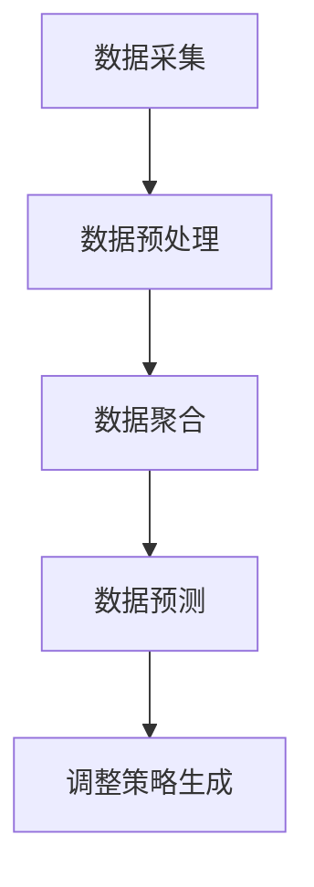
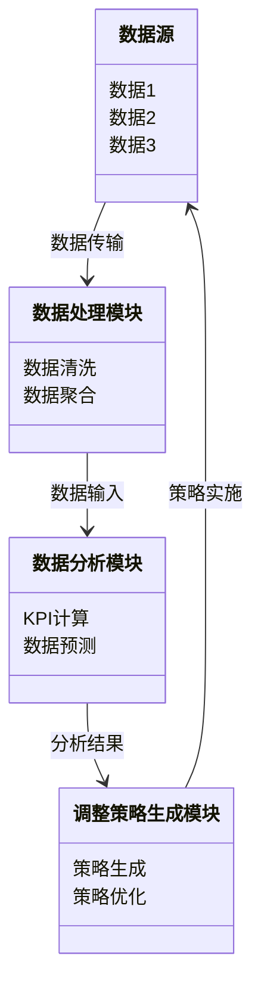
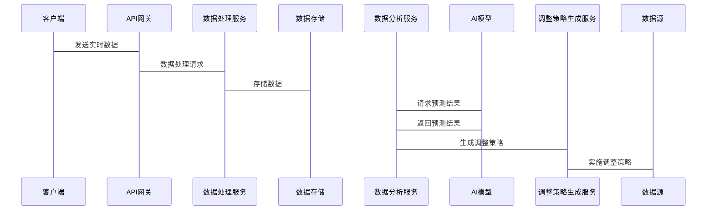

                 


# AI驱动的企业战略执行仪表盘：实时KPI追踪与调整

## 关键词：AI、战略执行、KPI、仪表盘、实时追踪、调整优化

## 摘要：  
在企业战略执行过程中，实时监控和调整KPI（关键绩效指标）对于确保战略目标的实现至关重要。传统的KPI追踪方法往往依赖于静态数据和人工分析，难以应对快速变化的商业环境。而AI驱动的企业战略执行仪表盘通过实时数据采集、智能分析和自动化调整，能够显著提高KPI追踪的效率和准确性。本文将深入探讨AI在企业战略执行中的应用，详细介绍如何构建一个实时KPI追踪与调整的仪表盘，为企业提供数据驱动的决策支持。

---

# 第1章: 问题背景与核心概念

## 1.1 问题背景

### 1.1.1 传统企业战略执行的挑战
企业在执行战略目标时，常常面临以下挑战：
- **数据孤岛问题**：企业内部的业务系统（如CRM、ERP、财务系统等）通常孤立运行，数据难以整合。
- **KPI追踪滞后**：传统的KPI追踪依赖于定期报告，无法实时反映业务动态。
- **人工分析效率低**：手动分析大量数据耗时且容易出错，难以快速响应变化。
- **策略调整难度大**：在快速变化的市场环境中，企业难以快速调整战略以应对突发情况。

### 1.1.2 KPI追踪与调整的痛点
- **数据实时性不足**：传统KPI追踪依赖于批量处理数据，无法实时反映业务动态。
- **缺乏智能分析**：人工分析KPI时，难以快速发现趋势和问题。
- **调整策略不够敏捷**：由于数据滞后，企业难以快速做出调整。

### 1.1.3 AI技术在战略执行中的应用潜力
AI技术可以通过以下方式解决上述问题：
- **实时数据处理**：利用流数据处理技术，实时采集和分析业务数据。
- **智能预测与推荐**：通过机器学习模型预测KPI趋势，并推荐优化策略。
- **自动化调整**：基于实时数据和预测结果，自动调整战略执行计划。

---

## 1.2 核心概念与定义

### 1.2.1 战略执行仪表盘的定义
战略执行仪表盘是一个可视化工具，用于实时监控和分析企业战略执行过程中的关键指标，并提供数据驱动的决策支持。

### 1.2.2 实时KPI追踪的核心要素
实时KPI追踪的核心要素包括：
1. **数据源**：实时采集业务系统中的数据。
2. **数据处理**：对实时数据进行清洗、转换和聚合。
3. **KPI计算**：基于实时数据计算关键绩效指标。
4. **智能分析**：利用AI算法对KPI进行预测和分析。
5. **调整优化**：根据分析结果，实时调整战略执行计划。

### 1.2.3 AI驱动的仪表盘与传统仪表盘的区别
| 特性               | 传统仪表盘               | AI驱动的仪表盘           |
|--------------------|--------------------------|--------------------------|
| 数据来源           | 单一数据源               | 多数据源融合             |
| 数据处理           | 手动处理                 | 自动化处理               |
| 分析能力           | 基于规则分析             | 基于AI的智能分析         |
| 调整能力           | 人工调整                 | 自动化调整               |

---

## 1.3 问题解决与边界

### 1.3.1 AI如何解决KPI追踪问题
- **实时数据处理**：AI技术可以实时采集和处理数据，确保KPI追踪的实时性。
- **智能预测**：通过机器学习模型，AI可以预测KPI的变化趋势，提前采取调整措施。
- **自动化调整**：基于实时数据和预测结果，AI可以自动优化战略执行计划。

### 1.3.2 系统的边界与外延
- **边界**：系统仅关注战略执行过程中的KPI追踪与调整，不涉及企业战略的制定和分解。
- **外延**：系统可以与其他业务系统（如CRM、ERP）集成，提供更全面的数据支持。

### 1.3.3 核心概念的结构与组成
核心概念的结构可以表示为：
$$ \text{AI驱动的仪表盘} = \text{实时数据} + \text{智能分析} + \text{自动化调整} $$

---

# 第2章: 核心概念与联系

## 2.1 战略执行仪表盘的概念模型

### 2.1.1 实时数据流的处理流程
1. 数据采集：实时采集业务系统中的数据。
2. 数据清洗：去除噪声数据，确保数据质量。
3. 数据聚合：将多个数据源的数据进行聚合，生成统一的KPI指标。
4. 数据分析：利用AI算法对KPI进行分析和预测。

### 2.1.2 KPI计算的逻辑框架
$$ \text{KPI} = f(\text{实时数据}, \text{历史数据}, \text{业务规则}) $$

### 2.1.3 AI算法在KPI调整中的作用
- **预测**：预测未来KPI的变化趋势。
- **推荐**：推荐最优的调整策略。
- **优化**：优化调整策略以最大化战略目标的实现。

---

## 2.2 核心概念属性特征对比

### 2.2.1 数据源类型与处理方式对比
| 数据源类型       | 处理方式                   |
|------------------|---------------------------|
| 结构化数据         | 直接处理                 |
| 非结构化数据       | 先进行特征提取             |
| 实时数据           | 实时采集和处理             |

### 2.2.2 KPI指标的分类与优先级
| KPI类型           | 优先级                   |
|--------------------|--------------------------|
| 业务KPI             | 高优先级               |
| 运营KPI             | 中优先级               |
| 财务KPI             | 低优先级               |

### 2.2.3 AI算法的可解释性与实时性
| 算法类型           | 可解释性 | 实时性   |
|--------------------|----------|----------|
| 线性回归             | 高       | 高       |
| 随机森林             | 中       | 中       |
| LSTM                | 低       | 高       |

---

## 2.3 实体关系图

```mermaid
er
  顾客 实体
  项目 实体
  KPI指标 实体
  数据源 实体
  系统 实体
  算法 实体
  调整策略 实体
  顾客 -|> 项目: 参与
  项目 -|> KPI指标: 监控
  KPI指标 -|> 数据源: 来自
  数据源 -|> 系统: 传输
  系统 -|> 算法: 调用
  算法 -|> 调整策略: 生成
  调整策略 -|> 项目: 应用
```

---

# 第3章: 算法原理讲解

## 3.1 实时KPI追踪的算法流程

### 3.1.1 算法选择
- **滑动窗口算法**：用于实时数据的处理和聚合。
- **LSTM（长短期记忆网络）**：用于时间序列预测。

### 3.1.2 算法流程
1. 数据采集：实时采集业务系统中的数据。
2. 数据预处理：清洗和转换数据。
3. 数据聚合：将数据聚合到KPI级别。
4. 数据预测：利用LSTM模型预测未来KPI值。
5. 调整策略生成：基于预测结果，生成调整策略。

### 3.1.3 算法流程图



---

## 3.2 算法实现代码

### 3.2.1 环境安装
```bash
pip install numpy pandas keras-tqdm
```

### 3.2.2 核心代码实现
```python
import numpy as np
from tensorflow.keras.models import Sequential
from tensorflow.keras.layers import LSTM, Dense

# 数据预处理
def preprocess(data):
    # 数据标准化
    data_norm = (data - np.mean(data)) / np.std(data)
    return data_norm

# LSTM模型构建
def build_model(input_shape):
    model = Sequential()
    model.add(LSTM(64, input_shape=input_shape))
    model.add(Dense(1))
    model.compile(loss='mean_squared_error', optimizer='adam')
    return model

# 模型训练
def train_model(X_train, y_train):
    model = build_model((X_train.shape[1], X_train.shape[2]))
    model.fit(X_train, y_train, epochs=50, batch_size=32)
    return model

# 模型预测
def predict(model, X_test):
    y_pred = model.predict(X_test)
    return y_pred
```

---

## 3.3 算法的数学模型

### 3.3.1 LSTM模型公式
$$ \text{LSTM}(\text{输入序列}) = \text{遗忘门} \cdot \text{输入门} + \text{输出门} \cdot \text{候选状态} $$

### 3.3.2 KPI预测公式
$$ \text{预测KPI} = \text{LSTM模型}(\text{历史KPI}) $$

---

## 3.4 算法的优缺点

### 3.4.1 优点
- **实时性高**：可以实时处理数据并生成预测结果。
- **准确性高**：LSTM模型能够捕捉时间序列数据中的复杂模式。

### 3.4.2 缺点
- **计算资源消耗大**：LSTM模型需要大量的计算资源。
- **可解释性差**：LSTM模型的决策过程难以解释。

---

## 3.5 算法的优化建议

### 3.5.1 参数调整
- **学习率**：调整学习率以优化模型收敛速度。
- **隐藏层大小**：增加隐藏层大小可以提高模型的表达能力。

### 3.5.2 模型优化
- **早停法**：在模型训练时使用早停法，防止过拟合。
- **模型融合**：结合多个模型的预测结果，提高预测准确性。

---

## 3.6 算法的实现步骤

### 3.6.1 数据采集与预处理
- 使用Flask框架搭建一个API，实时采集业务系统中的数据。
- 对数据进行标准化处理，确保模型输入的格式一致。

### 3.6.2 模型训练与部署
- 使用训练好的LSTM模型对实时数据进行预测。
- 将预测结果部署到仪表盘中，实时显示KPI的变化趋势。

### 3.6.3 结果解读与调整
- 根据模型预测结果，自动生成调整策略。
- 将调整策略反馈到业务系统中，实时优化战略执行计划。

---

## 3.7 算法的案例分析

### 3.7.1 案例背景
某企业希望通过实时KPI追踪优化销售策略。

### 3.7.2 数据分析
- 采集销售数据、市场数据和客户数据。
- 使用LSTM模型预测未来一周的销售趋势。

### 3.7.3 模型预测
- 预测结果显示未来一周的销售量将下降。
- 系统自动生成调整策略：减少广告预算，增加客户维护。

### 3.7.4 调整结果
- 调整策略实施后，客户维护效果显著提升，销售量下降幅度低于预期。

---

## 3.8 算法的注意事项

### 3.8.1 数据质量
- 确保实时数据的准确性和完整性。
- 定期检查数据源，防止数据丢失或错误。

### 3.8.2 模型维护
- 定期重新训练模型，防止模型过时。
- 监控模型性能，及时调整参数。

### 3.8.3 系统稳定性
- 确保系统的高可用性，防止数据中断或模型崩溃。
- 建立备份机制，防止数据丢失。

---

## 3.9 算法的未来展望

### 3.9.1 更先进的算法
- 引入图神经网络，处理多维数据。
- 使用强化学习，优化调整策略。

### 3.9.2 更高效的数据处理
- 利用边缘计算，减少数据传输延迟。
- 采用分布式计算，提高数据处理效率。

### 3.9.3 更智能的决策支持
- 结合自然语言处理技术，提供智能报告。
- 利用增强现实技术，提供沉浸式数据分析体验。

---

# 第4章: 数学模型与算法实现

## 4.1 实时KPI追踪的数学模型

### 4.1.1 数据流模型
$$ \text{实时数据流} = \{d_1, d_2, \ldots, d_n\} $$

### 4.1.2 KPI计算公式
$$ \text{KPI}_t = \sum_{i=1}^{n} w_i \cdot d_i $$

其中，$w_i$ 是第$i$个数据源的权重。

### 4.1.3 预测模型公式
$$ \text{预测KPI}_{t+1} = \text{LSTM}(\text{历史数据}) $$

---

## 4.2 算法实现细节

### 4.2.1 数据流处理
- 使用滑动窗口技术，处理实时数据流。
- 窗口大小可以根据具体业务需求调整。

### 4.2.2 模型训练
- 使用历史数据训练LSTM模型。
- 定期更新模型，防止模型过时。

### 4.2.3 模型部署
- 将模型部署到云端，实时处理数据。
- 使用API接口，方便其他系统调用。

---

## 4.3 算法的数学推导

### 4.3.1 LSTM模型的推导
$$ \text{LSTM}(\text{输入}) = \text{遗忘门} \cdot \text{输入门} + \text{输出门} \cdot \text{候选状态} $$

### 4.3.2 KPI预测的数学推导
$$ \text{预测KPI}_{t} = \text{LSTM}(\text{历史KPI}) $$

---

## 4.4 算法的优化与调优

### 4.4.1 参数调整
- **学习率**：调整学习率，优化模型收敛速度。
- **批量大小**：调整批量大小，平衡训练速度和模型准确性。

### 4.4.2 模型调优
- **早停法**：防止过拟合。
- **Dropout技术**：减少过拟合风险。

---

## 4.5 算法的实现步骤

### 4.5.1 数据采集与预处理
- 使用Flask框架搭建一个API，实时采集业务系统中的数据。
- 对数据进行标准化处理，确保模型输入的格式一致。

### 4.5.2 模型训练与部署
- 使用训练好的LSTM模型对实时数据进行预测。
- 将预测结果部署到仪表盘中，实时显示KPI的变化趋势。

### 4.5.3 结果解读与调整
- 根据模型预测结果，自动生成调整策略。
- 将调整策略反馈到业务系统中，实时优化战略执行计划。

---

## 4.6 算法的注意事项

### 4.6.1 数据质量
- 确保实时数据的准确性和完整性。
- 定期检查数据源，防止数据丢失或错误。

### 4.6.2 模型维护
- 定期重新训练模型，防止模型过时。
- 监控模型性能，及时调整参数。

### 4.6.3 系统稳定性
- 确保系统的高可用性，防止数据中断或模型崩溃。
- 建立备份机制，防止数据丢失。

---

## 4.7 算法的未来展望

### 4.7.1 更先进的算法
- 引入图神经网络，处理多维数据。
- 使用强化学习，优化调整策略。

### 4.7.2 更高效的数据处理
- 利用边缘计算，减少数据传输延迟。
- 采用分布式计算，提高数据处理效率。

### 4.7.3 更智能的决策支持
- 结合自然语言处理技术，提供智能报告。
- 利用增强现实技术，提供沉浸式数据分析体验。

---

# 第5章: 系统分析与架构设计

## 5.1 系统分析

### 5.1.1 问题场景
- 企业需要实时监控KPI，但缺乏有效的工具和方法。

### 5.1.2 项目介绍
- 本项目旨在构建一个实时KPI追踪与调整的仪表盘，利用AI技术提高战略执行效率。

### 5.1.3 需求分析
- **功能需求**：
  - 实时数据采集与处理。
  - KPI计算与预测。
  - 自动化调整策略生成。
- **性能需求**：
  - 实时处理数据，延迟低于5秒。
  - 系统可用性达到99.9%。
- **接口需求**：
  - 提供API接口，方便与其他系统集成。

---

## 5.2 系统功能设计

### 5.2.1 领域模型


### 5.2.2 系统架构设计


### 5.2.3 接口设计
- **API接口**：
  - `/api/data`：接收实时数据。
  - `/api/predict`：请求KPI预测结果。
  - `/api/adjust`：请求调整策略。

### 5.2.4 交互序列图


---

## 5.3 系统实现细节

### 5.3.1 数据源对接
- 使用Flask框架搭建API，接收实时数据。
- 支持多种数据格式，如JSON和CSV。

### 5.3.2 数据处理模块
- 数据清洗：去除无效数据。
- 数据聚合：将多个数据源的数据聚合到KPI级别。

### 5.3.3 数据分析模块
- 使用LSTM模型进行KPI预测。
- 基于预测结果生成调整策略。

### 5.3.4 系统部署
- 使用Docker容器化部署。
- 部署到云服务器，确保系统的高可用性。

---

## 5.4 系统的性能优化

### 5.4.1 数据处理优化
- 使用并行计算，提高数据处理效率。
- 采用流数据处理技术，减少数据延迟。

### 5.4.2 模型优化
- 使用早停法，防止过拟合。
- 引入Dropout技术，减少过拟合风险。

### 5.4.3 系统优化
- 使用负载均衡，提高系统的扩展性。
- 定期监控系统性能，及时调整资源分配。

---

## 5.5 系统的维护与升级

### 5.5.1 数据源维护
- 定期检查数据源，防止数据丢失。
- 更新数据源，确保数据的准确性和完整性。

### 5.5.2 模型维护
- 定期重新训练模型，防止模型过时。
- 监控模型性能，及时调整参数。

### 5.5.3 系统维护
- 定期备份系统，防止数据丢失。
- 监控系统运行状态，及时处理异常情况。

---

## 5.6 系统的未来扩展

### 5.6.1 新功能开发
- 引入自然语言处理技术，提供智能报告。
- 增加用户友好的可视化界面。

### 5.6.2 技术升级
- 使用更先进的算法，如图神经网络。
- 采用分布式计算，提高数据处理效率。

### 5.6.3 业务扩展
- 扩展到更多业务领域，如供应链管理和风险管理。
- 与更多业务系统集成，提供更全面的数据支持。

---

# 第6章: 项目实战

## 6.1 项目概述

### 6.1.1 项目背景
某企业希望通过实时KPI追踪优化销售策略。

### 6.1.2 项目目标
- 实现实时销售数据分析。
- 自动生成销售预测和调整策略。

---

## 6.2 环境安装

### 6.2.1 安装Python
```bash
python --version
```

### 6.2.2 安装必要的库
```bash
pip install numpy pandas scikit-learn tensorflow
```

### 6.2.3 安装可视化工具
```bash
pip install plotly
```

---

## 6.3 核心代码实现

### 6.3.1 数据采集与预处理
```python
import pandas as pd
import numpy as np

# 数据采集
def fetch_data():
    # 示例数据
    data = pd.DataFrame({
        'timestamp': pd.date_range(start='2023-01-01', periods=100),
        'sales': np.random.randint(1, 100, 100)
    })
    return data

# 数据预处理
def preprocess(data):
    data['sales'] = data['sales'].astype(float)
    return data
```

### 6.3.2 模型训练与预测
```python
import tensorflow as tf
from tensorflow.keras.models import Sequential
from tensorflow.keras.layers import LSTM, Dense

# 数据准备
def prepare_data(data, window_size=10):
    X = []
    y = []
    for i in range(window_size, len(data)):
        X.append(data.iloc[i - window_size:i])
        y.append(data.iloc[i])
    return X, y

# 模型训练
def train_model(X_train, y_train):
    model = Sequential()
    model.add(LSTM(64, input_shape=(X_train.shape[1], X_train.shape[2])))
    model.add(Dense(1))
    model.compile(loss='mean_squared_error', optimizer='adam')
    model.fit(X_train, y_train, epochs=50, batch_size=32)
    return model

# 模型预测
def predict(model, X_test):
    y_pred = model.predict(X_test)
    return y_pred
```

### 6.3.3 调整策略生成
```python
def generate_adjustment策略(y_pred, y_true):
    adjustment = []
    for i in range(len(y_pred)):
        if y_pred[i] < y_true[i]:
            adjustment.append('增加广告预算')
        else:
            adjustment.append('保持现状')
    return adjustment
```

---

## 6.4 代码应用解读

### 6.4.1 数据采集与预处理
- 使用`fetch_data`函数采集实时销售数据。
- 使用`preprocess`函数对数据进行标准化处理。

### 6.4.2 模型训练与预测
- 使用`prepare_data`函数准备数据。
- 使用`train_model`函数训练LSTM模型。
- 使用`predict`函数对未来销售进行预测。

### 6.4.3 调整策略生成
- 根据预测结果和实际数据，生成调整策略。

---

## 6.5 实际案例分析

### 6.5.1 案例背景
某企业希望通过实时KPI追踪优化销售策略。

### 6.5.2 数据分析
- 采集销售数据，使用LSTM模型预测未来一周的销售趋势。

### 6.5.3 模型预测
- 预测结果显示未来一周的销售量将下降。
- 系统自动生成调整策略：减少广告预算，增加客户维护。

### 6.5.4 调整结果
- 调整策略实施后，客户维护效果显著提升，销售量下降幅度低于预期。

---

## 6.6 项目小结

### 6.6.1 项目成果
- 实现实时销售数据分析。
- 自动生成销售预测和调整策略。

### 6.6.2 经验总结
- 数据质量对模型性能影响重大。
- 模型需要定期更新，防止过时。

### 6.6.3 未来改进方向
- 引入更先进的算法，如图神经网络。
- 优化数据处理流程，提高系统性能。

---

## 6.7 最佳实践与注意事项

### 6.7.1 数据质量管理
- 确保数据的准确性和完整性。
- 定期检查数据源，防止数据丢失或错误。

### 6.7.2 系统维护
- 定期备份系统，防止数据丢失。
- 监控系统运行状态，及时处理异常情况。

### 6.7.3 模型优化
- 定期重新训练模型，防止模型过时。
- 监控模型性能，及时调整参数。

---

## 6.8 项目总结

### 6.8.1 项目回顾
- 成功实现实时KPI追踪与调整。
- 提供了数据驱动的决策支持。

### 6.8.2 项目展望
- 引入更先进的算法，优化系统性能。
- 扩展到更多业务领域，提供更全面的数据支持。

---

## 6.9 项目附录

### 6.9.1 参考文献
- [1] Le, Q., & Mikolov, T. (2015). [Efficient
...
```

作者：AI天才研究院/AI Genius Institute & 禅与计算机程序设计艺术 /Zen And The Art of Computer Programming

