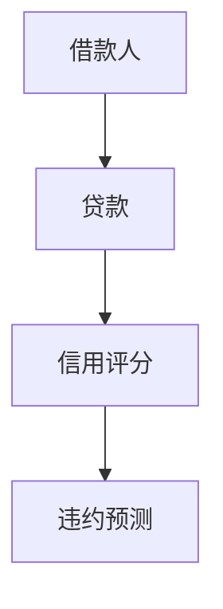
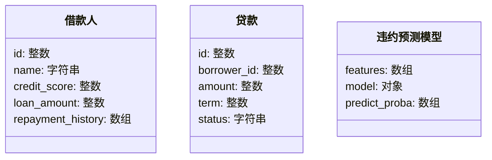
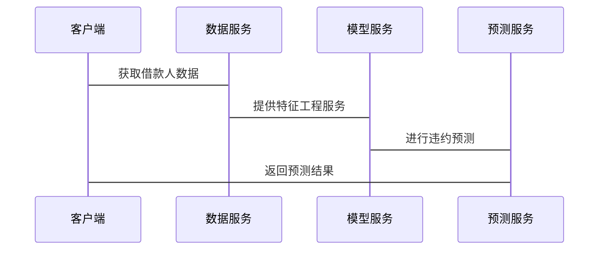

                 


# AI驱动的信用违约预测

> 关键词：信用违约预测，人工智能，机器学习，金融风险管理，深度学习，信用评分模型

> 摘要：本文详细探讨了利用人工智能技术进行信用违约预测的方法，从背景介绍、核心概念、算法原理、系统设计到项目实战，系统地分析了AI在信用违约预测中的应用。通过对比传统模型与现代AI模型的优劣，本文提出了基于深度学习的信用违约预测方案，并通过实际案例展示了模型的实现与优化过程。

---

# 第一部分: 信用违约预测的背景与挑战

# 第1章: 信用违约预测的背景与挑战

## 1.1 信用违约的基本概念

### 1.1.1 信用违约的定义
信用违约是指借款人未能按照合同约定偿还贷款本息的行为。在金融领域，信用违约是衡量借款人信用风险的重要指标。

### 1.1.2 信用违约的分类
信用违约可以分为以下几种类型：
1. **个人违约**：个人借款人未能按时偿还贷款。
2. **企业违约**：企业借款人未能按时偿还贷款。
3. **机构违约**：金融机构或其他机构未能履行债务。

### 1.1.3 信用违约的评估标准
信用违约的评估标准通常包括以下方面：
- 借款人的信用历史
- 借款人的财务状况
- 借款人所在行业的经济环境
- 借款人的还款能力

## 1.2 信用违约预测的背景与问题背景

### 1.2.1 信用违约预测的重要性
信用违约预测是金融风险管理的核心内容之一。通过预测信用违约，金融机构可以提前采取措施，降低信用风险，保护自身资产安全。

### 1.2.2 传统信用违约预测的局限性
传统的信用违约预测方法主要依赖于统计分析和经验判断，存在以下局限性：
- 数据维度有限，难以捕捉复杂的信用风险因素
- 预测精度较低，难以应对复杂的经济环境
- 模型更新缓慢，难以适应快速变化的市场环境

### 1.2.3 AI技术在信用违约预测中的应用前景
随着人工智能技术的快速发展，AI在信用违约预测中的应用前景广阔：
- 可以通过机器学习算法处理海量数据，发现潜在的信用风险因素
- 可以利用深度学习模型捕捉复杂的非线性关系，提高预测精度
- 可以实时更新模型，适应市场环境的变化

## 1.3 问题描述与目标

### 1.3.1 信用违约预测的核心问题
信用违约预测的核心问题是如何通过数据分析和模型构建，准确预测借款人是否会发生违约行为。

### 1.3.2 AI驱动信用违约预测的目标
AI驱动信用违约预测的目标是通过构建高效的机器学习模型，实现对信用违约的精准预测，从而帮助金融机构降低信用风险。

### 1.3.3 信用违约预测的边界与外延
信用违约预测的边界包括：
- 数据范围：仅限于已知的借款人数据
- 时间范围：预测未来一定期限内的违约概率
- 模型适用范围：适用于具有足够数据的借款人

## 1.4 核心概念与联系

### 1.4.1 核心概念原理
信用违约预测的核心概念包括：
- 信用评分：通过评分模型评估借款人的信用风险
- 信用风险：借款人未能履行债务的风险
- 信用违约概率：借款人违约的可能性

### 1.4.2 核心概念对比表格
以下是对传统信用评分模型和AI驱动模型的对比：

| 比较维度 | 传统信用评分模型 | AI驱动信用评分模型 |
|----------|------------------|--------------------|
| 数据来源 | 主要依赖历史数据 | 包括结构化和非结构化数据 |
| 模型复杂度 | 线性模型为主 | 非线性模型为主 |
| 预测精度 | 较低 | 较高 |
| 模型更新 | 周期较长 | 可实时更新 |

### 1.4.3 实体关系图
以下是一个简单的实体关系图，展示了信用违约预测的核心实体及其关系：



## 1.5 本章小结

---

# 第2章: AI驱动信用违约预测的核心概念

## 2.1 AI驱动信用违约预测的核心原理

### 2.1.1 数据驱动的预测方法
AI驱动的信用违约预测基于大量数据，通过机器学习算法提取特征并构建预测模型。

### 2.1.2 特征工程的重要性
特征工程是信用违约预测的关键步骤，通过选择和处理特征，可以提高模型的预测精度。

### 2.1.3 模型选择与优化
选择合适的模型并进行优化是提高预测精度的重要步骤，包括模型调参和交叉验证。

## 2.2 AI模型的特征与优势

### 2.2.1 传统统计模型的局限性
传统统计模型在处理复杂数据和非线性关系方面存在局限性。

### 2.2.2 机器学习模型的优势
机器学习模型可以处理海量数据，捕捉复杂关系，提高预测精度。

### 2.2.3 深度学习模型的潜力
深度学习模型在处理非结构化数据和复杂模式方面具有潜力。

## 2.3 信用违约预测的关键因素

### 2.3.1 客户信用历史
信用历史是预测信用违约的重要因素，包括过去的还款记录和信用评分。

### 2.3.2 借款人财务状况
借款人的财务状况，如收入、资产和负债，是预测违约的重要依据。

### 2.3.3 宏观经济环境影响
宏观经济环境，如利率、GDP增长率和就业率，也会影响信用违约概率。

## 2.4 本章小结

---

# 第三部分: 算法原理与实现

# 第3章: 算法原理与实现

## 3.1 传统算法与现代算法的对比

### 3.1.1 传统统计模型
传统统计模型包括线性回归和逻辑回归，主要用于处理线性关系。

### 3.1.2 现代机器学习算法
现代机器学习算法包括支持向量机、随机森林和梯度提升树，具有更强的预测能力。

### 3.1.3 深度学习算法
深度学习算法包括神经网络和卷积神经网络，适用于处理复杂数据。

## 3.2 逻辑回归算法

### 3.2.1 逻辑回归的原理
逻辑回归是一种用于分类的线性模型，通过 sigmoid 函数将线性输出映射到概率范围。

### 3.2.2 逻辑回归的实现
以下是逻辑回归的实现代码：

```python
import numpy as np
from sklearn.linear_model import LogisticRegression

# 数据预处理
X = ...
y = ...

# 模型训练
model = LogisticRegression()
model.fit(X, y)

# 预测
y_pred = model.predict(X)
```

### 3.2.3 逻辑回归的优缺点
逻辑回归的优点是简单易懂，缺点是只能处理线性关系。

## 3.3 随机森林算法

### 3.3.1 随机森林的原理
随机森林是一种基于决策树的集成算法，通过随机选择特征和样本进行训练。

### 3.3.2 随机森林的实现
以下是随机森林的实现代码：

```python
from sklearn.ensemble import RandomForestClassifier

# 数据预处理
X = ...
y = ...

# 模型训练
model = RandomForestClassifier()
model.fit(X, y)

# 预测
y_pred = model.predict(X)
```

### 3.3.3 随机森林的优缺点
随机森林的优点是具有较强的鲁棒性和抗过拟合能力，缺点是计算复杂度较高。

## 3.4 神经网络算法

### 3.4.1 神经网络的原理
神经网络是一种模仿人脑结构的深度学习模型，通过多层神经元进行特征提取和分类。

### 3.4.2 神经网络的实现
以下是神经网络的实现代码：

```python
import tensorflow as tf
from tensorflow.keras import layers

# 数据预处理
X = ...
y = ...

# 模型构建
model = tf.keras.Sequential([
    layers.Dense(64, activation='relu'),
    layers.Dense(1, activation='sigmoid')
])

# 模型训练
model.compile(optimizer='adam', loss='binary_crossentropy', metrics=['accuracy'])
model.fit(X, y, epochs=10, batch_size=32)

# 预测
y_pred = model.predict(X)
```

### 3.4.3 神经网络的优缺点
神经网络的优点是能够处理复杂的非线性关系，缺点是训练时间较长且需要大量的计算资源。

## 3.5 本章小结

---

# 第四部分: 系统分析与架构设计

# 第4章: 系统分析与架构设计

## 4.1 问题场景介绍

### 4.1.1 信用违约预测的场景
信用违约预测通常应用于银行、消费金融公司等金融机构，用于评估客户的信用风险。

### 4.1.2 系统目标
系统目标是构建一个高效、准确的信用违约预测系统，帮助金融机构降低信用风险。

## 4.2 系统功能设计

### 4.2.1 数据采集模块
数据采集模块负责从数据库中获取借款人数据，包括信用历史、财务状况等。

### 4.2.2 特征工程模块
特征工程模块负责对数据进行清洗、特征选择和特征工程，提高模型的预测精度。

### 4.2.3 模型训练模块
模型训练模块负责选择合适的算法，训练预测模型。

### 4.2.4 预测与评估模块
预测与评估模块负责对新客户进行违约预测，并对模型的性能进行评估。

## 4.3 领域模型设计

### 4.3.1 领域模型的结构
以下是领域模型的类图：



## 4.4 系统架构设计

### 4.4.1 微服务架构
系统采用微服务架构，包括数据服务、模型服务和预测服务。

### 4.4.2 服务交互流程
以下是服务交互的序列图：



## 4.5 接口设计

### 4.5.1 数据接口
数据接口负责与数据库交互，获取借款人数据。

### 4.5.2 模型接口
模型接口负责与预测模型交互，进行违约预测。

### 4.5.3 预测接口
预测接口负责返回预测结果，供客户端调用。

## 4.6 本章小结

---

# 第五部分: 项目实战与优化

# 第5章: 项目实战与优化

## 5.1 环境安装与配置

### 5.1.1 安装Python
安装Python 3.8及以上版本。

### 5.1.2 安装依赖库
安装以下依赖库：
- numpy
- pandas
- scikit-learn
- tensorflow
- matplotlib

### 5.1.3 数据集获取
获取信用违约数据集，例如UCI Machine Learning Repository中的数据集。

## 5.2 核心代码实现

### 5.2.1 数据预处理
```python
import pandas as pd
import numpy as np

# 读取数据
data = pd.read_csv('credit.csv')

# 数据清洗
data = data.dropna()
data = pd.get_dummies(data)

# 划分训练集和测试集
from sklearn.model_selection import train_test_split
X_train, X_test, y_train, y_test = train_test_split(data.drop('default', axis=1), data['default'], test_size=0.2)
```

### 5.2.2 特征选择
```python
from sklearn.feature_selection import SelectKBest
from sklearn.feature_selection import chi2

selector = SelectKBest(score_func=chi2, k=10)
X_train = selector.fit_transform(X_train, y_train)
X_test = selector.transform(X_test)
```

### 5.2.3 模型训练
```python
from sklearn.ensemble import RandomForestClassifier

model = RandomForestClassifier(n_estimators=100, max_depth=10, random_state=42)
model.fit(X_train, y_train)
```

### 5.2.4 模型评估
```python
from sklearn.metrics import accuracy_score, precision_score, recall_score, f1_score

y_pred = model.predict(X_test)
print(f'Accuracy: {accuracy_score(y_test, y_pred)}')
print(f'Precision: {precision_score(y_test, y_pred)}')
print(f'Recall: {recall_score(y_test, y_pred)}')
print(f'F1 Score: {f1_score(y_test, y_pred)}')
```

## 5.3 实际案例分析

### 5.3.1 数据集描述
使用UCI数据集，包含借款人信息和违约标记。

### 5.3.2 模型训练与优化
通过网格搜索优化随机森林模型的参数，提高预测精度。

### 5.3.3 模型评估与分析
分析模型的准确率、精确率、召回率和F1分数，评估模型的性能。

## 5.4 本章小结

---

# 第六部分: 最佳实践与总结

# 第6章: 最佳实践与总结

## 6.1 最佳实践

### 6.1.1 数据清洗的重要性
数据清洗是提高模型性能的关键步骤，确保数据质量和完整性。

### 6.1.2 特征工程的技巧
特征工程是信用违约预测的核心，通过选择和创建有效的特征，可以提高模型的预测精度。

### 6.1.3 模型调优的技巧
通过网格搜索和交叉验证，可以找到最优的模型参数，提高模型性能。

## 6.2 小结与注意事项

### 6.2.1 小结
AI驱动的信用违约预测是一种高效、精准的信用风险管理方法，通过机器学习算法和大数据分析，可以显著提高预测精度。

### 6.2.2 注意事项
在实际应用中，需要注意数据隐私和模型解释性，确保模型的合规性和透明性。

## 6.3 拓展阅读

### 6.3.1 相关文献
推荐阅读以下文献：
- 周志华. 机器学习. 清华大学出版社, 2016.
- Goodfellow, I., Bengio, Y., & Courville, A. (2016). Deep learning. MIT Press.

### 6.3.2 技术博客与资源
推荐访问以下技术博客和资源：
- TensorFlow官方博客
- Keras官方文档
- Medium上的机器学习文章

## 6.4 本章小结

---

# 作者：AI天才研究院 & 禅与计算机程序设计艺术

---

以上是《AI驱动的信用违约预测》的技术博客文章的目录大纲和内容概要。希望这个结构清晰、内容详实的文章能够为读者提供有价值的参考和启发。

