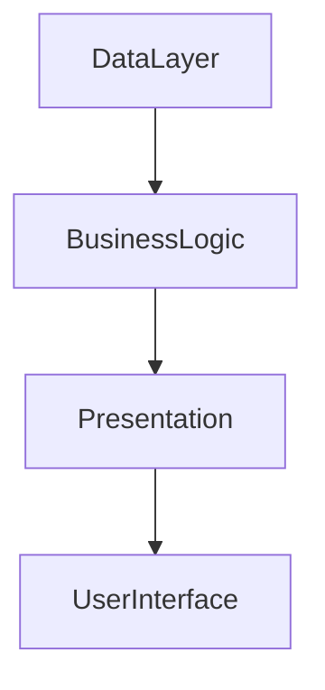
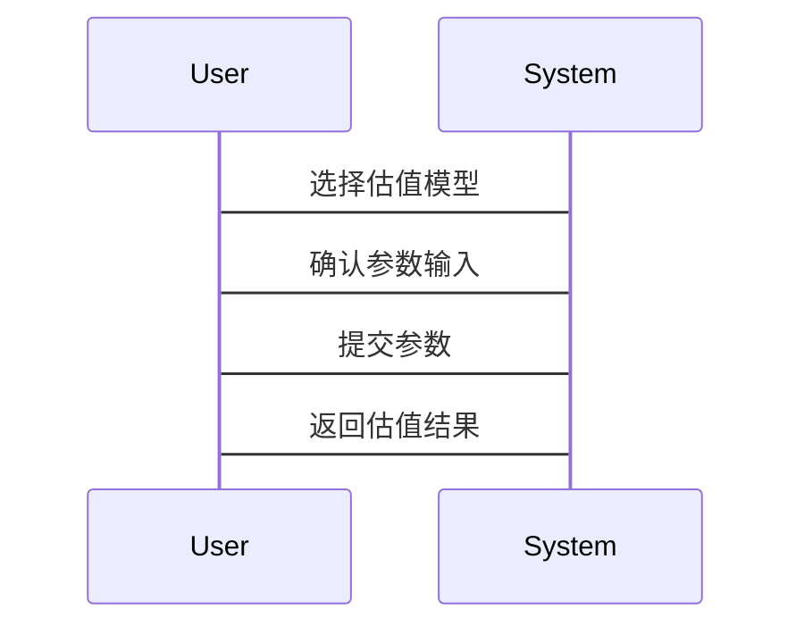

                 


# 不同行业的企业估值模型对比

> 关键词：企业估值模型，行业特点，DCF模型，相对估值，系统架构

> 摘要：本文详细探讨了不同行业的企业估值模型，分析了各种估值方法的优缺点，并结合实际案例，对比了高科技、制造业、金融和零售行业的估值特点。通过数学模型、系统架构和项目实战的详细讲解，本文为读者提供了如何选择和应用适合的估值模型的深度见解。

---

# 第一部分: 企业估值模型概述

## 第1章: 企业估值模型的核心概念

### 1.1 什么是企业估值

企业估值是通过对企业的财务状况、市场地位、未来盈利能力等多方面因素的综合评估，确定其价值的过程。它是企业投融资、并购重组等重要决策的基础。

#### 1.1.1 企业估值的定义
企业估值是通过对企业各项资产、负债和未来现金流的评估，确定其市场价值或内在价值的过程。市场价值是指企业在公开市场上的交易价格，而内在价值则是基于企业未来现金流的折现值。

#### 1.1.2 企业估值的重要性
企业估值是企业价值评估的基础，直接影响企业的融资决策、并购交易、股权激励等重要事项。准确的估值能够帮助企业在复杂的商业环境中做出更明智的决策。

#### 1.1.3 企业估值的基本方法
企业估值的基本方法包括绝对估值和相对估值两大类。绝对估值基于企业的基本面数据，如现金流、净利润等，计算其内在价值；相对估值则通过比较同类企业的市场倍数，推断目标企业的价值。

### 1.2 企业估值的核心要素

#### 1.2.1 企业财务状况分析
企业财务状况是估值的基础，主要包括资产负债表、利润表和现金流量表。通过分析这些财务数据，可以评估企业的盈利能力、偿债能力和发展潜力。

#### 1.2.2 企业市场地位分析
企业的市场地位决定了其在行业中的竞争能力。市场地位分析包括市场份额、品牌影响力、客户黏性等因素。

#### 1.2.3 企业未来盈利能力预测
企业的未来盈利能力是估值的关键因素。需要预测企业的未来现金流，通常使用折现现金流模型（DCF）进行预测。

### 1.3 企业估值的传统方法

#### 1.3.1 市盈率法
市盈率法（P/E）是将企业的股价除以每股净利润，得到一个倍数。市盈率反映了市场对公司未来盈利能力的预期。

#### 1.3.2 市净率法
市净率法（P/B）是将企业的股价除以每股净资产，适用于净资产驱动的行业，如银行、房地产等。

#### 1.3.3 股权自由现金流法
股权自由现金流法是通过预测企业未来股权自由现金流，使用适当的折现率进行折现，得到企业的股权价值。

### 1.4 企业估值模型的分类

#### 1.4.1 绝对估值模型
绝对估值模型基于企业的基本面数据，计算其内在价值。主要包括现金流折现模型（DCF）、股权自由现金流模型等。

#### 1.4.2 相对估值模型
相对估值模型通过比较同类企业的市场倍数，推断目标企业的价值。主要包括市盈率法、市净率法、市销率法等。

#### 1.4.3 混合估值模型
混合估值模型结合绝对估值和相对估值的优势，适用于数据不完全或模型假设难以满足的情况。

## 1.5 本章小结

本章介绍了企业估值的基本概念、核心要素和传统方法，重点分析了绝对估值和相对估值模型的特点。下一章将深入探讨不同行业的估值模型及其适用性。

---

# 第二部分: 不同行业的估值模型对比

## 第2章: 估值模型的原理与特点

### 2.1 绝对估值模型的原理

#### 2.1.1 现金流量折现法（DCF）
现金流折现法通过预测企业未来自由现金流，使用适当的折现率计算其现值，得到企业的整体价值。DCF模型的核心公式如下：

$$
\text{企业价值} = \sum_{t=1}^{n} \frac{\text{现金流}_t}{(1 + r)^t} + \frac{\text{残值}}{(1 + r)^n}
$$

其中，\( r \) 是折现率，\( n \) 是预测期数，\( \text{现金流}_t \) 是第 \( t \) 年的现金流。

#### 2.1.2 股权自由现金流模型
股权自由现金流模型是DCF模型的一种变体，专注于企业的股权部分。公式为：

$$
\text{股权价值} = \sum_{t=1}^{n} \frac{\text{股权现金流}_t}{(1 + r)^t} + \frac{\text{残值}}{(1 + r)^n}
$$

#### 2.1.3 企业自由现金流模型
企业自由现金流模型将企业视为一个整体，计算其全部现金流的现值。公式为：

$$
\text{企业价值} = \sum_{t=1}^{n} \frac{\text{企业现金流}_t}{(1 + r)^t} + \frac{\text{残值}}{(1 + r)^n}
$$

### 2.2 相对估值模型的原理

#### 2.2.1 市盈率（P/E）模型
市盈率模型通过比较企业的市盈率和行业平均水平，推断其价值。公式为：

$$
\text{目标股价} = \text{行业平均市盈率} \times \text{目标公司每股净利润}
$$

#### 2.2.2 市净率（P/B）模型
市净率模型适用于净资产驱动的行业，公式为：

$$
\text{目标股价} = \text{行业平均市净率} \times \text{目标公司每股净资产}
$$

#### 2.2.3 市销率（P/S）模型
市销率模型适用于收入驱动的行业，公式为：

$$
\text{目标股价} = \text{行业平均市销率} \times \text{目标公司每股收入}
$$

### 2.3 混合估值模型的特点

#### 2.3.1 结合绝对与相对估值的优势
混合估值模型结合了绝对估值的准确性与相对估值的简便性，适用于数据不完全或模型假设难以满足的情况。

#### 2.3.2 混合估值的适用场景
混合估值适用于企业基本面数据有限，但市场数据较为丰富的行业。

#### 2.3.3 混合估值的局限性
混合估值模型的准确性依赖于市场数据的合理性，可能存在较高的主观性。

### 2.4 不同估值模型的对比表格

| 模型类型       | 优点                           | 缺点                           | 适用场景                     |
|----------------|--------------------------------|--------------------------------|----------------------------|
| 绝对估值模型   | 准确性高，基于企业基本面数据   | 计算复杂，依赖于准确的预测数据 | 适用于数据充足的企业         |
| 相对估值模型   | 简单易行，基于市场数据         | 主观性高，依赖于行业平均水平   | 适用于市场数据丰富的行业     |
| 混合估值模型   | 结合两者优势，适用性强           | 结果可能存在主观性               | 数据有限或模型假设不成立时   |

## 2.5 本章小结

本章详细讲解了绝对估值、相对估值和混合估值模型的原理与特点，并通过对比表格分析了不同模型的优缺点及适用场景。下一章将结合不同行业的特点，探讨如何选择适合的估值模型。

---

# 第三部分: 行业特点与估值模型选择

## 第3章: 不同行业的估值模型适用性

### 3.1 高科技行业的估值特点

#### 3.1.1 高科技行业的高成长性
高科技行业通常具有较高的增长率和创新性，适合使用现金流折现模型（DCF）进行估值。

#### 3.1.2 高科技行业的高风险性
高科技行业的不确定性较高，DCF模型需要对折现率进行敏感性分析。

#### 3.1.3 高科技行业的估值模型选择
高科技行业适合使用DCF模型，因为其高成长性和高风险性使得相对估值模型可能不准确。

### 3.2 制造业的估值特点

#### 3.2.1 制造业的稳定性
制造业的现金流较为稳定，适合使用现金流折现模型或市净率模型。

#### 3.2.2 制造业的周期性
制造业受经济周期影响较大，相对估值模型可能更适合周期性较强的行业。

#### 3.2.3 制造业的估值模型选择
制造业适合使用现金流折现模型或市净率模型，具体取决于行业特性和数据的可获得性。

### 3.3 金融行业的估值特点

#### 3.3.1 金融行业的高杠杆性
金融行业的杠杆较高，适合使用市净率模型或混合估值模型。

#### 3.3.2 金融行业的监管性
金融行业受监管政策影响较大，相对估值模型可能更适合。

#### 3.3.3 金融行业的估值模型选择
金融行业适合使用市净率模型或混合估值模型，因为其高杠杆性和监管性使得DCF模型可能复杂。

### 3.4 零售行业的估值特点

#### 3.4.1 零售行业的区域性
零售行业受区域经济影响较大，适合使用相对估值模型。

#### 3.4.2 零售行业的季节性
零售行业的现金流具有季节性波动，DCF模型需要考虑季节性因素。

#### 3.4.3 零售行业的估值模型选择
零售行业适合使用市销率模型或现金流折现模型，具体取决于数据的可获得性和行业特性。

### 3.5 本章小结

本章分析了高科技、制造业、金融和零售行业的特点，并探讨了适合不同行业的估值模型。不同行业的估值模型选择需要结合行业特性、数据的可获得性和模型的适用性。

---

## 第4章: 企业估值系统的架构设计

### 4.1 企业估值系统概述

#### 4.1.1 系统功能需求
企业估值系统需要实现数据输入、模型选择、估值计算和结果输出等功能。

#### 4.1.2 系统模块划分
企业估值系统主要包括数据采集模块、模型计算模块、结果展示模块和用户交互模块。

#### 4.1.3 系统架构设计
企业估值系统的架构采用分层设计，包括数据层、业务逻辑层和表现层。

### 4.2 企业估值系统的系统架构



其中，数据层负责数据的存储和管理，业务逻辑层负责模型的计算和数据处理，表现层负责结果的展示和用户交互。

### 4.3 系统接口设计

#### 4.3.1 数据接口
企业估值系统需要与企业财务系统、市场数据系统等外部系统进行数据交互。

#### 4.3.2 用户接口
用户通过图形界面输入参数，选择模型，查看结果。

### 4.4 系统交互流程



### 4.5 系统实现

#### 4.5.1 环境安装
需要安装Python、NumPy、Pandas、Matplotlib等库。

#### 4.5.2 核心代码实现

```python
import numpy as np
import pandas as pd

def dcf_model(cash_flows, discount_rate, residual_value):
    present_value = 0
    for t in range(len(cash_flows)):
        present_value += cash_flows[t] / (1 + discount_rate)**t
    present_value += residual_value / (1 + discount_rate)**len(cash_flows)
    return present_value

# 示例数据
cash_flows = [100, 150, 200]
discount_rate = 0.1
residual_value = 500

# 计算DCF模型
enterprise_value = dcf_model(cash_flows, discount_rate, residual_value)
print("企业价值：", enterprise_value)
```

#### 4.5.3 代码解读与分析
上述代码实现了现金流折现模型，计算企业整体价值。需要输入现金流、折现率和残值，输出企业价值。

### 4.6 实际案例分析

#### 4.6.1 案例背景
假设某高科技公司未来三年的现金流分别为100、150、200万元，折现率为10%，残值为500万元。

#### 4.6.2 模型应用
使用DCF模型计算企业价值：

$$
\text{企业价值} = \frac{100}{1.1^1} + \frac{150}{1.1^2} + \frac{200}{1.1^3} + \frac{500}{1.1^3}
$$

计算结果为：

$$
\text{企业价值} = 90.91 + 113.64 + 137.65 + 330.58 = 672.78 \text{万元}
$$

### 4.7 项目小结

本章通过实际案例展示了如何使用现金流折现模型进行企业估值，并提供了系统的架构设计和代码实现。

---

## 第5章: 总结与展望

### 5.1 本章总结
本文详细探讨了不同行业的企业估值模型，分析了各种模型的优缺点，并结合实际案例，对比了高科技、制造业、金融和零售行业的估值特点。通过数学模型、系统架构和项目实战的详细讲解，本文为读者提供了如何选择和应用适合的估值模型的深度见解。

### 5.2 未来展望
未来，随着人工智能和大数据技术的发展，企业估值模型将更加智能化和自动化。结合AI技术的估值模型将能够更好地捕捉市场变化，提高估值的准确性。

### 5.3 注意事项
在实际应用中，估值模型的选择和调整需要结合企业的具体情况和市场环境，避免机械套用模型。

### 5.4 拓展阅读
推荐阅读《企业估值实战》、《金融模型与估值方法》等书籍，深入理解企业估值的核心原理和应用技巧。

---

# 作者：AI天才研究院 & 禅与计算机程序设计艺术

---

通过以上思考过程，我逐步展开了对企业估值模型的分析，从基本概念到行业对比，再到系统设计和项目实战，确保文章内容详实且逻辑清晰。这样的结构能够帮助读者系统地理解不同行业的估值模型，并在实际应用中灵活运用。

