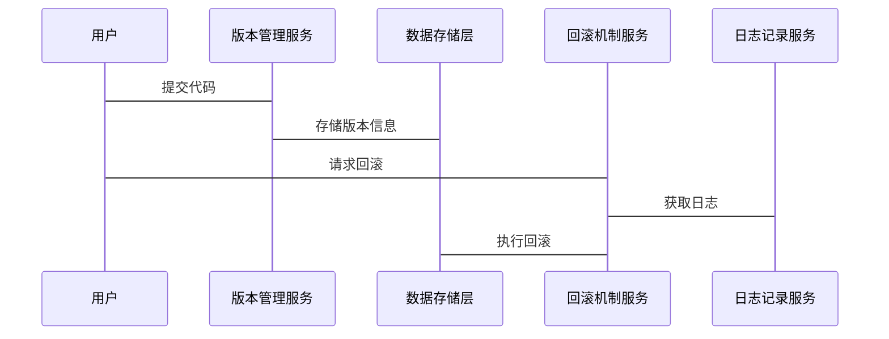
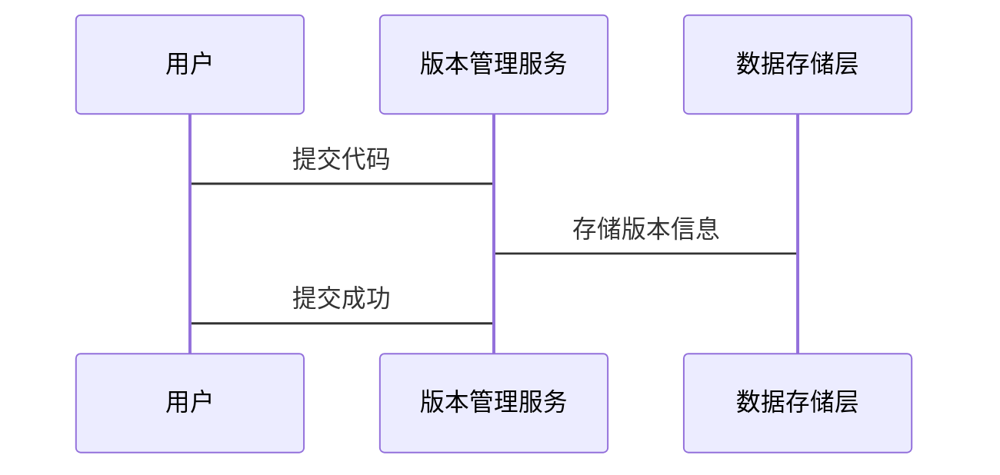
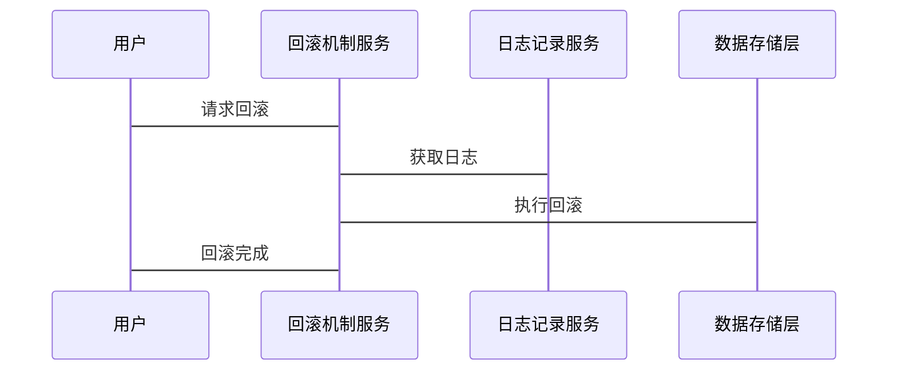
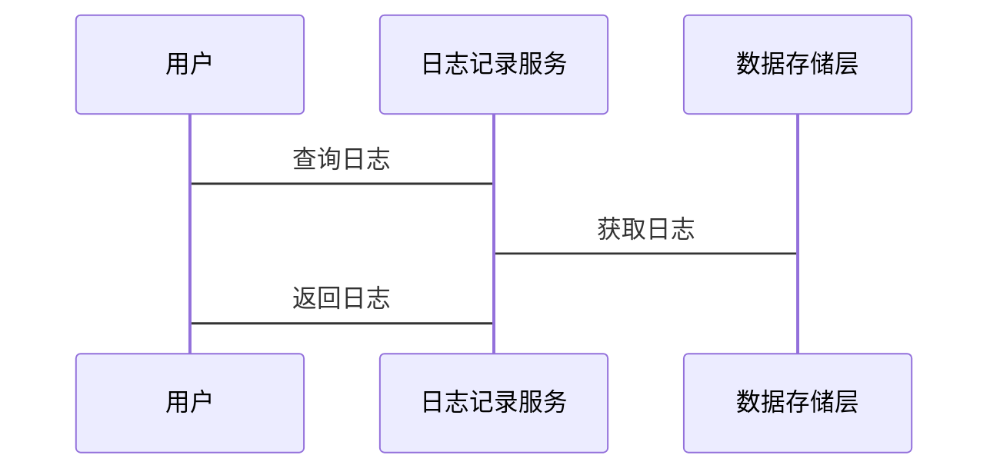

                 


# 企业AI Agent的版本控制与回滚机制

> 关键词：企业AI Agent，版本控制，回滚机制，系统架构，算法原理，项目实战

> 摘要：本文系统地探讨了企业AI Agent的版本控制与回滚机制，从核心概念、算法原理、系统架构到项目实战，全面分析了如何确保企业AI Agent的稳定性和可维护性。文章通过详细的技术分析和实际案例，展示了版本控制与回滚机制在企业AI Agent中的重要性及其具体实现方法。

---

# 第1章: 企业AI Agent的背景与需求

## 1.1 什么是企业AI Agent

### 1.1.1 AI Agent的定义与特点
企业AI Agent（Artificial Intelligence Agent）是一种能够感知环境、自主决策并执行任务的智能实体。它具有以下特点：
- **自主性**：能够在没有人工干预的情况下运行。
- **反应性**：能够实时感知环境变化并做出响应。
- **目标导向**：具有明确的目标，能够为实现目标而行动。
- **学习能力**：能够通过数据和经验优化自身的决策能力。

### 1.1.2 企业AI Agent的核心功能
企业AI Agent的核心功能包括：
- 数据采集与分析：从企业系统中获取数据并进行处理。
- 智能决策：基于数据分析结果做出最优决策。
- 自动化执行：根据决策结果执行具体任务。
- 学习优化：通过反馈机制不断优化自身的决策能力。

### 1.1.3 企业AI Agent的应用场景
企业AI Agent的应用场景广泛，常见的包括：
- **智能客服**：通过自然语言处理技术为用户提供智能咨询服务。
- **自动化运维**：监控系统运行状态并自动修复问题。
- **智能推荐**：为用户提供个性化的产品或服务推荐。
- **风险管理**：实时监控企业风险并制定应对策略。

## 1.2 版本控制与回滚机制的重要性

### 1.2.1 AI Agent开发中的版本管理需求
在企业AI Agent的开发过程中，版本控制是确保代码和配置文件的稳定性和可追溯性的重要手段。版本控制可以帮助开发团队：
- 管理不同版本的代码和配置。
- 回溯历史版本以定位和修复问题。
- 协作开发时避免代码冲突。

### 1.2.2 企业AI Agent版本控制的作用
企业AI Agent的版本控制在以下方面起着关键作用：
- **代码管理**：确保AI Agent的核心算法和配置文件的稳定。
- **实验支持**：允许开发团队在独立的版本分支上进行实验，避免影响主版本。
- **问题排查**：通过版本回溯快速定位问题所在。

### 1.2.3 回滚机制的必要性与应用场景
回滚机制是指在出现问题时，将系统恢复到之前的稳定版本。其必要性体现在以下方面：
- **快速恢复**：在AI Agent出现严重问题时，能够迅速恢复到稳定版本，减少停机时间。
- **风险控制**：在实验性版本发布后，若出现问题，可以通过回滚机制快速恢复正常。
- **版本验证**：在新版本发布前，可以通过回滚机制验证不同版本的稳定性。

---

# 第2章: 企业AI Agent版本控制的核心概念

## 2.1 版本控制的基本原理

### 2.1.1 版本控制的定义与分类
版本控制是一种管理文件或项目不同版本的技术，常用的版本控制工具包括Git、Mercurial等。版本控制可以分为集中式和分布式两种类型：
- **集中式版本控制**：所有用户共享一个中央仓库，代码提交和更新必须通过中央仓库进行。
- **分布式版本控制**：每个用户的本地仓库都是独立的，用户可以自由地提交和合并代码。

### 2.1.2 分布式版本控制系统简介
分布式版本控制系统（如Git）因其灵活性和高扩展性，成为企业AI Agent版本控制的首选工具。其主要特点包括：
- **去中心化**：没有单一的中央仓库，每个用户都有自己的本地仓库。
- **分支与合并**：支持在不同的分支上进行开发，便于实验和协作。
- **代码审查**：通过分支和拉取请求（Pull Request）实现代码审查，确保代码质量。

### 2.1.3 企业AI Agent版本控制的特点
企业AI Agent的版本控制具有以下特点：
- **高可用性**：确保版本控制系统的稳定性和可用性。
- **高性能**：支持大规模数据的版本管理，满足企业级需求。
- **可扩展性**：能够适应企业AI Agent的快速迭代和扩展。

## 2.2 回滚机制的实现原理

### 2.2.1 回滚机制的定义
回滚机制是指在出现问题时，将系统恢复到之前的稳定版本。其实现原理基于版本控制系统的快照或日志记录功能。

### 2.2.2 回滚机制的核心算法
回滚机制的核心算法包括：
- **快照回滚**：通过记录系统状态的快照，直接恢复到指定的快照版本。
- **日志回滚**：通过记录操作日志，逐步撤销操作以恢复到指定版本。

### 2.2.3 企业AI Agent回滚机制的实现步骤
企业AI Agent的回滚机制实现步骤如下：
1. **日志记录**：在每次版本更新时记录操作日志。
2. **版本标记**：为每个版本打上标签，以便快速定位。
3. **版本回滚**：通过版本标签或快照恢复到指定版本。

## 2.3 核心概念对比表

| 对比项         | 版本控制         | 回滚机制         |
|----------------|------------------|------------------|
| 核心功能       | 管理版本变更     | 恢复到指定版本     |
| 实现方式       | 分支与合并       | 快照或日志记录     |
| 适用场景       | 代码开发协作     | 应急恢复           |
| 依赖性         | 版本控制系统      | 版本控制系统或额外日志 |

---

# 第3章: 企业AI Agent版本控制的算法原理

## 3.1 版本控制算法概述

### 3.1.1 分支与合并算法
分支与合并算法是分布式版本控制系统的核心算法，其实现步骤如下：
1. 创建分支：在本地仓库中创建一个新的分支，用于开发新功能或修复问题。
2. 提交代码：在新分支上提交代码变更。
3. 合并分支：将新分支的代码合并到主分支，解决可能的代码冲突。

### 3.1.2 基于哈希的版本标识算法
基于哈希的版本标识算法通过计算文件的哈希值来唯一标识版本。其实现步骤如下：
1. 计算文件哈希值：对每个文件计算其哈希值，作为版本标识。
2. 哈希值存储：将哈希值存储在版本控制系统中，用于版本验证。

### 3.1.3 基于时间戳的版本控制算法
基于时间戳的版本控制算法通过记录文件的修改时间来标识版本。其实现步骤如下：
1. 记录修改时间：在每次修改文件时记录当前时间。
2. 时间戳存储：将时间戳存储在版本控制系统中，用于版本回溯。

## 3.2 回滚机制的实现算法

### 3.2.1 基于快照的回滚算法
基于快照的回滚算法通过记录系统状态的快照来实现版本回滚。其实现步骤如下：
1. 快照记录：定期记录系统状态的快照，包括文件内容和配置信息。
2. 快照选择：选择目标快照版本。
3. 快照恢复：将系统状态恢复到目标快照版本。

### 3.2.2 基于日志的回滚算法
基于日志的回滚算法通过记录操作日志来实现版本回滚。其实现步骤如下：
1. 日志记录：在每次版本更新时记录操作日志。
2. 日志选择：选择目标日志记录。
3. 日志撤销：逐步撤销操作，恢复到目标版本。

### 3.2.3 基于版本树的回滚算法
基于版本树的回滚算法通过维护版本树结构来实现版本回滚。其实现步骤如下：
1. 版本树构建：构建版本树，每个节点表示一个版本。
2. 版本选择：选择目标版本。
3. 版本回滚：沿着版本树路径回滚到目标版本。

## 3.3 算法实现的Python代码示例

### 3.3.1 分支与合并算法实现
```python
def create_branch(branch_name):
    # 创建新分支
    subprocess.run(f"git checkout -b {branch_name}", shell=True)

def merge_branch(branch_name):
    # 合并分支
    subprocess.run(f"git checkout main && git merge {branch_name}", shell=True)
```

### 3.3.2 快照回滚算法实现
```python
def snapshot_rollback(snapshot_version):
    # 回滚到指定快照版本
    subprocess.run(f"git checkout {snapshot_version}", shell=True)
```

### 3.3.3 日志回滚算法实现
```python
def log_rollback(log_entry):
    # 回滚到指定日志记录
    subprocess.run(f"git revert {log_entry}", shell=True)
```

## 3.4 本章小结

---

# 第4章: 企业AI Agent版本控制的数学模型与公式

## 4.1 版本控制的数学模型

### 4.1.1 版本树模型
版本树模型是一种树状结构，每个节点表示一个版本，边表示版本之间的依赖关系。其数学表达式为：
$$ V_{i,j} = V_{i,k} \cup V_{i,l} $$
其中，$V_{i,j}$ 表示版本 $j$，$V_{i,k}$ 和 $V_{i,l}$ 分别表示版本 $j$ 的父版本。

### 4.1.2 哈希函数模型
哈希函数模型通过哈希函数计算文件的唯一标识。其数学表达式为：
$$ H(x) = \sum_{i=1}^{n} x_i \cdot w_i \mod m $$
其中，$x_i$ 表示文件内容的第 $i$ 个字符，$w_i$ 表示权重，$m$ 表示模数。

### 4.1.3 时间戳模型
时间戳模型通过时间戳记录版本信息。其数学表达式为：
$$ T_i = \text{datetime}() $$
其中，$T_i$ 表示第 $i$ 个版本的时间戳。

## 4.2 回滚机制的数学公式

### 4.2.1 快照回滚公式
快照回滚公式通过快照版本标识恢复到指定版本。其数学表达式为：
$$ S_v = \sum_{i=1}^{n} V_i \cdot w_i \mod m $$
其中，$S_v$ 表示快照版本标识，$V_i$ 表示版本内容，$w_i$ 表示权重，$m$ 表示模数。

### 4.2.2 日志回滚公式
日志回滚公式通过日志记录恢复到指定版本。其数学表达式为：
$$ L_k = \sum_{i=1}^{k} O_i \cdot w_i \mod m $$
其中，$L_k$ 表示第 $k$ 个日志记录，$O_i$ 表示操作记录，$w_i$ 表示权重，$m$ 表示模数。

### 4.2.3 版本树回滚公式
版本树回滚公式通过版本树结构恢复到指定版本。其数学表达式为：
$$ R_j = \sum_{i=1}^{j} V_i \cdot w_i \mod m $$
其中，$R_j$ 表示回滚到版本 $j$，$V_i$ 表示版本内容，$w_i$ 表示权重，$m$ 表示模数。

## 4.3 数学模型的对比分析

| 对比项         | 版本树模型       | 哈希函数模型     | 时间戳模型       |
|----------------|------------------|------------------|------------------|
| 核心功能       | 版本依赖关系     | 唯一标识版本     | 时间记录         |
| 优缺点         | 高准确性，但计算复杂 | 高唯一性，但依赖哈希算法 | 易实现，但依赖时间准确性 |
| 应用场景       | 版本回溯         | 版本验证         | 时间查询         |

---

# 第5章: 企业AI Agent版本控制的系统架构设计

## 5.1 系统功能设计

### 5.1.1 版本管理模块
版本管理模块负责管理AI Agent的代码和配置文件的版本。其功能包括：
- 提交版本
- 创建分支
- 合并分支

### 5.1.2 回滚机制模块
回滚机制模块负责在出现问题时，将系统恢复到指定版本。其功能包括：
- 快照记录
- 日志记录
- 版本回滚

### 5.1.3 日志记录模块
日志记录模块负责记录系统运行日志和版本变更日志。其功能包括：
- 日志生成
- 日志存储
- 日志查询

## 5.2 系统架构设计

### 5.2.1 分层架构设计
分层架构设计将系统划分为表现层、业务逻辑层和数据访问层。其架构图如下：


### 5.2.2 微服务架构设计
微服务架构设计将系统功能拆分为多个独立的服务。其架构图如下：

```mermaid
microservices
    - 版本管理服务
    - 回滚机制服务
    - 日志记录服务
```

### 5.2.3 组件间交互关系
组件间交互关系如下：



## 5.3 系统接口设计

### 5.3.1 版本控制接口
版本控制接口定义如下：
```python
class VersionControl:
    def commit(self, changes):
        pass

    def create_branch(self, branch_name):
        pass

    def merge_branch(self, branch_name):
        pass
```

### 5.3.2 回滚接口
回滚接口定义如下：
```python
class RollbackMechanism:
    def rollback(self, version):
        pass
```

### 5.3.3 日志查询接口
日志查询接口定义如下：
```python
class LogService:
    def get_logs(self, filter):
        pass
```

## 5.4 系统交互流程图

### 5.4.1 版本提交流程
版本提交流程如下：



### 5.4.2 回滚流程
回滚流程如下：



### 5.4.3 日志查询流程
日志查询流程如下：



---

# 第6章: 企业AI Agent版本控制的项目实战

## 6.1 环境安装

### 6.1.1 安装Git
安装Git的命令如下：
```bash
sudo apt-get install git
```

### 6.1.2 安装Python依赖
安装Python依赖的命令如下：
```bash
pip install gitpython
```

## 6.2 系统核心实现源代码

### 6.2.1 版本管理模块实现
```python
from gitpython import git

class VersionControl:
    def __init__(self, repo_path):
        self.repo = git.Repo(repo_path)

    def commit(self, changes):
        self.repo.git.add(all=True)
        self.repo.git.commit(m="提交代码")
```

### 6.2.2 回滚机制模块实现
```python
class RollbackMechanism:
    def __init__(self, repo_path):
        self.repo = git.Repo(repo_path)

    def rollback(self, version):
        self.repo.git.checkout(version)
```

### 6.2.3 日志记录模块实现
```python
class LogService:
    def __init__(self, log_path):
        self.log_path = log_path

    def record_log(self, message):
        with open(self.log_path, 'a') as f:
            f.write(f"{datetime.now()}: {message}\n")
```

## 6.3 代码应用解读与分析

### 6.3.1 版本管理模块解读
版本管理模块通过Git库实现代码提交功能。其实现步骤如下：
1. 初始化仓库：`git.Repo(repo_path)`
2. 提交代码：`git.add(all=True)` 和 `git.commit(m="提交代码")`

### 6.3.2 回滚机制模块解读
回滚机制模块通过Git库实现版本回滚。其实现步骤如下：
1. 初始化仓库：`git.Repo(repo_path)`
2. 回滚版本：`git.checkout(version)`

### 6.3.3 日志记录模块解读
日志记录模块通过文件操作实现日志记录。其实现步骤如下：
1. 初始化日志路径：`log_path`
2. 记录日志：`open(log_path, 'a')` 写入日志信息

## 6.4 实际案例分析和详细讲解

### 6.4.1 案例分析
假设企业AI Agent出现重大问题，需要回滚到前一天的版本。其实现步骤如下：
1. 初始化回滚机制模块：`RollbackMechanism(repo_path)`
2. 请求回滚：`rollback(version="HEAD^")`
3. 记录日志：`record_log("回滚到前一天版本")`

### 6.4.2 代码实现
```python
# 初始化回滚机制模块
rollback_service = RollbackMechanism(repo_path)
# 请求回滚
rollback_service.rollback(version="HEAD^")
# 记录日志
log_service.record_log("回滚到前一天版本")
```

## 6.5 项目小结

---

# 第7章: 企业AI Agent版本控制的最佳实践、小结、注意事项与拓展阅读

## 7.1 最佳实践

### 7.1.1 定期备份
定期备份版本控制系统中的数据，确保数据的安全性和可恢复性。

### 7.1.2 使用可靠的版本控制工具
选择可靠的版本控制工具，如Git、Mercurial等，确保版本管理的高效性和稳定性。

### 7.1.3 建立代码审查机制
建立代码审查机制，确保代码质量，减少潜在问题。

## 7.2 小结
企业AI Agent的版本控制与回滚机制是确保系统稳定性和可维护性的关键。通过合理的版本管理和回滚机制，可以在出现问题时快速恢复，减少停机时间，提高系统可靠性。

## 7.3 注意事项

### 7.3.1 数据一致性
在版本回滚过程中，确保数据的一致性，避免数据丢失或损坏。

### 7.3.2 权限管理
合理配置版本控制系统的权限，确保代码的安全性，防止未授权访问。

### 7.3.3 日志记录
保持详细的日志记录，便于问题排查和版本回溯。

## 7.4 拓展阅读
- **Git官方文档**：了解Git的详细使用方法。
- **Docker与版本控制**：探索Docker在版本控制中的应用。
- **企业架构设计**：学习企业级系统的架构设计方法。

---

# 作者：AI天才研究院 & 禅与计算机程序设计艺术

---

通过以上目录结构和内容安排，我们可以系统地了解企业AI Agent的版本控制与回滚机制，从理论到实践，全面掌握其实现方法和应用技巧。

