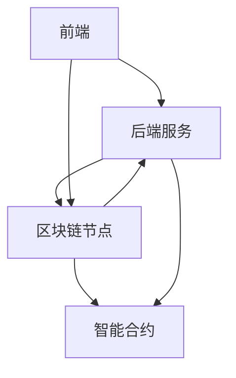

                 


# 《企业估值中的区块链智能合约平台评估》

> 关键词：区块链、智能合约、企业估值、去中心化、透明度

> 摘要：本文探讨了区块链智能合约平台在企业估值中的应用，分析了其核心概念、算法原理、系统架构，并通过实际案例展示了其在提升企业估值效率和准确性方面的优势。

---

# 第1章：企业估值中的区块链智能合约平台背景

## 1.1 企业估值的基本概念与挑战

### 1.1.1 企业估值的定义与重要性
企业估值是确定企业市场价值的过程，涉及对企业资产、负债、收入和利润的全面评估。它是企业融资、并购和投资决策的重要依据。然而，传统的企业估值方法依赖于人工计算和文档审核，容易受到人为错误和信息不透明的影响。

### 1.1.2 传统企业估值方法的局限性
传统方法依赖于复杂的财务模型和假设，可能导致估值偏差。此外，数据来源的多样性和复杂性增加了估值的难度和不确定性。例如，手工计算可能导致错误，数据更新不及时可能导致估值过时。

### 1.1.3 区块链技术对企业估值的潜在影响
区块链技术以其去中心化、不可篡改和透明性特点，为解决企业估值中的数据信任和透明度问题提供了新的可能性。通过区块链，企业估值的数据可以更加透明和准确，减少人为干预，提高估值效率。

## 1.2 区块链技术的核心特点

### 1.2.1 区块链的基本概念与技术原理
区块链是一种分布式账本技术，由多个节点共同维护，确保数据的一致性和不可篡改性。每个区块包含交易记录和时间戳，并通过哈希指针连接成链，形成不可篡改的记录。

### 1.2.2 区块链的去中心化与信任机制
区块链通过去中心化的方式，避免了单点故障和数据篡改的风险。每个节点都可以验证交易的合法性，确保数据的真实性和一致性。这种机制增强了数据的信任度。

### 1.2.3 区块链的透明性与不可篡改性
区块链上的数据对所有参与者公开，确保数据的透明性。同时，由于每个交易都被记录在多个区块中，并通过密码学技术保护，数据无法被篡改，保证了数据的真实性和可靠性。

## 1.3 智能合约的定义与特点

### 1.3.1 智能合约的定义
智能合约是基于区块链的自动执行程序，根据预设的条件自动执行和管理交易。它能够自动验证、执行和记录交易，减少人为干预和成本。

### 1.3.2 智能合约的核心特点
智能合约具有自动执行、不可篡改、去中心化和透明性等特点。它可以自动触发交易，确保合同条款的严格执行，减少违约风险。

### 1.3.3 智能合约与传统合同的区别
智能合约与传统合同的主要区别在于其自动执行和不可篡改性。传统合同需要人工审核和执行，而智能合约可以在区块链上自动执行，确保合同的严格履行。

## 1.4 区块链智能合约平台的潜力与应用前景

### 1.4.1 区块链智能合约平台的潜力
区块链智能合约平台具有广阔的应用潜力，尤其是在需要高度信任和透明度的领域，如金融、法律和企业估值。它可以通过自动化的交易执行和数据记录，提高效率和准确性。

### 1.4.2 区块链智能合约在企业估值中的应用场景
在企业估值中，区块链智能合约可以用于自动执行估值流程、记录企业资产和交易数据，确保数据的准确性和透明性。例如，智能合约可以自动计算企业的资产价值，并记录所有相关的交易和数据变更。

### 1.4.3 区块链智能合约平台的挑战与机遇
尽管区块链智能合约平台具有许多优势，但其推广和应用也面临一些挑战，如技术复杂性、法律合规性和用户接受度等。然而，这些挑战也为技术创新和市场拓展提供了机遇。

## 1.5 本章小结
本章介绍了企业估值的基本概念和挑战，探讨了区块链技术和智能合约的特点及其在企业估值中的潜在应用。区块链智能合约平台通过提供透明、不可篡改和自动化的数据记录和交易执行，为提升企业估值的效率和准确性提供了新的可能性。

---

# 第2章：区块链智能合约平台的核心概念与联系

## 2.1 区块链智能合约平台的原理

### 2.1.1 区块链智能合约的执行机制
智能合约在区块链上运行，通过预设的代码逻辑自动执行交易。当触发条件满足时，智能合约会自动执行相应的操作，并记录在区块链中。

### 2.1.2 智能合约的编译与部署
智能合约需要通过特定的编程语言编写，并经过编译和部署到区块链网络中。部署后的智能合约可以在区块链上被调用和执行。

### 2.1.3 智能合约的调用与执行流程
智能合约的调用通常需要通过交易发起者发送请求，区块链节点验证请求的有效性，并执行相应的智能合约代码。执行结果会被记录在区块链中，确保数据的不可篡改性。

## 2.2 区块链智能合约平台的核心要素

### 2.2.1 区块链网络的节点角色
区块链网络由多个节点组成，每个节点负责验证和传播交易数据。节点可以分为全节点和轻节点，全节点存储完整的区块链数据，轻节点仅参与部分交易的验证。

### 2.2.2 智能合约的代码结构
智能合约通常由函数、变量和事件组成，用于定义交易的逻辑和规则。代码通过区块链平台的虚拟机执行，并与区块链上的数据进行交互。

### 2.2.3 智能合约的存储与执行环境
智能合约存储在区块链上，通常以字节码形式存在，通过区块链的虚拟机执行。每个智能合约都有唯一的地址，并可以被其他合约或外部请求调用。

## 2.3 智能合约平台的属性特征对比

### 2.3.1 智能合约的可编程性
智能合约支持多种编程语言，允许开发者根据需求编写复杂的逻辑代码，实现个性化的交易规则和流程。

### 2.3.2 智能合约的自动执行性
智能合约可以在预设条件下自动执行交易，无需人工干预。这种自动执行能力显著提高了交易的效率和可靠性。

### 2.3.3 智能合约的不可篡改性
一旦智能合约部署到区块链上，其代码和数据无法被篡改。这种不可篡改性确保了交易的公正性和数据的可靠性。

## 2.4 ER实体关系图架构

```mermaid
erDiagram
    actor 用户
    actor 开发者
    actor 节点
    actor 企业
    actor 评估机构
    user 用户 {
        + 用户ID : 整数
        + 用户名 : 字符串
        + 密码 : 字符串
    }
    developer 开发者 {
        + 开发者ID : 整数
        + 开发者名 : 字符串
        + 资格认证 : 字符串
    }
    node 节点 {
        + 节点ID : 整数
        + 节点地址 : 字符串
        + 节点角色 : 字符串
    }
    company 企业 {
        + 企业ID : 整数
        + 企业名称 : 字符串
        + 企业地址 : 字符串
    }
    evaluation机构 评估机构 {
        + 机构ID : 整数
        + 机构名称 : 字符串
        + 认证资质 : 字符串
    }
    用户 -> 用户 : 用户角色
    用户 -> 开发者 : 请求合约开发
    用户 -> 节点 : 发起交易
    开发者 -> 节点 : 部署合约
    节点 -> 节点 : 传播交易
    企业 -> 节点 : 提交数据
    评估机构 -> 节点 : 获取数据
```

## 2.5 本章小结
本章详细介绍了区块链智能合约平台的核心概念和工作原理，探讨了其在企业估值中的应用潜力。通过ER实体关系图，展示了平台中各角色的交互关系和数据流向。

---

# 第3章：区块链智能合约平台的算法原理

## 3.1 区块链智能合约的执行流程

### 3.1.1 智能合约的编译与部署
智能合约需要通过特定的编译器转换为字节码，并部署到区块链网络中。部署过程包括智能合约地址生成和交易发起。

### 3.1.2 智能合约的触发条件
智能合约的执行通常由触发条件决定，如时间、交易金额或特定事件的发生。触发条件可以通过区块链的事件日志记录。

### 3.1.3 智能合约的执行过程
智能合约的执行过程包括函数调用、状态更新和交易确认。每个执行步骤都需要经过区块链节点的验证和确认，确保交易的合法性和一致性。

## 3.2 区块链智能合约的验证机制

### 3.2.1 区块链的共识机制
区块链通过共识机制确保所有节点对交易的一致性达成共识。常见的共识机制包括工作量证明（PoW）、权益证明（PoS）和 delegated proof of stake（DPoS）等。

### 3.2.2 智能合约的验证过程
智能合约的验证包括代码验证和数据验证。代码验证确保智能合约代码的正确性，数据验证确保交易数据的准确性和一致性。

### 3.2.3 智能合约的事件日志
智能合约执行过程中会产生事件日志，记录合约的执行状态和交易结果。这些日志可以被外部系统查询和分析，提供数据支持。

## 3.3 区块链智能合约的数学模型

### 3.3.1 区块链的基本数学模型
区块链的数学模型主要涉及哈希函数、数字签名和椭圆曲线加密等技术。哈希函数用于生成区块的唯一标识，数字签名用于验证交易的合法性。

### 3.3.2 智能合约的数学模型
智能合约的执行过程可以通过状态机模型描述，包括初始状态、中间状态和终止状态。每个状态转移由预设的条件触发，并通过区块链的共识机制确认。

## 3.4 区块链智能合约的代码实现

### 3.4.1 智能合约的编写
智能合约通常使用Solidity等编程语言编写，代码需要经过编译和测试。例如，以下是一个简单的智能合约示例：

```solidity
pragma solidity ^0.8.0;

contract HelloWorld {
    function sayHello() public pure returns (string memory) {
        return "Hello, World!";
    }
}
```

### 3.4.2 智能合约的部署
智能合约需要通过特定的部署交易部署到区块链网络中。部署过程包括智能合约地址生成和交易的广播。

### 3.4.3 智能合约的调用
智能合约可以通过区块链的API进行调用，例如通过以太坊的Web3.js库调用智能合约的函数。调用过程包括参数的传递和交易的发起。

## 3.5 本章小结
本章详细讲解了区块链智能合约平台的算法原理，包括智能合约的执行流程、验证机制和数学模型。通过具体的代码实现，展示了智能合约在实际应用中的实现细节。

---

# 第4章：区块链智能合约平台的系统分析与架构设计

## 4.1 系统场景介绍

### 4.1.1 企业估值的系统场景
企业估值系统需要收集和处理大量的企业数据，包括财务数据、市场数据和交易数据等。通过区块链智能合约平台，可以实现数据的自动记录和处理。

### 4.1.2 区块链智能合约平台的系统场景
区块链智能合约平台由前端、后端、区块链节点和智能合约组成。前端用于用户交互，后端负责业务逻辑处理，区块链节点负责数据的存储和验证，智能合约负责自动执行交易。

## 4.2 系统功能设计

### 4.2.1 系统功能模块
区块链智能合约平台的功能模块包括用户管理、合约管理、交易管理、数据查询和系统设置等。每个模块负责不同的功能，如用户身份验证、智能合约的部署和交易的查询。

### 4.2.2 系统功能流程
用户通过前端提交交易请求，后端接收并处理请求，调用智能合约进行交易执行，区块链节点验证并记录交易。交易结果通过日志和事件通知用户。

## 4.3 系统架构设计

### 4.3.1 系统架构图
以下是一个典型的区块链智能合约平台架构图：



### 4.3.2 系统功能交互
前端用户与后端服务交互，后端服务与区块链节点和智能合约交互。区块链节点负责数据的验证和存储，智能合约负责自动执行交易。

## 4.4 系统接口设计

### 4.4.1 前端接口
前端通过API与后端服务交互，如提交交易请求、查询交易状态等。API设计需要遵循RESTful原则，确保接口的规范性和易用性。

### 4.4.2 后端接口
后端服务通过区块链 SDK与区块链节点交互，如部署智能合约、查询区块链状态等。接口设计需要考虑安全性和效率。

## 4.5 本章小结
本章通过系统场景、功能设计和架构设计，展示了区块链智能合约平台的整体结构和交互流程。通过架构图和功能模块的设计，明确了各部分的职责和交互方式。

---

# 第5章：区块链智能合约平台的项目实战

## 5.1 项目背景与目标

### 5.1.1 项目背景
本项目旨在开发一个基于区块链智能合约的企业估值平台，通过区块链技术提升企业估值的透明度和准确性。

### 5.1.2 项目目标
项目的最终目标是实现一个支持智能合约的企业估值平台，能够自动记录和处理企业的财务数据，提供准确的估值结果。

## 5.2 项目环境搭建

### 5.2.1 环境需求
项目需要安装区块链平台（如以太坊）、智能合约编译工具（如Solidity）和相关开发工具（如Geth、Web3.js）。同时，需要安装开发环境，如Node.js、Python和数据库等。

### 5.2.2 开发工具安装
安装Solidity编译器、以太坊节点客户端（如Geth）和区块链开发框架（如Web3.js）。配置开发环境，确保各工具版本兼容。

## 5.3 系统核心实现

### 5.3.1 智能合约实现
编写智能合约代码，实现企业数据记录和估值计算功能。例如，以下是一个简单的智能合约示例：

```solidity
pragma solidity ^0.8.0;

contract EnterpriseValuation {
    mapping(address => uint) private valuations;

    function setValue(address _address, uint _value) public {
        valuations[_address] = _value;
    }

    function getValue(address _address) public view returns (uint) {
        return valuations[_address];
    }
}
```

### 5.3.2 后端实现
开发后端服务，接收前端请求，调用智能合约进行数据处理。例如，使用以太坊的Web3.js库调用智能合约的函数。

### 5.3.3 前端实现
开发用户界面，允许用户提交企业数据和查询估值结果。前端通过API与后端交互，展示智能合约的执行结果。

## 5.4 项目运行与测试

### 5.4.1 系统测试
通过单元测试、集成测试和回归测试验证系统的功能和性能。确保智能合约的正确执行和数据的准确记录。

### 5.4.2 性能优化
优化系统的性能，提高交易的处理速度和系统的扩展性。例如，通过优化智能合约代码和增加节点的数量。

## 5.5 本章小结
本章通过项目实战展示了区块链智能合约平台的开发过程，包括环境搭建、核心实现和系统测试。通过具体的代码实现和测试案例，验证了系统的功能和性能。

---

# 第6章：区块链智能合约平台的案例分析

## 6.1 案例背景介绍

### 6.1.1 案例背景
本案例选择一家中型企业，通过区块链智能合约平台进行企业估值。目标是通过智能合约自动记录和处理企业的财务数据，提供准确的估值结果。

## 6.2 案例分析

### 6.2.1 项目实施过程
首先，开发智能合约，实现企业数据的记录和估值计算功能。然后，开发后端服务和前端界面，实现用户交互和智能合约的调用。最后，部署系统并进行测试，确保系统的稳定性和可靠性。

### 6.2.2 案例结果
通过区块链智能合约平台，企业估值的效率和准确性得到了显著提升。智能合约自动记录和处理数据，减少了人为错误和数据篡改的风险。

## 6.3 案例总结与经验教训

### 6.3.1 成功经验
区块链智能合约平台的成功实施需要团队的紧密合作和系统的全面测试。智能合约的正确性和系统的安全性是项目成功的关键。

### 6.3.2 经验教训
在项目实施过程中，需要注意智能合约的逻辑复杂性和系统的性能优化。同时，需要充分考虑法律合规性和用户需求，确保系统的实用性和可扩展性。

## 6.4 本章小结
本章通过实际案例展示了区块链智能合约平台在企业估值中的应用，验证了其在提升效率和准确性方面的优势。

---

# 第7章：总结与展望

## 7.1 全文总结

### 7.1.1 核心内容回顾
本文详细探讨了区块链智能合约平台在企业估值中的应用，分析了其核心概念、算法原理和系统架构。通过实际案例展示了其在提升企业估值效率和准确性方面的潜力。

### 7.1.2 本文创新点
本文提出了将区块链智能合约技术应用于企业估值的新思路，通过自动化的数据记录和交易执行，解决了传统估值方法的诸多问题。

## 7.2 未来展望

### 7.2.1 技术创新
未来，区块链技术将更加智能化和自动化。智能合约的执行将更加高效和安全，支持更复杂的交易逻辑和数据处理。

### 7.2.2 行业应用
区块链智能合约平台将在更多行业得到应用，如金融、法律和供应链管理等。企业估值只是其中的一个应用场景，未来将有更多创新和突破。

## 7.3 最佳实践 tips

### 7.3.1 开发者的建议
开发者在设计智能合约时，需要充分考虑逻辑的正确性和代码的安全性。同时，需要熟悉区块链平台的特性，确保智能合约的高效执行和数据的准确记录。

### 7.3.2 用户的建议
企业在选择区块链智能合约平台时，需要充分评估其技术成熟度和实用性。同时，需要制定相应的安全策略和合规方案，确保系统的稳定运行。

## 7.4 本章小结
本章总结了全文的核心内容和创新点，并展望了未来的发展方向。同时，为开发者和用户提供了一些建议和最佳实践。

---

# 作者：AI天才研究院/AI Genius Institute & 禅与计算机程序设计艺术 /Zen And The Art of Computer Programming

---

**注**：本文为技术博客文章，内容基于区块链智能合约平台在企业估值中的应用，旨在为企业和技术人员提供深入的技术分析和实践指导。

