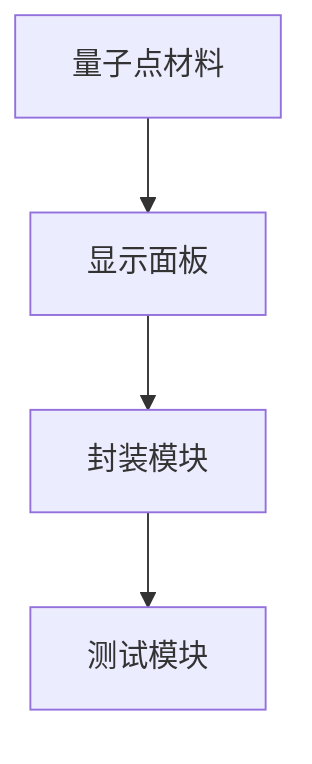
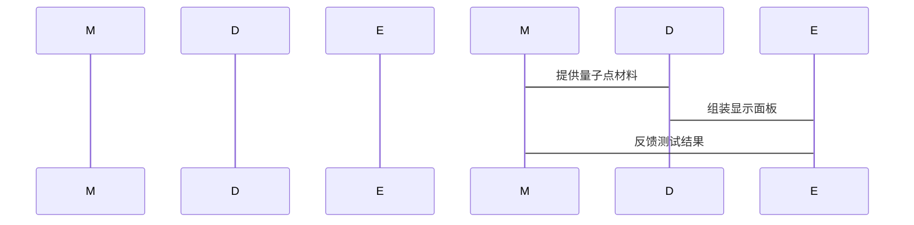

                 


```markdown
# 如何识别企业的量子点显示器制造技术优势

## 关键词：
量子点显示器，制造技术，企业优势，技术分析，市场竞争力

## 摘要：
量子点显示器作为一种新兴的显示技术，凭借其出色的色彩表现和能效优势，正在逐步改变显示行业格局。本文旨在帮助企业识别其量子点显示器制造技术的优势，从技术原理、制造工艺、成本控制和市场定位等方面进行详细分析，为企业制定竞争策略提供参考。

## 第1章: 量子点显示器制造技术概述

### 1.1 量子点技术的发展历程
#### 1.1.1 量子点技术的起源与演变
量子点技术起源于20世纪80年代，最初用于半导体研究。随着纳米技术的发展，量子点材料逐渐应用于显示领域。

#### 1.1.2 量子点技术在显示器领域的应用
量子点技术在显示器中的应用始于2010年代，最初用于背光模块，后来扩展到全彩显示。

#### 1.1.3 量子点显示器的技术优势
- 高色彩饱和度
- 低能耗
- 长寿命

### 1.2 量子点显示器的核心优势
#### 1.2.1 量子点显示技术的特点
- 纳米级材料
- 高色域
- 可调节发光效率

#### 1.2.2 量子点显示器的性能优势
- 超高色彩饱和度
- 低能耗
- 长使用寿命

#### 1.2.3 量子点显示器的市场定位
- 高端显示器市场
- 消费电子领域
- 商业显示应用

### 1.3 量子点显示器的市场现状
#### 1.3.1 全球量子点显示器市场的规模与增长
- 市场规模持续增长，预计年复合增长率超过20%
- 主要驱动力来自高端显示器和商业显示需求

#### 1.3.2 主要厂商的量子点技术布局
- 企业A：专注于量子点材料合成技术
- 企业B：优化制造工艺，降低生产成本
- 企业C：注重市场推广和品牌建设

#### 1.3.3 量子点显示器的技术发展趋势
- 向柔性显示方向发展
- 提高制造效率，降低成本
- 增强色彩表现和显示效果

### 1.4 量子点显示器对企业竞争力的影响
#### 1.4.1 量子点显示器的技术对企业的影响
- 提升产品性能，增强市场竞争力
- 优化生产流程，降低成本

#### 1.4.2 量子点显示器的市场对企业的影响
- 拓展高端市场，提升品牌影响力
- 增强客户满意度，提升市场份额

#### 1.4.3 量子点显示器的未来对企业的影响
- 技术创新驱动企业持续发展
- 市场需求变化对企业战略调整的要求

## 第2章: 量子点显示技术的核心原理

### 2.1 量子点的基本性质
#### 2.1.1 量子点的定义与分类
- 定义：量子点是纳米级半导体材料，按材料分为无机和有机量子点
- 分类：按尺寸分为大、中、小三种

#### 2.1.2 量子点的光电特性
- 发光特性：量子点的发光波长由其尺寸决定
- 耐用性：量子点材料稳定，不易受环境影响

#### 2.1.3 量子点的尺寸效应
- 小尺寸量子点发光效率高
- 大尺寸量子点颜色范围广

### 2.2 量子点显示技术的工作原理
#### 2.2.1 量子点发光机制
- 基本原理：电荷注入量子点，激发发光
- 光学原理：通过量子点材料的光电效应产生彩色光

#### 2.2.2 量子点显示的色彩表现
- 色彩生成：通过不同尺寸的量子点混合产生多种颜色
- 色域广：量子点显示色域超过100% NTSC

#### 2.2.3 量子点显示的效率优化
- 优化量子点材料：减少能量损失
- 提高发光效率：通过改进制造工艺

### 2.3 量子点显示器的制造工艺
#### 2.3.1 量子点材料的制备
- 制备方法：湿化学合成法
- 影响因素：反应条件、浓度和时间

#### 2.3.2 量子点显示器的组装
- 组装流程：量子点材料制备、基板处理、涂布、封装
- 关键步骤：材料合成、涂布均匀性、封装密封性

#### 2.3.3 量子点显示器的封装与测试
- 封装技术：采用先进封装工艺，确保显示效果
- 测试指标：亮度、色彩饱和度、响应时间

## 第3章: 量子点显示器制造技术的优势分析

### 3.1 量子点显示器的技术优势对比
#### 3.1.1 与传统LCD的对比
- 技术对比：量子点显示色彩更饱和，响应时间更快
- 优缺点：量子点显示器成本较高，但性能优越

#### 3.1.2 与OLED的对比
- 技术对比：OLED响应快，但色彩饱和度不如量子点
- 优缺点：OLED存在烧屏问题，而量子点寿命长

#### 3.1.3 与Micro OLED的对比
- 技术对比：Micro OLED分辨率高，但色彩表现受限
- 优缺点：Micro OLED适合小尺寸显示，而量子点适用于大尺寸

### 3.2 量子点显示器的成本优势
#### 3.2.1 量子点材料的成本分析
- 材料成本：量子点材料价格较高，但技术进步降低成本
- 制造成本：优化工艺流程，降低单位产品成本

#### 3.2.2 制造工艺的成本优化
- 工艺改进：提高材料利用率，减少浪费
- 技术创新：研发新型制造技术，降低能耗

#### 3.2.3 供应链的稳定性与成本
- 供应链管理：建立稳定的供应商关系，降低采购成本
- 本地化生产：降低物流和运输成本

### 3.3 量子点显示器的市场优势
#### 3.3.1 高端市场的需求
- 消费者对高色域、高亮度的需求增加
- 企业对高端显示器的需求上升

#### 3.3.2 企业技术布局的影响
- 技术领先企业获得更多的市场份额
- 技术落后企业面临竞争压力

#### 3.3.3 技术创新的驱动作用
- 持续的技术创新推动产品升级
- 技术创新促进市场扩大

## 第4章: 量子点显示器制造技术的系统分析

### 4.1 量子点显示器制造系统的组成
- 系统组成：材料制备、显示器组装、封装测试
- 关键模块：材料合成、涂布工艺、封装技术

### 4.2 系统功能设计
#### 4.2.1 材料制备模块
- 功能：合成高质量量子点材料
- 输入：基础原材料、反应条件
- 输出：量子点材料

#### 4.2.2 显示器组装模块
- 功能：将量子点材料整合到显示面板中
- 输入：量子点材料、基板
- 输出：量子点显示面板

#### 4.2.3 封装测试模块
- 功能：保护显示面板，确保显示效果
- 输入：显示面板
- 输出：封装好的量子点显示器

### 4.3 系统架构设计
#### 4.3.1 系统架构图


#### 4.3.2 关键接口设计
- 材料制备与显示面板的接口：量子点材料的性能参数
- 显示面板与封装模块的接口：面板尺寸和性能指标
- 封装模块与测试模块的接口：测试参数和结果

### 4.4 系统交互设计
#### 4.4.1 系统交互流程


#### 4.4.2 关键交互步骤
- 材料制备模块提供量子点材料给显示器组装模块
- 显示器组装模块将量子点材料整合到基板上
- 封装测试模块对显示面板进行封装和测试
- 测试结果反馈到材料制备模块，优化材料性能

## 第5章: 量子点显示器制造技术的项目实战

### 5.1 项目环境搭建
#### 5.1.1 环境需求
- 实验室环境：材料合成实验室、显示面板组装车间
- 设备需求：量子点合成设备、显示面板组装设备、封装设备

#### 5.1.2 工具安装
- 软件工具：材料制备模拟软件、显示效果测试软件
- 硬件工具：量子点合成设备、显示面板测试设备

### 5.2 核心代码实现
#### 5.2.1 材料制备模块
```python
def quantum_dot_synthesis(reactants, conditions):
    """
    合成量子点材料
    Args:
        reactants (list): 反应物列表
        conditions (dict): 反应条件，包括温度、时间、浓度等
    Returns:
        str: 合成的量子点材料
    """
    # 模拟材料合成过程
    return "quantum_dot_material"

# 示例调用
reactants = ["CdSe", "ZnS"]
conditions = {"temperature": 50, "time": 60}
material = quantum_dot_synthesis(reactants, conditions)
print(material)
```

#### 5.2.2 显示器组装模块
```python
def display_assembly(quantum_dot_material, substrate):
    """
    组装量子点显示面板
    Args:
        quantum_dot_material (str): 量子点材料
        substrate (str): 基板类型
    Returns:
        str: 组装好的显示面板
    """
    # 模拟显示面板组装过程
    return "quantum_dot_display"

# 示例调用
material = "quantum_dot_material"
substrate = "glass"
display = display_assembly(material, substrate)
print(display)
```

#### 5.2.3 封装测试模块
```python
def packaging_and_testing(display_panel):
    """
    封装并测试显示面板
    Args:
        display_panel (str): 显示面板
    Returns:
        dict: 测试结果，包括亮度、色彩饱和度等
    """
    # 模拟封装和测试过程
    return {
        "brightness": 100,
        "color_purity": 95
    }

# 示例调用
display = "quantum_dot_display"
results = packaging_and_testing(display)
print(results)
```

### 5.3 案例分析
#### 5.3.1 成功案例
- 某企业通过优化量子点材料合成工艺，显著降低了生产成本
- 通过改进封装技术，提升了显示面板的寿命和显示效果

#### 5.3.2 案例总结
- 技术创新是降低成本和提升性能的关键
- 系统化的项目管理是成功实施的关键因素

## 第6章: 量子点显示器制造技术的最佳实践

### 6.1 最佳实践 tips
#### 6.1.1 技术研发
- 持续投入研发，保持技术领先
- 加强产学研合作，获取技术支持

#### 6.1.2 生产管理
- 优化生产流程，提高生产效率
- 采用先进的生产管理系统

#### 6.1.3 市场策略
- 瞄准高端市场，提升品牌形象
- 加强市场推广，扩大市场份额

### 6.2 小结
- 量子点显示器制造技术具有显著的技术和市场优势
- 企业需要从技术研发、生产管理、市场策略等多个方面入手，提升竞争力

### 6.3 注意事项
- 技术创新与成本控制需平衡
- 供应链管理至关重要
- 市场需求变化需及时响应

### 6.4 拓展阅读
- 推荐阅读《Quantum Dot Display Technology: Principles and Applications》
- 关注行业期刊《Display Technology Review》

## 作者：AI天才研究院/AI Genius Institute & 禅与计算机程序设计艺术 /Zen And The Art of Computer Programming
```

# 如何识别企业的量子点显示器制造技术优势

---

## 关键词：
量子点显示器，制造技术，企业优势，技术分析，市场竞争力

---

## 摘要：
量子点显示器作为一种新兴的显示技术，凭借其出色的色彩表现和能效优势，正在逐步改变显示行业格局。本文旨在帮助企业识别其量子点显示器制造技术的优势，从技术原理、制造工艺、成本控制和市场定位等方面进行详细分析，为企业制定竞争策略提供参考。

---

## 第1章: 量子点显示器制造技术概述

### 1.1 量子点技术的发展历程
#### 1.1.1 量子点技术的起源与演变
量子点技术起源于20世纪80年代，最初用于半导体研究。随着纳米技术的发展，量子点材料逐渐应用于显示领域。

#### 1.1.2 量子点技术在显示器领域的应用
量子点技术在显示器中的应用始于2010年代，最初用于背光模块，后来扩展到全彩显示。

#### 1.1.3 量子点显示器的技术优势
- 高色彩饱和度
- 低能耗
- 长寿命

### 1.2 量子点显示器的核心优势
#### 1.2.1 量子点显示技术的特点
- 纳米级材料
- 高色域
- 可调节发光效率

#### 1.2.2 量子点显示器的性能优势
- 超高色彩饱和度
- 低能耗
- 长使用寿命

#### 1.2.3 量子点显示器的市场定位
- 高端显示器市场
- 消费电子领域
- 商业显示应用

### 1.3 量子点显示器的市场现状
#### 1.3.1 全球量子点显示器市场的规模与增长
- 市场规模持续增长，预计年复合增长率超过20%
- 主要驱动力来自高端显示器和商业显示需求

#### 1.3.2 主要厂商的量子点技术布局
- 企业A：专注于量子点材料合成技术
- 企业B：优化制造工艺，降低生产成本
- 企业C：注重市场推广和品牌建设

#### 1.3.3 量子点显示器的技术发展趋势
- 向柔性显示方向发展
- 提高制造效率，降低成本
- 增强色彩表现和显示效果

### 1.4 量子点显示器对企业竞争力的影响
#### 1.4.1 量子点显示器的技术对企业的影响
- 提升产品性能，增强市场竞争力
- 优化生产流程，降低成本

#### 1.4.2 量子点显示器的市场对企业的影响
- 拓展高端市场，提升品牌影响力
- 增强客户满意度，提升市场份额

#### 1.4.3 量子点显示器的未来对企业的影响
- 技术创新驱动企业持续发展
- 市场需求变化对企业战略调整的要求

---

## 第2章: 量子点显示技术的核心原理

### 2.1 量子点的基本性质
#### 2.1.1 量子点的定义与分类
- 定义：量子点是纳米级半导体材料，按材料分为无机和有机量子点
- 分类：按尺寸分为大、中、小三种

#### 2.1.2 量子点的光电特性
- 发光特性：量子点的发光波长由其尺寸决定
- 耐用性：量子点材料稳定，不易受环境影响

#### 2.1.3 量子点的尺寸效应
- 小尺寸量子点发光效率高
- 大尺寸量子点颜色范围广

### 2.2 量子点显示技术的工作原理
#### 2.2.1 量子点发光机制
- 基本原理：电荷注入量子点，激发发光
- 光学原理：通过量子点材料的光电效应产生彩色光

#### 2.2.2 量子点显示的色彩表现
- 色彩生成：通过不同尺寸的量子点混合产生多种颜色
- 色域广：量子点显示色域超过100% NTSC

#### 2.2.3 量子点显示的效率优化
- 优化量子点材料：减少能量损失
- 提高发光效率：通过改进制造工艺

### 2.3 量子点显示器的制造工艺
#### 2.3.1 量子点材料的制备
- 制备方法：湿化学合成法
- 影响因素：反应条件、浓度和时间

#### 2.3.2 量子点显示器的组装
- 组装流程：量子点材料制备、基板处理、涂布、封装
- 关键步骤：材料合成、涂布均匀性、封装密封性

#### 2.3.3 量子点显示器的封装与测试
- 封装技术：采用先进封装工艺，确保显示效果
- 测试指标：亮度、色彩饱和度、响应时间

---

## 第3章: 量子点显示器制造技术的优势分析

### 3.1 量子点显示器的技术优势对比
#### 3.1.1 与传统LCD的对比
- 技术对比：量子点显示色彩更饱和，响应时间更快
- 优缺点：量子点显示器成本较高，但性能优越

#### 3.1.2 与OLED的对比
- 技术对比：OLED响应快，但色彩饱和度不如量子点
- 优缺点：OLED存在烧屏问题，而量子点寿命长

#### 3.1.3 与Micro OLED的对比
- 技术对比：Micro OLED分辨率高，但色彩表现受限
- 优缺点：Micro OLED适合小尺寸显示，而量子点适用于大尺寸

### 3.2 量子点显示器的成本优势
#### 3.2.1 量子点材料的成本分析
- 材料成本：量子点材料价格较高，但技术进步降低成本
- 制造成本：优化工艺流程，降低单位产品成本

#### 3.2.2 制造工艺的成本优化
- 工艺改进：提高材料利用率，减少浪费
- 技术创新：研发新型制造技术，降低能耗

#### 3.2.3 供应链的稳定性与成本
- 供应链管理：建立稳定的供应商关系，降低采购成本
- 本地化生产：降低物流和运输成本

### 3.3 量子点显示器的市场优势
#### 3.3.1 高端市场的需求
- 消费者对高色域、高亮度的需求增加
- 企业对高端显示器的需求上升

#### 3.3.2 企业技术布局的影响
- 技术领先企业获得更多的市场份额
- 技术落后企业面临竞争压力

#### 3.3.3 技术创新的驱动作用
- 持续的技术创新推动产品升级
- 技术创新促进市场扩大

---

## 第4章: 量子点显示器制造技术的系统分析

### 4.1 量子点显示器制造系统的组成
- 系统组成：材料制备、显示器组装、封装测试
- 关键模块：材料合成、涂布工艺、封装技术

### 4.2 系统功能设计
#### 4.2.1 材料制备模块
- 功能：合成高质量量子点材料
- 输入：基础原材料、反应条件
- 输出：量子点材料

#### 4.2.2 显示器组装模块
- 功能：将量子点材料整合到显示面板中
- 输入：量子点材料、基板
- 输出：量子点显示面板

#### 4.2.3 封装测试模块
- 功能：保护显示面板，确保显示效果
- 输入：显示面板
- 输出：封装好的量子点显示器

### 4.3 系统架构设计
#### 4.3.1 系统架构图


#### 4.3.2 关键接口设计
- 材料制备与显示面板的接口：量子点材料的性能参数
- 显示面板与封装模块的接口：面板尺寸和性能指标
- 封装模块与测试模块的接口：测试参数和结果

### 4.4 系统交互设计
#### 4.4.1 系统交互流程


#### 4.4.2 关键交互步骤
- 材料制备模块提供量子点材料给显示器组装模块
- 显示器组装模块将量子点材料整合到基板上
- 封装测试模块对显示面板进行封装和测试
- 测试结果反馈到材料制备模块，优化材料性能

---

## 第5章: 量子点显示器制造技术的项目实战

### 5.1 项目环境搭建
#### 5.1.1 环境需求
- 实验室环境：材料合成实验室、显示面板组装车间
- 设备需求：量子点合成设备、显示面板组装设备、封装设备

#### 5.1.2 工具安装
- 软件工具：材料制备模拟软件、显示效果测试软件
- 硬件工具：量子点合成设备、显示面板测试设备

### 5.2 核心代码实现
#### 5.2.1 材料制备模块
```python
def quantum_dot_synthesis(reactants, conditions):
    """
    合成量子点材料
    Args:
        reactants (list): 反应物列表
        conditions (dict): 反应条件，包括温度、时间、浓度等
    Returns:
        str: 合成的量子点材料
    """
    # 模拟材料合成过程
    return "quantum_dot_material"

# 示例调用
reactants = ["CdSe", "ZnS"]
conditions = {"temperature": 50, "time": 60}
material = quantum_dot_synthesis(reactants, conditions)
print(material)
```

#### 5.2.2 显示器组装模块
```python
def display_assembly(quantum_dot_material, substrate):
    """
    组装量子点显示面板
    Args:
        quantum_dot_material (str): 量子点材料
        substrate (str): 基板类型
    Returns:
        str: 组装好的显示面板
    """
    # 模拟显示面板组装过程
    return "quantum_dot_display"

# 示例调用
material = "quantum_dot_material"
substrate = "glass"
display = display_assembly(material, substrate)
print(display)
```

#### 5.2.3 封装测试模块
```python
def packaging_and_testing(display_panel):
    """
    封装并测试显示面板
    Args:
        display_panel (str): 显示面板
    Returns:
        dict: 测试结果，包括亮度、色彩饱和度等
    """
    # 模拟封装和测试过程
    return {
        "brightness": 100,
        "color_purity": 95
    }

# 示例调用
display = "quantum_dot_display"
results = packaging_and_testing(display)
print(results)
```

### 5.3 案例分析
#### 5.3.1 成功案例
- 某企业通过优化量子点材料合成工艺，显著降低了生产成本
- 通过改进封装技术，提升了显示面板的寿命和显示效果

#### 5.3.2 案例总结
- 技术创新是降低成本和提升性能的关键
- 系统化的项目管理是成功实施的关键因素

---

## 第6章: 量子点显示器制造技术的最佳实践

### 6.1 最佳实践 tips
#### 6.1.1 技术研发
- 持续投入研发，保持技术领先
- 加强产学研合作，获取技术支持

#### 6.1.2 生产管理
- 优化生产流程，提高生产效率
- 采用先进的生产管理系统

#### 6.1.3 市场策略
- 瞄准高端市场，提升品牌形象
- 加强市场推广，扩大市场份额

### 6.2 小结
- 量子点显示器制造技术具有显著的技术和市场优势
- 企业需要从技术研发、生产管理、市场策略等多个方面入手，提升竞争力

### 6.3 注意事项
- 技术创新与成本控制需平衡
- 供应链管理至关重要
- 市场需求变化需及时响应

### 6.4 拓展阅读
- 推荐阅读《Quantum Dot Display Technology: Principles and Applications》
- 关注行业期刊《Display Technology Review》

---

## 作者：AI天才研究院/AI Genius Institute & 禅与计算机程序设计艺术 /Zen And The Art of Computer Programming
```

