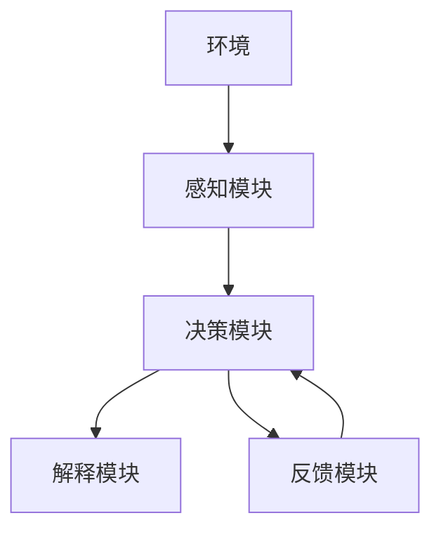
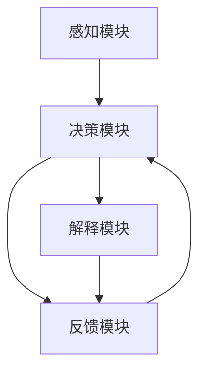
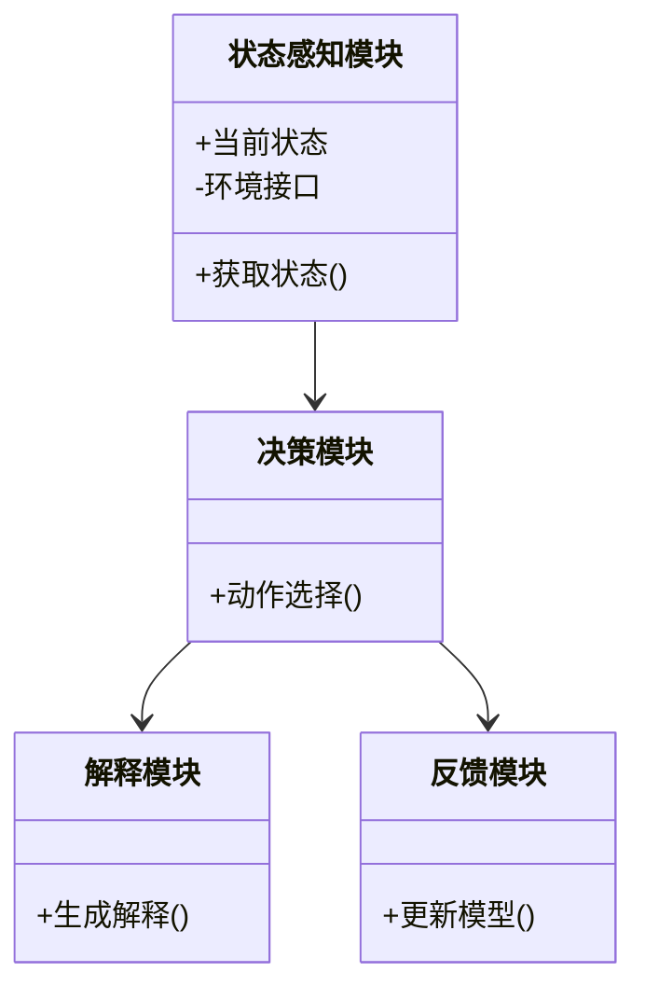

                 


# 构建AI Agent的可解释性强化学习模型

> 关键词：AI Agent，强化学习，可解释性，模型构建，算法设计

> 摘要：本文深入探讨了构建具有可解释性的AI Agent强化学习模型的关键技术和方法。从强化学习和可解释性AI的背景出发，详细分析了可解释性强化学习的核心概念、算法原理、系统架构设计，以及实际项目中的实现与应用。通过具体案例分析，展示了如何在实际场景中设计和实现可解释性强化学习模型，为AI Agent的开发提供了理论基础和实践指导。

---

# 第1章: 强化学习与可解释性AI的背景

## 1.1 强化学习的背景与概念

### 1.1.1 从监督学习到强化学习的演进

在人工智能领域，监督学习通过大量标注数据进行训练，但在处理动态环境和复杂决策问题时显得力不从心。强化学习（Reinforcement Learning，RL）作为一种基于试错的学习方法，逐渐成为解决这类问题的主流技术。强化学习通过智能体与环境的交互，逐步优化策略，实现目标。

### 1.1.2 强化学习的核心概念与特点

强化学习的核心概念包括：
- **状态（State）**：环境在某一时刻的观测。
- **动作（Action）**：智能体在给定状态下选择的操作。
- **奖励（Reward）**：智能体在环境中执行动作后获得的反馈，用于评估动作的好坏。
- **策略（Policy）**：智能体选择动作的规则，可以是确定性的（策略网络）或概率性的（策略网络）。
- **价值函数（Value Function）**：评估在特定状态下采取某种动作后的期望回报。

强化学习的特点包括：
- **在线学习**：智能体通过与环境的实时交互进行学习。
- **延迟反馈**：奖励通常在多个动作之后才给出，增加了学习的难度。
- **探索与利用**：智能体需要在探索新策略和利用已知策略之间找到平衡。

### 1.1.3 强化学习在AI Agent中的应用

AI Agent（智能体）通过强化学习可以在动态环境中自主决策，例如游戏AI、自动驾驶、机器人控制等领域。强化学习赋予智能体从经验中学习的能力，使其能够适应复杂多变的环境。

---

## 1.2 可解释性AI的背景与重要性

### 1.2.1 可解释性AI的定义与特点

可解释性AI（Explainable AI，XAI）是指AI系统在做出决策时，能够提供清晰、可理解的解释，使人类能够理解其决策过程。可解释性AI的特点包括：
- **透明性**：用户可以理解AI的决策过程。
- **可追溯性**：用户可以追溯AI决策的依据。
- **可解释性**：用户能够理解AI决策的逻辑。

### 1.2.2 可解释性在AI系统中的重要性

在医疗、金融、法律等领域，AI系统的决策直接影响到人们的生活和财产安全，因此可解释性至关重要。可解释性AI能够帮助用户信任系统、发现错误，并在需要时进行调整。

### 1.2.3 可解释性与强化学习的结合

强化学习模型通常基于复杂的数学模型，其决策过程往往难以解释。通过可解释性强化学习，可以将复杂的决策过程转化为人类可理解的形式，例如通过状态分解、动作解释等方式，提升模型的透明性和可信度。

---

## 1.3 AI Agent的基本概念

### 1.3.1 AI Agent的定义与分类

AI Agent是一个能够感知环境、自主决策并执行动作的智能实体。根据智能体的智能水平，可以分为：
- **反应式智能体**：基于当前感知做出反应，不依赖记忆。
- **基于模型的智能体**：利用环境模型进行决策，具备记忆和规划能力。
- **实用推理智能体**：基于效用函数进行决策优化。

### 1.3.2 AI Agent的核心功能与特点

AI Agent的核心功能包括：
- **感知环境**：通过传感器或其他输入方式获取环境信息。
- **决策制定**：基于当前状态和目标，选择最优动作。
- **执行动作**：将决策转化为实际操作。

AI Agent的特点包括：
- **自主性**：能够自主决策。
- **反应性**：能够实时感知并响应环境变化。
- **目标导向性**：所有决策和行动都以实现目标为导向。

### 1.3.3 AI Agent在实际应用中的案例

AI Agent在自动驾驶、智能助手、游戏AI等领域有广泛应用。例如，自动驾驶汽车通过强化学习优化驾驶策略，同时需要具备可解释性以确保安全性和用户信任。

---

## 1.4 本章小结

本章介绍了强化学习和可解释性AI的基本概念，并分析了AI Agent的核心功能和特点。通过结合强化学习和可解释性AI，可以构建更加透明和可信的AI Agent，满足实际应用中的需求。

---

# 第2章: 可解释性强化学习的核心概念

## 2.1 可解释性强化学习的定义与特点

### 2.1.1 可解释性强化学习的定义

可解释性强化学习是一种结合强化学习和可解释性AI的技术，旨在通过可解释的方式优化智能体的决策过程。它不仅关注最终的决策结果，还关注决策背后的逻辑和原因。

### 2.1.2 可解释性强化学习的核心特点

可解释性强化学习的特点包括：
- **透明性**：用户可以理解智能体的决策过程。
- **可解释性**：智能体能够提供决策的解释。
- **可调整性**：用户可以根据解释调整智能体的行为。

---

## 2.2 可解释性强化学习的重要性和挑战

### 2.2.1 可解释性在强化学习中的重要性

在医疗、金融等领域，强化学习模型的决策直接影响到人们的生活。可解释性强化学习能够帮助用户信任系统、发现错误，并在需要时进行调整。

### 2.2.2 可解释性强化学习的主要挑战

可解释性强化学习的主要挑战包括：
- **复杂性**：强化学习模型通常基于复杂的数学模型，难以解释。
- **动态性**：环境动态变化，解释需要实时更新。
- **多样性**：不同场景下的解释需求不同，需要灵活应对。

### 2.2.3 可解释性强化学习的未来发展方向

未来，可解释性强化学习将更加注重模型的透明性和用户友好性，同时结合领域知识，提升解释的准确性和实用性。

---

## 2.3 可解释性强化学习的核心要素

### 2.3.1 行为策略的可解释性

行为策略的可解释性是指智能体能够清晰地解释其选择的动作。例如，通过分解状态空间，智能体可以说明其选择某个动作的原因。

### 2.3.2 状态空间的可解释性

状态空间的可解释性是指智能体能够清晰地描述其对环境状态的理解。例如，通过将状态分解为可解释的特征，智能体可以说明其对环境的感知。

### 2.3.3 奖励函数的可解释性

奖励函数的可解释性是指智能体能够清晰地说明其奖励机制。例如，通过定义奖励函数的各个组成部分，智能体可以说明其如何评估动作的价值。

---

## 2.4 本章小结

本章详细分析了可解释性强化学习的核心概念和特点，并探讨了其重要性和挑战。通过理解这些内容，我们可以更好地设计和实现可解释性强化学习模型。

---

# 第3章: 可解释性强化学习的算法原理

## 3.1 强化学习的基本算法

### 3.1.1 Q-learning算法

Q-learning是一种基于价值函数的强化学习算法，通过更新Q值表来学习最优策略。其核心公式为：

$$ Q(s, a) = Q(s, a) + \alpha [r + \gamma \max Q(s', a') - Q(s, a)] $$

其中，$\alpha$ 是学习率，$\gamma$ 是折扣因子。

### 3.1.2 Deep Q-Networks (DQN) 算法

DQN通过深度神经网络近似Q值函数，避免了Q值表的存储问题。其核心思想是通过两个网络：主网络和目标网络，交替更新Q值函数。

### 3.1.3 Policy Gradient 方法

Policy Gradient方法直接优化策略，通过梯度上升算法更新策略参数。其核心公式为：

$$ \theta = \theta + \alpha \nabla_\theta J(\theta) $$

其中，$J(\theta)$ 是目标函数，$\alpha$ 是学习率。

---

## 3.2 可解释性强化学习算法的改进

### 3.2.1 Intrinsic Motivation 方法

Intrinsic Motivation方法通过引入内在奖励，鼓励智能体探索未知区域。例如，使用好奇心驱动的奖励函数：

$$ r_{\text{intrinsic}} = \exp(-|\Delta s|) $$

其中，$\Delta s$ 是状态变化量。

### 3.2.2 Transparency-based 方法

Transparency-based方法通过透明化模型结构，提升解释性。例如，使用可解释性更强的模型，如线性模型或决策树模型。

### 3.2.3 Explanation-Aware 方法

Explanation-Aware方法在学习过程中同时考虑解释性。例如，通过生成解释性特征，提升模型的可解释性。

---

## 3.3 可解释性强化学习的数学模型

### 3.3.1 Q-learning的数学模型

Q-learning的数学模型可以表示为：

$$ Q(s, a) = Q(s, a) + \alpha [r + \gamma \max Q(s', a') - Q(s, a)] $$

其中，$Q(s, a)$ 是当前状态下动作$a$的Q值，$\alpha$ 是学习率，$\gamma$ 是折扣因子。

### 3.3.2 DQN的数学模型

DQN的数学模型包括主网络和目标网络，其更新公式为：

$$ \text{主网络}：Q_{\text{main}}(s, a) = Q_{\text{main}}(s, a) + \alpha (r + \gamma Q_{\text{target}}(s', a') - Q_{\text{main}}(s, a)) $$
$$ \text{目标网络}：Q_{\text{target}}(s, a) = \beta Q_{\text{main}}(s, a) + (1 - \beta) Q_{\text{target}}(s, a) $$

其中，$\beta$ 是目标网络更新系数。

### 3.3.3 Intrinsic Motivation的数学模型

Intrinsic Motivation的数学模型可以通过以下公式表示：

$$ r_{\text{total}} = r_{\text{extrinsic}} + r_{\text{intrinsic}} $$

其中，$r_{\text{extrinsic}}$ 是外部奖励，$r_{\text{intrinsic}}$ 是内在奖励。

---

## 3.4 本章小结

本章详细介绍了强化学习的基本算法和可解释性强化学习的改进方法，并通过数学模型和公式进行了详细讲解。

---

# 第4章: 可解释性强化学习的系统架构

## 4.1 系统架构设计

### 4.1.1 系统功能模块划分

可解释性强化学习系统的功能模块包括：
- **感知模块**：获取环境信息。
- **决策模块**：基于强化学习算法生成动作。
- **解释模块**：对决策过程进行解释。
- **反馈模块**：接收环境反馈，更新模型。

### 4.1.2 系统架构的层次结构

系统架构的层次结构包括：
1. **环境层**：与智能体交互的外部环境。
2. **感知层**：获取环境信息并进行初步处理。
3. **决策层**：基于强化学习算法生成动作。
4. **解释层**：对决策过程进行解释和可视化。
5. **反馈层**：接收环境反馈，更新模型参数。

### 4.1.3 系统组件之间的关系

系统组件之间的关系可以通过以下流程图表示：



---

## 4.2 系统接口设计

### 4.2.1 输入接口设计

输入接口包括：
- 状态信息输入：当前环境状态。
- 动作选择接口：智能体选择动作的接口。

### 4.2.2 输出接口设计

输出接口包括：
- 动作输出：智能体选择的动作。
- 解释输出：对决策过程的解释。

### 4.2.3 与外部系统的接口设计

与外部系统的接口设计包括：
- 与环境的交互接口。
- 与用户界面的交互接口。

---

## 4.3 系统交互流程

### 4.3.1 用户与系统的交互流程

用户与系统的交互流程如下：

1. 用户输入环境状态。
2. 感知模块获取状态信息。
3. 决策模块基于强化学习算法生成动作。
4. 解释模块对决策过程进行解释。
5. 用户查看解释并确认或调整动作。
6. 智能体执行动作并接收反馈。
7. 反馈模块更新模型参数。

### 4.3.2 系统内部组件的交互流程

系统内部组件的交互流程可以通过以下流程图表示：



### 4.3.3 异常情况下的交互流程

在异常情况下，系统会触发异常处理模块，暂停当前流程并进行故障排除。

---

## 4.4 本章小结

本章详细分析了可解释性强化学习系统的架构设计和交互流程，为后续的实现提供了理论基础。

---

# 第5章: 可解释性强化学习的项目实战

## 5.1 项目介绍

### 5.1.1 项目背景

本项目旨在设计一个可解释性强化学习模型，用于模拟机器人在动态环境中的导航任务。

### 5.1.2 项目目标

项目目标包括：
- 实现一个可解释性强化学习模型。
- 验证模型在动态环境中的适应能力。
- 提供决策过程的可解释性。

---

## 5.2 系统功能设计

### 5.2.1 系统功能模块

系统功能模块包括：
- **状态感知模块**：获取机器人当前状态。
- **决策模块**：基于强化学习算法生成动作。
- **解释模块**：对决策过程进行解释。
- **反馈模块**：接收环境反馈，更新模型参数。

---

## 5.3 系统架构设计

系统架构设计可以通过以下类图表示：



---

## 5.4 系统实现

### 5.4.1 环境安装

项目需要安装以下依赖：
- Python 3.x
- TensorFlow或Keras
- gym库

### 5.4.2 核心实现代码

以下是强化学习算法的核心实现代码：

```python
import numpy as np
import gym

class Agent:
    def __init__(self, env):
        self.env = env
        self.state_size = env.observation_space.shape[0]
        self.action_size = env.action_space.n
        self.Q_table = np.zeros((self.state_size, self.action_size))
    
    def act(self, state):
        # 选择动作
        return np.argmax(self.Q_table[state])
    
    def learn(self, state, action, reward, next_state):
        # 更新Q表
        self.Q_table[state][action] += 0.1 * (reward + 0.95 * np.max(self.Q_table[next_state]) - self.Q_table[state][action])

# 创建环境
env = gym.make('CartPole-v1')
agent = Agent(env)

# 训练过程
for episode in range(1000):
    state = env.reset()
    for step in range(1000):
        action = agent.act(state)
        next_state, reward, done, _ = env.step(action)
        agent.learn(state, action, reward, next_state)
        if done:
            break
```

### 5.4.3 代码解读与分析

上述代码实现了一个简单的Q-learning算法，通过不断更新Q值表来优化策略。代码中定义了智能体类`Agent`，并实现了动作选择和学习过程。通过训练过程，智能体能够逐渐掌握环境的规律。

---

## 5.5 实际案例分析

以CartPole-v1环境为例，智能体需要通过左右移动杆子，使其保持垂直。通过强化学习算法，智能体能够逐渐掌握平衡杆子的技巧。同时，通过解释模块，用户可以理解智能体的决策过程。

---

## 5.6 项目小结

本章通过一个实际项目，展示了可解释性强化学习模型的实现过程，包括环境安装、算法实现和案例分析。通过实践，我们可以更好地理解可解释性强化学习的应用。

---

# 第6章: 总结与展望

## 6.1 本章总结

本文详细探讨了构建AI Agent的可解释性强化学习模型的关键技术和方法。从强化学习和可解释性AI的背景出发，分析了可解释性强化学习的核心概念、算法原理和系统架构设计，并通过实际项目展示了实现过程。

---

## 6.2 未来展望

未来，可解释性强化学习将朝着更加透明和用户友好的方向发展。同时，结合领域知识和多模态数据，将进一步提升模型的解释性和实用性。

---

## 6.3 最佳实践 Tips

- 在实际应用中，建议优先选择可解释性更强的算法，如Intrinsic Motivation方法。
- 定期对模型进行解释性验证，确保决策过程的透明性和可信度。
- 结合领域知识，设计更符合实际需求的奖励函数。

---

作者：AI天才研究院/AI Genius Institute & 禅与计算机程序设计艺术 /Zen And The Art of Computer Programming

