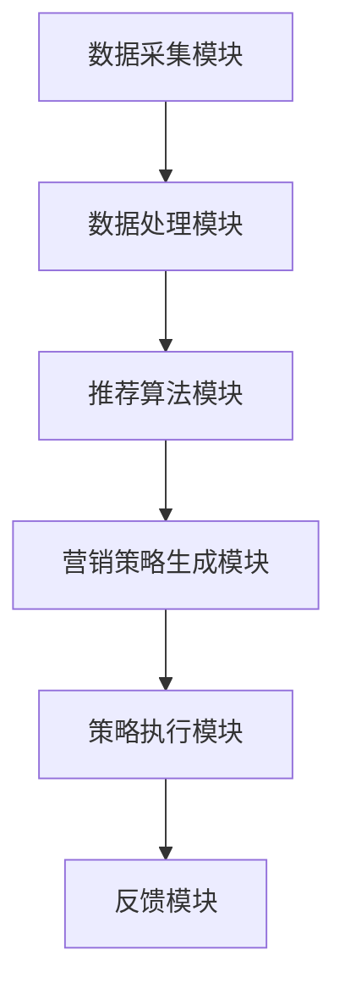

                 


# 构建AI Agent驱动的智能营销系统

> 关键词：AI Agent，智能营销，机器学习，数据驱动，自然语言处理

> 摘要：本文将深入探讨如何构建一个基于AI Agent的智能营销系统，涵盖从背景介绍到系统实现的完整流程，包括AI Agent的核心原理、算法设计、系统架构、项目实战以及优化与扩展等内容。

---

# 第一章: AI Agent与智能营销的背景与概念

## 1.1 AI Agent的基本概念

### 1.1.1 什么是AI Agent
AI Agent（人工智能代理）是指能够感知环境、自主决策并执行任务的智能体。它通过数据输入、信息处理和决策输出，帮助用户完成特定目标。

### 1.1.2 AI Agent的核心特征
- **自主性**：能够在没有外部干预的情况下独立运行。
- **反应性**：能够实时感知环境并做出响应。
- **目标导向**：基于预设目标或学习目标进行决策和行动。
- **可扩展性**：能够根据需求扩展功能和能力。

### 1.1.3 AI Agent与传统营销的区别
- **传统营销**：依赖人工分析和决策，效率较低且难以个性化。
- **AI Agent驱动的营销**：通过自动化数据处理和智能决策，实现精准营销和高效运营。

---

## 1.2 智能营销的定义与特点

### 1.2.1 智能营销的概念
智能营销是指利用人工智能、大数据分析和自动化技术，通过智能化工具和系统，实现精准客户画像、个性化推荐和自动化营销活动。

### 1.2.2 智能营销的主要特点
- **数据驱动**：基于大量数据进行分析和决策。
- **精准性**：通过客户画像和行为分析，实现精准营销。
- **自动化**：营销活动可以自动触发和执行。
- **可扩展性**：能够适应不同规模和复杂度的营销需求。

### 1.2.3 智能营销与传统营销的对比
- **数据利用**：智能营销依赖于大数据分析，而传统营销主要依赖经验。
- **效率**：智能营销通过自动化提高效率，传统营销效率较低。
- **个性化**：智能营销能够实现高度个性化，传统营销则难以做到。

---

## 1.3 AI Agent在智能营销中的作用

### 1.3.1 AI Agent如何提升营销效率
AI Agent能够自动处理大量数据，快速生成客户画像和营销策略，从而提高营销效率。

### 1.3.2 AI Agent在客户画像与行为分析中的应用
通过自然语言处理和机器学习，AI Agent可以分析客户的语言、行为和历史数据，生成精准的客户画像。

### 1.3.3 AI Agent在精准营销中的优势
AI Agent能够根据客户的行为和偏好，实时调整营销策略，实现精准推送和个性化推荐。

---

## 1.4 本章小结
本章介绍了AI Agent的基本概念和智能营销的特点，阐述了AI Agent在智能营销中的重要性及其优势。下一章将详细讲解AI Agent的核心原理和技术。

---

# 第二章: AI Agent的核心原理与技术

## 2.1 AI Agent的工作原理

### 2.1.1 AI Agent的基本工作流程
1. **感知环境**：通过传感器或数据接口获取环境信息。
2. **信息处理**：利用算法对数据进行分析和处理。
3. **决策与规划**：基于处理后的信息生成行动计划。
4. **执行行动**：根据计划执行具体的任务或操作。

### 2.1.2 知识表示与推理
- **知识表示**：通过知识图谱或数据库表示知识。
- **推理引擎**：利用逻辑推理或机器学习模型生成结论。

### 2.1.3 行为规划与决策
- **行为规划**：基于目标生成行动计划。
- **决策优化**：通过强化学习不断优化决策策略。

---

## 2.2 AI Agent的类型与应用场景

### 2.2.1 单一智能体与多智能体
- **单一智能体**：适用于简单任务，如自动化推荐。
- **多智能体**：适用于复杂场景，如多部门协作的营销活动。

### 2.2.2 基于规则的AI Agent
- **规则驱动**：通过预设规则进行决策。
- **应用场景**：简单的条件判断，如优惠券发放。

### 2.2.3 基于机器学习的AI Agent
- **学习驱动**：通过机器学习模型进行决策。
- **应用场景**：复杂场景，如客户行为预测和个性化推荐。

---

## 2.3 AI Agent的核心技术

### 2.3.1 自然语言处理
- **NLP技术**：用于文本分析和语义理解。
- **应用场景**：客户反馈分析、情感分析。

### 2.3.2 机器学习与深度学习
- **机器学习**：用于模式识别和预测。
- **深度学习**：用于复杂模式的提取和分析。
- **应用场景**：客户画像、需求预测。

### 2.3.3 知识图谱与推理引擎
- **知识图谱**：构建领域知识库。
- **推理引擎**：基于知识图谱进行推理和决策。

---

## 2.4 本章小结
本章详细讲解了AI Agent的核心原理和技术，包括工作流程、知识表示、行为规划以及不同类型AI Agent的应用场景。下一章将探讨AI Agent驱动的智能营销系统的核心算法和实现细节。

---

# 第三章: AI Agent驱动的智能营销系统的核心算法与实现

## 3.1 推荐算法原理与实现

### 3.1.1 推荐算法概述
推荐算法是智能营销系统的核心技术之一，常用的推荐算法包括协同过滤、基于内容的推荐和深度学习推荐。

### 3.1.2 协同过滤算法
- **基本原理**：基于用户行为相似性进行推荐。
- **数学模型**：
  $$ sim(u, v) = \frac{\sum_{i=1}^n (r_{u,i} - \bar{r}_u)(r_{v,i} - \bar{r}_v)}{\sqrt{\sum_{i=1}^n (r_{u,i} - \bar{r}_u)^2} \cdot \sqrt{\sum_{i=1}^n (r_{v,i} - \bar{r}_v)^2}} $$
- **代码实现示例**：
  ```python
  def compute_similarity(user_id, user_profiles):
      user_profile = user_profiles[user_id]
      similarities = []
      for other_user in user_profiles:
          if other_user == user_id:
              continue
          other_profile = user_profiles[other_user]
          # 计算相似度
          numerator = sum((user_profile[i] - mean(user_profile)) * (other_profile[i] - mean(other_profile)) for i in range(len(user_profile)))
          denominator = (sqrt(sum((user_profile[i] - mean(user_profile))**2 for i in range(len(user_profile)))) *
                         sqrt(sum((other_profile[i] - mean(other_profile))**2 for i in range(len(other_profile)))))
          similarity = numerator / denominator if denominator != 0 else 0
          similarities.append((other_user, similarity))
      return similarities
  ```

### 3.1.3 基于内容的推荐算法
- **基本原理**：基于商品的属性进行推荐。
- **数学模型**：
  $$ sim(item_i, item_j) = \frac{\sum_{k=1}^n w_k \cdot (feature_{i,k} - feature_{j,k})^2}{\sqrt{\sum_{k=1}^n w_k^2} \cdot \sqrt{\sum_{k=1}^n w_k^2}} $$
- **代码实现示例**：
  ```python
  def content_based_recommendation(user_id, item_features):
      user_features = item_features[user_id]
      similarities = []
      for other_item in item_features:
          if other_item == user_id:
              continue
          other_features = item_features[other_item]
          # 计算相似度
          numerator = sum(w * (user_features[k] - other_features[k])**2 for k, w in enumerate(weights))
          denominator = sqrt(sum(w**2 for w in weights)) * sqrt(sum(w**2 for w in weights))
          similarity = numerator / denominator if denominator != 0 else 0
          similarities.append((other_item, similarity))
      return similarities
  ```

### 3.1.4 深度学习推荐算法
- **基本原理**：利用神经网络模型进行推荐。
- **常用模型**：协同过滤神经网络（Neural Collaborative Filtering，NCF）。
- **代码实现示例**：
  ```python
  import tensorflow as tf
  class NCF(tf.keras.Model):
      def __init__(self, user_num, item_num):
          super(NCF, self).__init__()
          self.user_embedding = tf.keras.layers.Embedding(user_num, 64)
          self.item_embedding = tf.keras.layers.Embedding(item_num, 64)
          self.dense1 = tf.keras.layers.Dense(64, activation='relu')
          self.dense2 = tf.keras.layers.Dense(1, activation='sigmoid')
      
      def call(self, inputs):
          user_ids, item_ids = inputs
          user_embeddings = self.user_embedding(user_ids)
          item_embeddings = self.item_embedding(item_ids)
          concatenated = tf.concat([user_embeddings, item_embeddings], axis=-1)
          hidden = self.dense1(concatenated)
          output = self.dense2(hidden)
          return output
  ```

---

## 3.2 自然语言处理在智能营销中的应用

### 3.2.1 情感分析
- **基本原理**：通过NLP技术分析文本中的情感倾向。
- **常用算法**：基于词袋模型、TF-IDF和深度学习模型（如LSTM、BERT）。

### 3.2.2 文本摘要
- **基本原理**：对长文本进行摘要提取。
- **常用算法**：基于词图模型和序列到序列模型。

### 3.2.3 命题逻辑与自然语言生成
- **基本原理**：基于知识图谱生成营销文案。
- **代码实现示例**：
  ```python
  import spacy
  nlp = spacy.load("en_core_web_sm")
  def generate_marketing_copy(target Audience):
      doc = nlp(target_audience)
      # 提取关键词
      keywords = [token.text for token in doc if token.pos_ in ["NOUN", "ADJ"]]
      # 生成文案
      copy = "Our innovative solution is designed for " + " ".join(keywords) + ". Contact us today!"
      return copy
  ```

---

## 3.3 强化学习在营销策略优化中的应用

### 3.3.1 强化学习的基本原理
- **基本原理**：通过奖励机制优化策略。
- **数学模型**：
  $$ Q(s, a) = Q(s, a) + \alpha \cdot (r + \gamma \cdot \max_{a'} Q(s', a') - Q(s, a)) $$
- **代码实现示例**：
  ```python
  import numpy as np
  class QLearningAgent:
      def __init__(self, state_space_size, action_space_size):
          self.state_space_size = state_space_size
          self.action_space_size = action_space_size
          self.q_table = np.zeros((state_space_size, action_space_size))
      
      def choose_action(self, state, epsilon=0.1):
          if np.random.random() < epsilon:
              return np.random.randint(self.action_space_size)
          else:
              return np.argmax(self.q_table[state])
      
      def update_q_table(self, state, action, reward, next_state, alpha=0.1, gamma=0.9):
          self.q_table[state, action] += alpha * (reward + gamma * np.max(self.q_table[next_state]) - self.q_table[state, action])
  ```

---

## 3.4 本章小结
本章详细讲解了AI Agent驱动的智能营销系统中常用的推荐算法、自然语言处理技术和强化学习算法，包括协同过滤、基于内容的推荐、深度学习推荐、情感分析、文本摘要和强化学习策略优化。下一章将基于这些算法实现一个完整的智能营销系统。

---

# 第四章: AI Agent驱动的智能营销系统架构设计与实现

## 4.1 系统功能设计

### 4.1.1 系统模块划分
- **数据采集模块**：负责收集客户行为数据、市场数据等。
- **数据处理模块**：对数据进行清洗、转换和特征提取。
- **营销策略模块**：基于AI Agent生成营销策略。
- **执行模块**：根据策略执行营销活动。
- **反馈模块**：收集营销活动的反馈数据，用于优化策略。

### 4.1.2 系统功能模块的交互流程
1. **数据采集**：通过API或日志采集客户行为数据。
2. **数据处理**：清洗数据并提取特征。
3. **营销策略生成**：基于AI Agent生成个性化推荐和营销策略。
4. **策略执行**：通过自动化工具执行营销活动。
5. **反馈优化**：收集反馈数据，优化AI Agent的策略。

---

## 4.2 系统架构设计

### 4.2.1 分层架构设计
- **数据层**：存储原始数据和特征数据。
- **算法层**：实现推荐算法、自然语言处理和强化学习算法。
- **应用层**：提供用户界面和API接口，供用户使用。

### 4.2.2 数据流设计
1. 数据采集模块将数据传输到数据层。
2. 数据处理模块从数据层读取数据，进行处理后传输到算法层。
3. 算法层生成策略后，传输到应用层。
4. 应用层执行策略并收集反馈数据，传输回数据层。

---

## 4.3 系统实现

### 4.3.1 环境搭建
- **开发环境**：Python 3.8+, TensorFlow 2.0+, PyTorch 1.0+
- **数据存储**：使用MySQL或MongoDB存储数据。
- **前端框架**：使用React或Vue.js构建用户界面。

### 4.3.2 前端开发
- **用户界面**：实现客户画像、推荐结果展示和营销活动管理功能。
- **API接口**：提供RESTful API供后端调用。

### 4.3.3 后端开发
- **数据处理**：编写数据清洗和特征提取的代码。
- **算法实现**：实现推荐算法、自然语言处理和强化学习算法。
- **系统集成**：将各个模块集成到一起，实现完整的智能营销系统。

---

## 4.4 本章小结
本章详细讲解了AI Agent驱动的智能营销系统的架构设计和实现过程，包括系统模块划分、数据流设计和系统实现。下一章将通过一个具体案例，展示如何构建一个完整的AI Agent驱动的智能营销系统。

---

# 第五章: 项目实战——构建AI Agent驱动的智能营销系统

## 5.1 项目背景与需求分析

### 5.1.1 项目背景
某电商平台希望利用AI技术提升营销效率，实现精准推荐和个性化营销。

### 5.1.2 项目需求
- **客户画像**：基于用户行为数据生成客户画像。
- **个性化推荐**：根据客户画像推荐个性化商品。
- **自动化营销活动**：根据推荐结果自动触发营销活动。

---

## 5.2 系统设计

### 5.2.1 领域模型设计
- **客户画像**：包括客户的基本信息、行为数据和偏好数据。
- **推荐系统**：基于协同过滤算法实现个性化推荐。

### 5.2.2 系统架构设计


---

## 5.3 系统实现

### 5.3.1 环境搭建
- **安装Python**：Python 3.8+
- **安装依赖库**：TensorFlow、Keras、Spacy、Flask、React

### 5.3.2 数据采集与处理
```python
import pandas as pd
from sklearn.preprocessing import StandardScaler

# 数据采集
data = pd.read_csv('customer_data.csv')

# 数据处理
scaler = StandardScaler()
scaled_data = scaler.fit_transform(data)
```

### 5.3.3 推荐算法实现
```python
from sklearn.metrics.pairwise import cosine_similarity

# 基于协同过滤的推荐算法
def recommend_user(user_id, scaled_data, data):
    user_index = data.index == user_id
    user_vector = scaled_data[user_index, :]
    similarities = cosine_similarity(user_vector, scaled_data)
    top_recommendations = similarities.argsort()[0][-5:]
    return data.iloc[top_recommendations]
```

### 5.3.4 系统集成与测试
- **前端测试**：测试用户界面是否正常显示推荐结果。
- **后端测试**：测试推荐算法是否正确生成推荐列表。
- **集成测试**：测试整个系统是否能够正常运行并完成营销活动。

---

## 5.4 项目小结
本章通过一个具体案例展示了如何构建一个AI Agent驱动的智能营销系统，包括项目背景、系统设计和系统实现。通过本章的学习，读者可以掌握AI Agent驱动的智能营销系统的核心技术和实现方法。

---

# 第六章: 优化与扩展

## 6.1 系统优化

### 6.1.1 算法优化
- **推荐算法优化**：使用深度学习模型替代传统协同过滤算法，提高推荐精度。
- **自然语言处理优化**：引入预训练模型（如BERT）提高情感分析和文本摘要的准确性。

### 6.1.2 系统性能优化
- **数据处理优化**：使用分布式计算框架（如Spark）提高数据处理效率。
- **算法加速**：利用GPU加速深度学习模型的训练和推理。

---

## 6.2 系统扩展

### 6.2.1 功能扩展
- **多渠道营销**：支持邮件、短信和社交媒体等多种营销渠道。
- **动态调整策略**：根据实时数据动态调整营销策略。

### 6.2.2 规模扩展
- **分布式部署**：将系统部署到多个服务器，提高系统的扩展性和可用性。
- **负载均衡**：使用负载均衡技术提高系统的吞吐量和响应速度。

---

## 6.3 本章小结
本章详细讲解了如何优化和扩展AI Agent驱动的智能营销系统，包括算法优化、系统性能优化和功能扩展等内容。通过优化和扩展，可以进一步提升系统的性能和功能，满足更多复杂场景的需求。

---

# 第七章: 总结与展望

## 7.1 全文总结
本文详细讲解了AI Agent驱动的智能营销系统的构建过程，包括核心概念、算法原理、系统架构、项目实现和优化扩展等内容。通过本文的学习，读者可以掌握构建AI Agent驱动的智能营销系统的核心技术和实现方法。

## 7.2 未来展望
随着人工智能技术的不断发展，AI Agent在智能营销中的应用将更加广泛和深入。未来，我们可以期待更多基于AI Agent的创新应用，如实时互动营销、多模态营销和自适应营销等。

---

# 作者：AI天才研究院 & 禅与计算机程序设计艺术

