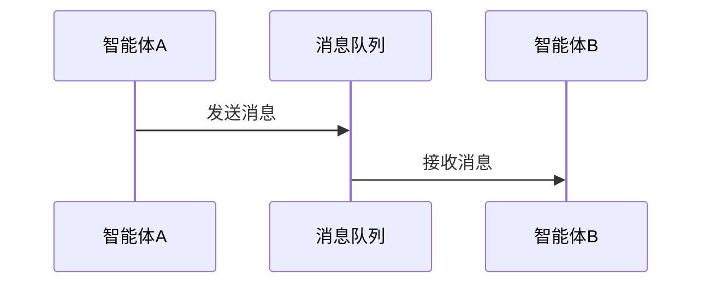
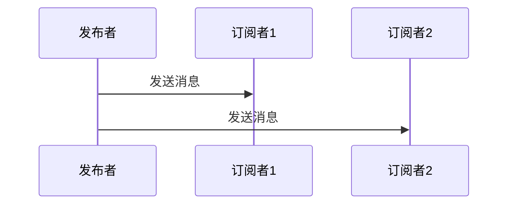
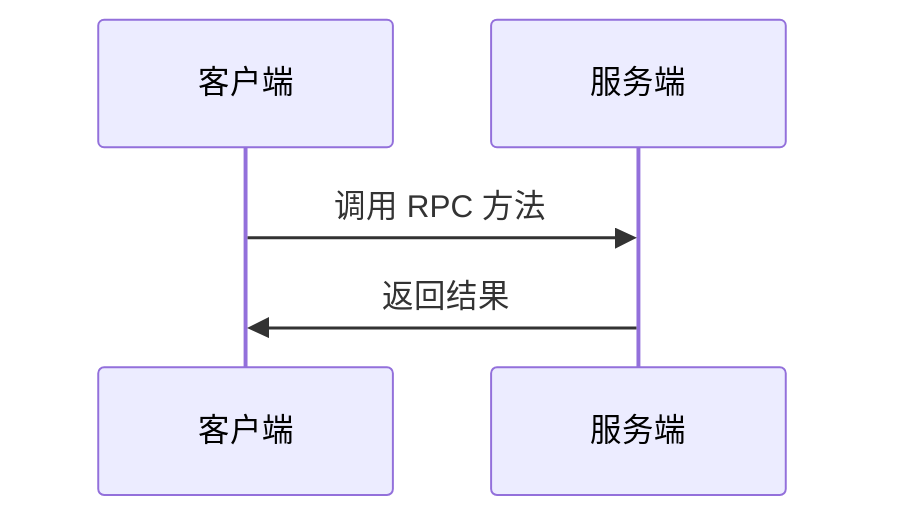
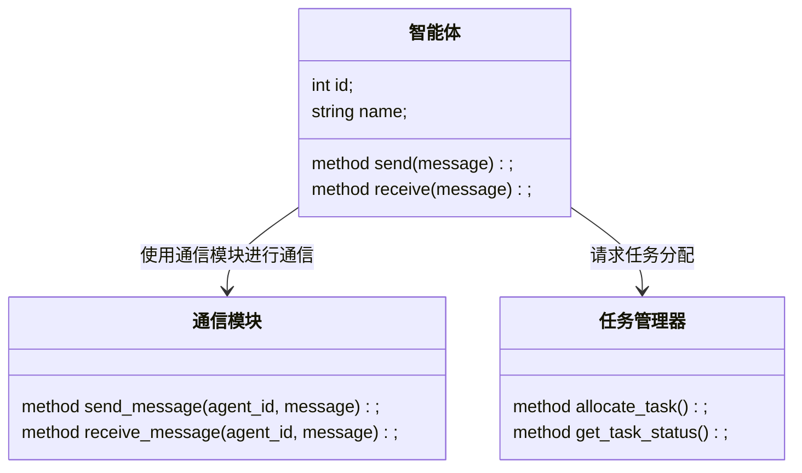
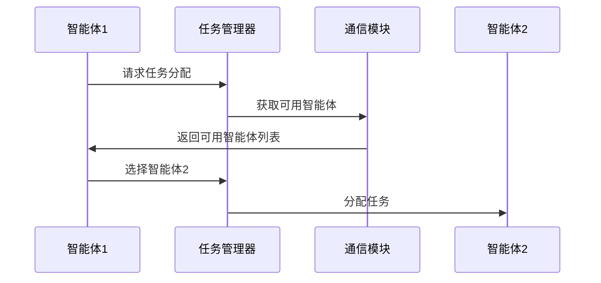

                 


# 构建具有多智能体协作能力的AI系统

## 关键词：多智能体协作、AI系统、通信协议、任务分配、系统架构

## 摘要：  
在AI系统中，多智能体协作是指多个智能体通过合作完成复杂任务的能力。本文详细介绍了多智能体协作的核心概念、通信协议、任务分配算法、系统架构设计以及实际项目实现，帮助读者全面理解并掌握构建具有多智能体协作能力的AI系统的技能。

---

## 第1章: 多智能体协作系统概述

### 1.1 多智能体协作的背景与重要性

#### 1.1.1 多智能体协作的背景
随着人工智能技术的快速发展，单一智能体的能力已难以满足复杂场景的需求。例如，在自动驾驶、机器人协作、分布式计算等领域，多个智能体需要协同工作以完成任务。多智能体协作通过整合多个智能体的能力，显著提升了系统的整体性能和灵活性。

#### 1.1.2 多智能体协作的重要性
- **提高效率**：多个智能体可以同时处理不同的子任务，加快整体任务的完成速度。
- **增强鲁棒性**：当一个智能体出现问题时，其他智能体可以继续完成任务，确保系统的稳定性。
- **扩展能力**：通过增加智能体数量，系统可以处理更复杂或更大规模的任务。

#### 1.1.3 多智能体协作的应用场景
- **自动驾驶**：多辆自动驾驶汽车协同完成交通调度和路径规划。
- **机器人协作**：工业机器人在生产线上协同完成复杂任务。
- **分布式计算**：多个计算节点协作完成大规模数据处理任务。

### 1.2 多智能体协作的核心概念

#### 1.2.1 多智能体协作的定义
多智能体协作是指多个智能体通过通信和协调，共同完成一个或多个任务的过程。每个智能体都有自己的目标和能力，通过协作实现整体目标的优化。

#### 1.2.2 多智能体协作的特点
| 特性 | 描述 |
|------|------|
| 分布性 | 每个智能体独立运行，无中心节点 |
| 协作性 | 智能体之间需要通信和协调 |
| 动态性 | 系统状态和任务需求可能动态变化 |
| 多目标性 | 每个智能体的目标可能不同，需要协调统一 |

#### 1.2.3 多智能体协作的边界与外延
- **边界**：多智能体协作的范围仅限于智能体之间的协作，不涉及外部环境的直接控制。
- **外延**：协作可能涉及外部服务或数据库，但智能体本身仅负责通信和任务执行。

### 1.3 多智能体协作的系统架构

#### 1.3.1 多智能体协作的系统组成
- **智能体**：负责执行具体任务。
- **通信模块**：实现智能体之间的信息交换。
- **协调模块**：负责任务分配和冲突解决。
- **监控模块**：实时监控系统状态，提供反馈。

#### 1.3.2 多智能体协作的通信机制
- **消息传递**：智能体通过发送消息进行通信。
- **订阅-发布**：采用发布-订阅模式，智能体可以订阅感兴趣的信息。

#### 1.3.3 多智能体协作的任务分配
- **均衡分配**：任务均匀分配给多个智能体，确保资源利用率最大化。
- **动态分配**：根据实时状态调整任务分配，适应系统变化。

### 1.4 多智能体协作的实现挑战

#### 1.4.1 智能体之间的通信问题
- **延迟**：通信延迟可能影响任务执行效率。
- **带宽**：通信量过大可能导致带宽不足。

#### 1.4.2 任务分配的公平性与效率
- **公平性**：任务分配需确保每个智能体都有公平的机会。
- **效率**：任务分配算法需高效，避免资源浪费。

#### 1.4.3 协作过程中的冲突与协调
- **冲突**：多个智能体可能争夺同一资源或任务。
- **协调**：需要设计机制解决冲突，确保协作顺利进行。

## 第2章: 多智能体协作的通信协议

### 2.1 多智能体协作中的通信需求

#### 2.1.1 通信的基本要求
- **实时性**：通信需快速响应，确保协作效率。
- **可靠性**：通信必须准确无误，避免信息丢失或错误。

### 2.2 常见的通信协议

#### 2.2.1 基于消息队列的通信
- **消息队列**：智能体通过队列发送和接收消息。
- **实现**：使用 RabbitMQ 或 Kafka 等消息队列工具。

#### 2.2.2 基于发布-订阅模式的通信
- **发布者-订阅者模式**：智能体可以订阅感兴趣的消息，发布者发布消息后，所有订阅者都会收到。
- **实现**：使用 MQTT 或 Kafka 等协议。

#### 2.2.3 基于gRPC的通信
- **gRPC**：基于 HTTP/2 的 RPC 通信协议，支持流式通信。
- **实现**：通过 Protobuf 定义服务接口，使用 grpc-go 或 grpc-java 实现。

### 2.3 通信协议的设计与实现

#### 2.3.1 通信协议的设计原则
- **简洁性**：协议应简单明了，易于实现和维护。
- **可扩展性**：协议应支持未来扩展和新增功能。
- **安全性**：确保通信数据的安全性，防止被篡改或窃取。

#### 2.3.2 通信协议的实现步骤
1. **定义消息格式**：使用 JSON 或 Protobuf 等格式定义消息结构。
2. **选择通信协议**：根据需求选择合适的消息队列或 RPC 协议。
3. **实现发送和接收逻辑**：编写代码实现消息的发送和接收功能。

### 2.4 通信协议的实现案例

#### 2.4.1 消息队列的实现


#### 2.4.2 发布-订阅模式的实现


#### 2.4.3 gRPC的实现


## 第3章: 多智能体协作的任务分配

### 3.1 任务分配的基本概念

#### 3.1.1 任务分配的定义
任务分配是指将任务分解为多个子任务，并分配给不同的智能体执行。

### 3.2 常见的任务分配算法

#### 3.2.1 基于贪心算法的任务分配
- **贪心算法**：每次选择当前最优的任务分配方式，逐步构建整体最优解。
- **实现**：遍历所有智能体，将任务分配给当前负载最小的智能体。

#### 3.2.2 基于动态规划的任务分配
- **动态规划**：通过分解问题，找到最优子结构，逐步构建整体最优解。
- **实现**：将任务分解为子任务，计算每个子任务的最优分配方案。

#### 3.2.3 基于分布式计算的任务分配
- **分布式计算**：将任务分配给多个智能体，利用分布式计算资源加速任务完成。
- **实现**：使用 MapReduce 或 Apache Spark 等分布式计算框架。

### 3.3 任务分配算法的实现

#### 3.3.1 贪心算法的实现
```python
def greedy_task_allocation(tasks, agents):
    # 初始化每个智能体的负载
    agent_loads = {agent: 0 for agent in agents}
    # 按任务优先级排序
    sorted_tasks = sorted(tasks, key=lambda x: x['priority'])
    for task in sorted_tasks:
        # 选择负载最小的智能体
        selected_agent = min(agent_loads, key=lambda k: agent_loads[k])
        # 分配任务
        agent_loads[selected_agent] += task['weight']
    return agent_loads
```

#### 3.3.2 动态规划算法的实现
```python
def dynamic_programming_task_allocation(tasks):
    # 初始化动态规划表
    dp = [0] * (len(tasks) + 1)
    # 填充动态规划表
    for i in range(1, len(tasks) + 1):
        dp[i] = max(dp[i-1], tasks[i-1])
    return dp[len(tasks)]
```

#### 3.3.3 分布式计算算法的实现
```python
from concurrent.futures import ThreadPoolExecutor

def distribute_task(executor, tasks):
    futures = []
    for task in tasks:
        futures.append(executor.submit(task))
    return futures
```

### 3.4 任务分配的优化策略

#### 3.4.1 负载均衡策略
- **目标**：确保每个智能体的负载均衡，避免某个智能体过载。
- **实现**：定期监控智能体负载，动态调整任务分配。

#### 3.4.2 响应时间优化策略
- **目标**：减少任务的响应时间，提高系统效率。
- **实现**：优先分配任务给响应速度最快的智能体。

## 第4章: 多智能体协作的系统架构设计

### 4.1 问题场景介绍
- **场景**：一个智能仓储系统，需要多个机器人协作完成货物搬运任务。
- **需求**：机器人需要实时通信，动态分配任务，确保货物高效搬运。

### 4.2 系统功能设计

#### 4.2.1 领域模型


### 4.3 系统架构设计

#### 4.3.1 系统架构图


#### 4.3.2 系统接口设计
- **智能体接口**：
  - `void send(message)`：发送消息。
  - `void receive(message)`：接收消息。
- **任务管理器接口**：
  - `Task allocate_task()`：分配任务。
  - `Status get_task_status(task_id)`：获取任务状态。

#### 4.3.3 系统交互设计


## 第5章: 项目实战

### 5.1 环境安装
- **安装依赖**：
  - Python 3.8+
  - pip install mermaid
  - pip install grpcio
  - pip install kafka-python

### 5.2 系统核心实现源代码

#### 5.2.1 通信模块实现
```python
from kafka import KafkaProducer, KafkaConsumer

class Communicator:
    def __init__(self, bootstrap_servers='localhost:9092'):
        self.producer = KafkaProducer(bootstrap_servers=bootstrap_servers)
        self.consumer = KafkaConsumer()

    def send_message(self, topic, message):
        self.producer.send(topic, message)

    def receive_message(self, topic):
        self.consumer.subscribe([topic])
        for message in self.consumer:
            yield message.value
```

#### 5.2.2 任务分配实现
```python
class TaskAllocator:
    def __init__(self, agents):
        self.agents = agents

    def allocate_task(self, task):
        # 简单的负载均衡算法
        agent = self.agents[0]
        return agent
```

### 5.3 代码应用解读与分析
- **通信模块**：使用 Kafka 实现智能体之间的消息通信。
- **任务分配**：采用简单的负载均衡算法，将任务分配给第一个智能体。

### 5.4 实际案例分析和详细讲解剖析
- **案例**：多个智能体协作完成货物搬运任务。
- **实现步骤**：
  1. 初始化多个智能体。
  2. 启动通信模块，建立智能体之间的通信通道。
  3. 任务管理器分配任务给智能体。
  4. 智能体接收任务后执行。

### 5.5 项目小结
通过本项目，读者可以掌握多智能体协作的基本实现方法，包括通信模块和任务分配模块的设计与实现。

## 第6章: 总结与展望

### 6.1 总结
本文详细介绍了多智能体协作的核心概念、通信协议、任务分配算法、系统架构设计以及实际项目实现。通过阅读本文，读者可以全面理解并掌握构建具有多智能体协作能力的AI系统的技能。

### 6.2 展望
未来，多智能体协作将在更多领域得到应用，例如自动驾驶、智能城市、分布式计算等。随着AI技术的不断发展，多智能体协作的实现将更加高效和智能。

## 作者：AI天才研究院/AI Genius Institute & 禅与计算机程序设计艺术 /Zen And The Art of Computer Programming

---

**注意**：本文内容较多，完整输出将非常长。建议根据实际需求，逐步展开各部分内容。

