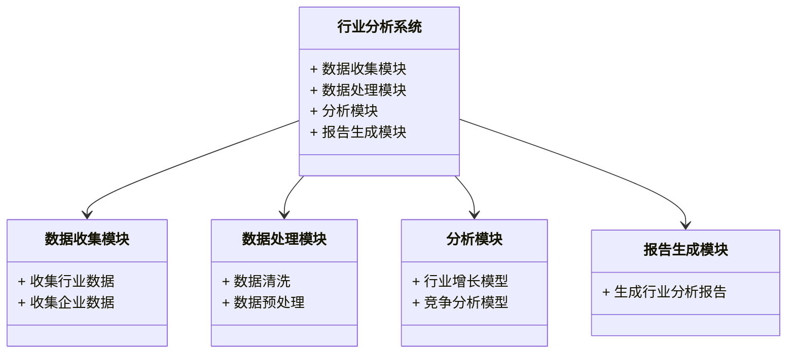
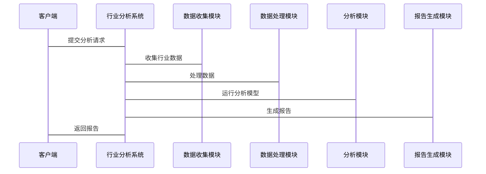

                 


# 费雪的行业分析方法：寻找高增长机会

## 关键词

- 费雪的行业分析方法
- 高增长机会
- 行业生命周期
- 竞争优势
- 投资决策

## 摘要

本文将详细介绍费雪的行业分析方法，从理论基础到实际应用，深入探讨如何通过行业分析寻找高增长机会。我们将从行业生命周期、竞争优势分析、行业结构分析等方面展开，结合实际案例，为您揭示费雪分析方法的核心精髓。通过本文的学习，您将能够掌握如何运用费雪的行业分析方法，制定有效的投资策略和企业战略。

---

## 第一部分：费雪行业分析方法概述

### 第1章：行业分析的背景与基础

#### 1.1 费雪分析方法的起源与发展

##### 1.1.1 费雪分析方法的起源
费雪的行业分析方法是由投资大师菲利普·费雪（Philip Fisher）提出的一种用于评估企业投资价值的方法。这种方法以“成长股”投资理念为核心，强调通过深入分析企业的行业地位、竞争优势和成长潜力，找到具有长期增长潜力的投资标的。

##### 1.1.2 行业分析在投资决策中的重要性
行业分析是投资决策中的关键步骤，它帮助投资者了解行业的整体发展趋势、竞争格局以及企业的市场地位。通过行业分析，投资者可以更好地判断企业的成长潜力和投资价值。

##### 1.1.3 费雪方法的核心理念与特点
费雪的行业分析方法以“成长”为核心，强调选择那些在行业内具有领先地位且能够持续增长的企业。其特点包括：
- **长期视角**：关注企业的长期增长潜力。
- **竞争优势**：重视企业的竞争优势和行业地位。
- **深入分析**：通过细致的行业分析和企业分析，寻找具有投资价值的企业。

#### 1.2 费雪行业分析的核心概念

##### 1.2.1 行业分析的基本定义与范围
行业分析是指对特定行业内的市场结构、竞争格局、发展趋势和经济指标进行系统性研究的过程。通过对行业的深入了解，投资者可以更好地评估企业的投资价值。

##### 1.2.2 费雪分析方法的关键要素
- **行业生命周期**：分析行业所处的生命周期阶段，判断行业的成长性和投资潜力。
- **行业竞争结构**：通过五力模型（波特竞争分析模型）分析行业的竞争格局。
- **行业增长潜力**：评估行业的增长空间和未来发展趋势。

##### 1.2.3 行业分析与企业增长的关系
行业分析是企业增长的重要外部因素。企业的发展离不开行业的整体趋势，而行业的增长潜力则为企业的成长提供了基础。

#### 1.3 费雪分析方法的分析框架

##### 1.3.1 行业生命周期分析
行业生命周期分析是费雪分析方法的重要组成部分。通过对行业所处生命周期阶段的分析，投资者可以更好地判断行业的成长性和投资价值。

##### 1.3.2 行业竞争结构分析
通过分析行业的竞争结构，投资者可以判断行业的竞争格局和企业的竞争优势，从而更好地评估企业的投资价值。

##### 1.3.3 行业增长潜力评估
行业增长潜力评估是费雪分析方法的核心内容之一。通过对行业增长潜力的评估，投资者可以找到具有长期增长潜力的投资标的。

#### 1.4 费雪分析方法的应用领域

##### 1.4.1 投资分析中的应用
在投资分析中，费雪的行业分析方法可以帮助投资者评估企业的投资价值，找到具有长期增长潜力的投资标的。

##### 1.4.2 企业战略规划中的应用
企业可以通过费雪的行业分析方法，了解行业发展趋势和竞争格局，制定有效的战略规划。

##### 1.4.3 行业趋势预测中的应用
费雪的行业分析方法可以帮助行业研究者预测行业发展趋势，为企业的经营决策提供支持。

---

## 第二部分：行业分析的理论基础

### 第2章：行业生命周期分析

#### 2.1 行业生命周期的定义与阶段划分

##### 2.1.1 行业生命周期的定义
行业生命周期是指一个行业从进入市场到退出市场的整个发展过程。通常包括导入期、成长期、成熟期和衰退期四个阶段。

##### 2.1.2 行业生命周期的阶段划分
- **导入期**：行业刚刚进入市场，市场需求较低，竞争较小。
- **成长期**：市场需求迅速增长，行业规模扩大。
- **成熟期**：市场需求趋于稳定，行业规模不再显著增长。
- **衰退期**：市场需求下降，行业规模逐步缩小。

#### 2.2 行业生命周期对投资策略的影响

##### 2.2.1 不同阶段的投资策略选择
- **导入期**：适合风险承受能力强的投资者，寻找具有创新潜力的企业。
- **成长期**：适合大多数投资者，寻找行业龙头企业的投资机会。
- **成熟期**：适合稳健投资者，选择具有稳定收益的企业。
- **衰退期**：适合规避风险的投资者，逐步退出相关投资。

##### 2.2.2 生命周期阶段与企业增长机会的关系
- 在导入期和成长期，企业具有较大的增长潜力。
- 在成熟期和衰退期，企业的增长潜力较小，投资风险较高。

#### 2.3 行业生命周期分析的案例

##### 2.3.1 某行业的生命周期分析案例
以科技行业为例，分析其在不同生命周期阶段的增长潜力和投资策略。

##### 2.3.2 案例分析中的关键点总结
- 导入期：技术创新驱动增长，风险较高。
- 成长期：市场需求旺盛，行业龙头企业发展迅速。
- 成熟期：行业格局稳定，龙头企业收益稳定。
- 衰退期：市场需求下降，企业需转型或退出。

---

### 第3章：行业竞争结构分析

#### 3.1 行业竞争结构的定义与分析框架

##### 3.1.1 行业竞争结构的定义
行业竞争结构是指行业内各个企业之间的竞争关系和竞争程度。通过分析行业竞争结构，可以更好地判断行业的竞争格局和企业的竞争优势。

##### 3.1.2 五力模型（波特竞争分析模型）的介绍
五力模型是迈克尔·波特提出的分析行业竞争结构的工具，包括：
- **新进入者威胁**
- **替代品威胁**
- **供应商议价能力**
- **买方议价能力**
- **现有竞争者之间的竞争程度**

#### 3.2 费雪分析方法中的竞争分析

##### 3.2.1 竞争优势的定义与分类
竞争优势是指企业在行业内相对于竞争对手的优势。竞争优势可以分为成本优势、产品优势、品牌优势等。

##### 3.2.2 费雪分析方法中的竞争优势评估
- 通过分析企业的竞争优势，判断其在行业中的地位和成长潜力。
- 重点关注企业的核心竞争力和市场占有率。

#### 3.3 行业竞争结构分析的案例

##### 3.3.1 某行业的竞争结构分析案例
以智能手机行业为例，分析其竞争结构和竞争优势。

##### 3.3.2 案例分析中的关键点总结
- 新进入者威胁：行业内新进入者的威胁较小，但技术创新和成本优势是关键。
- 替代品威胁：替代品的威胁较低，但需关注技术进步带来的潜在威胁。
- 供应商议价能力：供应商的议价能力较强，需关注供应链的稳定性和成本控制。
- 买方议价能力：买方的议价能力一般，但需关注市场的需求变化和价格敏感性。
- 竞争者之间的竞争程度：行业内竞争激烈，需关注市场份额的集中度和企业的差异化策略。

---

## 第三部分：数学模型与分析方法

### 第4章：行业增长模型与竞争分析模型

#### 4.1 行业增长模型的推导

##### 4.1.1 行业增长模型的定义
行业增长模型是用于预测行业未来增长趋势的数学模型。通过分析行业的历史增长数据和未来发展趋势，可以预测行业的未来增长潜力。

##### 4.1.2 行业增长模型的数学公式
$$
\text{行业增长潜力} = \text{行业市场规模} \times \text{行业增长率} \times \text{行业生命周期阶段权重}
$$

##### 4.1.3 行业增长模型的推导过程
- 确定行业的市场规模和增长率。
- 分析行业所处的生命周期阶段，确定生命周期阶段权重。
- 计算行业增长潜力。

#### 4.2 竞争分析模型的建立

##### 4.2.1 竞争分析模型的定义
竞争分析模型是用于评估行业竞争格局的数学模型。通过分析行业内主要竞争者的优势和劣势，可以更好地判断行业的竞争结构和企业的竞争优势。

##### 4.2.2 竞争分析模型的数学公式
$$
\text{竞争优势指数} = \frac{\text{企业市场份额}}{\text{行业平均市场份额}} \times \text{企业利润率} \times \text{企业研发投入占比}
$$

##### 4.2.3 竞争分析模型的推导过程
- 确定行业内主要竞争者的市场份额和利润率。
- 计算企业的市场份额和利润率相对于行业平均水平的比值。
- 综合考虑企业的研发投入占比，计算竞争优势指数。

#### 4.3 行业增长模型与竞争分析模型的结合应用

##### 4.3.1 行业增长模型与竞争分析模型的结合
通过结合行业增长模型和竞争分析模型，可以更好地判断行业的未来增长潜力和企业的竞争优势。

##### 4.3.2 结合模型的数学公式
$$
\text{综合增长潜力} = \text{行业增长潜力} \times \text{竞争优势指数}
$$

##### 4.3.3 案例分析
以某行业为例，结合行业增长模型和竞争分析模型，分析行业的综合增长潜力。

---

## 第四部分：系统分析与架构设计

### 第5章：系统分析与架构设计

#### 5.1 系统功能设计

##### 5.1.1 行业分析系统功能模块
- 数据收集模块：收集行业数据和企业数据。
- 数据处理模块：对收集的数据进行清洗和预处理。
- 分析模块：应用行业增长模型和竞争分析模型进行分析。
- 报告生成模块：生成行业分析报告。

##### 5.1.2 系统功能设计的mermaid类图


#### 5.2 系统架构设计

##### 5.2.1 系统架构设计的mermaid架构图
```mermaid
container 行业分析系统 {
    属于 服务器端
    包含 数据库
    包含 分析引擎
}

container 客户端 {
    包含 行业分析报告
}

行业分析系统 --> 客户端
```

#### 5.3 系统接口设计

##### 5.3.1 系统接口设计的mermaid序列图


---

## 第五部分：项目实战

### 第6章：项目实战

#### 6.1 环境安装与配置

##### 6.1.1 系统运行环境
- 操作系统：Linux/Windows/MacOS
- 开发工具：Python/Java/SQL
- 数据库：MySQL/PostgreSQL

##### 6.1.2 安装依赖包
- Python：安装pandas、numpy、scikit-learn等库。

#### 6.2 核心代码实现

##### 6.2.1 行业增长模型的代码实现
```python
import pandas as pd
import numpy as np

def industry_growth_potential(industry_size, growth_rate, lifecycle_stage_weight):
    return industry_size * growth_rate * lifecycle_stage_weight

# 示例数据
industry_size = 100  # 行业市场规模
growth_rate = 0.1  # 行业增长率
lifecycle_stage_weight = 0.8  # 行业生命周期阶段权重

potential = industry_growth_potential(industry_size, growth_rate, lifecycle_stage_weight)
print("行业增长潜力:", potential)
```

##### 6.2.2 竞争分析模型的代码实现
```python
import pandas as pd
import numpy as np

def competitive_advantage_index(enterprise_market_share, industry_avg_market_share, enterprise_profit_margin, enterprise_rnd_ratio):
    return (enterprise_market_share / industry_avg_market_share) * enterprise_profit_margin * enterprise_rnd_ratio

# 示例数据
enterprise_market_share = 0.3  # 企业市场份额
industry_avg_market_share = 0.2  # 行业平均市场份额
enterprise_profit_margin = 0.2  # 企业利润率
enterprise_rnd_ratio = 0.05  # 企业研发投入占比

index = competitive_advantage_index(enterprise_market_share, industry_avg_market_share, enterprise_profit_margin, enterprise_rnd_ratio)
print("竞争优势指数:", index)
```

#### 6.3 案例分析与解读

##### 6.3.1 案例分析
以某行业为例，结合上述代码实现，分析行业的增长潜力和企业的竞争优势。

##### 6.3.2 分析结果解读
通过代码实现，可以得出行业的增长潜力和企业的竞争优势指数，从而为投资决策提供支持。

---

## 第六部分：总结与最佳实践

### 第7章：总结与最佳实践

#### 7.1 小结

##### 7.1.1 费雪行业分析方法的核心思想
费雪的行业分析方法以“成长”为核心，强调通过深入分析行业和企业的竞争优势，寻找具有长期增长潜力的投资标的。

##### 7.1.2 本文的主要内容总结
本文从理论到实践，详细介绍了费雪的行业分析方法，包括行业生命周期分析、行业竞争结构分析、数学模型与分析方法、系统分析与架构设计以及项目实战等内容。

#### 7.2 注意事项

##### 7.2.1 投资者需要注意的事项
- 行业分析是投资决策的重要步骤，但需要结合企业的具体情况。
- 投资者需要持续关注行业的动态和企业的经营状况。
- 投资需要谨慎，建议在投资前进行充分的研究和风险评估。

#### 7.3 拓展阅读

##### 7.3.1 推荐的阅读资料
- 菲利普·费雪的《成长股投资》
- 迈克尔·波特的《竞争优势》
- 其他相关的投资分析书籍和研究报告。

##### 7.3.2 推荐的在线资源
- 投资分析论坛和社区
- 行业研究报告网站
- 在线课程和讲座

---

## 作者

作者：AI天才研究院/AI Genius Institute & 禅与计算机程序设计艺术/Zen And The Art of Computer Programming

