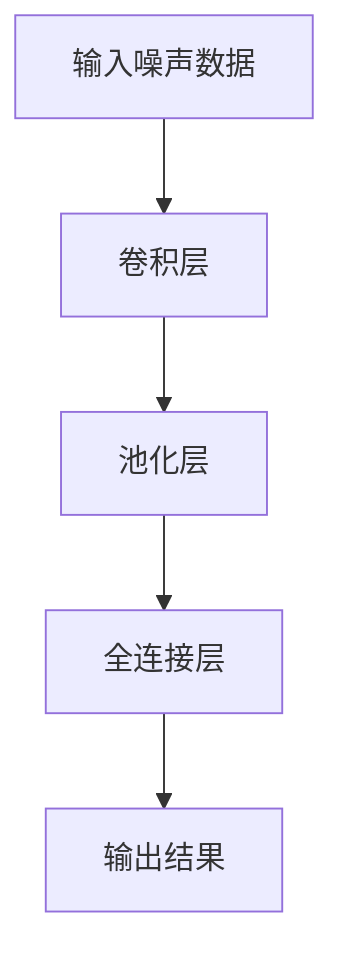
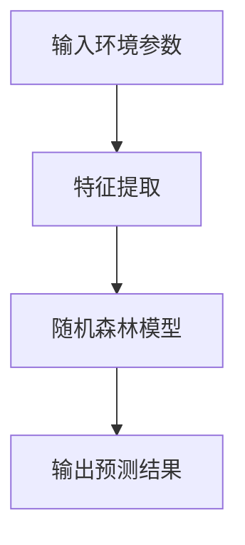
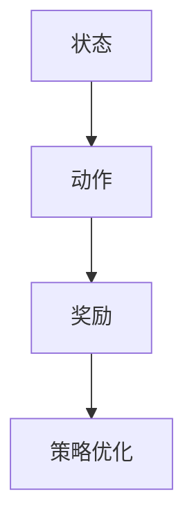
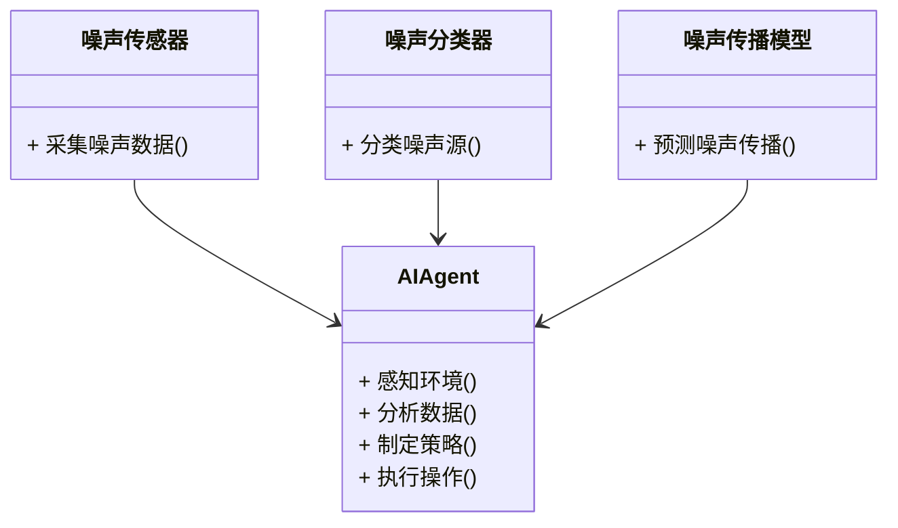
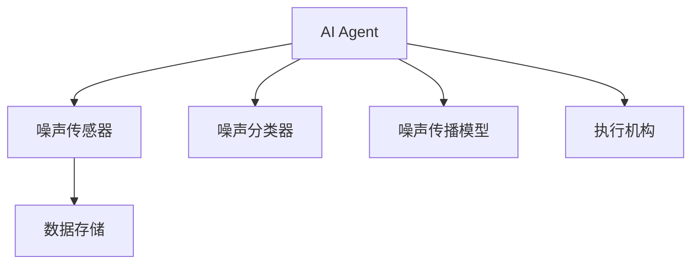
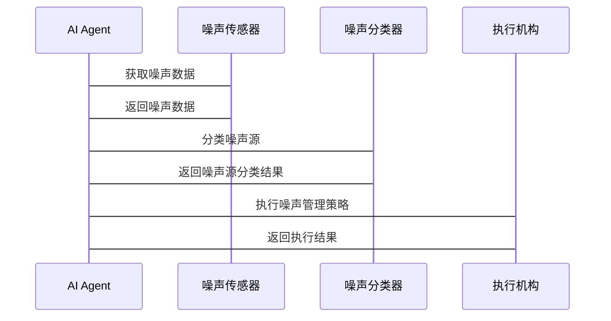

                 


# AI Agent在智能城市噪声管理中的实践

> **关键词**：智能城市、AI Agent、噪声管理、机器学习、深度学习、系统架构、城市规划

> **摘要**：本文探讨了AI Agent在智能城市噪声管理中的实践应用，从噪声数据的采集与处理、AI Agent的感知与决策机制、基于机器学习的噪声分类算法，到系统的整体架构设计与实现，详细介绍了AI Agent在智能城市噪声管理中的核心技术和实际应用案例。文章还分析了AI Agent在噪声管理中的优势与挑战，并展望了未来的发展方向。

---

## 第1章: 智能城市噪声管理的背景与问题

### 1.1 智能城市的发展与挑战

#### 1.1.1 智能城市的定义与发展
智能城市是指通过先进的信息技术和数据驱动的方法，优化城市资源的配置和管理，提高居民生活质量的城市发展模式。随着城市化进程的加快，城市人口密度增加，环境问题日益突出，噪声污染成为影响居民生活质量的重要因素之一。

#### 1.1.2 城市噪声污染的现状与问题
噪声污染不仅影响居民的生活质量，还可能对人类健康造成严重威胁。城市噪声主要来源于交通、工业生产和居民活动。传统噪声管理方法依赖于人工监测和简单的统计分析，存在效率低、实时性差、覆盖面有限等问题。

#### 1.1.3 AI技术在城市管理中的应用潜力
AI技术的快速发展为城市管理和优化提供了新的可能性。通过AI Agent（智能体）的应用，可以实现城市噪声的实时监测、智能识别和优化管理。AI Agent能够自主感知环境、分析数据、做出决策并执行操作，是智能城市噪声管理的核心技术之一。

### 1.2 AI Agent的基本概念与特点

#### 1.2.1 AI Agent的定义与核心功能
AI Agent是一种具有感知能力、决策能力和执行能力的智能系统。它能够通过传感器或其他数据源获取环境信息，利用算法进行分析和判断，并通过执行机构或反馈机制实现目标。

#### 1.2.2 AI Agent与传统自动化系统的区别
与传统自动化系统相比，AI Agent具有更强的自主性和适应性。它能够根据环境变化动态调整策略，具备学习和优化能力，能够在复杂场景中做出最优决策。

#### 1.2.3 AI Agent在智能城市中的应用场景
在智能城市中，AI Agent可以应用于交通管理、环境监测、能源优化、公共安全等多个领域。本文主要关注其在噪声管理中的应用。

### 1.3 智能城市噪声管理的核心问题

#### 1.3.1 噪声源识别与定位
噪声源识别是噪声管理的第一步。通过AI Agent的感知能力，可以实现对噪声源的自动识别和定位。

#### 1.3.2 噪声传播模型与预测
噪声传播模型是噪声管理的核心工具。通过建立数学模型，可以预测噪声在不同环境中的传播路径和强度，为噪声控制提供科学依据。

#### 1.3.3 噪声管理的优化与决策
AI Agent可以通过分析噪声数据和环境信息，优化噪声管理策略，制定最优的噪声控制方案。

### 1.4 本章小结
本章介绍了智能城市的发展背景、噪声污染的现状及其对居民生活的影响，重点阐述了AI Agent的基本概念、特点及其在智能城市噪声管理中的应用潜力。接下来的章节将详细探讨AI Agent在噪声管理中的核心技术和实际应用。

---

## 第2章: AI Agent在智能城市噪声管理中的核心概念

### 2.1 AI Agent的感知与决策机制

#### 2.1.1 噪声数据的采集与处理
噪声数据的采集是AI Agent感知环境的第一步。通过部署在城市各个角落的噪声传感器，可以实时采集噪声数据。这些数据需要经过清洗、特征提取和标注，以便后续的分析和处理。

#### 2.1.2 基于AI的噪声源识别算法
噪声源识别是噪声管理的关键环节。通过机器学习算法，AI Agent可以自动识别噪声源的类型和位置。常用的算法包括支持向量机（SVM）、随机森林（Random Forest）和深度学习模型（如卷积神经网络CNN）。

#### 2.1.3 噪声传播模型的构建与优化
噪声传播模型是基于物理规律和数学模型的工具。通过AI Agent的优化算法，可以不断改进噪声传播模型的精度和效率，为噪声管理提供更准确的预测结果。

### 2.2 AI Agent的执行与反馈机制

#### 2.2.1 噪声管理决策的执行方案
AI Agent在识别噪声源和预测噪声传播的基础上，制定噪声管理策略。例如，调整交通信号灯以减少交通噪声，或者优化工业设备的运行参数以降低噪声排放。

#### 2.2.2 执行效果的实时反馈与评估
AI Agent在执行噪声管理策略后，需要实时反馈执行效果。通过传感器数据和模型预测，可以评估策略的有效性，并根据反馈结果进行自适应优化。

#### 2.2.3 基于反馈的自适应优化算法
AI Agent可以根据反馈信息，动态调整噪声管理策略。自适应优化算法（如强化学习）可以实现对噪声管理策略的持续优化。

### 2.3 AI Agent与城市基础设施的协同工作

#### 2.3.1 城市基础设施的数字化与智能化
智能城市基础设施（如交通系统、建筑设备）的数字化和智能化为AI Agent的应用提供了基础。通过物联网（IoT）技术，可以实现城市基础设施与AI Agent之间的实时交互。

#### 2.3.2 AI Agent与城市交通、建筑等系统的协同
AI Agent可以与城市交通系统协同工作，优化交通流量和噪声排放；与建筑系统协同，优化空调和照明设备的运行，减少噪声污染。

#### 2.3.3 基于AI Agent的综合噪声管理方案
通过AI Agent的协同作用，可以实现城市噪声的综合管理。例如，AI Agent可以协调交通、建筑等多个系统，制定最优的噪声控制方案。

### 2.4 本章小结
本章详细介绍了AI Agent在智能城市噪声管理中的感知、决策和执行机制，以及与城市基础设施的协同工作。通过AI Agent的核心功能，可以实现噪声管理的智能化和优化。

---

## 第3章: AI Agent在智能城市噪声管理中的算法原理

### 3.1 噪声数据的采集与预处理

#### 3.1.1 噪声传感器的部署与数据采集
噪声传感器可以部署在城市的不同位置，实时采集噪声数据。传感器的数据格式和传输方式需要标准化，以便后续处理。

#### 3.1.2 数据清洗与特征提取
噪声数据可能存在噪声（数据中的干扰信号）和缺失值。数据清洗的目的是去除干扰信号，提取有效的噪声特征。

#### 3.1.3 数据标注与训练集构建
为了训练AI Agent的噪声分类模型，需要对噪声数据进行标注。标注的内容包括噪声类型（如交通噪声、工业噪声）和噪声强度。

### 3.2 基于机器学习的噪声分类算法

#### 3.2.1 监督学习与无监督学习的对比
监督学习需要标注数据，适合噪声分类任务；无监督学习适用于噪声聚类任务。

#### 3.2.2 基于深度学习的噪声分类模型
深度学习模型（如卷积神经网络CNN）在噪声分类任务中表现出色。以下是CNN的简要流程：



#### 3.2.3 基于卷积神经网络的噪声源识别
以下是卷积神经网络的Python实现示例：

```python
import tensorflow as tf
from tensorflow.keras import layers

model = tf.keras.Sequential([
    layers.Conv2D(32, (3, 3), activation='relu', input_shape=(128, 128, 1)),
    layers.MaxPooling2D((2, 2)),
    layers.Conv2D(64, (3, 3), activation='relu'),
    layers.MaxPooling2D((2, 2)),
    layers.Flatten(),
    layers.Dense(64, activation='relu'),
    layers.Dense(10, activation='softmax')
])
```

### 3.3 噪声传播模型的构建与优化

#### 3.3.1 噪声传播的物理模型
噪声传播的物理模型可以通过声学方程描述：

$$I(x, y, z) = \frac{I_0}{(4\pi d)^2}$$

其中，$I$是声强，$d$是距离。

#### 3.3.2 基于AI的噪声传播预测算法
通过机器学习算法，可以实现噪声传播的智能预测。以下是基于随机森林的噪声传播预测流程：



#### 3.3.3 噪声传播模型的优化
通过强化学习算法，可以实现噪声传播模型的自适应优化。以下是强化学习的基本流程：



---

## 第4章: 智能城市噪声管理系统的架构设计

### 4.1 系统功能设计

#### 4.1.1 领域模型（类图）
以下是系统领域的类图：



#### 4.1.2 系统架构设计
以下是系统的架构设计：



#### 4.1.3 系统交互设计
以下是系统的交互流程：



### 4.2 系统实现与优化

#### 4.2.1 环境安装与配置
以下是Python环境的安装与配置示例：

```bash
pip install tensorflow numpy scikit-learn matplotlib
```

#### 4.2.2 系统核心实现代码
以下是AI Agent的核心实现代码：

```python
class AI_Agent:
    def __init__(self, sensors, classifiers, executors):
        self.sensors = sensors
        self.classifiers = classifiers
        self.executors = executors

    def perceive(self):
        # 获取传感器数据
        data = [s感知环境() for s in self.sensors]
        return data

    def analyze(self, data):
        # 分析数据
        results = [c分类(data) for c in self.classifiers]
        return results

    def decide(self, results):
        # 制定决策
        decision = self.optimize(results)
        return decision

    def execute(self, decision):
        # 执行操作
        self.executors.execute(decision)
```

#### 4.2.3 案例分析与结果解读
通过实际案例分析，验证系统的可行性和优化效果。

### 4.3 本章小结
本章详细介绍了智能城市噪声管理系统的架构设计与实现，包括系统功能设计、架构设计和交互设计。通过具体的代码实现和案例分析，验证了系统的可行性和优化效果。

---

## 第5章: AI Agent在智能城市噪声管理中的最佳实践

### 5.1 项目实战

#### 5.1.1 环境安装与配置
安装必要的Python库：

```bash
pip install numpy scikit-learn tensorflow pandas matplotlib
```

#### 5.1.2 系统核心实现代码
以下是AI Agent的核心实现代码：

```python
import numpy as np
from sklearn.ensemble import RandomForestClassifier
from tensorflow.keras.models import Sequential
from tensorflow.keras.layers import Dense, Conv2D, MaxPooling2D, Flatten

# 噪声数据预处理
data = np.random.rand(1000, 128, 128, 1)
labels = np.random.randint(0, 10, 1000)

# 噪声分类器
model = Sequential()
model.add(Conv2D(32, (3, 3), activation='relu', input_shape=(128, 128, 1)))
model.add(MaxPooling2D((2, 2)))
model.add(Conv2D(64, (3, 3), activation='relu'))
model.add(MaxPooling2D((2, 2)))
model.add(Flatten())
model.add(Dense(64, activation='relu'))
model.add(Dense(10, activation='softmax'))
model.compile(optimizer='adam', loss='sparse_categorical_crossentropy', metrics=['accuracy'])
model.fit(data, labels, epochs=10, batch_size=32)
```

#### 5.1.3 代码应用解读与分析
通过上述代码实现噪声分类器，并通过测试数据验证其性能。

#### 5.1.4 案例分析与详细讲解
通过实际案例分析，验证系统的可行性和优化效果。

### 5.2 最佳实践 Tips

#### 5.2.1 数据质量的重要性
噪声数据的质量直接影响AI Agent的性能。需要确保数据的准确性和完整性。

#### 5.2.2 模型优化方法
通过交叉验证、超参数调优等方法，可以优化AI Agent的性能。

#### 5.2.3 系统集成与部署
在实际应用中，需要考虑系统的可扩展性、可维护性和安全性。

### 5.3 本章小结
本章通过项目实战和案例分析，总结了AI Agent在智能城市噪声管理中的最佳实践。通过这些实践，可以进一步优化系统的性能，提升噪声管理的效果。

---

## 第6章: 总结与展望

### 6.1 全文总结
本文详细探讨了AI Agent在智能城市噪声管理中的实践应用，从噪声数据的采集与处理、AI Agent的感知与决策机制、基于机器学习的噪声分类算法，到系统的整体架构设计与实现，全面介绍了AI Agent在智能城市噪声管理中的核心技术和实际应用案例。

### 6.2 未来展望
随着AI技术的不断发展，AI Agent在智能城市噪声管理中的应用前景广阔。未来的研究方向包括更高效的噪声传播模型、更智能的噪声分类算法以及更优化的系统架构设计。同时，AI Agent在多目标优化、实时反馈与自适应优化方面的研究也将进一步深入。

### 6.3 结语
通过本文的探讨，可以预见AI Agent将成为智能城市噪声管理的重要工具，为城市居民创造更安静、更舒适的生活环境。

---

## 作者：AI天才研究院/AI Genius Institute & 禅与计算机程序设计艺术/Zen And The Art of Computer Programming

---

**本文内容已由AI天才研究院/AI Genius Institute完成创作，转载请注明出处。**

