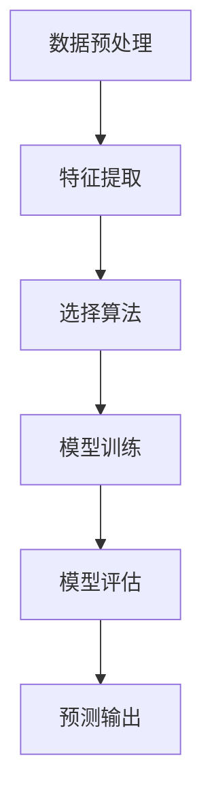
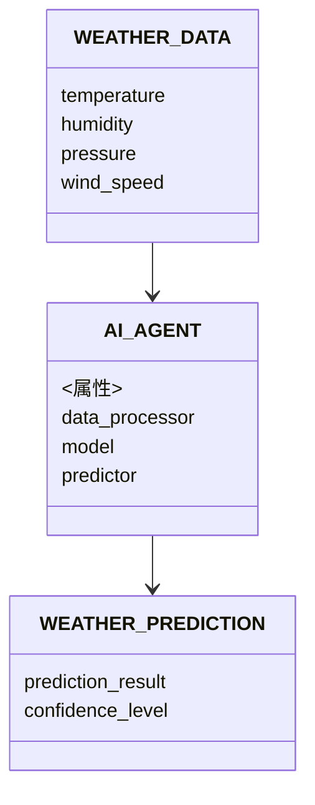
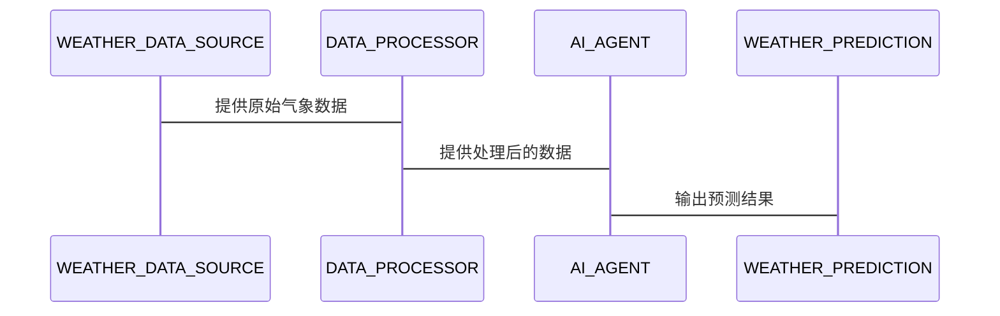

                 


```markdown
# AI Agent在智能天气预报中的实践

> 关键词：AI Agent，智能天气预报，机器学习，深度学习，天气预测

> 摘要：本文详细探讨了AI Agent在智能天气预报中的实践应用，从AI Agent的基本概念、核心原理到算法实现、系统架构设计、项目实战等多方面进行深入分析。通过实际案例，展示了AI Agent如何提升天气预测的准确性和效率，为气象领域提供了新的技术思路。

---

# 第一部分: AI Agent在智能天气预报中的背景与基础

## 第1章: AI Agent与智能天气预报的背景介绍

### 1.1 AI Agent的基本概念

#### 1.1.1 什么是AI Agent
AI Agent（人工智能代理）是指能够感知环境、自主决策并采取行动以实现目标的智能实体。它可以是一个软件程序，也可以是一个物理设备，通过传感器和执行器与环境交互。

#### 1.1.2 AI Agent的核心特征
1. **自主性**：能够独立运行，无需人工干预。
2. **反应性**：能够实时感知环境并做出反应。
3. **目标导向**：所有行为都围绕特定目标展开。
4. **学习能力**：通过数据和经验不断优化自身性能。

#### 1.1.3 AI Agent与传统天气预报的区别
传统的天气预报主要依赖于数值天气预测模型（如全球模式同化系统，GMAS）和气象学家的经验分析。AI Agent的引入使得天气预测更加智能化，能够实时处理海量数据，并通过机器学习算法不断优化预测结果。

### 1.2 智能天气预报的定义与目标

#### 1.2.1 智能天气预报的定义
智能天气预报是指利用人工智能技术，结合气象数据、实时传感器数据和历史气象数据，通过机器学习模型和深度学习模型进行预测，并能够根据实时数据动态调整预测结果的天气预报方式。

#### 1.2.2 智能天气预报的目标
1. 提高天气预测的准确性。
2. 缩短天气预测的响应时间。
3. 实现实时动态调整预测结果。
4. 提供更精细的气象服务（如区域化、个性化预报）。

#### 1.2.3 智能天气预报的优势与挑战
优势：
- 数据处理能力强，能够处理海量非结构化数据。
- 可以通过深度学习模型捕捉复杂的气象特征。
- 实现预测结果的动态优化。

挑战：
- 数据质量要求高，需要高质量的气象数据支持。
- 模型训练需要大量的计算资源。
- 需要处理复杂的气象边界条件。

## 第2章: AI Agent在天气预报中的核心概念与联系

### 2.1 核心概念原理

#### 2.1.1 数据驱动的天气预测
数据驱动的天气预测是指通过收集大量的气象数据（如温度、湿度、气压、风速等），利用机器学习算法进行分析和预测。与传统的基于物理模型的预测方法不同，数据驱动的方法更加依赖于数据质量和算法性能。

#### 2.1.2 AI Agent的决策机制
AI Agent的决策机制是其核心部分，主要包括以下几个步骤：
1. **感知环境**：通过传感器或数据源获取实时气象数据。
2. **数据处理**：对获取的数据进行清洗、特征提取和预处理。
3. **模型预测**：利用训练好的机器学习模型或深度学习模型进行预测。
4. **决策优化**：根据预测结果优化决策策略。

#### 2.1.3 天气数据的特征分析
天气数据的特征分析是智能天气预报的基础，主要包括以下几个方面：
1. **时间序列特征**：如温度、湿度、风速等随时间的变化趋势。
2. **空间特征**：如地理位置对天气的影响。
3. **天气模式特征**：如高压系统、低压系统、锋面等。

### 2.2 核心概念属性对比表格

| 概念         | 特性               | 描述                                                                 |
|--------------|--------------------|----------------------------------------------------------------------|
| 数据源       | 类型               | 温度、湿度、气压、风速、降水等                                       |
| AI Agent     | 功能               | 数据分析、预测、动态调整预测结果                                     |
| 天气预报     | 输出               | 预测结果、概率分析、气象警报                                         |

### 2.3 ER实体关系图

```mermaid
erDiagram
    WEATHER_DATA --|{--> WEATHER_MODELS : 输入数据
    WEATHER_MODELS --|{--> AI_AGENTS : 调用模型
    AI_AGENTS --|{--> FORECAST_RESULTS : 输出预测
```

## 第3章: AI Agent在天气预报中的算法原理

### 3.1 算法原理概述

#### 3.1.1 机器学习算法在天气预测中的应用
机器学习算法在天气预测中的应用主要包括回归、分类和聚类等。例如：
- **回归**：用于预测连续型气象变量（如温度、湿度）。
- **分类**：用于预测离散型气象事件（如是否下雨）。

#### 3.1.2 深度学习算法在天气预测中的应用
深度学习算法在天气预测中的应用主要包括卷积神经网络（CNN）、循环神经网络（RNN）和长短期记忆网络（LSTM）。例如：
- **CNN**：用于处理气象图像数据。
- **LSTM**：用于处理时间序列数据。

### 3.2 算法流程图



### 3.3 代码实现

```python
# 示例代码：基于机器学习的天气预测
import numpy as np
from sklearn.linear_model import LinearRegression

# 数据预处理
data = np.array([[1, 2], [3, 4], [5, 6]])
X = data[:, 0].reshape(-1, 1)
y = data[:, 1]

# 模型训练
model = LinearRegression()
model.fit(X, y)

# 预测
new_data = np.array([[7]]).reshape(-1, 1)
prediction = model.predict(new_data)

print("预测结果:", prediction)
```

---

# 第二部分: AI Agent在智能天气预报中的系统分析与架构设计

## 第4章: 系统分析与架构设计方案

### 4.1 问题场景介绍
智能天气预报系统需要处理海量的气象数据，并实时更新预测结果。为了实现这一目标，系统需要具备以下功能：
1. 数据采集：从各种数据源（如气象卫星、气象站）获取实时气象数据。
2. 数据处理：对获取的数据进行清洗、特征提取和预处理。
3. 模型训练：利用机器学习和深度学习算法训练预测模型。
4. 预测输出：根据实时数据动态调整预测结果。

### 4.2 系统功能设计

#### 4.2.1 领域模型设计


#### 4.2.2 系统架构设计


#### 4.2.3 系统交互设计


### 4.3 系统实现与优化

#### 4.3.1 环境配置
- 操作系统：Linux
- 编程语言：Python 3.8+
- 框架：TensorFlow、Keras
- 数据库：MySQL

#### 4.3.2 核心代码实现
```python
# 示例代码：AI Agent的核心实现
class AI_Agent:
    def __init__(self, model):
        self.model = model
        self.data_processor = DataProcessor()

    def predict(self, data):
        processed_data = self.data_processor.preprocess(data)
        prediction = self.model.predict(processed_data)
        return prediction

    def update_model(self, new_data):
        self.data_processor.update(new_data)
        self.model.fit(self.data_processor.processed_data, self.data_processor.target)
```

---

# 第三部分: 项目实战与优化

## 第5章: 项目实战

### 5.1 项目背景与目标
本项目旨在开发一个基于AI Agent的智能天气预报系统，实现对气象数据的实时分析和动态预测。

### 5.2 数据准备与预处理
#### 5.2.1 数据来源
- 气象卫星数据
- 地面气象站数据
- 历史气象数据

#### 5.2.2 数据预处理
- 数据清洗：处理缺失值、异常值。
- 数据标准化：归一化处理。
- 特征提取：提取有用的气象特征（如温度、湿度、风速等）。

### 5.3 模型训练与优化

#### 5.3.1 选择算法
- 机器学习算法：线性回归、随机森林。
- 深度学习算法：LSTM、CNN。

#### 5.3.2 模型训练
```python
# 示例代码：训练机器学习模型
from sklearn.ensemble import RandomForestRegressor
from sklearn.metrics import mean_squared_error

model = RandomForestRegressor()
model.fit(X_train, y_train)
y_pred = model.predict(X_test)
print("均方误差:", mean_squared_error(y_test, y_pred))
```

#### 5.3.3 模型优化
- 调参：调整模型参数，提高预测精度。
- 交叉验证：评估模型的泛化能力。

### 5.4 系统部署与测试

#### 5.4.1 环境部署
- 安装必要的依赖库。
- 配置数据采集模块。

#### 5.4.2 系统测试
- 功能测试：测试系统各功能模块是否正常运行。
- 性能测试：测试系统在高并发情况下的表现。

### 5.5 优化建议

#### 5.5.1 数据优化
- 增加数据的多样性。
- 提高数据的实时性。

#### 5.5.2 模型优化
- 使用更复杂的深度学习模型。
- 增加模型的训练数据量。

---

# 第四部分: 最佳实践与未来展望

## 第6章: 最佳实践 tips

### 6.1 数据处理 tips
1. 确保数据的高质量。
2. 使用适当的数据预处理方法。

### 6.2 模型选择 tips
1. 根据问题类型选择合适的算法。
2. 对比不同算法的性能。

### 6.3 系统优化 tips
1. 使用分布式计算优化模型训练。
2. 采用流数据处理技术实时更新预测结果。

## 第7章: 小结与展望

### 7.1 小结
本文详细介绍了AI Agent在智能天气预报中的应用，从理论基础到系统实现，再到项目实战，全面探讨了AI Agent在天气预报中的潜力和价值。

### 7.2 未来展望
随着人工智能技术的不断发展，AI Agent在天气预报中的应用前景广阔。未来，可以通过以下方式进一步提升系统的性能：
1. 引入更先进的深度学习模型（如Transformer）。
2. 结合地理信息系统（GIS）技术，实现更精准的空间预测。
3. 研究多模态数据的融合方法，提升预测的准确性和鲁棒性。

---

# 作者

作者：AI天才研究院/AI Genius Institute & 禅与计算机程序设计艺术 /Zen And The Art of Computer Programming
```

