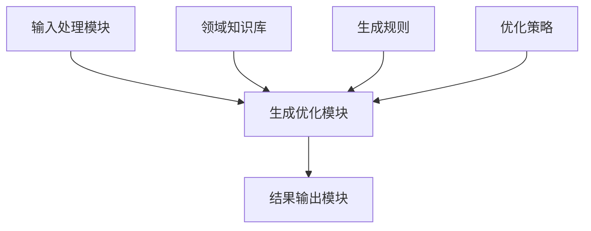

                 


# AI Agent的自然语言生成优化

> 关键词：AI Agent, 自然语言生成, 优化, 深度学习, 生成模型, 对抗训练

> 摘要：本文系统地探讨了AI Agent在自然语言生成优化中的关键技术和方法。通过分析生成模型的原理、优化算法的设计、系统架构的实现以及实际项目的应用，本文为AI Agent的自然语言生成优化提供了全面的理论和实践指导。文章内容涵盖从基础概念到高级算法，从系统设计到项目实战，为读者提供了一条从理论到实践的学习路径。

---

# 第1章: AI Agent与自然语言生成概述

## 1.1 AI Agent的基本概念

### 1.1.1 AI Agent的定义与特点

AI Agent（人工智能代理）是指能够感知环境、自主决策并执行任务的智能实体。AI Agent可以是软件程序、机器人或其他智能系统，其核心目标是通过感知和行动与环境交互，完成特定任务。AI Agent具有以下特点：

1. **自主性**：能够自主决策，无需外部干预。
2. **反应性**：能够实时感知环境并做出反应。
3. **目标导向**：所有行为都围绕实现特定目标展开。
4. **学习能力**：通过经验或数据不断优化自身行为。

AI Agent在自然语言生成中的作用是通过语言交互与用户进行高效沟通，提供信息或服务。这种交互需要生成自然流畅的文本，以提高用户体验。

### 1.1.2 自然语言生成的基本原理

自然语言生成（Natural Language Generation, NLG）是将结构化的数据转化为自然语言文本的过程。其基本原理包括以下步骤：

1. **内容规划**：确定生成文本的主题、目标受众和语境。
2. **文本生成**：根据内容规划生成初步文本。
3. **文本优化**：对生成的文本进行润色，使其更加自然流畅。

### 1.1.3 AI Agent在自然语言生成中的作用

AI Agent通过自然语言生成技术，能够以人类可读的方式输出信息。这不仅提高了交互的便捷性，还增强了用户体验。AI Agent在自然语言生成中的作用主要体现在以下方面：

1. **信息传递**：将复杂的数据转化为易于理解的文本。
2. **个性化沟通**：根据用户需求生成定制化文本。
3. **实时交互**：在动态环境中快速生成相关文本。

---

## 1.2 自然语言生成的优化目标

### 1.2.1 生成文本的质量优化

生成文本的质量是自然语言生成的核心目标。高质量的文本需要满足以下条件：

1. **准确性**：生成的文本要准确反映输入信息。
2. **流畅性**：文本结构合理，语句通顺。
3. **相关性**：文本内容与用户需求高度相关。

### 1.2.2 生成文本的效率优化

生成文本的效率直接影响用户体验。高效的生成过程需要满足以下条件：

1. **快速响应**：在较短时间内生成文本。
2. **资源利用率高**：优化计算资源的使用效率。
3. **并行处理**：支持多任务并行处理。

### 1.2.3 生成文本的可解释性优化

可解释性是自然语言生成的重要特性。生成文本的可解释性优化包括以下内容：

1. **生成过程透明**：用户能够理解生成文本的逻辑。
2. **结果可追溯**：生成的文本可以追溯到原始数据。
3. **模型可解释**：生成模型的行为可以通过一定方式解释。

---

## 1.3 自然语言生成的挑战与解决方案

### 1.3.1 当前自然语言生成的主要挑战

自然语言生成面临以下主要挑战：

1. **语义理解**：准确理解输入数据的语义。
2. **上下文处理**：处理复杂语境中的信息。
3. **生成多样性**：生成多样化的表达方式。
4. **实时性要求**：在动态环境中快速生成文本。

### 1.3.2 解决方案概述

针对上述挑战，目前主要的解决方案包括：

1. **预训练语言模型**：利用大规模数据预训练生成模型。
2. **对抗训练**：通过对抗训练提高生成质量。
3. **领域定制化**：针对特定领域进行模型优化。
4. **多模态输入**：结合图像、语音等多种输入形式。

### 1.3.3 优化方法的分类与比较

优化方法主要分为以下几类：

1. **基于规则的优化**：通过人工规则调整生成文本。
2. **基于统计的优化**：利用统计方法改进生成质量。
3. **基于深度学习的优化**：使用深度神经网络提升生成能力。
4. **基于强化学习的优化**：通过强化学习优化生成过程。

不同优化方法的比较如下表所示：

| 方法类型      | 优点                     | 缺点                     |
|---------------|--------------------------|--------------------------|
| 基于规则的优化 | 实现简单，易于控制        | 需要大量人工规则设计      |
| 基于统计的优化 | 数据驱动，结果客观        | 需要大量数据支持          |
| 基于深度学习的优化 | 强大的特征学习能力        | 训练时间长，资源消耗大      |
| 基于强化学习的优化 | 可以优化复杂目标函数      | 需要设计合适的奖励机制      |

---

## 1.4 本章小结

本章主要介绍了AI Agent与自然语言生成的基本概念、优化目标以及面临的挑战和解决方案。通过这些内容，读者可以理解自然语言生成优化的核心问题和解决思路，为后续章节的学习打下基础。

---

# 第2章: 自然语言生成的原理与模型

## 2.1 自然语言生成的原理

### 2.1.1 生成模型的基本原理

自然语言生成的核心原理是将结构化数据转化为自然语言文本。生成模型通过学习大量文本数据，掌握语言的结构和语义，从而实现文本生成。生成模型的基本原理包括以下步骤：

1. **输入处理**：将输入数据转化为模型可处理的形式。
2. **生成过程**：模型根据输入数据生成初步文本。
3. **优化调整**：对生成的文本进行优化，使其更加自然流畅。

### 2.1.2 基于概率的生成模型

基于概率的生成模型通过计算文本的概率分布，选择最可能的生成文本。其核心思想是通过最大化生成文本的概率来提高生成质量。基于概率的生成模型主要包括以下几种：

1. **马尔可夫链模型**：通过马尔可夫假设生成文本。
2. **隐马尔可夫模型**：结合隐藏层状态生成文本。
3. **变分自编码器**：通过变分推断生成文本。

### 2.1.3 基于规则的生成模型

基于规则的生成模型通过预定义的语法规则生成文本。这种方法的优势在于生成文本的可控性高，但生成结果可能缺乏灵活性和创造性。

---

## 2.2 主流生成模型的比较

### 2.2.1 基于规则的模型与基于统计的模型对比

基于规则的模型与基于统计的模型在以下几个方面存在差异：

1. **生成原理**：基于规则的模型依赖预定义规则，而基于统计的模型依赖数据统计。
2. **生成质量**：基于统计的模型生成质量通常更高，但需要大量数据支持。
3. **实现复杂度**：基于规则的模型实现简单，而基于统计的模型实现复杂。

### 2.2.2 基于统计的模型与深度学习模型对比

基于统计的模型与深度学习模型在以下几个方面存在差异：

1. **特征表示**：基于统计的模型通常使用词袋模型，而深度学习模型使用词嵌入。
2. **训练效率**：基于统计的模型训练效率高，而深度学习模型训练效率较低。
3. **生成质量**：深度学习模型生成质量通常更高。

### 2.2.3 基于深度学习的模型与强化学习模型对比

基于深度学习的模型与强化学习模型在以下几个方面存在差异：

1. **训练方法**：深度学习模型使用监督学习，而强化学习模型使用强化学习。
2. **生成结果**：强化学习模型可以生成多样化结果，而深度学习模型生成结果相对固定。

---

## 2.3 自然语言生成的优化方法

### 2.3.1 基于语言模型的优化

基于语言模型的优化方法通过优化语言模型的参数，提高生成文本的概率。这种方法主要包括以下步骤：

1. **模型训练**：通过大量数据训练语言模型。
2. **生成过程**：根据语言模型生成文本。
3. **优化调整**：通过调整语言模型参数提高生成质量。

### 2.3.2 基于奖励模型的优化

基于奖励模型的优化方法通过定义奖励函数，对生成模型进行优化。这种方法主要包括以下步骤：

1. **定义奖励函数**：设计合适的奖励函数。
2. **训练奖励模型**：通过强化学习训练奖励模型。
3. **优化生成模型**：根据奖励模型优化生成模型。

### 2.3.3 基于对抗训练的优化

基于对抗训练的优化方法通过设计生成器和判别器，进行对抗训练。这种方法主要包括以下步骤：

1. **设计生成器**：生成器负责生成文本。
2. **设计判别器**：判别器负责区分生成文本和真实文本。
3. **训练过程**：通过交替训练生成器和判别器，优化生成模型。

---

## 2.4 本章小结

本章主要介绍了自然语言生成的原理与主流生成模型。通过这些内容，读者可以理解自然语言生成的核心原理和不同模型的优缺点，为后续章节的学习打下基础。

---

# 第3章: 自然语言生成优化的算法原理

## 3.1 生成模型的数学基础

### 3.1.1 生成模型的概率分布

生成模型的概率分布是自然语言生成的数学基础。概率分布的表示方法如下：

$$ P(x) = \frac{1}{Z} \sum_{i=1}^{n} e^{x_i} $$

其中，$x$ 表示生成文本的概率，$Z$ 表示归一化常数。

### 3.1.2 损失函数与优化目标

生成模型的损失函数通常采用交叉熵损失函数，其数学表达式如下：

$$ H(y, p) = -\sum_{i=1}^{n} y_i \log p(y_i) $$

其中，$y_i$ 表示真实标签的概率，$p(y_i)$ 表示生成模型预测的概率。

### 3.1.3 最大似然估计

最大似然估计是一种常用的参数估计方法，其数学表达式如下：

$$ \theta = \arg\max_{\theta} \prod_{i=1}^{n} p(x_i; \theta) $$

其中，$\theta$ 表示模型参数，$x_i$ 表示输入数据。

---

## 3.2 生成模型的优化算法

### 3.2.1 基于梯度的优化方法

基于梯度的优化方法通过计算损失函数的梯度，优化生成模型的参数。常用的梯度优化方法包括随机梯度下降（SGD）和Adam优化器。

### 3.2.2 基于强化学习的优化方法

基于强化学习的优化方法通过定义奖励函数，对生成模型进行优化。强化学习的优化过程如下：

1. **定义奖励函数**：设计合适的奖励函数。
2. **训练生成模型**：通过强化学习训练生成模型。
3. **优化生成策略**：根据奖励函数优化生成策略。

---

## 3.3 对抗训练的优化方法

### 3.3.1 对抗训练的基本原理

对抗训练通过设计生成器和判别器，进行对抗训练。生成器的目标是生成与真实数据无法区分的假数据，而判别器的目标是区分真实数据和生成数据。

### 3.3.2 对抗训练的数学模型

对抗训练的数学模型如下：

$$ \min_{G} \max_{D} \mathbb{E}_{x \sim p_{\text{data}}(x)}[\log D(x)] + \mathbb{E}_{z \sim p(z)}[\log (1 - D(G(z)))] $$

其中，$G$ 表示生成器，$D$ 表示判别器，$z$ 表示噪声输入。

---

## 3.4 本章小结

本章主要介绍了自然语言生成优化的算法原理，包括生成模型的数学基础、优化算法和对抗训练方法。通过这些内容，读者可以理解自然语言生成优化的核心算法，为后续章节的学习打下基础。

---

# 第4章: 自然语言生成优化的系统设计

## 4.1 系统分析与设计

### 4.1.1 问题场景介绍

自然语言生成优化的系统设计需要解决以下问题：

1. **生成质量**：如何提高生成文本的质量。
2. **生成效率**：如何提高生成文本的效率。
3. **生成可解释性**：如何提高生成文本的可解释性。

### 4.1.2 系统功能设计

自然语言生成优化系统的功能设计包括以下模块：

1. **输入处理模块**：处理输入数据并生成初步文本。
2. **生成优化模块**：对生成文本进行优化，提高生成质量。
3. **结果输出模块**：输出优化后的文本。

### 4.1.3 领域模型设计

领域模型设计是系统设计的重要部分，主要包括以下内容：

1. **领域知识库**：存储领域相关的知识和数据。
2. **生成规则**：定义生成文本的规则和约束。
3. **优化策略**：定义生成优化的策略和方法。

---

## 4.2 系统架构设计

### 4.2.1 系统架构图

自然语言生成优化系统的架构设计如下：



### 4.2.2 接口设计

系统接口设计包括以下内容：

1. **输入接口**：接收输入数据并传递给输入处理模块。
2. **输出接口**：输出优化后的文本并传递给结果输出模块。
3. **知识库接口**：与领域知识库进行交互，获取相关知识。

---

## 4.3 本章小结

本章主要介绍了自然语言生成优化的系统设计，包括问题场景分析、系统功能设计和系统架构设计。通过这些内容，读者可以理解自然语言生成优化的系统实现方法，为后续章节的学习打下基础。

---

# 第5章: 自然语言生成优化的项目实战

## 5.1 项目环境与安装

### 5.1.1 环境要求

自然语言生成优化项目需要以下环境：

1. **Python 3.7+**
2. **TensorFlow 2.0+**
3. **Keras 2.2.4+**
4. **GPU支持（可选）**

### 5.1.2 安装依赖

安装依赖可以通过以下命令完成：

```bash
pip install numpy tensorflow keras
```

---

## 5.2 项目核心代码实现

### 5.2.1 生成模型实现

生成模型的实现代码如下：

```python
import numpy as np
import tensorflow as tf
from tensorflow import keras

# 定义生成器模型
def build_generator():
    model = keras.Sequential()
    model.add(keras.layers.Dense(256, activation='relu', input_dim=100))
    model.add(keras.layers.Dense(256, activation='relu'))
    model.add(keras.layers.Dense(784, activation='sigmoid'))
    return model

# 定义判别器模型
def build_discriminator():
    model = keras.Sequential()
    model.add(keras.layers.Dense(256, activation='relu', input_dim=784))
    model.add(keras.layers.Dense(256, activation='relu'))
    model.add(keras.layers.Dense(1, activation='sigmoid'))
    return model
```

---

## 5.3 项目实战分析

### 5.3.1 生成模型的训练

生成模型的训练过程如下：

1. **定义损失函数**：定义生成模型的损失函数。
2. **训练生成器**：通过对抗训练优化生成器。
3. **训练判别器**：通过对抗训练优化判别器。

### 5.3.2 优化策略的实现

优化策略的实现包括以下步骤：

1. **定义奖励函数**：设计合适的奖励函数。
2. **训练奖励模型**：通过强化学习训练奖励模型。
3. **优化生成策略**：根据奖励模型优化生成策略。

---

## 5.4 本章小结

本章通过实际项目展示了自然语言生成优化的实现过程，包括项目环境配置、核心代码实现和项目实战分析。通过这些内容，读者可以理解自然语言生成优化的实际应用，为后续章节的学习打下基础。

---

# 第6章: 自然语言生成优化的最佳实践

## 6.1 最佳实践

### 6.1.1 优化方法的选择

优化方法的选择需要考虑以下因素：

1. **生成质量**：选择能够提高生成质量的优化方法。
2. **生成效率**：选择能够提高生成效率的优化方法。
3. **生成可解释性**：选择能够提高生成可解释性的优化方法。

### 6.1.2 模型调优技巧

模型调优技巧包括以下内容：

1. **参数调整**：合理调整模型参数。
2. **数据预处理**：对输入数据进行合理的预处理。
3. **模型评估**：通过评估指标优化模型性能。

### 6.1.3 系统优化建议

系统优化建议包括以下内容：

1. **资源优化**：优化计算资源的使用效率。
2. **并行处理**：支持多任务并行处理。
3. **系统架构优化**：优化系统架构设计。

---

## 6.2 小结

通过以上内容，读者可以理解自然语言生成优化的最佳实践，包括优化方法的选择、模型调优技巧和系统优化建议。

---

## 6.3 注意事项

在实际应用中，需要注意以下事项：

1. **数据质量**：确保输入数据的质量，避免低质量数据影响生成效果。
2. **模型泛化能力**：提高生成模型的泛化能力，使其能够适应不同的场景。
3. **模型可解释性**：确保生成模型的可解释性，便于调试和优化。

---

## 6.4 拓展阅读

推荐以下拓展阅读资料：

1. **《生成式人工智能：方法与应用》**
2. **《深度学习自然语言处理》**
3. **《自然语言生成技术》**

---

# 作者：AI天才研究院/AI Genius Institute & 禅与计算机程序设计艺术 /Zen And The Art of Computer Programming

---

**总结：** 本文系统地探讨了AI Agent在自然语言生成优化中的关键技术和方法。通过分析生成模型的原理、优化算法的设计、系统架构的实现以及实际项目的应用，本文为AI Agent的自然语言生成优化提供了全面的理论和实践指导。文章内容涵盖从基础概念到高级算法，从系统设计到项目实战，为读者提供了一条从理论到实践的学习路径。

