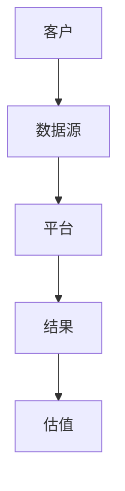
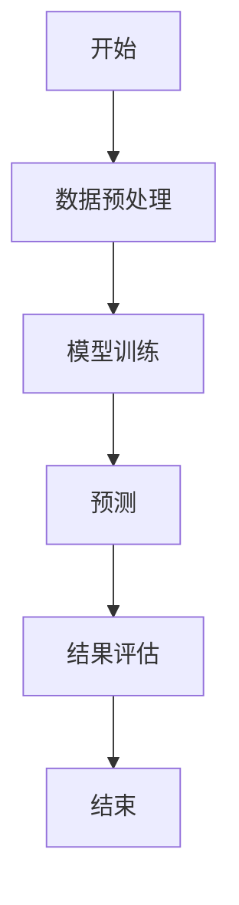
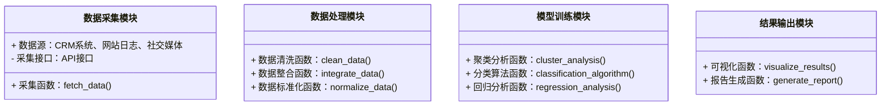
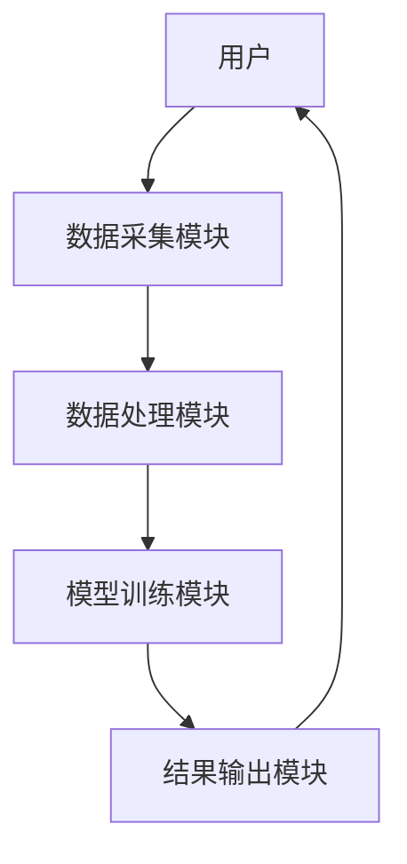
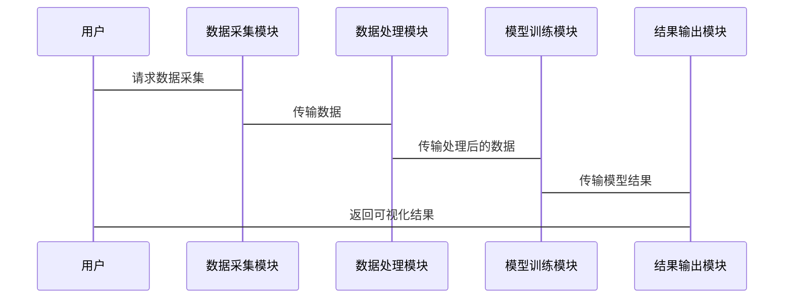

                 


# 企业估值中的AI驱动的自动化客户洞察平台评估

## 关键词：
- 企业估值, AI驱动, 客户洞察, 平台评估, 数据分析, 机器学习, 人工智能

## 摘要：
本文详细探讨了AI驱动的自动化客户洞察平台在企业估值中的应用。通过分析传统企业估值方法的局限性，提出了一种基于AI技术的客户洞察解决方案。文章从背景介绍、核心概念、算法原理、数学模型、系统架构设计、项目实战等多个方面展开，结合实际案例和代码实现，全面剖析了AI驱动的客户洞察平台在企业估值中的优势和应用场景。文章最后总结了平台的关键优势，并提出了相关的最佳实践建议。

---

# 第一部分: 企业估值中的AI驱动的自动化客户洞察平台背景介绍

# 第1章: 企业估值与客户洞察平台概述

## 1.1 问题背景与描述
### 1.1.1 传统企业估值方法的局限性
传统的企业估值方法主要依赖于财务指标和历史数据，例如市盈率、市净率、现金流折现法（DCF）等。这些方法虽然在一定程度上能够反映企业的价值，但存在以下局限性：
- 数据依赖性：过于依赖历史数据和财务指标，难以捕捉企业的未来增长潜力。
- 非财务因素忽视：难以量化客户关系、品牌价值等非财务因素对企业价值的影响。
- 数据处理复杂：面对海量数据时，传统方法难以高效处理和分析。

### 1.1.2 客户洞察在企业估值中的重要性
客户洞察是指通过对客户数据的深度分析，挖掘客户的特征、行为和需求，从而帮助企业更好地理解客户价值。在企业估值中，客户洞察可以帮助企业：
- 量化客户价值：通过分析客户生命周期价值（CLV）等指标，评估客户的长期贡献。
- 识别高价值客户：通过客户分群和画像，识别高价值客户，优化资源配置。
- 预测客户流失：通过预测客户流失率，评估客户保留的成本和收益。

### 1.1.3 AI驱动的客户洞察平台的提出
AI驱动的客户洞察平台是一种基于人工智能技术的自动化解决方案，能够从海量数据中提取有价值的信息，帮助企业在估值过程中更好地理解客户行为和需求。与传统方法相比，AI驱动的客户洞察平台具有以下优势：
- 高效性：通过自动化数据处理和分析，大幅提高数据处理效率。
- 深度分析：利用机器学习算法，挖掘数据中的非直观关系。
- 实时性：能够实时分析数据，提供动态的客户洞察。

## 1.2 问题解决与边界
### 1.2.1 AI驱动客户洞察平台的核心目标
AI驱动的客户洞察平台的核心目标是通过自动化数据处理和机器学习算法，帮助企业实现客户价值的深度分析和预测，从而为企业的估值提供更精准的数据支持。

### 1.2.2 平台的边界与外延
AI驱动的客户洞察平台的边界在于：
- 数据范围：主要处理与客户相关的数据，例如交易数据、行为数据、反馈数据等。
- 业务场景：主要用于企业估值、客户分群、客户画像等场景。
- 技术实现：基于机器学习算法和大数据处理技术。

### 1.2.3 与传统客户分析方法的区别
AI驱动的客户洞察平台与传统客户分析方法的主要区别在于：
- 数据处理效率：AI平台能够快速处理海量数据，而传统方法依赖人工分析。
- 分析深度：AI平台能够挖掘数据中的非直观关系，而传统方法仅依赖简单的统计分析。
- 实时性：AI平台能够实时分析数据，而传统方法通常依赖于定期报告。

## 1.3 核心概念与组成要素
### 1.3.1 核心概念的结构化分析
AI驱动的客户洞察平台的核心概念包括：
- 数据采集：从多种数据源（如CRM系统、网站日志、社交媒体等）获取客户数据。
- 数据处理：对数据进行清洗、整合和标准化处理。
- 模型训练：利用机器学习算法（如聚类分析、回归分析等）对数据进行建模。
- 结果输出：生成客户画像、客户分群、客户价值预测等结果。

### 1.3.2 平台功能模块的构成
AI驱动的客户洞察平台的功能模块包括：
- 数据采集模块：负责从多种数据源采集客户数据。
- 数据处理模块：对采集到的数据进行清洗、整合和标准化处理。
- 模型训练模块：利用机器学习算法对数据进行建模。
- 结果输出模块：生成客户画像、客户分群、客户价值预测等结果。

### 1.3.3 各模块之间的关系
各模块之间的关系如下：
1. 数据采集模块从多种数据源采集客户数据。
2. 数据处理模块对采集到的数据进行清洗、整合和标准化处理。
3. 模型训练模块利用处理后的数据进行建模，生成客户画像和客户分群。
4. 结果输出模块将建模结果输出为可读的报告或可视化图表。

## 1.4 本章小结
本章介绍了AI驱动的客户洞察平台的背景、核心概念和组成要素。通过分析传统企业估值方法的局限性，提出了AI驱动的客户洞察平台的概念，并详细描述了平台的核心目标和功能模块。

---

# 第二部分: AI驱动的客户洞察平台核心概念与联系

# 第2章: AI驱动的客户洞察平台原理

## 2.1 核心原理概述
### 2.1.1 数据采集与处理
AI驱动的客户洞察平台的第一步是数据采集和处理。数据源包括：
- CRM系统：客户的基本信息、交易记录、联系记录等。
- 网站日志：客户的浏览行为、点击行为、搜索记录等。
- 社交媒体：客户的评论、点赞、分享等行为数据。

数据处理包括：
- 数据清洗：去除重复数据、处理缺失值、纠正错误数据。
- 数据整合：将来自不同数据源的数据进行整合，形成统一的数据集。
- 数据标准化：将数据转换为统一的格式，例如将日期格式统一为ISO标准格式。

### 2.1.2 AI算法的核心流程
AI驱动的客户洞察平台的核心流程是模型训练。常用的算法包括：
- 聚类分析：将客户分为不同的群体，例如高价值客户、中等价值客户、低价值客户。
- 回归分析：预测客户的价值、流失概率等。
- 分类算法：将客户分为不同的类别，例如 churn 风险高低客户。

### 2.1.3 结果输出与反馈机制
模型训练完成后，平台会生成客户画像、客户分群、客户价值预测等结果。这些结果可以通过可视化图表、报告等形式呈现给用户。

## 2.2 核心概念属性对比表
以下是核心概念的属性对比表：

| 概念         | 数据源 | 数据处理 | 算法模型 | 输出结果 |
|--------------|--------|----------|----------|----------|
| 客户画像     | CRM数据 | 清洗、标准化 | 聚类分析 | 客户特征 |
| 客户分群     | 网站日志 | 整合、标准化 | 分类算法 | 客户群体 |
| 客户价值预测 | 社交媒体数据 | 清洗、整合 | 回归分析 | 客户价值 |

## 2.3 ER实体关系图
以下是ER实体关系图：



## 2.4 本章小结
本章详细介绍了AI驱动的客户洞察平台的核心原理，包括数据采集与处理、算法模型的选择与实现、结果输出与反馈机制。通过对比分析，明确了各个概念的属性和关系。

---

# 第三部分: 算法原理与数学模型

# 第3章: 算法原理讲解

## 3.1 算法流程图
以下是算法流程图：



## 3.2 算法实现代码
以下是Python代码示例：

```python
def preprocess(data):
    # 数据预处理代码
    return processed_d

def train_model(processed_data):
    # 模型训练代码
    return model

def predict(model, new_data):
    # 预测代码
    return predictions

def evaluate(predictions, actual):
    # 结果评估代码
    return evaluation_metrics
```

## 3.3 数学模型和公式
以下是数学模型和公式：

客户价值预测模型可以表示为：

$$
\text{客户价值} = \beta_0 + \beta_1 \times \text{收入} + \beta_2 \times \text{忠诚度} + \epsilon
$$

其中，$\beta_0$ 是截距，$\beta_1$ 和 $\beta_2$ 是回归系数，$\epsilon$ 是误差项。

---

# 第四部分: 系统分析与架构设计

# 第4章: 系统分析与架构设计方案

## 4.1 问题场景介绍
AI驱动的客户洞察平台需要解决以下问题：
- 如何高效地从多种数据源采集客户数据？
- 如何对采集到的数据进行清洗、整合和标准化处理？
- 如何选择合适的算法模型，并对其进行训练？
- 如何将模型结果输出为可读的报告或可视化图表？

## 4.2 项目介绍
本项目的目标是开发一个AI驱动的客户洞察平台，能够从多种数据源采集客户数据，并利用机器学习算法对数据进行建模，生成客户画像、客户分群和客户价值预测等结果。

## 4.3 系统功能设计
以下是系统功能设计的类图：



## 4.4 系统架构设计
以下是系统架构设计的架构图：



## 4.5 系统接口设计
系统接口设计包括：
- 数据采集模块的API接口：用于从CRM系统、网站日志、社交媒体等数据源采集数据。
- 模型训练模块的API接口：用于接收处理后的数据，并返回模型训练结果。
- 结果输出模块的API接口：用于生成可视化图表和报告。

## 4.6 系统交互设计
以下是系统交互设计的序列图：



---

# 第五部分: 项目实战

# 第5章: 项目实战

## 5.1 环境安装与配置
以下是环境安装与配置步骤：
1. 安装Python：建议使用Python 3.8或更高版本。
2. 安装必要的库：例如numpy、pandas、scikit-learn、matplotlib等。
   ```bash
   pip install numpy pandas scikit-learn matplotlib
   ```

## 5.2 系统核心实现源代码
以下是系统核心实现的源代码：

```python
import numpy as np
import pandas as pd
from sklearn.cluster import KMeans
from sklearn.metrics import silhouette_score
import matplotlib.pyplot as plt

def fetch_data():
    # 从CRM系统采集数据
    return pd.read_csv('customer_data.csv')

def clean_data(data):
    # 数据清洗
    data.dropna(inplace=True)
    return data

def train_model(processed_data):
    # 聚类分析
    X = processed_data[['收入', '忠诚度']]
    kmeans = KMeans(n_clusters=3, random_state=42)
    kmeans.fit(X)
    return kmeans

def visualize_results(model, data):
    # 可视化结果
    plt.figure(figsize=(10, 6))
    plt.scatter(data['收入'], data['忠诚度'], c=model.labels_, cmap='viridis')
    plt.xlabel('收入')
    plt.ylabel('忠诚度')
    plt.title('客户分群')
    plt.show()

if __name__ == '__main__':
    data = fetch_data()
    processed_data = clean_data(data)
    model = train_model(processed_data)
    visualize_results(model, processed_data)
```

## 5.3 代码应用解读与分析
上述代码实现了一个简单的客户分群功能。具体步骤如下：
1. 从CRM系统采集数据。
2. 对数据进行清洗，去除缺失值。
3. 使用K均值聚类算法对数据进行建模，将客户分为三类。
4. 可视化结果，展示客户的收入和忠诚度分布。

## 5.4 实际案例分析
以一个零售企业的客户数据为例，假设我们已经采集了以下数据：

| 客户ID | 收入 | 忠诚度 |
|-------|------|--------|
| C001  | 5000 | 0.8     |
| C002  | 3000 | 0.6     |
| C003  | 8000 | 0.9     |
| ...   | ...  | ...     |

通过上述代码，我们可以将这些客户分为三类：

1. 高价值客户（忠诚度高，收入高）。
2. 中等价值客户（忠诚度中等，收入中等）。
3. 低价值客户（忠诚度低，收入低）。

## 5.5 项目小结
本章通过实际案例分析，展示了AI驱动的客户洞察平台的核心功能。通过代码实现，读者可以理解如何利用机器学习算法对客户数据进行建模，并生成客户分群等结果。

---

# 第六部分: 总结与展望

# 第6章: 总结与展望

## 6.1 平台优势总结
AI驱动的客户洞察平台具有以下优势：
- 高效性：能够快速处理海量数据。
- 深度分析：能够挖掘数据中的非直观关系。
- 实时性：能够实时分析数据，提供动态的客户洞察。

## 6.2 最佳实践 tips
- 数据质量：确保数据的准确性和完整性。
- 模型选择：根据具体业务需求选择合适的算法模型。
- 可视化：通过可视化图表帮助用户更好地理解结果。

## 6.3 未来展望
随着人工智能技术的不断发展，AI驱动的客户洞察平台将在企业估值中发挥越来越重要的作用。未来的研究方向包括：
- 更加复杂的模型：例如深度学习模型。
- 实时分析：实时处理数据，提供实时的客户洞察。
- 多模态数据：整合文本、图像等多种数据源。

---

# 作者：AI天才研究院/AI Genius Institute & 禅与计算机程序设计艺术/Zen And The Art of Computer Programming

