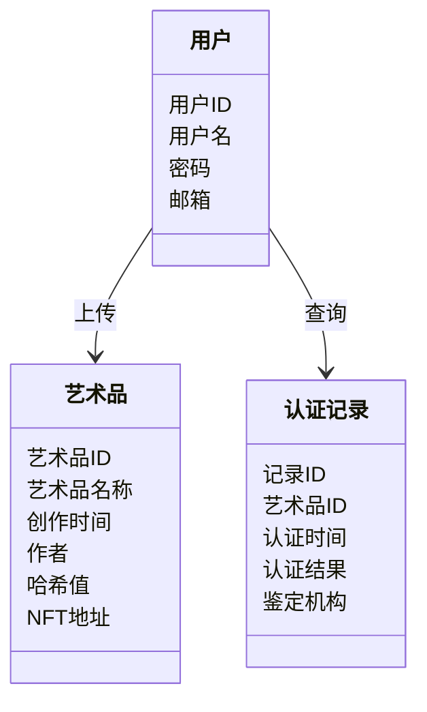

                 


```markdown
# 企业估值中的区块链数字艺术品认证平台评估

> **关键词**: 区块链, 数字艺术品, 企业估值, 认证平台, 智能合约, 数字版权, 去中心化

> **摘要**: 本文探讨了区块链技术在数字艺术品认证中的应用，分析了其对企业和艺术市场估值的影响。通过详细的技术分析和案例研究，展示了如何利用区块链实现数字艺术品的溯源和确权，从而提升企业估值。文章从背景、技术原理到系统架构和项目实战，全面阐述了区块链数字艺术品认证平台的构建与应用。

---

# 第1章：数字艺术品市场与区块链技术

## 1.1 数字艺术品市场的现状与挑战

### 1.1.1 数字艺术品市场的快速发展

数字艺术品市场近年来呈现爆发式增长，NFT（非同质化代币）的兴起使得数字艺术作品的价值得到了前所未有的认可。然而，市场的快速发展也带来了诸多挑战，如艺术品的真伪辨别困难、抄袭现象频发、交易透明度不足等问题。

### 1.1.2 当前市场中的问题与痛点

- **抄袭与侵权**：数字艺术品易于复制，导致原创作品的权益难以保障。
- **缺乏信任机制**：买家难以确定艺术品的来源和真实性，影响市场交易的活跃度。
- **交易透明度低**：艺术品的流转记录不清晰，影响其价值评估。

### 1.1.3 区块链技术如何解决这些问题

区块链通过去中心化、不可篡改和可追溯的特性，为数字艺术品的认证和交易提供了可靠的技术支持。区块链可以记录艺术品的创作、所有权变更和交易历史，确保每件作品的唯一性和真实性。

---

## 1.2 区块链技术的基本概念

### 1.2.1 区块链的定义与核心特性

区块链是一种分布式账本技术，通过去中心化的共识机制记录数据，确保数据的安全性和不可篡改性。其核心特性包括：

1. **去中心化**：数据存储在多个节点，避免单点故障。
2. **不可篡改**：数据一旦上链，难以被修改或删除。
3. **可追溯**：每条数据都有明确的来源和时间戳，便于追踪。

### 1.2.2 区块链的三种主要类型：公链、私链、联盟链

| 类型   | 描述                                      | 适用场景                     |
|--------|------------------------------------------|------------------------------|
| 公链   | 开放式区块链，任何人都可以参与             | 去中心化金融（DeFi）、NFT交易 |
| 私链   | 受限的区块链，仅限特定参与者               | 企业内部数据管理             |
| 联盟链 | 多个机构共同参与的区块链，权限可控         | 供应链管理、行业联盟          |

### 1.2.3 区块链在数字艺术品领域的应用潜力

区块链可以用于数字艺术品的认证、溯源、交易和版权保护。通过区块链，艺术家可以确保证件的唯一性和所有权，买家也能通过区块链查询艺术品的历史，确保购买的合法性。

---

## 1.3 数字艺术品认证平台的系统架构

### 1.3.1 平台的基本功能模块

- **用户模块**：用户注册、登录、个人资料管理。
- **艺术品模块**：艺术品上链、存储、展示。
- **认证模块**：艺术品的认证、溯源查询。
- **交易模块**：艺术品的购买、转让、交易记录追踪。

### 1.3.2 平台的用户角色与权限分配

| 角色     | 描述                     | 权限               |
|----------|--------------------------|--------------------|
| 艺术家    | 创作并上传艺术品           | 上传作品、管理作品 |
| 买家     | 购买数字艺术品             | 浏览作品、购买作品 |
| 收藏家   | 收藏和管理数字艺术品       | 查询作品、持有作品 |
| 鉴定机构 | 鉴定作品真伪               | 提供认证服务         |

### 1.3.3 平台的法律与合规性考虑

平台需遵守相关法律法规，确保数据的安全性和合法性。此外，平台还需与法律机构合作，为用户提供法律支持，确保艺术品的版权保护和交易的合法性。

---

# 第2章：区块链的核心技术与实现原理

## 2.1 区块链的核心技术

### 2.1.1 去中心化与分布式账本

区块链通过分布式账本记录数据，每个节点都有一份完整的数据副本，确保数据的完整性和一致性。

### 2.1.2 共识机制：工作量证明（PoW）、权益证明（PoS）等

| 共识机制 | 描述                     | 优缺点               |
|----------|--------------------------|----------------------|
| PoW      | 基于计算工作量来产生区块   | 安全性高，但能耗高    |
| PoS      | 基于持币者权益来产生区块   | 能耗低，但存在“富者越富”风险 |

### 2.1.3 智能合约的原理与应用

智能合约是区块链上的自动执行程序，用于自动执行合同条款。在数字艺术品平台中，智能合约可以用于自动执行交易、分配收益等。

---

## 2.2 区块链的实现原理

### 2.2.1 区块的结构与哈希计算

每个区块包含以下字段：

- **区块头**：包含前一个区块的哈希、时间戳、随机数等。
- **交易列表**：记录该区块中的所有交易。
- **哈希值**：区块内容的哈希值，用于唯一标识区块。

哈希计算确保了区块内容的不可篡改性。

### 2.2.2 区块链的共识过程

共识过程是区块链的核心，通过共识机制确保所有节点达成一致。常见的共识机制包括PoW和PoS。

### 2.2.3 智能合约的编译与部署

智能合约通常使用Solidity语言编写，编译后部署到区块链上。部署后，智能合约可以自动执行预设的逻辑。

---

## 2.3 数字艺术品认证的实现流程

### 2.3.1 数字艺术品的上链过程

1. 艺术家将作品生成为特定格式（如JSON、图片）。
2. 平台将作品哈希值记录到区块链，确保作品的唯一性。
3. 每个作品生成唯一的NFT，记录在区块链上。

### 2.3.2 认证信息的存储与查询

- **存储**：艺术品的元数据（如创作时间、作者信息）和交易历史存储在区块链上。
- **查询**：用户可以通过区块链查询艺术品的来源和历史，确保作品的真实性。

### 2.3.3 权益证明与转让的实现

- **权益证明**：通过智能合约记录艺术品的所有权，确保转让过程透明可追溯。
- **转让**：买家购买艺术品后，智能合约自动更新所有权信息。

---

# 第3章：系统分析与架构设计

## 3.1 系统功能设计与分析

### 3.1.1 用户需求分析

- **艺术家**：需要方便地上传作品，并确保证件的唯一性。
- **买家**：需要快速查询作品真伪，并安全购买。
- **收藏家**：需要管理和展示收藏的作品。
- **鉴定机构**：需要提供专业的认证服务，并确保认证结果的权威性。

### 3.1.2 系统功能设计

- **艺术品上链**：艺术家上传作品，系统生成NFT并记录到区块链。
- **认证查询**：用户可以通过输入作品信息查询其真伪和历史。
- **交易模块**：支持作品的购买、转让和交易记录追踪。

---

## 3.2 系统架构设计

### 3.2.1 问题场景介绍

数字艺术品认证平台需要处理大量的艺术品上传、认证和交易请求，系统需要具备高可用性和高性能。

### 3.2.2 项目介绍

本项目旨在构建一个基于区块链的数字艺术品认证平台，通过区块链技术实现艺术品的溯源和确权，提升企业的估值能力。

### 3.2.3 系统功能设计（领域模型mermaid类图）



### 3.2.4 系统架构设计（mermaid架构图）


### 3.2.5 接口设计与交互设计

- **API设计**：
  - `/api/upload`：上传艺术品
  - `/api/query`：查询艺术品信息
  - `/api/transfer`：转让艺术品

- **交互流程**：
  1. 用户登录系统，选择上传作品。
  2. 系统生成作品哈希值，调用智能合约上链。
  3. 用户可以查看作品的区块链记录，确保其真实性。

---

## 3.3 系统实现与优化

### 3.3.1 系统实现细节

- **智能合约开发**：使用Solidity编写合约，实现艺术品的上链和转让功能。
- **前后端分离**：前端采用React框架，后端采用Node.js和Express框架。
- **数据库设计**：使用MongoDB存储用户信息和艺术品元数据，区块链存储交易记录。

### 3.3.2 性能优化

- **并行处理**：优化区块链节点的处理能力，提高交易确认速度。
- **缓存机制**：对高频访问的数据进行缓存，减少数据库压力。

---

## 3.4 项目总结与展望

通过本项目的实施，我们成功构建了一个基于区块链的数字艺术品认证平台，实现了艺术品的溯源和确权。未来，我们可以进一步优化系统性能，扩展更多功能，如艺术品保险、鉴定机构信用评估等，为数字艺术品市场的发展提供更有力的支持。

---

# 第4章：项目实战

## 4.1 环境搭建

### 4.1.1 安装以太坊开发环境

```bash
npm install -g truffle
npm install -g solidity-compiler
```

### 4.1.2 安装Solidity智能合约开发工具

```bash
npm install -g ethereumjs-abi-utils
```

### 4.1.3 安装Node.js和Express框架

```bash
npm install express
npm install body-parser
```

---

## 4.2 核心代码实现

### 4.2.1 智能合约实现

```solidity
// SPDX-License-Identifier: MIT
pragma solidity ^0.8.0;

contract ArtNFT {
    struct ArtPiece {
        uint256 tokenId;
        string name;
        address owner;
        uint256 timestamp;
    }

    mapping(uint256 => ArtPiece) public artPieces;

    function createArt(uint256 tokenId, string memory name) public {
        ArtPiece memory piece = ArtPiece({
            tokenId: tokenId,
            name: name,
            owner: msg.sender,
            timestamp: block.timestamp
        });
        artPieces[tokenId] = piece;
    }

    function transfer(uint256 tokenId, address recipient) public {
        require(msg.sender == artPieces[tokenId].owner, "Not owner");
        artPieces[tokenId].owner = recipient;
    }
}
```

### 4.2.2 后端接口实现

```javascript
const express = require('express');
const bodyParser = require('body-parser');
const app = express();

app.use(bodyParser.json());

app.post('/api/upload', async (req, res) => {
    const { tokenId, name } = req.body;
    try {
        // 调用智能合约创建NFT
        const result = await contract.createArt(tokenId, name);
        res.status(200).json({ success: true, message: 'Art created successfully' });
    } catch (error) {
        res.status(500).json({ success: false, error: error.message });
    }
});

app.put('/api/transfer', async (req, res) => {
    const { tokenId, recipient } = req.body;
    try {
        // 调用智能合约转移NFT
        const result = await contract.transfer(tokenId, recipient);
        res.status(200).json({ success: true, message: 'Transfer successful' });
    } catch (error) {
        res.status(500).json({ success: false, error: error.message });
    }
});
```

---

## 4.3 案例分析与代码解读

### 4.3.1 案例分析

假设一位艺术家上传了一件数字艺术品， tokenId为123，名称为“Digital Masterpiece”。系统将调用智能合约创建NFT，并记录在区块链上。当买家购买该作品后，系统将调用`transfer`方法，将所有权转移至买家地址。

### 4.3.2 代码解读

- **智能合约**：通过`createArt`方法创建艺术品记录，`transfer`方法实现所有权转移。
- **后端接口**：`/api/upload`接口用于上传作品，`/api/transfer`接口用于转让作品。

---

## 4.4 项目小结

通过本项目的实施，我们展示了区块链技术在数字艺术品认证中的应用。系统实现了艺术品的上链、认证和转让功能，确保了作品的唯一性和交易的透明性。未来，我们可以进一步优化系统性能，增加更多功能，如艺术品保险和鉴定机构信用评估。

---

# 第5章：最佳实践

## 5.1 小结

本文详细探讨了区块链技术在数字艺术品认证中的应用，分析了其对企业估值的影响。通过技术实现和案例分析，展示了区块链技术在提升数字艺术品市场透明度和信任度中的巨大潜力。

## 5.2 注意事项

- **安全性**：确保智能合约的安全性，避免漏洞被利用。
- **性能优化**：优化区块链节点的处理能力，提升交易确认速度。
- **用户体验**：设计直观易用的用户界面，降低用户使用门槛。

## 5.3 拓展阅读

- 《Mastering Blockchain》
- 《Solidity编程指南》
- 《区块链开发实战》

---

# 作者：AI天才研究院 & 禅与计算机程序设计艺术

```

