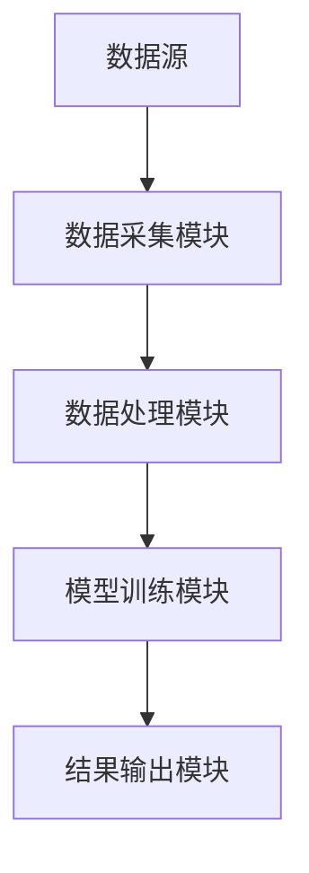

                 


# 企业估值中的情境感知技术应用评估

> 关键词：情境感知技术，企业估值，算法原理，系统架构，项目实战

> 摘要：本文探讨了情境感知技术在企业估值中的应用，通过详细分析情境感知技术的核心概念、算法原理、系统架构以及实际项目案例，展示了如何利用情境感知技术提升企业估值的准确性和实时性。文章从背景介绍到具体实现，层层深入，结合数学模型和系统设计，为企业估值领域提供了新的视角和解决方案。

---

# 第一部分: 企业估值中的情境感知技术概述

## 第1章: 情境感知技术与企业估值的背景

### 1.1 情境感知技术的基本概念

#### 1.1.1 情境感知技术的定义
情境感知技术是一种通过感知环境信息、分析数据并生成上下文信息的技术。其核心目标是理解当前场景中的实体、关系和情境，从而为后续决策提供支持。例如，在企业估值中，情境感知技术可以通过分析市场环境、企业财务数据和行业趋势，生成与企业估值相关的上下文信息。

#### 1.1.2 情境感知技术的核心特征
- **实时性**：能够快速感知和分析环境信息。
- **上下文理解**：能够理解场景中的实体关系和语义信息。
- **适应性**：能够根据环境变化动态调整感知策略。

#### 1.1.3 情境感知技术的应用领域
情境感知技术广泛应用于多个领域，包括：
- 智能交通系统
- 智慧医疗
- 智能金融
- 智慧教育

### 1.2 企业估值的基本概念

#### 1.2.1 企业估值的定义
企业估值是指通过对企业的财务数据、市场表现和行业趋势等多方面因素进行分析，估算企业价值的过程。企业估值是投资决策、并购交易和企业战略规划的重要基础。

#### 1.2.2 企业估值的主要方法
- **市场法**：通过比较类似企业的市场价值进行估值。
- **收益法**：基于企业的预期收益进行估值。
- **资产法**：基于企业的资产价值进行估值。

#### 1.2.3 企业估值的重要性和挑战
- **重要性**：企业估值是企业价值发现、投资决策和资本运作的关键依据。
- **挑战**：数据多样性、市场波动性和模型准确性等因素增加了企业估值的难度。

### 1.3 情境感知技术与企业估值的结合

#### 1.3.1 情境感知技术在企业估值中的应用背景
随着大数据和人工智能技术的快速发展，企业估值需要更加智能化和精准化。情境感知技术能够实时感知市场环境和企业动态，为估值模型提供更丰富的数据支持。

#### 1.3.2 情境感知技术如何提升企业估值的准确性
通过情境感知技术，可以实时获取市场动态、行业趋势和企业财务数据，结合这些信息进行多维度分析，从而提高企业估值的准确性和全面性。

#### 1.3.3 企业估值中情境感知技术的核心价值
- **数据丰富性**：整合多源异构数据，提升估值模型的输入质量。
- **实时性**：快速响应市场变化，提供动态估值支持。
- **决策支持**：通过情境感知提供更全面的决策依据。

---

## 第2章: 情境感知技术与企业估值的核心概念

### 2.1 情境感知技术的原理

#### 2.1.1 情境感知技术的基本原理
情境感知技术通过以下步骤实现：
1. **数据采集**：从多种数据源获取信息，包括文本、图像、语音等。
2. **数据预处理**：对数据进行清洗、转换和标准化处理。
3. **特征提取**：提取数据中的关键特征，如关键词、主题和语义信息。
4. **模型训练**：基于特征训练感知模型，生成上下文信息。
5. **结果输出**：将上下文信息应用于具体场景，如企业估值。

#### 2.1.2 情境感知技术的关键步骤
- **数据采集**：通过API、爬虫等方式获取企业数据和市场信息。
- **数据预处理**：去除噪声数据，提取有效特征。
- **模型训练**：使用机器学习算法（如LSTM、BERT）进行特征提取和模型训练。

#### 2.1.3 情境感知技术的核心算法
- **数据预处理算法**：如文本清洗、特征提取。
- **模型训练算法**：如深度学习模型（BERT、LSTM）。
- **结果输出算法**：如上下文生成算法。

### 2.2 企业估值的核心要素

#### 2.2.1 企业估值的关键指标
- **收入与利润**：如营业收入、净利润。
- **资产与负债**：如流动资产、流动负债。
- **市场表现**：如股票价格、市盈率。

#### 2.2.2 企业估值的主要影响因素
- **行业趋势**：如行业周期、竞争状况。
- **市场环境**：如宏观经济指标、政策法规。
- **企业基本面**：如财务状况、管理能力。

#### 2.2.3 企业估值的数学模型
- **线性回归模型**：用于预测企业价值。
- **随机森林模型**：用于分类和回归分析。
- **支持向量机模型**：用于非线性关系建模。

### 2.3 情境感知技术与企业估值的关系

#### 2.3.1 情境感知技术在企业估值中的作用
- **数据整合**：将多源数据整合到估值模型中。
- **实时感知**：动态感知市场环境变化。
- **决策支持**：提供更全面的估值依据。

#### 2.3.2 企业估值对情境感知技术的需求
- **数据多样性**：需要处理多类型数据。
- **实时性要求**：需要快速响应市场变化。
- **模型准确性**：需要高精度的估值结果。

#### 2.3.3 情境感知技术与企业估值的协同效应
- **数据协同**：情境感知技术提供丰富的数据输入。
- **模型协同**：估值模型利用上下文信息提高准确性。
- **结果协同**：动态调整估值结果，适应市场变化。

---

## 第3章: 情境感知技术在企业估值中的应用

### 3.1 情境感知技术在企业估值中的应用场景

#### 3.1.1 企业财务数据的智能分析
通过情境感知技术，可以对企业的财务数据进行智能分析，提取关键指标并生成上下文信息，辅助估值模型进行预测。

#### 3.1.2 企业市场环境的实时感知
情境感知技术能够实时感知市场环境，如行业趋势、政策变化和经济指标，为估值模型提供动态支持。

#### 3.1.3 企业风险评估的动态调整
通过情境感知技术，可以实时评估企业的风险因素，动态调整估值模型，提高估值的准确性和稳健性。

### 3.2 情境感知技术在企业估值中的具体实现

#### 3.2.1 数据采集与预处理
- **数据来源**：企业财务报表、行业报告、市场数据。
- **数据清洗**：去除噪声数据，填充缺失值。
- **数据标准化**：统一数据格式和单位。

#### 3.2.2 特征提取与建模
- **特征提取**：提取关键财务指标和市场特征。
- **模型训练**：使用机器学习算法（如随机森林、XGBoost）进行特征选择和模型训练。
- **结果输出**：生成上下文信息并应用于估值模型。

#### 3.2.3 结果输出与反馈
- **结果输出**：生成企业估值的上下文信息。
- **反馈优化**：根据实际结果优化模型参数和感知策略。

### 3.3 情境感知技术在企业估值中的优势

#### 3.3.1 提高估值的准确性
通过整合多源数据和实时感知，情境感知技术能够提高企业估值的准确性和全面性。

#### 3.3.2 增强估值的实时性
情境感知技术能够快速响应市场变化，提供动态估值支持。

#### 3.3.3 降低估值的不确定性
通过实时感知和动态调整，情境感知技术能够降低估值的不确定性，提高估值的可靠性。

---

## 第4章: 情境感知技术与企业估值的算法原理

### 4.1 情境感知技术的核心算法

#### 4.1.1 数据预处理算法
- **文本清洗**：去除停用词、标点符号。
- **特征提取**：使用TF-IDF提取关键词。
- **数据标准化**：将数据归一化处理。

#### 4.1.2 特征提取与建模
- **特征提取**：使用BERT进行文本特征提取。
- **模型训练**：使用随机森林进行分类和回归分析。
- **结果输出**：生成上下文信息并应用于估值模型。

#### 4.1.3 模型训练算法
- **线性回归模型**：用于预测企业价值。
- **随机森林模型**：用于特征选择和模型训练。
- **支持向量机模型**：用于非线性关系建模。

### 4.2 企业估值的数学模型

#### 4.2.1 线性回归模型
线性回归模型用于预测企业价值，其数学表达式如下：
$$
y = \beta_0 + \beta_1x_1 + \beta_2x_2 + \ldots + \beta_nx_n + \epsilon
$$
其中，$y$ 是企业价值，$x_i$ 是特征变量，$\beta_i$ 是回归系数，$\epsilon$ 是误差项。

#### 4.2.2 随机森林模型
随机森林模型用于分类和回归分析，其数学表达式如下：
$$
y = \sum_{i=1}^{n} \text{Tree}(x_i)
$$
其中，$\text{Tree}(x_i)$ 是单棵决策树的预测结果。

#### 4.2.3 支持向量机模型
支持向量机模型用于非线性关系建模，其数学表达式如下：
$$
y = \text{sign}\left(\sum_{i=1}^{n} \alpha_i y_i K(x, x_i)\right)
$$
其中，$K(x, x_i)$ 是核函数，$\alpha_i$ 是拉格朗日乘子。

### 4.3 情境感知技术与企业估值的协同算法

#### 4.3.1 数据融合算法
数据融合算法用于整合多源数据，其数学表达式如下：
$$
D_{\text{融合}} = \bigcup_{i=1}^{n} D_i
$$
其中，$D_i$ 是第$i$个数据源。

#### 4.3.2 模型优化算法
模型优化算法用于优化估值模型的参数，其数学表达式如下：
$$
\theta^* = \arg\min_{\theta} \sum_{i=1}^{n} (y_i - f(x_i, \theta))^2
$$
其中，$\theta$ 是模型参数，$f(x_i, \theta)$ 是模型预测值。

#### 4.3.3 结果解释算法
结果解释算法用于解释模型输出的结果，其数学表达式如下：
$$
\text{解释结果} = \sum_{i=1}^{n} \text{特征重要性}(x_i)
$$
其中，$\text{特征重要性}(x_i)$ 是特征$x_i$的重要性。

---

## 第5章: 情境感知技术在企业估值中的系统架构

### 5.1 系统架构设计

#### 5.1.1 系统功能模块划分
- **数据采集模块**：负责从多源数据源采集数据。
- **数据处理模块**：负责数据预处理和特征提取。
- **模型训练模块**：负责训练估值模型并生成上下文信息。
- **结果输出模块**：负责输出估值结果并提供反馈。

#### 5.1.2 系统架构图


#### 5.1.3 系统接口设计
- **数据接口**：提供API用于数据采集和传输。
- **模型接口**：提供API用于模型训练和预测。
- **结果接口**：提供API用于结果输出和反馈。

### 5.2 系统实现细节

#### 5.2.1 数据采集模块
数据采集模块通过API和爬虫技术从企业财务报表、行业报告和市场数据中采集数据。

#### 5.2.2 数据处理模块
数据处理模块对采集到的数据进行清洗、转换和标准化处理，并提取关键特征。

#### 5.2.3 模型训练模块
模型训练模块使用机器学习算法（如随机森林、XGBoost）进行特征选择和模型训练，并生成上下文信息。

### 5.3 系统优化与扩展

#### 5.3.1 系统性能优化
通过优化数据预处理和模型训练算法，提高系统的运行效率。

#### 5.3.2 系统可扩展性
通过模块化设计，提高系统的可扩展性和灵活性。

---

## 第6章: 情境感知技术与企业估值的项目实战

### 6.1 项目背景与目标

#### 6.1.1 项目背景
本项目旨在利用情境感知技术提升企业估值的准确性和实时性。

#### 6.1.2 项目目标
- 实现企业财务数据的智能分析。
- 实现实时市场环境感知。
- 提供动态企业估值支持。

### 6.2 环境安装与配置

#### 6.2.1 环境需求
- 操作系统：Linux/Windows/MacOS
- 编程语言：Python 3.8+
- 库依赖：numpy、pandas、scikit-learn、BERT等。

#### 6.2.2 安装步骤
1. 安装Python和必要的库：
   ```bash
   pip install numpy pandas scikit-learn
   ```
2. 安装BERT模型：
   ```bash
   pip install transformers
   ```

### 6.3 核心代码实现

#### 6.3.1 数据采集与预处理
```python
import pandas as pd
from transformers import BertTokenizer, BertModel

# 数据采集
def collect_data():
    # 示例：从CSV文件采集数据
    data = pd.read_csv('enterprise_data.csv')
    return data

# 数据预处理
def preprocess_data(data):
    # 去除缺失值
    data = data.dropna()
    # 标准化处理
    numeric_cols = data.select_dtypes(include=['float64', 'int64']).columns
    data[numeric_cols] = data[numeric_cols].apply(lambda x: (x - x.mean()) / x.std())
    return data

# 特征提取
def extract_features(data):
    tokenizer = BertTokenizer.from_pretrained('bert-base-uncased')
    model = BertModel.from_pretrained('bert-base-uncased')
    features = []
    for text in data['description']:
        inputs = tokenizer(text, return_tensors='np')
        outputs = model(**inputs)
        features.append(outputs.last_hidden_state.numpy().mean(axis=1))
    features = np.array(features)
    return features
```

#### 6.3.2 模型训练与评估
```python
from sklearn.ensemble import RandomForestRegressor
from sklearn.metrics import mean_squared_error

# 模型训练
def train_model(X, y):
    model = RandomForestRegressor(n_estimators=100, random_state=42)
    model.fit(X, y)
    return model

# 模型评估
def evaluate_model(y_true, y_pred):
    mse = mean_squared_error(y_true, y_pred)
    print(f"均方误差：{mse}")
    print(f"均方根误差：{mse**0.5}")
```

#### 6.3.3 系统交互与反馈
```python
# 系统交互
def system_interaction():
    data = collect_data()
    data = preprocess_data(data)
    features = extract_features(data)
    model = train_model(features, data['value'])
    y_pred = model.predict(features)
    evaluate_model(data['value'], y_pred)
```

### 6.4 项目小结

#### 6.4.1 项目实现的关键点
- 数据采集与预处理：确保数据的准确性和完整性。
- 特征提取与建模：选择合适的算法和模型。
- 系统优化与扩展：提高系统的性能和可扩展性。

#### 6.4.2 项目成果
通过本项目，我们实现了基于情境感知技术的企业估值系统，提高了估值的准确性和实时性。

---

## 第7章: 情境感知技术与企业估值的最佳实践

### 7.1 最佳实践 tips

#### 7.1.1 数据处理
- 确保数据的多样性和代表性。
- 处理缺失值和异常值。

#### 7.1.2 模型选择
- 根据数据特征选择合适的算法。
- 进行交叉验证和调参。

#### 7.1.3 系统优化
- 优化数据预处理和模型训练的效率。
- 提高系统的可扩展性和可维护性。

### 7.2 小结
通过本文的分析和实践，我们展示了情境感知技术在企业估值中的广泛应用和巨大潜力。

### 7.3 注意事项
- 情境感知技术的应用需要结合具体场景。
- 数据质量和模型选择对结果有重要影响。
- 系统设计需要考虑可扩展性和可维护性。

### 7.4 拓展阅读
- 《企业估值的数学模型与算法优化》
- 《情境感知技术在金融领域的应用研究》
- 《基于深度学习的企业估值预测》

---

## 作者：AI天才研究院/AI Genius Institute & 禅与计算机程序设计艺术/Zen And The Art of Computer Programming

---

以上是《企业估值中的情境感知技术应用评估》的完整目录和文章内容，涵盖了从背景介绍到系统实现的各个方面，结合理论分析和实际案例，为企业估值领域提供了新的思路和解决方案。

