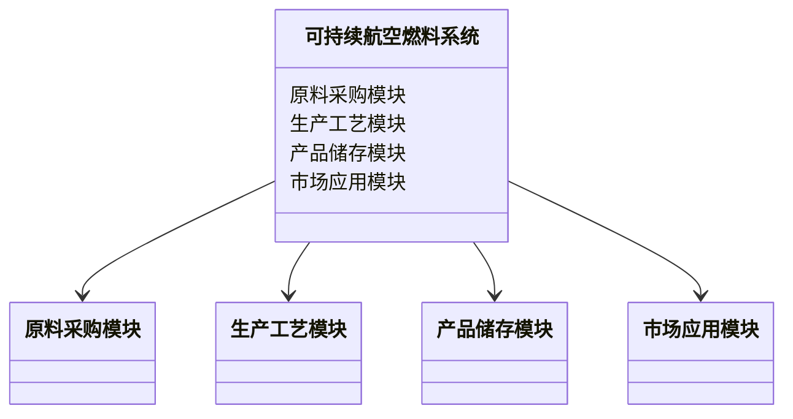
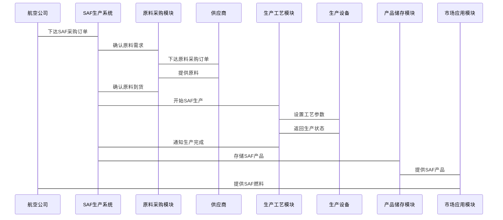

                 


# 可持续航空燃料产业的发展前景与挑战

> 关键词：可持续航空燃料，航空业，碳中和，生物基燃料，绿色能源

> 摘要：本文探讨了可持续航空燃料（SAF）产业的发展前景与挑战。文章从SAF的定义、背景、技术路径、市场前景、技术创新与优化等方面进行了详细分析。结合实际案例，本文阐述了SAF在航空业中的应用潜力及其对环境保护的重要意义，同时探讨了当前面临的技术、经济与政策挑战。

---

## 第一部分：可持续航空燃料产业的背景与现状

### 第1章：可持续航空燃料的定义与背景

#### 1.1 可持续航空燃料的定义
可持续航空燃料（Sustainable Aviation Fuel，SAF）是指通过可再生资源（如植物油、动物脂肪、微生物发酵产物等）生产，并经过改性或直接使用以替代传统石油基航空燃料的燃料。SAF的核心优势在于其全生命周期的碳排放相较于传统航空燃料大幅降低，甚至可以实现碳中和。

##### 1.1.1 传统航空燃料的局限性
传统航空燃料主要来源于化石燃料，其生产和使用对环境和气候的影响显著：
- **高碳排放**：化石燃料燃烧会产生大量二氧化碳（CO₂），加剧全球气候变化。
- **资源不可再生**：化石燃料的储量有限，且不可再生，长期依赖将面临枯竭风险。
- **环境影响**：传统燃料的生产和使用还会产生硫氧化物（SOx）、氮氧化物（NOx）等污染物，对空气质量造成负面影响。

##### 1.1.2 可持续航空燃料的特点
与传统航空燃料相比，SAF具有以下显著特点：
- **低碳排放**：通过使用可再生资源生产，SAF的全生命周期碳排放大幅降低，甚至可以实现碳中和。
- **可再生性**：SAF的主要原料（如植物油、动物脂肪等）来源于可再生资源，能够持续供应。
- **兼容性**：SAF与传统航空燃料具有良好的兼容性，可以在现有航空燃料基础设施和飞机发动机中直接使用，无需进行大规模的技术改造。

##### 1.1.3 可持续航空燃料与传统燃料的对比
下表对比了可持续航空燃料与传统航空燃料的主要差异：

| 特性                | 传统航空燃料                 | 可持续航空燃料（SAF）           |
|---------------------|------------------------------|--------------------------------|
| 原料来源            | 化石燃料（如原油）             | 可再生资源（如植物油、微生物） |
| 碳排放              | 高，不可再生                  | 低，可实现碳中和                |
| 环境影响            | 高硫、氮氧化物排放             | 低硫、低氮氧化物排放            |
| 技术成熟度          | 成熟，大规模应用               | 逐步成熟，部分技术仍需优化      |
| 成本                | 较低（传统生产技术成熟）       | 较高（原料收集、加工成本高）    |

#### 1.2 可持续航空燃料的发展现状
目前，全球范围内可持续航空燃料的生产和应用仍处于起步阶段，但发展速度逐渐加快。以下是一些关键点：

##### 1.2.1 全球能源转型的背景
全球能源转型的核心目标是减少温室气体排放，实现碳中和。航空业作为全球碳排放的重要来源之一，正面临越来越严格的监管要求。例如，国际民航组织（ICAO）提出的“碳中和增长”目标要求航空业从2020年起实现碳排放的零增长。

##### 1.2.2 可持续航空燃料在航空业的应用现状
尽管SAF的应用尚未大规模普及，但一些航空公司和机场已经开始尝试使用SAF。例如：
- 美国航空公司（American Airlines）已成功试用由植物油制成的SAF。
- 欧洲的某些机场已开始混合使用SAF和传统燃料，以减少碳排放。

##### 1.2.3 主要国家与地区的政策支持
为了推动SAF的发展，许多国家和地区已经出台了一系列政策和激励措施。例如：
- 美国：通过《可再生能源税收抵免》等政策，鼓励企业投资于SAF的生产和应用。
- 欧盟：将SAF纳入其“绿色燃料”计划，要求航空公司逐步增加SAF的使用比例。
- 中国：将SAF的研发和应用列为“十四五”能源发展规划的重点任务。

#### 1.3 可持续航空燃料的政策与环保意义
可持续航空燃料的发展离不开政策支持和环保理念的推动。

##### 1.3.1 国际航空碳排放监管政策
国际民航组织（ICAO）是推动航空业碳减排的主要国际机构。其提出的“碳中和增长”计划要求全球航空业从2020年起实现碳排放的零增长。SAF的使用是实现这一目标的重要途径之一。

##### 1.3.2 各国政府对可持续航空燃料的补贴与支持
为了降低SAF的生产成本，许多国家政府提供了财政补贴、税收优惠等支持政策。例如：
- 美国能源部（DOE）为SAF的研发和生产提供研发资金。
- 欧盟通过“绿色燃料”计划，为使用SAF的航空公司提供碳排放配额奖励。

##### 1.3.3 可持续航空燃料对环境保护的重要性
SAF的使用能够显著减少航空业的碳排放，同时降低硫氧化物和氮氧化物的排放，对改善空气质量具有重要意义。此外，通过使用可再生资源生产SAF，还可以减少对化石燃料的依赖，推动能源结构的优化和可持续发展。

---

## 第二部分：可持续航空燃料产业发展的驱动力与挑战

### 第2章：可持续航空燃料产业的驱动因素

#### 2.1 环境保护的需求
随着全球气候变化问题的加剧，减少碳排放已成为全球共识。航空业作为碳排放的重要来源，必须采取行动应对这一挑战。SAF的使用是航空业实现碳中和目标的关键途径之一。

##### 2.1.1 航空业碳排放对全球气候变化的影响
航空业的碳排放量约占全球人为碳排放总量的2.5%~3%。如果航空业不采取有效措施减少碳排放，其对全球气候变化的影响将逐步加剧。

##### 2.1.2 可持续航空燃料在减少碳足迹中的作用
SAF的全生命周期碳排放显著低于传统航空燃料，因此使用SAF可以有效减少航空业的碳足迹。例如，使用100% SAF的航班相比传统燃料，碳排放可以减少80%~90%。

#### 2.2 航空业的可持续发展目标
航空业的可持续发展不仅包括减少碳排放，还包括提高能源效率、减少资源浪费等方面。SAF的使用是实现这些目标的重要手段。

##### 2.2.1 航空公司对可持续发展的承诺
越来越多的航空公司开始关注可持续发展，并将SAF的使用作为其实现可持续发展目标的重要组成部分。例如，英国航空公司（British Airways）承诺到2025年将SAF的使用比例提高到10%。

##### 2.2.2 机场与航空联盟的绿色倡议
机场和航空联盟也在积极推动SAF的应用。例如，欧洲机场联盟（ACI Europe）已承诺到2030年将机场碳排放减少50%。

#### 2.3 技术进步与成本下降
随着技术的进步，SAF的生产成本正在逐步下降，这为SAF的广泛应用创造了条件。

##### 2.3.1 可持续航空燃料生产技术的优化
近年来，科学家们在SAF的生产工艺上取得了显著进展。例如，通过改进催化剂和优化反应条件，可以显著提高SAF的产量并降低生产成本。

##### 2.3.2 生物基原料的成本优势
随着技术的进步，生物基原料（如植物油、动物脂肪等）的生产成本正在逐步下降。这使得SAF的生产成本更加具有竞争力。

---

### 第3章：可持续航空燃料产业面临的挑战

#### 3.1 技术瓶颈
尽管SAF的生产技术已经取得了一定的进展，但仍然存在一些技术瓶颈，限制了其大规模应用。

##### 3.1.1 可持续航空燃料生产技术的成熟度
目前，SAF的生产技术尚未完全成熟，特别是在大规模生产方面仍面临诸多挑战。例如，某些生产工艺的效率较低，导致生产成本较高。

##### 3.1.2 生产过程中的效率与成本问题
SAF的生产需要大量可再生资源，而这些资源的供应和成本受到季节性和地理条件的影响。此外，SAF的生产工艺复杂，生产效率较低，也增加了成本压力。

#### 3.2 原料供应与成本
原料供应的不稳定性和成本问题是SAF产业发展面临的另一个重要挑战。

##### 3.2.1 可持续航空燃料原料的多样性
SAF的原料来源多样，包括植物油、动物脂肪、微生物发酵产物等。然而，不同原料的生产成本和供应稳定性存在差异，这使得原料的选择和管理成为一个复杂的问题。

##### 3.2.2 原料供应链的稳定性与成本控制
SAF的生产依赖于稳定的原料供应链。然而，由于可再生资源的季节性波动和地理分布不均，原料供应链的稳定性受到挑战。此外，原料成本的波动也对SAF的经济性产生了不利影响。

#### 3.3 市场接受度与政策支持
尽管政策支持是推动SAF发展的关键因素，但市场接受度仍然是一个重要的挑战。

##### 3.3.1 航空公司与消费者对可持续航空燃料的接受度
目前，航空公司和消费者对SAF的认知和接受度较低。由于SAF的价格较高，航空公司担心使用SAF会增加运营成本，从而影响其市场竞争力。

##### 3.3.2 政策不确定性对产业发展的潜在影响
尽管许多国家和地区已经出台了支持SAF发展的政策，但这些政策的稳定性和持续性仍然存在不确定性。政策的不稳定性可能对SAF产业的投资和长期发展产生不利影响。

---

## 第三部分：可持续航空燃料的关键技术与创新

### 第4章：可持续航空燃料的技术路径

#### 4.1 可持续航空燃料的原料选择
原料的选择是SAF生产过程中最重要的环节之一。不同的原料具有不同的成本、供应和环境影响。

##### 4.1.1 生物基原料
生物基原料是SAF的主要来源，包括植物油、动物脂肪、微生物发酵产物等。

###### 植物油
植物油是目前最常用的SAF原料之一。常见的植物油包括菜籽油、大豆油、棕榈油等。这些植物油可以通过酯交换反应转化为生物柴油。

###### 动物脂肪
动物脂肪也是一种重要的SAF原料。与植物油相比，动物脂肪的碳排放较低，但其来源和供应受到动物养殖和屠宰业的影响。

###### 微生物发酵产物
微生物发酵产物（如藻类油）是新兴的SAF原料。通过基因工程和微生物培养技术，可以高效生产高价值的脂肪酸，这些脂肪酸可以进一步转化为SAF。

##### 4.1.2 合成燃料
合成燃料是另一种SAF的原料，主要通过天然气和可再生能源结合生产。

###### 天然气
天然气是一种清洁的化石燃料，可以通过费托合成工艺（Fischer-Tropsch process）转化为合成燃料。这种燃料具有较高的能量密度和较低的硫含量。

###### 可再生能源
可再生能源（如风能和太阳能）可以用于驱动电解过程，将水转化为氢气和氧气。氢气可以通过进一步反应生成合成燃料。

#### 4.2 可持续航空燃料的生产工艺
SAF的生产工艺主要包括酯交换法、费托合成法等。

##### 4.2.1 生物柴油的酯交换法
酯交换法是目前最常用的SAF生产工艺之一。该工艺将植物油与甲醇或乙醇在催化剂作用下发生酯交换反应，生成生物柴油和甲醇。

**反应式：**
$$ \text{脂肪酸} + \text{甲醇} \xrightarrow{\text{催化剂}} \text{生物柴油} + \text{甲烷} $$

##### 4.2.2 合成燃料的费托合成工艺
费托合成工艺是通过天然气和氧气反应生成合成气（CO和H₂），再将合成气转化为液态烃燃料。

**反应式：**
$$ \text{CH}_4 + \text{H}_2\text{O} \xrightarrow{\text{催化剂}} \text{CO} + 3\text{H}_2 $$  
$$ \text{CO} + 2\text{H}_2 \xrightarrow{\text{催化剂}} \text{CH}_2\text{OH} + \text{H}_2\text{O} $$  
$$ \text{CH}_2\text{OH} \xrightarrow{\text{脱水}} \text{CH}_2 = \text{CH}_2 $$  

#### 4.3 技术创新与优化
为了提高SAF的生产效率和降低成本，科学家们正在不断进行技术创新和工艺优化。

##### 4.3.1 催化剂在生产过程中的应用
催化剂是SAF生产过程中的关键因素。通过开发高效的催化剂，可以显著提高反应速率和产物的选择性。

##### 4.3.2 循环经济模式下的资源利用
循环经济模式强调资源的高效利用和废弃物的再利用。在SAF生产中，可以通过回收和再利用副产物来降低生产成本并减少环境影响。

---

### 第5章：可持续航空燃料的技术创新与未来方向

#### 5.1 新型原料的开发
为了进一步降低SAF的生产成本，科学家们正在积极开发新的原料。

##### 5.1.1 海藻基燃料的潜力
海藻是一种富含油脂的可再生资源，可以通过生物柴油生产工艺转化为SAF。海藻的生长速度快，且不需要大量农田，因此具有较大的发展潜力。

##### 5.1.2 微生物发酵技术的应用
通过基因工程和微生物培养技术，可以高效生产高价值的脂肪酸。这些脂肪酸可以进一步转化为SAF。

#### 5.2 生产工艺的优化
通过优化生产工艺，可以显著提高SAF的生产效率并降低成本。

##### 5.2.1 高效催化剂的研发
高效催化剂的开发是SAF生产技术优化的重要方向。通过改进催化剂的性能，可以提高反应速率和产物的选择性，从而降低生产成本。

##### 5.2.2 数字化生产与智能化监控
数字化生产技术（如工业物联网、人工智能等）可以实现对SAF生产过程的实时监控和优化。通过智能化监控，可以显著提高生产效率并降低成本。

#### 5.3 技术经济性分析
尽管SAF的生产成本正在逐步下降，但其经济性仍然是制约其大规模应用的重要因素。

##### 5.3.1 生产成本的降低策略
通过技术优化、规模化生产和供应链管理，可以显著降低SAF的生产成本。例如，通过改进催化剂和优化反应条件，可以提高生产效率并降低单位产品成本。

##### 5.3.2 市场竞争力的提升
为了提高SAF的市场竞争力，需要通过政策支持、技术创新和规模化生产等多方面努力，降低SAF的成本，使其与传统航空燃料具有相同的经济性。

---

## 第四部分：可持续航空燃料的系统分析与架构设计

### 第6章：可持续航空燃料的系统分析

#### 6.1 问题场景介绍
为了实现航空业的碳中和目标，需要构建一个可持续航空燃料的生产、储存和应用系统。

#### 6.2 系统功能设计
系统功能包括原料采购、生产工艺、产品储存和市场应用等环节。

##### 6.2.1 领域模型


##### 6.2.2 系统架构设计


##### 6.2.3 接口设计
- **原料采购模块接口**：与供应商进行原料采购订单的交互。
- **生产工艺模块接口**：与生产设备进行工艺参数的交互。
- **产品储存模块接口**：与仓储设施进行产品存储和运输的交互。
- **市场应用模块接口**：与航空公司和机场进行SAF供应和使用的交互。

##### 6.2.4 系统交互设计


---

## 第五部分：可持续航空燃料的项目实战

### 第7章：可持续航空燃料的项目实战

#### 7.1 项目背景与目标
本项目旨在通过实际案例展示可持续航空燃料的生产与应用。

#### 7.2 项目环境与安装
##### 7.2.1 环境配置
- **操作系统**：Linux（Ubuntu 20.04）
- **编程语言**：Python 3.8
- **依赖库**：numpy, pandas, matplotlib

#### 7.3 核心实现源代码
以下是一个简单的SAF生产模拟代码示例：

```python
import numpy as np
import pandas as pd
import matplotlib.pyplot as plt

# 模拟原料采购与生产过程
def simulate_saf_production(simulation_days=365):
    days = range(simulation_days)
    production_cost = []
    carbon_emission = []
    for day in days:
        # 原料价格波动
       原料价格 = np.random.uniform(0.8, 1.2)
        # 生产成本计算
        production_cost.append(原料价格 * 100 + 50)
        # 碳排放计算
        carbon_emission.append(原料价格 * 10 + 20)
    plt.figure(figsize=(10, 6))
    plt.plot(days, production_cost, label='生产成本')
    plt.plot(days, carbon_emission, label='碳排放')
    plt.xlabel('天数')
    plt.ylabel('单位：美元/天')
    plt.title('可持续航空燃料生产过程模拟')
    plt.legend()
    plt.show()

simulate_saf_production(365)
```

#### 7.4 代码应用解读与分析
上述代码模拟了一个SAF生产过程的成本和碳排放情况。通过绘制生产成本和碳排放随时间的变化曲线，可以观察到生产成本和碳排放之间的关系。

#### 7.5 实际案例分析
以某航空公司为例，分析其使用SAF的成本效益。

#### 7.6 项目小结
通过本项目，我们可以看到SAF的生产成本和碳排放之间的关系。未来，随着技术的进步和规模效应的显现，SAF的生产成本将进一步降低，碳排放也将显著减少。

---

## 第六部分：可持续航空燃料的最佳实践与未来展望

### 第8章：可持续航空燃料的最佳实践

#### 8.1 最佳实践 tips
- **选择合适的原料**：根据地理位置和资源条件选择合适的原料，降低生产成本。
- **优化生产工艺**：通过技术优化和工艺改进，提高生产效率并降低成本。
- **加强政策支持**：争取政府的政策支持和财政补贴，降低投资风险。
- **推动国际合作**：通过国际合作共享技术、资源和市场，实现共赢。

#### 8.2 小结
可持续航空燃料是实现航空业碳中和目标的重要途径。随着技术的进步和政策的支持，SAF的生产和应用将逐步扩大，为航空业的可持续发展做出重要贡献。

#### 8.3 未来展望
未来，随着技术的进一步突破和规模效应的显现，SAF的生产成本将进一步降低，碳排放也将显著减少。同时，通过技术创新和国际合作，SAF的生产效率和应用范围将进一步扩大。

---

## 第七部分：可持续航空燃料的注意事项与拓展阅读

### 第9章：注意事项
在推动SAF产业发展的同时，需要注意以下几点：
- **技术可行性**：确保SAF的生产工艺技术成熟，能够实现大规模生产。
- **成本控制**：通过技术优化和规模化生产，降低SAF的生产成本。
- **政策稳定性**：争取稳定的政策支持，为SAF产业的发展创造良好的环境。

### 第10章：拓展阅读
为了进一步了解可持续航空燃料的相关知识，读者可以参考以下文献：
- ICAO. (2020). "Global Aviation Sector Emissions Reduction Strategy".
- Smith, R. J., & Brown, D. (2021). "Sustainable Aviation Fuel Production and Applications".

---

## 结语
可持续航空燃料是航空业实现碳中和目标的关键途径。尽管当前面临技术、经济和政策等多方面的挑战，但随着技术的进步和政策的支持，SAF的生产和应用将逐步扩大，为航空业的可持续发展做出重要贡献。

---

**作者：AI天才研究院/AI Genius Institute & 禅与计算机程序设计艺术 /Zen And The Art of Computer Programming**

