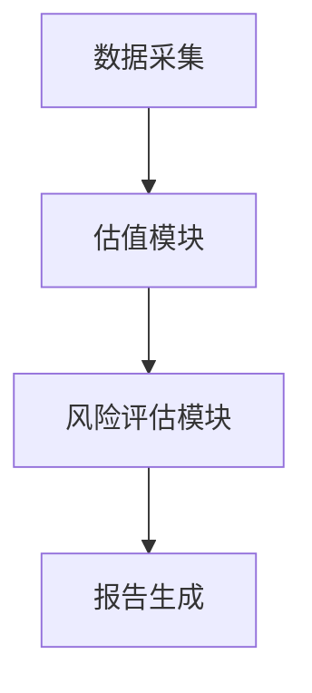
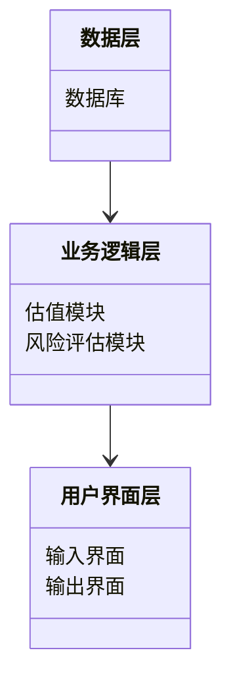
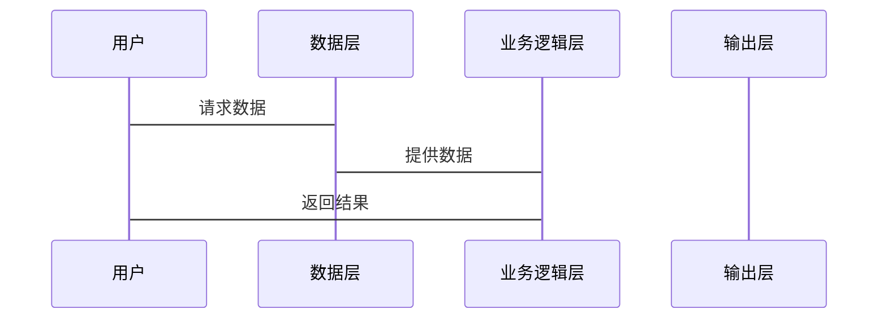

                 


# 彼得林奇如何看待公司的并购策略

> 关键词：彼得·林奇，并购策略，投资哲学，公司估值，协同效应，风险管理

> 摘要：本文深入探讨了彼得·林奇在公司并购策略中的独特见解。从并购的基本概念到林奇的投资哲学，再到具体的评估框架和风险管理，文章详细分析了林奇如何通过并购实现投资目标。通过数学模型、算法和系统架构的设计，本文为读者提供了全面的视角来理解并购策略的核心要素和实际应用。

---

## 第一部分: 公司并购策略的背景与核心概念

### 第1章: 公司并购的基本概念与背景

#### 1.1 公司并购的定义与类型

##### 1.1.1 公司并购的定义
公司并购（Mergers and Acquisitions，简称 M&A）是指一家公司通过购买另一家公司的股权或资产，以实现战略目标的过程。并购可以是敌意的或善意的，具体取决于双方的意愿和交易方式。

##### 1.1.2 并购的主要类型（横向、纵向、混合并购）

| 类型       | 定义                                                                 | 特点                                   |
|------------|----------------------------------------------------------------------|----------------------------------------|
| 横向并购   | 同行业竞争对手之间的合并。                                           | 减少竞争，扩大市场份额                 |
| 纵向并购   | 上下游企业之间的整合。                                              | 控制供应链，降低风险                   |
| 混合并购   | 两家无直接关联的企业之间的合并。                                     | 跨行业资源整合，寻求协同效应           |

##### 1.1.3 并购的动机与目的

| 动机       | 描述                                                                 |
|------------|----------------------------------------------------------------------|
| 市场扩展    | 通过并购进入新市场或扩大市场份额                                     |
| 成本优势    | 通过整合资源降低生产成本                                             |
| 技术获取    | 获取新技术或专利                                                     |
| 财务优化    | 通过杠杆效应优化资本结构                                             |

#### 1.2 并购的历史与发展

##### 1.2.1 并购的历史演变
并购活动可以追溯到古代的商业交易，但现代并购的快速发展始于20世纪初。随着企业规模的扩大和全球化的发展，并购成为企业战略的重要组成部分。

##### 1.2.2 并购在现代企业战略中的地位
在现代企业中，并购不仅是扩张的手段，更是优化资产配置、提升竞争力的重要工具。企业通过并购可以快速获取技术、市场和人才，从而在竞争中占据优势。

##### 1.2.3 并购与企业增长的关系
并购为企业提供了一种快速的增长方式，尤其是在技术密集型行业。通过并购，企业可以避免内部研发的高成本和时间消耗，快速获取技术能力。

#### 1.3 彼得·林奇与并购策略的关联

##### 1.3.1 彼得·林奇的投资理念概述
彼得·林奇是美国著名的职业棒球运动员和作家，以其对棒球运动的深刻理解和对运动员心理的分析而闻名。虽然他的成就主要在体育领域，但他的分析方法和思维方式对其他领域也有启发。

##### 1.3.2 林奇对并购策略的关注点
林奇在分析并购时，注重企业文化和领导力的契合，以及并购后的整合能力。他认为，并购成功与否不仅取决于财务数据，还取决于管理层的协同能力和企业文化的融合。

##### 1.3.3 并购在林奇投资组合中的作用
林奇在投资过程中，注重对企业管理和战略的分析。他认为，并购是企业实现增长的重要手段，但前提是并购必须创造协同效应，并且管理层具备整合能力。

---

### 第2章: 彼得·林奇的投资哲学与并购分析框架

#### 2.1 林奇的价值投资理念

##### 2.1.1 价值投资的核心原则
价值投资强调以低于内在价值的价格购买资产。林奇认为，长期来看，市场的波动不会影响企业的内在价值，因此投资者应关注企业的基本面。

##### 2.1.2 林奇对安全边际的理解
安全边际是指购买价格低于内在价值的部分。林奇认为，安全边际是投资成功的关键因素，可以降低投资风险。

##### 2.1.3 林奇对市场情绪的分析
林奇强调，市场情绪往往会影响短期价格波动，但长期来看，价格会回归基本面。因此，投资者应避免被市场情绪左右，专注于企业的内在价值。

#### 2.2 林奇并购策略的核心要素

##### 2.2.1 并购的协同效应分析
协同效应是指并购后双方的资源整合所产生的额外价值。林奇认为，协同效应是并购成功的关键因素之一。

##### 2.2.2 并购的财务杠杆效应
财务杠杆是指通过债务融资来放大股权收益。林奇认为，并购后的财务杠杆应合理，避免过度杠杆化带来的风险。

##### 2.2.3 并购后的整合能力
林奇强调，并购后的整合能力是决定并购成功的重要因素。整合包括组织结构、文化融合和资源优化等多个方面。

#### 2.3 林奇对并购风险的评估

##### 2.3.1 并购失败的常见原因
- 管理层能力不足
- 企业文化冲突
- 估值过高
- 整合困难

##### 2.3.2 林奇对管理层能力的重视
林奇认为，并购后的整合能力取决于管理层的能力。他强调，投资者应评估目标企业的管理层是否具备整合能力。

##### 2.3.3 并购后的整合风险
整合风险包括组织文化冲突、资源分配不均等问题。林奇认为，整合失败是并购失败的主要原因之一。

---

### 第3章: 并购的评估与决策框架

#### 3.1 并购的估值方法

##### 3.1.1 企业价值评估公式
企业价值（EV）的计算公式为：
$$ EV = EBITDA \times 倍数 $$

其中，EBITDA是息税折旧及摊销前利润，倍数通常取行业平均值或可比公司估值倍数。

##### 3.1.2 并购溢价的计算
并购溢价是指支付的价格超过目标企业公允价值的部分。溢价的计算公式为：
$$ 溢价率 = \frac{\text{并购价格} - \text{公允价值}}{\text{公允价值}} \times 100\% $$

##### 3.1.3 市盈率与市净率分析
市盈率（P/E）和市净率（P/B）是常用的估值指标。林奇认为，市盈率低于行业平均水平的公司具有投资价值。

#### 3.2 林奇的并购评估模型

##### 3.2.1 企业协同效应的量化
协同效应可以通过成本节约和收入增加来量化。例如：
$$ 协同效应 = \text{成本节约} + \text{收入增加} $$

##### 3.2.2 并购后的财务健康评估
林奇认为，并购后的财务健康可以通过以下指标评估：
- 净利润增长
- 负债率变化
- 现金流状况

##### 3.2.3 风险调整后的净现值法
净现值（NPV）是评估并购项目的常用方法。林奇强调，NPV应考虑风险因素，采用风险调整折现率进行计算。

---

### 第4章: 并购的数学模型与算法

#### 4.1 企业价值评估模型

##### 4.1.1 模型概述
企业价值评估模型基于财务指标和市场数据，计算目标企业的公允价值。

##### 4.1.2 模型实现
以下是Python代码实现企业价值评估模型：

```python
def calculate_ev(revenue, profit_margin, days Sales Outstanding, days Inventory, days Payables, EBITDA):
    # 计算流动资产和流动负债
    current_assets = revenue + days_Sales_Outstanding + days_Inventory
    current_liabilities = revenue - days_Payables
    # 计算净营运资本
    net_operating_capital = current_assets - current_liabilities
    # 计算企业价值
    ev = EBITDA * (1 + net_operating_capital / 1000)
    return ev
```

##### 4.1.3 模型解释
该模型通过EBITDA和净营运资本计算企业价值，适用于稳定增长的企业。

#### 4.2 协同效应评估算法

##### 4.2.1 算法概述
协同效应评估算法通过整合双方的资源，计算并购后的预期协同价值。

##### 4.2.2 算法实现
以下是协同效应评估算法的Python代码：

```python
def calculate_synergy(company_a, company_b):
    # 计算成本节约
    cost_savings = (company_a.costs + company_b.costs) * 0.1
    # 计算收入增加
    revenue_increase = (company_a.revenue + company_b.revenue) * 0.05
    # 计算协同效应
    synergy = cost_savings + revenue_increase
    return synergy
```

##### 4.2.3 算法解释
该算法通过将两家公司的成本和收入进行加权计算，得出并购后的协同效应。

---

### 第5章: 并购的系统架构与实现

#### 5.1 系统功能设计

##### 5.1.1 功能模块
- 数据采集模块：收集目标公司和可比公司的财务数据。
- 估值模块：计算企业价值和并购溢价。
- 风险评估模块：评估并购风险并制定应对策略。

##### 5.1.2 功能流程图
以下是功能流程图：



#### 5.2 系统架构设计

##### 5.2.1 架构设计
系统采用分层架构，包括数据层、业务逻辑层和用户界面层。

##### 5.2.2 架构图
以下是系统架构图：



#### 5.3 系统接口设计

##### 5.3.1 接口定义
- 数据接口：从数据库中提取目标公司和可比公司的数据。
- 估值接口：调用企业价值评估模型计算公允价值。
- 报告接口：生成并购评估报告。

##### 5.3.2 接口交互图
以下是接口交互图：



---

### 第6章: 并购的项目实战

#### 6.1 项目背景与目标

##### 6.1.1 项目背景
假设我们是一家科技公司，希望通过并购快速进入人工智能领域。

##### 6.1.2 项目目标
- 识别具有潜力的人工智能公司。
- 评估并购的财务可行性和协同效应。

#### 6.2 项目环境与工具

##### 6.2.1 环境配置
- 操作系统：Windows 10
- 编程语言：Python 3.9
- 库：Pandas、NumPy、Matplotlib

##### 6.2.2 工具安装
安装以下Python库：
```bash
pip install pandas numpy matplotlib
```

#### 6.3 项目核心代码实现

##### 6.3.1 数据采集与处理
```python
import pandas as pd

# 读取目标公司数据
df_target = pd.read_csv('target.csv')
# 读取可比公司数据
df_comparable = pd.read_csv('comparable.csv')
```

##### 6.3.2 并购溢价计算
```python
def calculate_premium(target_ev, comparable_ev):
    premium = target_ev - comparable_ev
    return premium
```

##### 6.3.3 协同效应分析
```python
def calculate_synergy(revenue_a, revenue_b, costs_a, costs_b):
    cost_savings = (costs_a + costs_b) * 0.1
    revenue_increase = (revenue_a + revenue_b) * 0.05
    synergy = cost_savings + revenue_increase
    return synergy
```

#### 6.4 项目实现与解读

##### 6.4.1 数据分析
通过分析目标公司和可比公司的财务数据，计算目标公司的企业价值和并购溢价。

##### 6.4.2 并购后的整合
评估并购后的协同效应，制定整合计划，确保资源优化和文化融合。

##### 6.4.3 风险管理
制定风险管理策略，识别潜在风险并制定应对措施。

#### 6.5 项目小结
通过本项目，我们学会了如何应用林奇的并购策略进行实际操作，掌握了企业价值评估和协同效应分析的方法。

---

### 第7章: 并购的最佳实践与小结

#### 7.1 并购的关键点

##### 7.1.1 识别低估公司
林奇强调，投资应关注被低估的公司，避免高价并购。

##### 7.1.2 评估协同效应
协同效应是并购成功的关键，需通过量化方法进行评估。

##### 7.1.3 管理整合风险
整合风险是并购失败的主要原因，需提前制定整合计划。

#### 7.2 并购中的注意事项

##### 7.2.1 财务杠杆控制
合理控制财务杠杆，避免过度负债。

##### 7.2.2 管理层能力评估
评估目标公司管理层的能力，确保整合顺利进行。

##### 7.2.3 市场环境影响
关注市场环境变化，及时调整并购策略。

#### 7.3 并购的拓展阅读
推荐书籍和文章，进一步学习并购策略。

---

## 作者：AI天才研究院 & 禅与计算机程序设计艺术

---

以上是《彼得林奇如何看待公司的并购策略》的技术博客文章的完整大纲和内容。

