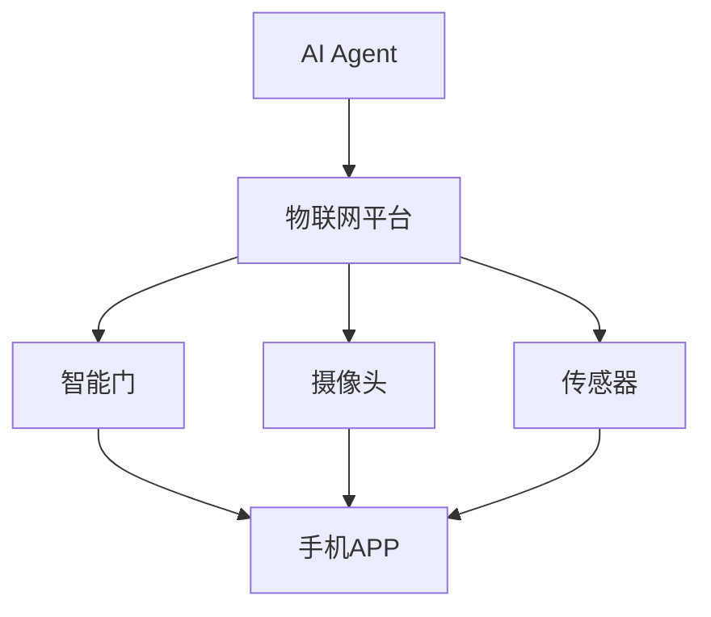
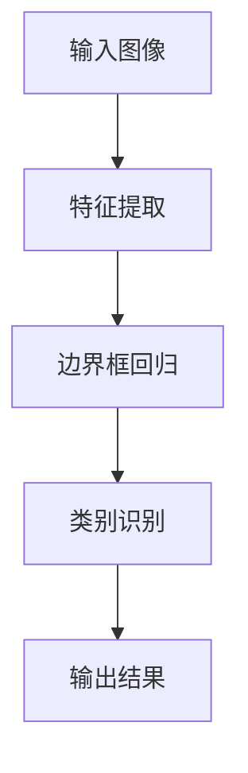
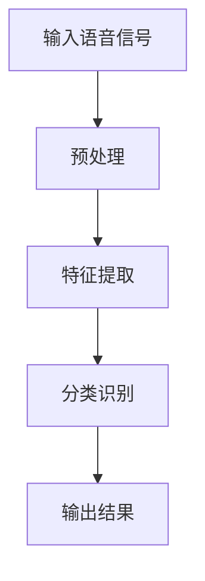
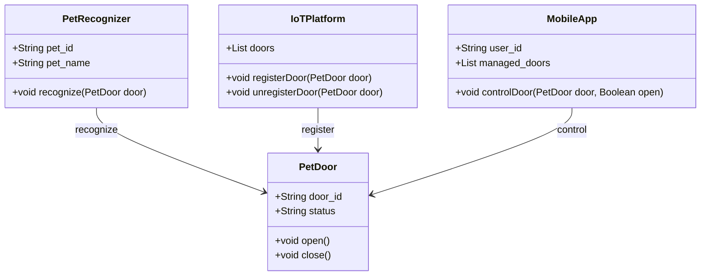
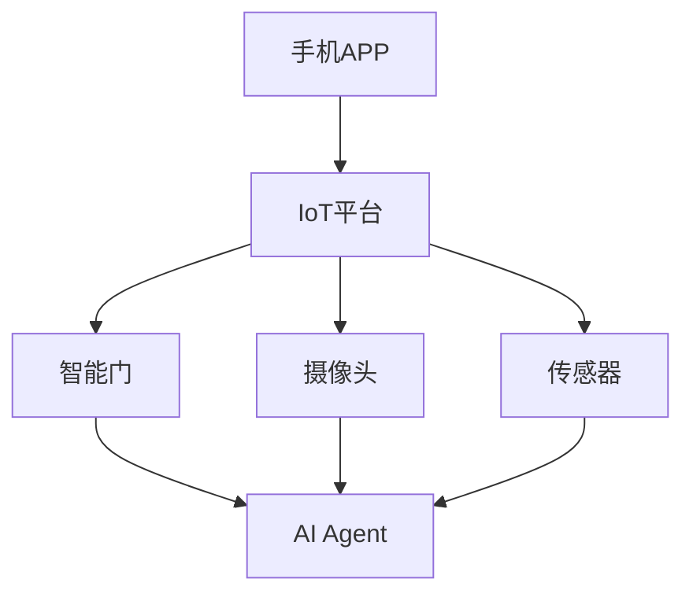
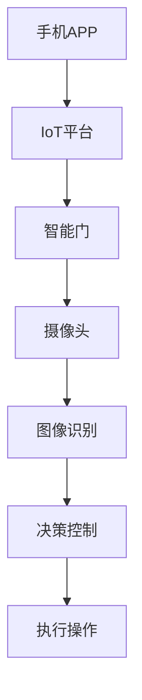

                 


# 智能宠物门：AI Agent的宠物出入管理

> 关键词：智能宠物门，AI Agent，物联网技术，目标检测，语音识别，系统架构设计

> 摘要：本文探讨了智能宠物门的设计与实现，通过结合AI Agent和物联网技术，详细介绍了解决宠物出入管理问题的核心算法、系统架构以及项目实战。文章从背景介绍、核心概念、算法原理、系统架构设计、项目实现到优化与扩展，全面解析了智能宠物门的技术细节与应用场景。

---

# 第一部分: 智能宠物门的背景与核心概念

## 第1章: 智能宠物门的背景与问题背景

### 1.1 问题背景

#### 1.1.1 宠物管理的传统方式与局限性

在传统的宠物管理中，宠物的出入主要依赖于手动操作或简单的机械装置。这种方式存在以下问题：

- **手动管理**：主人需要手动开关门，特别是在主人不在家时，宠物无法自由出入。
- **安全性低**：传统门锁或机械装置容易被宠物误操作或损坏，存在安全隐患。
- **缺乏智能化**：无法记录宠物出入的时间，也无法与主人的手机或其他设备联动。

#### 1.1.2 智能化宠物管理的需求驱动

随着智能家居的普及和物联网技术的发展，宠物主人对智能化宠物管理的需求日益增长。智能化宠物门可以通过以下方式解决传统管理的痛点：

- **远程控制**：主人可以通过手机或其他设备远程开关宠物门。
- **自动识别**：通过传感器或摄像头识别宠物身份，实现自动开门。
- **数据记录**：记录宠物出入的时间和次数，方便主人了解宠物的活动情况。

#### 1.1.3 AI Agent在宠物管理中的应用潜力

AI Agent（智能代理）是一种能够感知环境并自主决策的智能系统。在宠物管理中，AI Agent可以通过以下方式发挥作用：

- **智能识别**：通过图像识别或语音识别技术，识别宠物的身份。
- **自主决策**：根据宠物的行为和环境信息，自主决定是否开门。
- **数据分析**：分析宠物的出入数据，提供行为分析和健康建议。

### 1.2 问题描述

#### 1.2.1 宠物出入管理的核心问题

宠物出入管理的核心问题包括：

- **身份识别**：如何准确识别宠物的身份。
- **权限管理**：如何确保只有授权的宠物才能出入。
- **安全性**：如何保证宠物出入的安全性，防止非法入侵或误操作。

#### 1.2.2 智能宠物门的功能需求

智能宠物门需要具备以下核心功能：

- **自动识别**：通过图像或语音识别技术，识别宠物的身份。
- **智能控制**：根据识别结果，自动控制门的开关。
- **远程控制**：通过手机或其他设备远程控制门的开关。
- **数据记录**：记录宠物出入的时间、次数等信息。

#### 1.2.3 用户场景与痛点分析

用户场景包括：

- **家庭宠物管理**：宠物主人希望实现宠物的智能化管理。
- **多人家庭**：多个宠物或宠物主人需要管理多个宠物的出入。
- **远程监控**：主人不在家时，可以通过手机远程监控宠物的出入情况。

痛点分析包括：

- **操作复杂**：传统宠物门操作复杂，缺乏智能化。
- **安全性低**：传统宠物门容易被宠物误操作或损坏。
- **缺乏数据支持**：无法记录和分析宠物的出入数据。

### 1.3 问题解决与系统边界

#### 1.3.1 智能宠物门的解决方案

智能宠物门的解决方案包括：

- **AI Agent**：通过AI Agent实现宠物的身份识别和智能控制。
- **物联网技术**：通过物联网技术实现远程控制和数据传输。
- **智能硬件**：通过智能硬件实现门的自动开关。

#### 1.3.2 系统边界与功能范围

系统的边界包括：

- **硬件部分**：智能门、传感器、摄像头等。
- **软件部分**：AI Agent、物联网平台、手机APP等。
- **数据部分**：出入记录、宠物信息等。

功能范围包括：

- **身份识别**：通过图像或语音识别技术识别宠物的身份。
- **智能控制**：根据识别结果控制门的开关。
- **远程控制**：通过手机APP远程控制门的开关。
- **数据记录**：记录宠物出入的时间、次数等信息。

#### 1.3.3 核心功能与辅助功能的划分

核心功能包括：

- **身份识别**：通过图像或语音识别技术识别宠物的身份。
- **智能控制**：根据识别结果控制门的开关。

辅助功能包括：

- **远程控制**：通过手机APP远程控制门的开关。
- **数据记录**：记录宠物出入的时间、次数等信息。
- **通知提醒**：通过手机APP通知主人宠物的出入情况。

### 1.4 系统组成与核心要素

#### 1.4.1 系统组成结构

智能宠物门系统由以下部分组成：

- **智能门**：具备自动开关功能。
- **摄像头**：用于图像识别。
- **传感器**：用于检测宠物的存在。
- **AI Agent**：用于处理图像识别和决策控制。
- **物联网平台**：用于数据传输和远程控制。
- **手机APP**：用于远程控制和数据查看。

#### 1.4.2 核心要素与功能模块

核心要素包括：

- **AI Agent**：负责图像识别和决策控制。
- **物联网平台**：负责数据传输和远程控制。
- **智能门**：负责执行开门或关门操作。

功能模块包括：

- **图像识别模块**：用于识别宠物的身份。
- **智能控制模块**：用于控制门的开关。
- **远程控制模块**：用于通过手机APP远程控制门的开关。
- **数据记录模块**：用于记录宠物出入的时间、次数等信息。

#### 1.4.3 系统工作原理与流程

系统的工作原理如下：

1. **触发事件**：宠物靠近门或主人通过手机APP触发开门。
2. **图像识别**：摄像头捕捉宠物图像，AI Agent进行图像识别。
3. **决策控制**：根据识别结果，AI Agent决定是否开门。
4. **执行操作**：智能门执行开门或关门操作。
5. **数据记录**：记录宠物出入的时间、次数等信息，并通过物联网平台传输到手机APP。

---

## 第2章: AI Agent与物联网技术的核心概念

### 2.1 AI Agent的基本原理

#### 2.1.1 AI Agent的定义与分类

AI Agent（智能代理）是一种能够感知环境并自主决策的智能系统。根据功能和应用场景的不同，AI Agent可以分为以下几类：

- **简单反射Agent**：根据预设的规则进行简单决策。
- **基于模型的反射Agent**：基于环境模型进行决策。
- **目标导向Agent**：具有明确的目标，通过规划和推理实现目标。
- **实用导向Agent**：基于效用函数进行决策，追求效用的最大化。

#### 2.1.2 AI Agent的核心功能与特性

AI Agent的核心功能包括：

- **感知环境**：通过传感器或其他信息源感知环境。
- **自主决策**：基于感知信息进行决策。
- **执行操作**：根据决策结果执行操作。

AI Agent的特性包括：

- **智能性**：能够自主决策和解决问题。
- **适应性**：能够根据环境变化调整行为。
- **学习能力**：能够通过学习提高决策的准确性。

#### 2.1.3 AI Agent在智能宠物门中的应用

在智能宠物门中，AI Agent主要负责以下任务：

- **图像识别**：识别宠物的身份。
- **决策控制**：根据识别结果决定是否开门。
- **数据处理**：处理和存储宠物出入的数据。

### 2.2 物联网技术在智能宠物门中的应用

#### 2.2.1 物联网技术的基本概念

物联网（Internet of Things, IoT）是指通过各种信息传感设备，如传感器、摄像头、RFID等，按照约定的协议，把任何物品与互联网连接起来，进行信息交换和通信，以实现智能化识别、定位、跟踪、监控和管理。

#### 2.2.2 物联网在智能宠物门中的具体应用

在智能宠物门中，物联网技术主要用于以下方面：

- **数据传输**：将宠物出入的数据传输到云端或手机APP。
- **远程控制**：通过物联网平台实现远程控制门的开关。
- **设备联动**：通过物联网技术实现智能门与其他设备的联动，如智能灯、智能摄像头等。

#### 2.2.3 物联网技术的优势与挑战

物联网技术的优势包括：

- **远程监控**：通过物联网平台实现远程监控。
- **数据丰富**：能够采集和存储大量的数据，支持后续分析和决策。
- **设备联动**：能够实现设备之间的联动，提供更智能化的服务。

物联网技术的挑战包括：

- **安全性**：物联网设备容易受到黑客攻击，存在安全隐患。
- **数据量大**：物联网设备产生的数据量巨大，需要高效的存储和处理能力。
- **设备兼容性**：不同设备之间的兼容性问题可能影响系统的稳定性。

### 2.3 AI Agent与物联网技术的结合

#### 2.3.1 AI Agent与物联网技术的协同工作

AI Agent与物联网技术的结合主要体现在以下几个方面：

- **数据处理**：AI Agent通过物联网平台获取宠物出入的数据，进行分析和处理。
- **智能决策**：AI Agent基于分析结果，决定是否开门。
- **远程控制**：通过物联网平台实现远程控制门的开关。

#### 2.3.2 两者结合的优势

两者结合的优势包括：

- **智能化**：通过AI Agent实现智能化的决策和控制。
- **远程化**：通过物联网技术实现远程监控和控制。
- **数据化**：通过物联网技术实现数据的采集和分析，支持后续优化和决策。

#### 2.3.3 实体关系图

以下是AI Agent与物联网技术结合的实体关系图：



---

## 第3章: 核心算法原理与实现

### 3.1 目标检测算法原理

#### 3.1.1 目标检测的定义与作用

目标检测是指在图像中检测出目标物体的位置和类别。在智能宠物门中，目标检测主要用于识别宠物的身份。

#### 3.1.2 基于YOLO的目标检测算法

YOLO（You Only Look Once）是一种基于深度学习的目标检测算法，具有检测速度快、精度高的特点。

#### 3.1.3 YOLO算法的实现步骤

YOLO算法的实现步骤如下：

1. **图像输入**：将宠物图像输入YOLO模型。
2. **特征提取**：模型提取图像的特征。
3. **边界框回归**：模型预测宠物的边界框。
4. **类别识别**：模型识别宠物的类别。

以下是YOLO算法的流程图：



#### 3.1.4 YOLO算法的Python实现

以下是YOLO算法的Python实现示例：

```python
import tensorflow as tf
from tensorflow.keras import layers

def yolo_model(input_shape, num_classes):
    inputs = layers.Input(shape=input_shape)
    x = layers.Conv2D(32, (3,3), activation='relu')(inputs)
    x = layers.MaxPooling2D((2,2))(x)
    x = layers.Conv2D(64, (3,3), activation='relu')(x)
    x = layers.MaxPooling2D((2,2))(x)
    x = layers.Flatten()(x)
    x = layers.Dense(128, activation='relu')(x)
    predictions = layers.Dense(num_classes, activation='softmax')(x)
    return tf.keras.Model(inputs=inputs, outputs=predictions)

model = yolo_model((224, 224, 3), 2)
model.summary()
```

#### 3.1.5 算法的优化与改进

为了提高YOLO算法的性能，可以进行以下优化：

- **模型优化**：使用更复杂的模型结构，如YOLOv4或YOLOv5。
- **数据增强**：通过数据增强技术提高模型的泛化能力。
- **训练策略**：采用合适的训练策略，如学习率衰减、批量归一化等。

---

### 3.2 语音识别算法原理

#### 3.2.1 语音识别的定义与作用

语音识别是指将语音信号转换为文本的过程。在智能宠物门中，语音识别主要用于通过宠物的声音识别其身份。

#### 3.2.2 基于MFCC的语音识别算法

MFCC（Mel-Cepstral Cepstrum Coefficients）是一种常用的语音特征提取方法，广泛应用于语音识别领域。

#### 3.2.3 MFCC算法的实现步骤

MFCC算法的实现步骤如下：

1. **预处理**：对语音信号进行预处理，包括降噪、归一化等。
2. **特征提取**：提取语音信号的MFCC特征。
3. **分类识别**：通过机器学习算法对特征进行分类识别。

以下是MFCC算法的流程图：



#### 3.2.4 MFCC算法的Python实现

以下是MFCC算法的Python实现示例：

```python
import librosa

def extract_features(audio_path):
    audio, sr = librosa.load(audio_path, sr=None)
    # 预处理
    audio = librosa.resample(audio, sr, 16000)
    # 特征提取
    mfccs = librosa.feature.mfcc(y=audio, sr=16000, n_mfcc=13)
    return mfccs.T

features = extract_features("pet_sound.wav")
print(features.shape)
```

#### 3.2.5 算法的优化与改进

为了提高MFCC算法的性能，可以进行以下优化：

- **特征优化**：尝试不同的特征提取方法，如改进的MFCC或其他特征提取方法。
- **模型优化**：使用更复杂的机器学习模型，如支持向量机（SVM）或深度学习模型。
- **数据增强**：通过数据增强技术提高模型的泛化能力。

---

## 第4章: 系统分析与架构设计方案

### 4.1 项目背景与目标

#### 4.1.1 项目背景

智能宠物门的设计目标是通过AI Agent和物联网技术实现宠物出入的智能化管理。

#### 4.1.2 项目目标

项目的具体目标包括：

- **实现宠物身份识别**：通过图像或语音识别技术识别宠物的身份。
- **实现智能控制**：根据识别结果自动控制门的开关。
- **实现远程控制**：通过手机APP远程控制门的开关。
- **实现数据记录**：记录宠物出入的时间、次数等信息。

### 4.2 系统功能设计

#### 4.2.1 领域模型类图

以下是系统功能的领域模型类图：



#### 4.2.2 系统架构设计

以下是系统的架构设计图：



#### 4.2.3 系统接口设计

系统的主要接口包括：

- **API接口**：手机APP通过API接口与IoT平台通信。
- **硬件接口**：智能门通过硬件接口与传感器和摄像头连接。

#### 4.2.4 系统交互流程

以下是系统的交互流程图：



---

## 第5章: 项目实战

### 5.1 环境搭建

#### 5.1.1 开发环境

开发环境包括：

- **操作系统**：Windows 10或更高版本。
- **开发工具**：PyCharm或Visual Studio Code。
- **编程语言**：Python 3.8或更高版本。
- **深度学习框架**：TensorFlow或Keras。

#### 5.1.2 物理环境

物理环境包括：

- **智能门**：支持GPIO控制的智能门。
- **摄像头**：支持视频采集的摄像头。
- **传感器**：用于检测宠物存在的传感器。
- **手机APP**：支持远程控制的手机APP。

### 5.2 核心代码实现

#### 5.2.1 图像识别模块

以下是图像识别模块的核心代码：

```python
import tensorflow as tf
from tensorflow.keras import layers

def pet_recognition_model(input_shape, num_classes):
    model = tf.keras.Sequential([
        layers.Conv2D(32, (3,3), activation='relu', input_shape=input_shape),
        layers.MaxPooling2D((2,2)),
        layers.Conv2D(64, (3,3), activation='relu'),
        layers.MaxPooling2D((2,2)),
        layers.Flatten(),
        layers.Dense(128, activation='relu'),
        layers.Dense(num_classes, activation='softmax')
    ])
    return model

model = pet_recognition_model((224, 224, 3), 2)
model.summary()
```

#### 5.2.2 智能控制模块

以下是智能控制模块的核心代码：

```python
import RPi.GPIO as GPIO

def open_door(gpio_pin):
    GPIO.output(gpio_pin, GPIO.HIGH)

def close_door(gpio_pin):
    GPIO.output(gpio_pin, GPIO.LOW)

# 示例代码
gpio_pin = 17
GPIO.setmode(GPIO.BCM)
GPIO.setup(gpio_pin, GPIO.OUT)
open_door(gpio_pin)
close_door(gpio_pin)
GPIO.cleanup()
```

### 5.3 代码解读与功能分析

#### 5.3.1 图像识别模块代码解读

图像识别模块的代码实现了基于深度学习的目标检测算法，能够识别宠物的身份。代码的主要部分包括：

- **模型定义**：定义了一个卷积神经网络模型，用于图像分类。
- **模型训练**：通过训练数据训练模型。
- **模型推理**：通过模型推理实现宠物身份的识别。

#### 5.3.2 智能控制模块代码解读

智能控制模块的代码实现了智能门的开关控制。代码的主要部分包括：

- **GPIO初始化**：通过GPIO模块初始化门的控制引脚。
- **门的开关控制**：通过控制引脚的高低电平实现门的开关。

### 5.4 案例分析与实现

#### 5.4.1 典型案例分析

典型的应用场景包括：

- **宠物识别**：通过图像识别模块识别宠物的身份。
- **智能控制**：根据识别结果自动控制门的开关。
- **远程控制**：通过手机APP远程控制门的开关。

#### 5.4.2 实现步骤

实现步骤如下：

1. **硬件安装**：安装智能门、摄像头、传感器等硬件设备。
2. **环境搭建**：搭建开发环境，安装必要的软件和库。
3. **代码实现**：编写图像识别和智能控制模块的代码。
4. **系统集成**：将各个模块集成到系统中，实现系统的整体功能。
5. **测试优化**：通过测试优化系统的性能和稳定性。

### 5.5 项目总结

#### 5.5.1 项目成果

通过本项目，我们成功实现了智能宠物门的智能化管理，包括宠物身份识别、智能控制、远程控制和数据记录等功能。

#### 5.5.2 经验与教训

在项目实施过程中，我们积累了以下经验和教训：

- **经验**：在硬件安装和调试过程中，需要仔细检查每一步，确保硬件设备正常工作。
- **教训**：在软件开发过程中，需要充分考虑系统的兼容性和稳定性，避免因为软件问题导致系统崩溃。

#### 5.5.3 未来改进方向

未来改进的方向包括：

- **算法优化**：进一步优化目标检测和语音识别算法，提高识别的准确率。
- **系统扩展**：增加更多的功能，如宠物健康监测、行为分析等。
- **安全性提升**：提高系统的安全性，防止黑客攻击和数据泄露。

---

## 第6章: 优化与扩展

### 6.1 系统优化与性能提升

#### 6.1.1 算法优化

为了提高系统的性能，可以进行以下优化：

- **模型优化**：使用更复杂的模型结构，如YOLOv4或YOLOv5，提高目标检测的精度。
- **数据增强**：通过数据增强技术提高模型的泛化能力。
- **训练策略**：采用合适的学习率和训练策略，提高模型的训练效果。

#### 6.1.2 系统性能测试

系统性能测试包括：

- **目标检测精度**：通过测试数据集验证目标检测的准确率。
- **系统响应时间**：测试系统对开门和关门操作的响应时间。
- **系统稳定性**：测试系统在长时间运行中的稳定性。

#### 6.1.3 系统扩展

系统扩展包括：

- **增加更多功能**：如宠物健康监测、行为分析等。
- **支持更多设备**：如支持更多的智能门和传感器。
- **支持更多平台**：如支持更多的操作系统和设备。

### 6.2 最佳实践与注意事项

#### 6.2.1 最佳实践

最佳实践包括：

- **模块化设计**：将系统设计为模块化结构，便于维护和扩展。
- **代码规范**：遵循代码规范，提高代码的可读性和可维护性。
- **测试驱动开发**：采用测试驱动开发，确保系统的稳定性和可靠性。

#### 6.2.2 注意事项

注意事项包括：

- **安全性问题**：确保系统的安全性，防止黑客攻击和数据泄露。
- **兼容性问题**：确保系统在不同设备和平台上的兼容性。
- **维护与更新**：定期维护和更新系统，确保系统的稳定性和先进性。

### 6.3 未来展望与拓展阅读

#### 6.3.1 未来展望

未来，随着人工智能和物联网技术的不断发展，智能宠物门将具备更多的功能和更高的智能化水平。例如：

- **宠物健康监测**：通过传感器监测宠物的健康状况。
- **行为分析**：通过图像识别技术分析宠物的行为，提供健康建议。
- **环境监测**：通过传感器监测宠物所在的环境，提供安全的保障。

#### 6.3.2 拓展阅读

推荐的拓展阅读材料包括：

- **《深度学习实战》**：深入理解深度学习的核心概念和技术。
- **《物联网技术与应用》**：系统学习物联网技术及其应用。
- **《Python编程：从入门到实践》**：提高Python编程能力，为系统开发打下坚实基础。

---

## 附录

### 附录A: 参考文献

- [1] YOLO官方文档: https://pjreddie.com/darknet/yolo/
- [2] MFCC算法相关文献: https://en.wikipedia.org/wiki/Mel-frequency_cepstral_coefficients
- [3] 智能宠物门相关研究论文: https://scholar.google.com

### 附录B: 术语表

- **AI Agent**：智能代理，能够感知环境并自主决策的智能系统。
- **物联网技术**：通过各种信息传感设备，实现物品与互联网连接的技术。
- **YOLO**：You Only Look Once，一种基于深度学习的目标检测算法。
- **MFCC**：Mel-Cepstral Cepstrum Coefficients，一种常用的语音特征提取方法。

### 附录C: 联系方式

- **作者邮箱**：[您的邮箱]
- **GitHub仓库**：[您的GitHub仓库]

---

# 结语

智能宠物门的实现结合了AI Agent和物联网技术，通过目标检测和语音识别等算法，实现了宠物出入的智能化管理。本文详细介绍了智能宠物门的设计与实现过程，包括背景介绍、核心概念、算法原理、系统架构、项目实战以及优化与扩展。希望本文能够为智能宠物门的设计与开发提供有益的参考和指导。

作者：AI天才研究院/AI Genius Institute & 禅与计算机程序设计艺术 /Zen And The Art of Computer Programming

