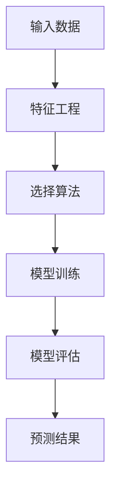
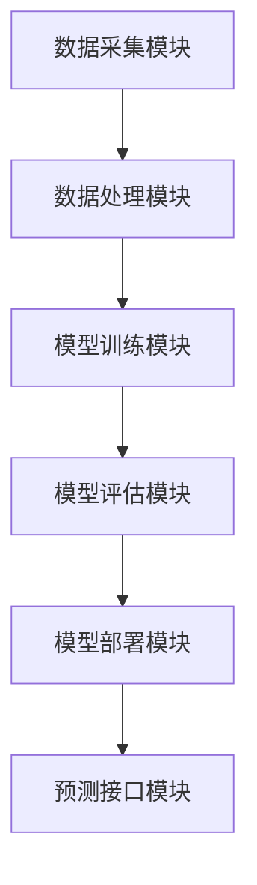
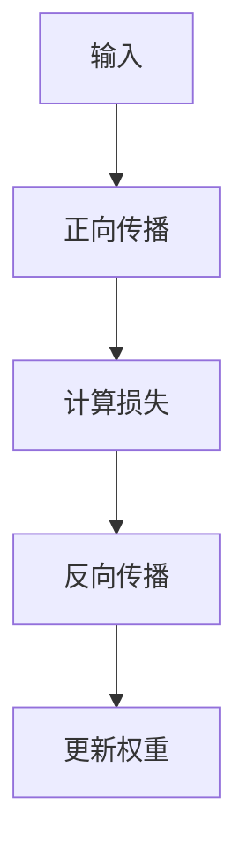
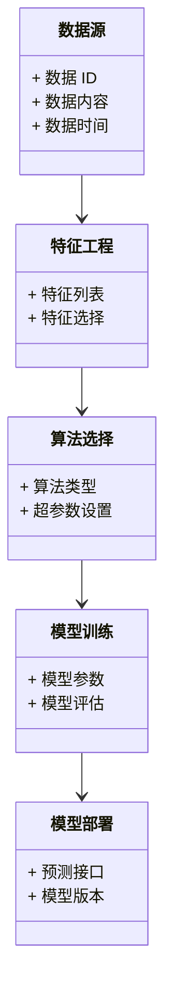
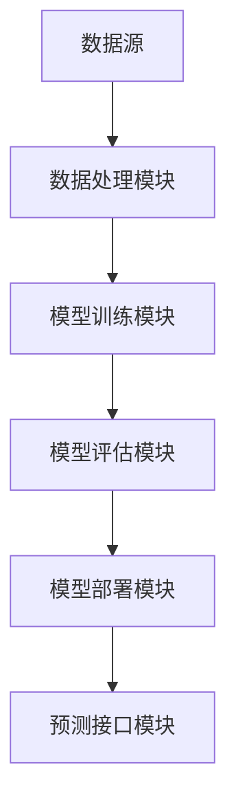
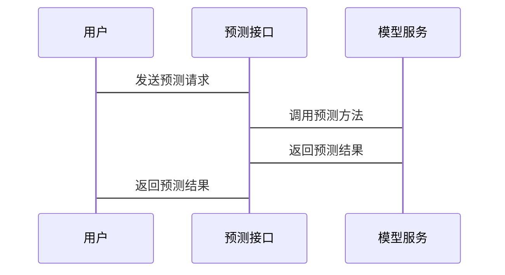

                 


# 构建企业级预测性分析平台：跨业务领域的综合预测模型

## 关键词：企业级预测性分析平台，跨业务领域，综合预测模型，数据驱动决策，机器学习算法

## 摘要：本文详细探讨了如何构建一个适用于跨业务领域的企业级预测性分析平台。文章从预测性分析的背景与概念出发，深入分析了综合预测模型的核心算法与数学模型，并结合系统架构设计与项目实战，展示了如何将理论应用于实际。通过本文，读者将能够理解企业级预测性分析平台的构建过程，并掌握其在不同业务领域的应用方法。

---

# 第一部分: 企业级预测性分析平台概述

# 第1章: 预测性分析平台的背景与概念

## 1.1 预测性分析的背景与现状

### 1.1.1 数据驱动决策的时代背景

在当今数据驱动的商业时代，企业每天都在产生海量的数据。从客户行为数据到生产流程数据，从社交媒体数据到物联网设备数据，企业拥有前所未有的数据资源。然而，数据的价值不仅仅在于存储，而在于如何利用这些数据为企业创造价值。预测性分析正是通过分析历史数据，预测未来趋势，从而帮助企业做出更明智的决策。

### 1.1.2 企业预测性分析的需求与挑战

企业预测性分析的需求主要来自于以下几个方面：

1. **提升决策效率**：通过预测未来趋势，企业可以在问题发生之前采取预防措施，从而提升决策效率。
2. **优化资源配置**：预测性分析可以帮助企业合理分配资源，避免浪费。
3. **提高客户满意度**：通过预测客户行为，企业可以更好地满足客户需求，提高客户满意度。

然而，企业在实施预测性分析时也面临一些挑战：

1. **数据质量**：数据的准确性和完整性直接影响预测结果的准确性。
2. **模型选择**：不同业务场景需要不同的预测模型，选择合适的模型是关键。
3. **技术实现**：构建一个高效、可靠的预测性分析平台需要强大的技术支撑。

### 1.1.3 预测性分析在跨业务领域的应用

预测性分析的应用范围非常广泛，几乎涵盖了所有行业。以下是几个典型的跨业务领域应用：

1. **金融行业**：预测股票价格、检测欺诈交易。
2. **零售行业**：预测销售趋势、优化库存管理。
3. **医疗行业**：预测患者病情发展、优化资源配置。
4. **制造业**：预测设备故障、优化生产流程。

## 1.2 预测性分析的核心概念

### 1.2.1 预测模型的基本定义

预测模型是预测性分析的核心工具。它基于历史数据，通过一定的算法和数学模型，对未来趋势进行预测。预测模型可以分为以下几类：

1. **回归模型**：用于预测连续型变量。
2. **分类模型**：用于预测分类变量。
3. **时间序列模型**：用于预测时间序列数据。
4. **机器学习模型**：如随机森林、神经网络等。

### 1.2.2 数据特征与业务目标的关系

在构建预测模型时，数据特征的选择至关重要。数据特征是指影响预测结果的各种因素，例如时间、地点、客户属性等。业务目标则是指企业希望通过预测模型实现的具体目标，例如预测销售量、客户 churn 等。

数据特征和业务目标之间的关系可以用以下表格来表示：

| 数据特征         | 业务目标         |
|------------------|------------------|
| 时间             | 预测销售量       |
| 地点             | 预测客户 churn   |
| 客户属性         | 预测信用风险     |

### 1.2.3 预测性分析的边界与外延

预测性分析的边界是指模型能够准确预测的范围，而外延则是指模型预测的不确定性范围。在构建预测模型时，需要明确模型的边界，避免超出模型的能力范围。

## 1.3 综合预测模型的结构与组成

### 1.3.1 预测模型的组成要素

综合预测模型通常由以下几个要素组成：

1. **数据源**：输入数据的来源和格式。
2. **特征工程**：对数据进行特征提取和处理。
3. **算法选择**：选择适合的预测算法。
4. **模型训练**：利用训练数据训练模型。
5. **模型评估**：评估模型的性能和准确性。
6. **模型部署**：将模型部署到生产环境，用于实际预测。

### 1.3.2 模型输入与输出的关系

模型输入是指模型的输入数据，模型输出是指模型的预测结果。以下是输入与输出的关系示意图：



### 1.3.3 预测性分析平台的系统架构

预测性分析平台的系统架构通常包括以下几个部分：

1. **数据采集模块**：负责采集数据。
2. **数据处理模块**：对数据进行清洗和预处理。
3. **模型训练模块**：利用算法训练模型。
4. **模型评估模块**：评估模型的性能。
5. **模型部署模块**：将模型部署到生产环境。
6. **预测接口模块**：提供 API 接口，供其他系统调用。

以下是系统的架构图：



## 1.4 本章小结

本章详细介绍了预测性分析平台的背景与概念，包括预测性分析的背景与现状、核心概念以及综合预测模型的结构与组成。通过本章的学习，读者可以理解预测性分析的基本概念和其在企业中的重要性。

---

# 第二部分: 预测性分析的核心算法与数学模型

# 第2章: 预测模型的算法原理

## 2.1 线性回归算法

### 2.1.1 线性回归的基本原理

线性回归是一种简单而强大的预测模型，主要用于预测连续型变量。它的基本假设是因变量与自变量之间存在线性关系。

线性回归的数学模型可以表示为：

$$ y = \beta_0 + \beta_1x_1 + \beta_2x_2 + ... + \beta_nx_n $$

其中，$y$ 是因变量，$x_i$ 是自变量，$\beta_i$ 是回归系数。

### 2.1.2 线性回归的数学模型

线性回归的损失函数通常采用最小二乘法：

$$ L = \sum_{i=1}^{n}(y_i - (\beta_0 + \beta_1x_{i1} + ... + \beta_kx_{ik}))^2 $$

通过求解损失函数的最小值，可以得到回归系数的最优解。

### 2.1.3 线性回归的应用

线性回归广泛应用于各种领域，例如预测房价、销售量等。以下是一个简单的线性回归实现示例：

```python
import numpy as np
from sklearn.linear_model import LinearRegression

# 生成数据
X = np.array([[1, 2], [3, 4], [5, 6]])
y = np.array([7, 8, 9])

# 训练模型
model = LinearRegression()
model.fit(X, y)

# 预测
print(model.predict([[7, 8]]))  # 输出 [10.]
```

## 2.2 随机森林算法

### 2.2.1 随机森林的原理与优势

随机森林是一种基于决策树的集成学习算法。它通过构建多棵决策树，并将它们的结果进行投票或平均，从而提高模型的准确性和稳定性。

随机森林的优势包括：

1. **高准确性**：集成学习提高了模型的准确性。
2. **鲁棒性**：随机森林对噪声数据具有较强的鲁棒性。
3. **易于实现**：随机森林的实现相对简单。

### 2.2.2 随机森林的数学模型

随机森林的数学模型可以表示为：

$$ y = \frac{1}{n} \sum_{i=1}^{n} h_i(x) $$

其中，$h_i(x)$ 是第 $i$ 棵决策树的预测结果，$n$ 是决策树的数量。

### 2.2.3 随机森林与决策树的关系

随机森林是决策树的一种集成方法。以下是决策树和随机森林的对比：

| 特性               | 决策树             | 随机森林       |
|--------------------|-------------------|----------------|
| 是否集成           | 否               | 是             |
| 抗噪声能力         | 弱               | 强             |
| 计算效率           | 高               | 低             |

## 2.3 XGBoost算法

### 2.3.1 XGBoost的核心思想

XGBoost是一种基于梯度提升的算法，其核心思想是通过不断优化损失函数，逐步构建模型。XGBoost不仅在训练速度上优于其他算法，还在模型的准确性和稳定性上表现出色。

### 2.3.2 XGBoost的数学模型

XGBoost的目标函数可以表示为：

$$ obj = \sum_{i=1}^{n} [w_{i} + \sum_{j=1}^{m} \gamma_{ij}] + \lambda \sum_{j=1}^{m} \theta_j^2 $$

其中，$w_i$ 是样本的权重，$\gamma_{ij}$ 是决策树的叶子节点权重，$\theta_j$ 是模型参数，$\lambda$ 是正则化参数。

### 2.3.3 XGBoost的优化策略

XGBoost的优化策略包括：

1. **正则化**：通过添加正则化项，防止过拟合。
2. **剪枝**：通过剪枝操作，减少决策树的复杂度。
3. **学习率**：通过调整学习率，控制模型的更新速度。

## 2.4 神经网络算法

### 2.4.1 神经网络的基本结构

神经网络是一种模仿人脑结构的算法，主要包括输入层、隐藏层和输出层。神经网络的结构可以用以下示意图表示：


### 2.4.2 神经网络的数学模型

神经网络的数学模型可以表示为：

$$ y = f(Wx + b) $$

其中，$W$ 是权重矩阵，$x$ 是输入向量，$b$ 是偏置项，$f$ 是激活函数。

### 2.4.3 神经网络的训练过程

神经网络的训练过程包括正向传播和反向传播两个阶段。以下是训练过程的示意图：



## 2.5 算法对比与选择策略

### 2.5.1 算法性能对比表格

以下是几种常见算法的性能对比表格：

| 算法      | 优点                     | 缺点                     |
|-----------|--------------------------|--------------------------|
| 线性回归   | 简单，易于实现           | 仅适用于线性关系         |
| 随机森林   | 高准确性，鲁棒性         | 计算效率较低             |
| XGBoost    | 高准确性，训练速度快       | 易于过拟合               |
| 神经网络    | 高准确性，适应能力强       | 计算复杂，需要大量数据   |

### 2.5.2 算法适用场景分析

选择合适的算法需要考虑以下因素：

1. **数据类型**：线性回归适用于连续型变量，随机森林适用于分类和回归问题。
2. **数据规模**：神经网络适用于大规模数据，随机森林适用于中小规模数据。
3. **计算能力**：XGBoost和神经网络需要较高的计算能力。

---

# 第三部分: 系统分析与架构设计

# 第3章: 系统分析与架构设计

## 3.1 项目背景与需求分析

### 3.1.1 项目背景

企业级预测性分析平台的目标是通过整合不同业务领域的数据，构建一个通用的预测模型，为企业提供跨业务的预测支持。

### 3.1.2 项目需求

1. **数据整合**：整合多个业务领域的数据。
2. **模型构建**：支持多种算法，构建综合预测模型。
3. **模型部署**：将模型部署到生产环境，提供预测服务。

## 3.2 系统功能设计

### 3.2.1 领域模型设计

以下是领域模型的类图：



### 3.2.2 系统架构设计

以下是系统的架构图：



### 3.2.3 接口设计与交互流程

以下是接口交互流程的示意图：



## 3.3 系统实现细节

### 3.3.1 数据源与数据处理

数据源包括数据库、文件等多种形式。数据处理模块负责对数据进行清洗、转换和特征提取。

### 3.3.2 算法选择与模型训练

算法选择模块根据业务需求选择合适的预测算法，并通过调整超参数优化模型性能。

### 3.3.3 模型部署与预测服务

模型部署模块将训练好的模型部署到生产环境，并通过 API 接口提供预测服务。

## 3.4 系统优化与扩展

### 3.4.1 模型优化策略

模型优化策略包括：

1. **超参数调优**：通过网格搜索或随机搜索优化模型参数。
2. **特征优化**：通过特征选择或降维技术优化模型性能。
3. **模型集成**：通过集成学习提高模型的准确性和稳定性。

### 3.4.2 系统扩展性设计

系统扩展性设计包括：

1. **模块化设计**：通过模块化设计，方便后续功能扩展。
2. **分布式部署**：通过分布式部署，提高系统的计算能力和处理能力。
3. **动态调整**：通过动态调整模型参数，适应业务需求的变化。

---

# 第四部分: 项目实战

# 第4章: 项目实战与案例分析

## 4.1 项目环境安装与配置

### 4.1.1 安装 Python 环境

使用 Anaconda 安装 Python 环境：

```bash
conda create -n py38 python=3.8
conda activate py38
```

### 4.1.2 安装依赖库

安装所需的依赖库：

```bash
pip install numpy scikit-learn xgboost
```

## 4.2 系统核心实现

### 4.2.1 数据处理代码

以下是数据处理的代码示例：

```python
import pandas as pd
import numpy as np

# 读取数据
data = pd.read_csv('data.csv')

# 数据清洗
data = data.dropna()
data = data.replace({np.nan: 0})

# 特征提取
features = data[['feature1', 'feature2', 'feature3']]
target = data['target']

print("数据处理完成。")
```

### 4.2.2 模型训练代码

以下是模型训练的代码示例：

```python
from sklearn.ensemble import RandomForestRegressor
from sklearn.model_selection import train_test_split

# 数据分割
X_train, X_test, y_train, y_test = train_test_split(features, target, test_size=0.2)

# 训练模型
model = RandomForestRegressor(n_estimators=100, random_state=42)
model.fit(X_train, y_train)

# 预测结果
y_pred = model.predict(X_test)

print("模型训练完成。")
```

### 4.2.3 模型评估代码

以下是模型评估的代码示例：

```python
from sklearn.metrics import mean_squared_error, r2_score

# 计算均方误差
mse = mean_squared_error(y_test, y_pred)
print(f"均方误差：{mse}")

# 计算 R 平方
r2 = r2_score(y_test, y_pred)
print(f"R 平方：{r2}")
```

## 4.3 项目案例分析

### 4.3.1 案例背景

以某零售企业为例，该企业希望预测未来一个月的销售量。

### 4.3.2 数据分析与处理

以下是数据处理的步骤：

1. **数据清洗**：删除缺失值。
2. **特征提取**：选择影响销售量的关键特征，如历史销售数据、季节因素、促销活动等。
3. **数据分割**：将数据分为训练集和测试集。

### 4.3.3 模型选择与训练

选择随机森林算法进行模型训练，并通过交叉验证优化模型参数。

### 4.3.4 模型评估与部署

通过均方误差和 R 平方评估模型的性能，并将模型部署到生产环境，提供销售量预测服务。

## 4.4 项目总结

### 4.4.1 项目成果

通过本项目，我们成功构建了一个适用于零售行业的销售量预测模型，并将其部署到生产环境，为企业提供实时预测服务。

### 4.4.2 项目经验与教训

1. **数据质量的重要性**：数据清洗和特征提取是影响模型性能的关键因素。
2. **算法选择的策略**：选择合适的算法需要结合业务需求和数据特点。
3. **模型优化的技巧**：通过超参数调优和特征优化可以显著提高模型性能。

---

# 第五部分: 最佳实践与总结

# 第5章: 最佳实践与总结

## 5.1 最佳实践

### 5.1.1 数据处理

1. **数据清洗**：删除无效数据，处理缺失值。
2. **特征提取**：选择关键特征，避免过多的特征维度。
3. **数据标准化**：对数据进行标准化处理，确保模型的稳定性。

### 5.1.2 模型选择

1. **算法选择**：根据业务需求和数据特点选择合适的算法。
2. **超参数调优**：通过网格搜索或随机搜索优化模型参数。
3. **模型集成**：通过集成学习提高模型的准确性和稳定性。

### 5.1.3 系统部署

1. **模块化设计**：通过模块化设计，方便后续功能扩展。
2. **分布式部署**：通过分布式部署，提高系统的计算能力和处理能力。
3. **动态调整**：通过动态调整模型参数，适应业务需求的变化。

## 5.2 小结

通过本文的详细讲解，我们了解了企业级预测性分析平台的构建过程，包括背景与概念、核心算法与数学模型、系统架构设计以及项目实战与案例分析。通过本文的学习，读者可以掌握如何将理论应用于实际，构建一个高效、可靠的预测性分析平台。

## 5.3 注意事项

1. **数据隐私**：在处理数据时，需要注意数据隐私和安全问题。
2. **模型解释性**：在实际应用中，模型的解释性非常重要，尤其是在金融和医疗等领域。
3. **模型更新**：需要定期更新模型，以适应数据和业务的变化。

## 5.4 拓展阅读

1. **《Hands-On Machine Learning with Scikit-Learn, Keras, and TensorFlow》**：这本书详细讲解了机器学习算法和模型的实现。
2. **《Deep Learning》**：这本书深入讲解了深度学习的理论和应用。
3. **《Data Science for Business》**：这本书从商业角度讲解了数据分析和预测性分析的应用。

---

# 作者：AI天才研究院/AI Genius Institute & 禅与计算机程序设计艺术 /Zen And The Art of Computer Programming

---

这篇文章从企业级预测性分析平台的背景与概念出发，详细讲解了预测性分析的核心算法与数学模型，并结合系统架构设计与项目实战，展示了如何将理论应用于实际。通过本文的学习，读者可以掌握企业级预测性分析平台的构建方法，并在实际应用中灵活运用。

