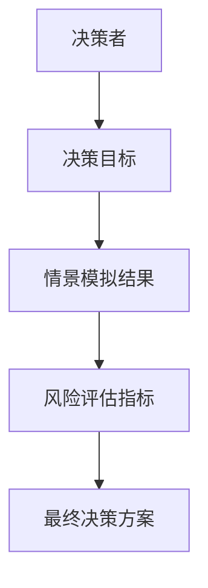
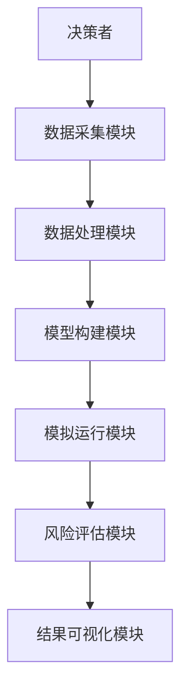
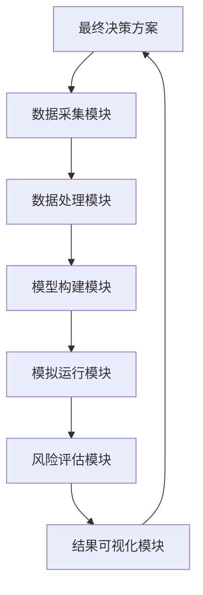

                 


# 构建智能企业决策支持系统：多维度情景模拟与风险评估

> 关键词：企业决策支持系统、情景模拟、风险评估、算法原理、系统架构、项目实战

> 摘要：本文详细探讨了构建智能企业决策支持系统的理论基础、核心算法、系统架构及项目实现。通过多维度情景模拟与风险评估的方法，结合实际案例分析，为读者提供了一套完整的系统构建方案。本文适合企业决策者、IT架构师及数据科学家阅读，帮助他们理解如何通过智能化手段提升企业决策效率和准确性。

---

# 第一部分: 智能企业决策支持系统概述

# 第1章: 问题背景与需求分析

## 1.1 问题背景

### 1.1.1 传统企业决策的局限性
传统的企业决策过程依赖于人工经验判断和简单的数据统计分析，存在以下主要问题：
- 数据来源单一，难以覆盖多维度信息。
- 决策周期长，难以快速响应市场变化。
- 风险评估不全面，难以预测复杂场景下的潜在问题。
- 缺乏系统性，难以实现跨部门协同优化。

### 1.1.2 智能化决策的必要性
随着企业规模的扩大和市场竞争的加剧，传统决策方式已无法满足现代企业的需求。智能化决策支持系统可以通过以下方式解决这些问题：
- 利用大数据技术整合多维度数据，提供全面的决策依据。
- 通过机器学习算法进行预测和优化，提升决策的科学性和准确性。
- 实现实时数据处理和动态调整，增强企业应对市场变化的敏捷性。

### 1.1.3 情景模拟与风险评估的重要性
情景模拟与风险评估是企业决策支持系统的核心功能。它们可以帮助企业在复杂多变的市场环境中：
- 评估不同决策方案的可行性。
- 预测潜在风险并制定应对策略。
- 优化资源配置，提高企业整体效率。

## 1.2 问题描述

### 1.2.1 企业决策支持系统的定义
企业决策支持系统（Enterprise Decision Support System，EDSS）是一种利用信息技术和数据分析技术，辅助企业决策者进行决策的智能化系统。它能够通过数据处理、模型构建和结果分析，为决策者提供科学依据。

### 1.2.2 多维度情景模拟的需求
在现代企业中，决策往往涉及多个维度的因素，例如市场、财务、生产、供应链等。多维度情景模拟可以通过构建复杂的数学模型，模拟不同场景下的企业运行状态，为决策者提供全面的决策依据。

### 1.2.3 风险评估的核心作用
风险评估是企业决策过程中不可或缺的一部分。它通过对潜在风险的识别、量化和分析，帮助企业在决策中考虑各种不确定性因素，降低决策失败的风险。

## 1.3 问题解决

### 1.3.1 智能化决策支持的实现路径
智能化决策支持系统的实现路径主要包括以下几个方面：
1. 数据采集与整合：从企业内外部获取多源异构数据，进行清洗和预处理。
2. 数据分析与建模：利用统计分析、机器学习等技术，构建决策模型。
3. 情景模拟与优化：通过多维度情景模拟，优化决策方案，降低风险。
4. 可视化与人机交互：将分析结果以直观的方式呈现，辅助决策者进行判断。

### 1.3.2 多维度情景模拟的方法论
多维度情景模拟的方法论主要包括以下步骤：
1. 确定模拟目标：明确模拟的核心问题和目标。
2. 构建数学模型：根据问题特点，构建合适的数学模型。
3. 确定输入参数：收集和处理相关数据，确定模拟的输入参数。
4. 运行模拟：通过算法进行模拟运算，获取模拟结果。
5. 分析与优化：对模拟结果进行分析，优化决策方案。

### 1.3.3 风险评估的数学模型构建
风险评估的数学模型通常包括以下几个部分：
1. 风险因子识别：识别影响决策的主要风险因素。
2. 风险概率计算：计算每个风险因子的发生概率。
3. 风险影响评估：评估每个风险因子对决策目标的影响程度。
4. 综合风险评分：根据概率和影响程度，计算综合风险评分。

## 1.4 系统边界与外延

### 1.4.1 系统的输入与输出
系统的输入包括：
- 各类数据源（如市场数据、财务数据、供应链数据等）。
- 用户输入的决策参数。
系统的输出包括：
- 情景模拟结果。
- 风险评估报告。
- 优化后的决策方案。

### 1.4.2 系统的功能边界
系统的功能边界包括：
- 数据采集与处理。
- 模型构建与模拟。
- 风险评估与优化。
- 结果可视化与报告生成。

### 1.4.3 系统的扩展性与适应性
系统设计需要考虑扩展性和适应性，以便在未来业务变化时能够方便地进行功能扩展和参数调整。

## 1.5 核心概念与组成

### 1.5.1 多维度情景模拟的定义
多维度情景模拟是指在企业决策过程中，通过构建多个维度的数学模型，模拟不同场景下的企业运行状态，从而为决策者提供科学依据。

### 1.5.2 风险评估的实现机制
风险评估的实现机制包括风险因子识别、概率计算、影响评估和综合评分等多个步骤。

### 1.5.3 系统的核心组成要素
系统的核心组成要素包括：
- 数据采集模块。
- 数据处理模块。
- 模型构建模块。
- 模拟运行模块。
- 风险评估模块。
- 结果可视化模块。

## 1.6 本章小结
本章详细介绍了企业决策支持系统的基本概念、问题背景、解决方法以及系统的组成要素。通过本章的学习，读者可以理解构建智能企业决策支持系统的必要性和基本框架。

---

# 第二部分: 核心概念与联系

# 第2章: 多维度情景模拟与风险评估的核心概念

## 2.1 核心概念原理

### 2.1.1 多维度情景模拟的原理
多维度情景模拟的原理是通过构建多个维度的数学模型，模拟不同场景下的企业运行状态，从而为决策者提供科学依据。

### 2.1.2 风险评估的基本原理
风险评估的基本原理是通过对潜在风险的识别、量化和分析，帮助企业在决策中考虑各种不确定性因素，降低决策失败的风险。

### 2.1.3 两者结合的实现机制
多维度情景模拟与风险评估的结合可以通过以下步骤实现：
1. 构建多维度数学模型。
2. 输入相关数据参数。
3. 运行模拟，获取模拟结果。
4. 进行风险评估，优化决策方案。

## 2.2 核心概念对比分析

### 2.2.1 情景模拟与风险评估的属性特征对比
以下是情景模拟与风险评估的属性特征对比表：

| 特性 | 情景模拟 | 风险评估 |
|------|----------|----------|
| 目标 | 预测不同场景下的企业运行状态 | 评估潜在风险及其影响程度 |
| 输入 | 多维度数据和参数 | 风险因子和相关数据 |
| 输出 | 模拟结果 | 风险评分和应对策略 |

### 2.2.2 两者的优缺点分析
- **情景模拟的优点**：
  - 可以全面分析多种场景下的企业运行状态。
  - 能够提供科学的决策依据。
- **情景模拟的缺点**：
  - 模型构建复杂，需要大量的数据和计算资源。
  - 模拟结果的准确性依赖于模型的合理性和数据的准确性。
- **风险评估的优点**：
  - 能够帮助企业识别潜在风险。
  - 有助于制定风险应对策略。
- **风险评估的缺点**：
  - 风险因子的识别和量化较为困难。
  - 风险评估结果的准确性依赖于数据和模型的合理性。

### 2.2.3 两者在企业决策中的协同作用
情景模拟和风险评估在企业决策中的协同作用体现在以下几个方面：
1. **相互补充**：情景模拟提供多种场景的运行状态，风险评估则分析每种场景下的潜在风险。
2. **优化决策**：通过情景模拟和风险评估的结合，企业可以在多种场景下找到最优的决策方案。
3. **提高决策效率**：通过模拟和评估，企业可以快速找到最优决策方案，提高决策效率。

## 2.3 实体关系图



---

# 第三部分: 算法原理讲解

# 第3章: 多维度情景模拟的算法原理

## 3.1 算法原理概述

### 3.1.1 情景模拟的基本步骤
情景模拟的基本步骤包括：
1. 确定模拟目标。
2. 构建数学模型。
3. 确定输入参数。
4. 运行模拟。
5. 分析模拟结果。

### 3.1.2 多维度模拟的实现方法
多维度模拟的实现方法包括：
1. 分层模拟：将问题分解为多个层次，分别进行模拟。
2. 并行模拟：利用并行计算技术，同时进行多个维度的模拟。
3. 组合模拟：结合不同维度的模拟结果，综合分析。

### 3.1.3 算法的数学模型
情景模拟的数学模型通常包括以下几个部分：
1. 状态变量：描述系统状态的变量。
2. 输入变量：影响系统状态的输入参数。
3. 转移函数：描述状态变量之间的转移关系。
4. 输出变量：模拟结果。

## 3.2 算法实现

### 3.2.1 蒙特卡洛模拟算法

#### 3.2.1.1 蒙特卡洛模拟的步骤
蒙特卡洛模拟的步骤包括：
1. 确定输入参数的概率分布。
2. 生成随机数，模拟输入参数。
3. 计算模拟结果。
4. 统计分析模拟结果。

#### 3.2.1.2 Python实现示例

```python
import random

def monte_carlo_simulation(iterations=1000):
    results = []
    for _ in range(iterations):
        # 生成随机数
        x = random.uniform(0, 1)
        y = random.uniform(0, 1)
        # 计算模拟结果
        result = x + y
        results.append(result)
    return results

# 运行蒙特卡洛模拟
sim_results = monte_carlo_simulation(1000)
# 统计分析
mean_result = sum(sim_results) / len(sim_results)
print(f"Mean result: {mean_result}")
```

#### 3.2.1.3 算法的数学模型
蒙特卡洛模拟的数学模型如下：

$$
\text{结果} = \sum_{i=1}^{n} \text{随机变量}
$$

其中，随机变量服从均匀分布或其他概率分布。

## 3.3 算法的数学模型和公式

### 3.3.1 概率分布的数学模型
概率分布的数学模型如下：

$$
P(X = x) = \frac{1}{b - a}
$$

其中，$a$ 和 $b$ 分别是变量 $X$ 的最小值和最大值。

### 3.3.2 期望值的计算
期望值的计算公式如下：

$$
E[X] = \int_{a}^{b} x f(x) dx
$$

其中，$f(x)$ 是变量 $X$ 的概率密度函数。

---

# 第四部分: 系统分析与架构设计

# 第4章: 系统分析与架构设计

## 4.1 问题场景介绍

### 4.1.1 系统目标
系统目标是构建一个智能企业决策支持系统，实现多维度情景模拟与风险评估功能，辅助企业决策者进行科学决策。

### 4.1.2 项目介绍
本项目旨在开发一个智能化的企业决策支持系统，结合多维度情景模拟和风险评估技术，为企业提供全面的决策支持。

## 4.2 系统功能设计

### 4.2.1 领域模型类图


## 4.3 系统架构设计

### 4.3.1 系统架构图



### 4.3.2 系统接口设计
系统接口设计包括：
1. 数据接口：用于数据的输入和输出。
2. 模型接口：用于模型的构建和运行。
3. 可视化接口：用于结果的展示和交互。

### 4.3.3 系统交互流程



---

# 第五部分: 项目实战

# 第5章: 项目实战

## 5.1 环境安装

### 5.1.1 Python环境安装
安装Python和必要的库：

```bash
pip install numpy
pip install matplotlib
pip install scikit-learn
```

## 5.2 系统核心实现

### 5.2.1 情景模拟实现

```python
import numpy as np
import matplotlib.pyplot as plt

def scenario_simulation(parameters):
    # 模拟过程
    results = []
    for param in parameters:
        result = param + np.random.normal(0, 0.1)
        results.append(result)
    return results

# 运行模拟
params = np.random.uniform(0, 1, 100)
sim_results = scenario_simulation(params)
# 可视化结果
plt.plot(sim_results)
plt.xlabel('Scenario')
plt.ylabel('Result')
plt.show()
```

### 5.2.2 风险评估实现

```python
from sklearn.metrics import mean_squared_error

def risk_assessment(sim_results, actual_results):
    # 计算风险评分
    mse = mean_squared_error(sim_results, actual_results)
    risk_score = np.sqrt(mse)
    return risk_score

# 示例数据
sim_results = [1.2, 1.3, 1.1, 1.4]
actual_results = [1.0, 1.1, 0.9, 1.2]
risk_score = risk_assessment(sim_results, actual_results)
print(f"Risk score: {risk_score}")
```

## 5.3 代码应用解读与分析

### 5.3.1 情景模拟代码解读
上述情景模拟代码通过生成随机参数，运行模拟，并将结果可视化。这可以帮助决策者理解不同场景下的企业运行状态。

### 5.3.2 风险评估代码解读
上述风险评估代码通过计算模拟结果与实际结果的均方误差，计算风险评分。这可以帮助企业识别潜在风险，并制定应对策略。

## 5.4 实际案例分析

### 5.4.1 案例背景
某企业计划推出新产品，需要评估不同市场环境下的销售情况。

### 5.4.2 数据收集与处理
收集市场数据、竞争对手数据、消费者偏好数据等。

### 5.4.3 模型构建与模拟
构建销售预测模型，模拟不同场景下的销售情况。

### 5.4.4 风险评估与优化
评估不同场景下的销售风险，优化决策方案。

## 5.5 项目小结
通过本章的项目实战，读者可以掌握如何利用Python代码实现情景模拟和风险评估功能，并能够将这些技术应用到实际的企业决策中。

---

# 第六部分: 总结与展望

# 第6章: 总结与展望

## 6.1 本章总结
本文详细介绍了构建智能企业决策支持系统的理论基础、核心算法、系统架构及项目实现。通过多维度情景模拟与风险评估的方法，结合实际案例分析，为读者提供了一套完整的系统构建方案。

## 6.2 最佳实践 Tips

### 6.2.1 数据质量的重要性
数据质量是情景模拟和风险评估的基础，确保数据的准确性和完整性至关重要。

### 6.2.2 模型选择的注意事项
选择合适的模型可以提高模拟结果的准确性，建议根据具体问题选择合适的方法。

### 6.2.3 系统维护与优化
系统需要定期维护和优化，以适应业务的变化和技术的发展。

## 6.3 注意事项
- 情景模拟和风险评估的结果仅供参考，决策者需要结合实际情况进行判断。
- 模型的复杂度和计算资源需要进行权衡。
- 系统的安全性和数据隐私需要高度重视。

## 6.4 拓展阅读
建议读者阅读以下书籍和文章，以进一步深入了解相关技术：
1. 《机器学习实战》—— 周志华
2. 《数据挖掘导论》—— 艾迪·汉密尔顿
3. 《风险评估与管理》—— 约翰·C·霍兰

---

# 作者：AI天才研究院/AI Genius Institute & 禅与计算机程序设计艺术 /Zen And The Art of Computer Programming

---

以上是《构建智能企业决策支持系统：多维度情景模拟与风险评估》的完整目录结构和内容框架。希望对您有所帮助！

