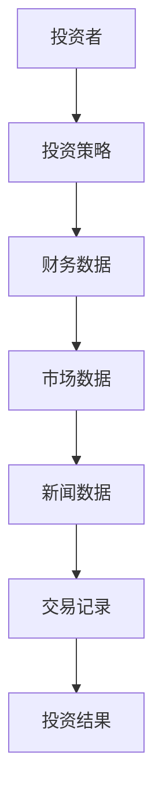
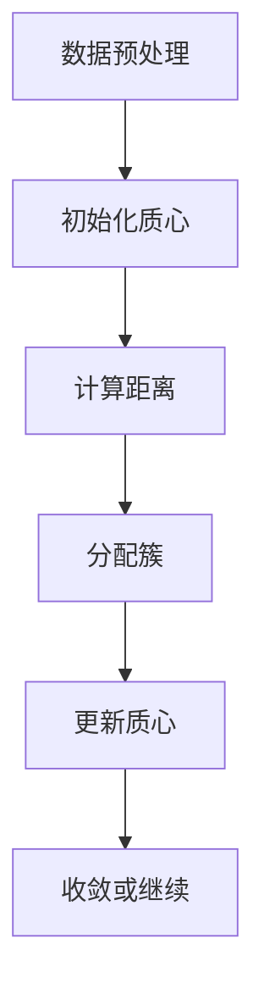
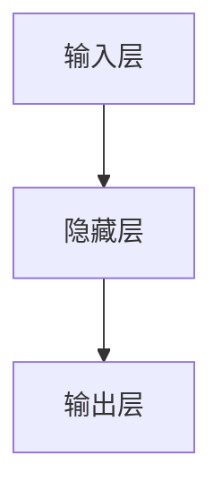
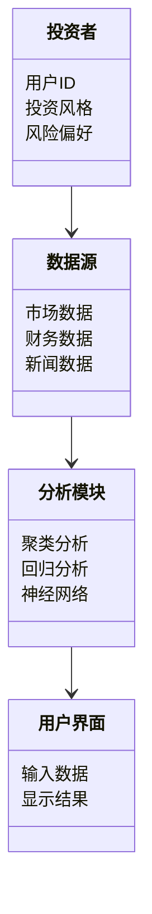
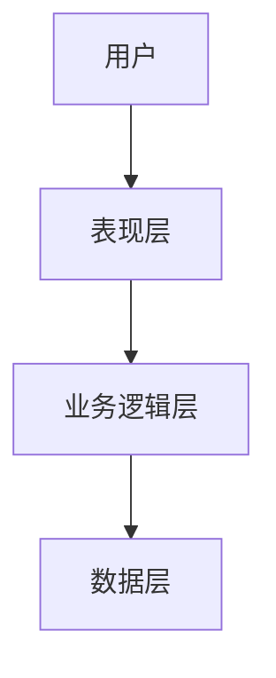
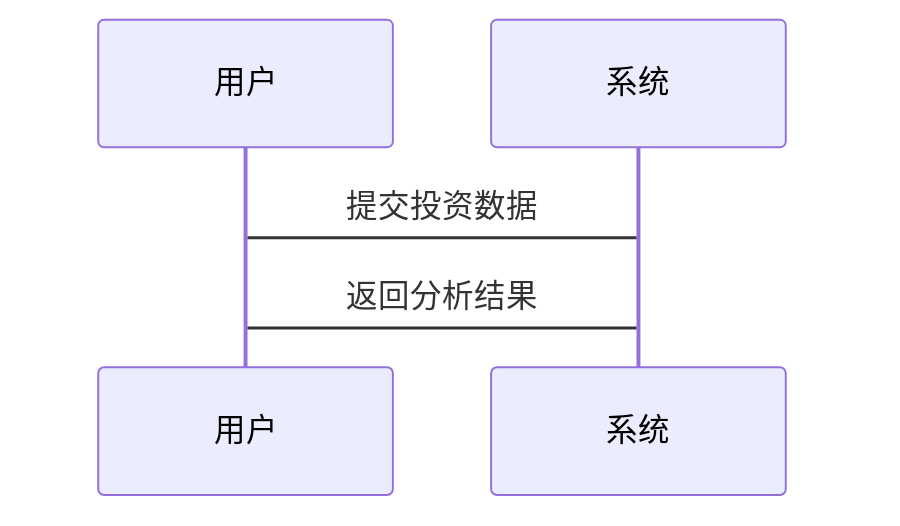

                 


# 构建智能化的个人投资风格分析工具

## 关键词：投资风格分析，人工智能，机器学习，数据驱动，系统架构

## 摘要：本文详细探讨了构建智能化个人投资风格分析工具的全过程，从背景分析到算法实现，再到系统架构设计和项目实战，旨在帮助投资者通过智能化手段优化投资策略。文章通过逐步分析，结合具体案例和代码示例，全面解析了如何利用现代技术提升投资分析效率和准确性。

---

# 第一部分: 背景介绍

## 第1章: 个人投资风格分析工具的背景与意义

### 1.1 投资市场的复杂性与挑战

#### 1.1.1 投资市场的基本特征

投资市场是一个高度复杂和动态变化的环境，涉及多种因素如经济指标、市场情绪、政策变化等。这些因素相互作用，使得市场预测和投资决策变得极具挑战性。

#### 1.1.2 传统投资分析方法的局限性

传统投资分析方法依赖于人工判断和经验分析，这种方法在面对海量数据时显得力不从心，且容易受到主观因素的影响，难以捕捉市场中的隐含规律。

#### 1.1.3 智能化工具在投资分析中的必要性

随着数据科学和人工智能技术的发展，智能化工具能够处理大量数据，提取深层次信息，提供更精准的投资建议，从而帮助投资者做出更科学的决策。

### 1.2 个人投资风格的定义与分类

#### 1.2.1 投资风格的定义

投资风格是指投资者在选择投资标的、制定投资策略和管理投资组合时所遵循的一贯方法和偏好。

#### 1.2.2 主要投资风格的分类

主要投资风格包括价值投资、成长投资、趋势投资、技术分析等。每种风格都有其独特的特点和适用场景。

#### 1.2.3 不同投资风格的特点与适用场景

例如，价值投资者注重低市盈率、高分红率的股票，而成长投资者则关注高成长性的公司。了解这些特点有助于投资者选择适合自己的风格。

### 1.3 智能化工具的核心优势

#### 1.3.1 数据处理能力的提升

智能化工具能够快速处理和分析大量的市场数据，发现传统方法难以察觉的规律。

#### 1.3.2 个性化分析的实现

通过机器学习等技术，工具可以为不同投资者提供个性化的投资建议。

#### 1.3.3 风险控制的优化

智能化工具能够实时监控市场变化，及时预警潜在风险，帮助投资者做出及时调整。

## 第2章: 问题背景与目标分析

### 2.1 问题背景

#### 2.1.1 投资者行为分析的必要性

了解投资者的行为模式和偏好，有助于制定更有效的投资策略。

#### 2.1.2 个性化投资策略的需求

每个投资者的需求和风险承受能力不同，因此需要个性化的投资建议。

#### 2.1.3 当前市场对智能化工具的需求

传统方法难以满足现代市场对高效、精准分析的需求，智能化工具成为必然选择。

### 2.2 问题描述

#### 2.2.1 投资风格分析的复杂性

不同投资者的风格差异大，且受多种因素影响，分析起来较为复杂。

#### 2.2.2 数据来源的多样性

投资分析需要整合多种数据源，包括市场数据、财务数据、新闻数据等，增加了分析的难度。

#### 2.2.3 分析结果的可解释性

复杂的算法可能导致结果难以解释，影响投资者的信任和应用。

### 2.3 问题解决的目标

#### 2.3.1 构建智能化分析框架

通过整合多种数据源和算法，构建一个高效的分析框架。

#### 2.3.2 提供个性化投资建议

根据投资者的风格和需求，提供定制化的投资建议。

#### 2.3.3 实现风险预警机制

实时监控市场变化，及时预警潜在风险。

## 第3章: 核心概念与联系

### 3.1 核心概念原理

#### 3.1.1 数据驱动的分析方法

通过大量数据的分析和挖掘，发现投资风格的特征和规律。

#### 3.1.2 机器学习在投资分析中的应用

使用机器学习算法，如聚类、分类和回归，来分析和预测市场走势。

#### 3.1.3 自然语言处理在文本分析中的作用

利用NLP技术分析新闻、财报等文本数据，提取情感和关键词，辅助投资决策。

### 3.2 核心概念对比表

| 分析方法 | 优点 | 缺点 | 适用场景 |
|----------|------|------|----------|
| 传统统计分析 | 方法简单，易于解释 | 易受噪声干扰，精度低 | 初步数据分析 |
| 机器学习 | 高精度，可处理复杂模式 | 需大量数据，难解释 | 复杂市场分析 |
| 深度学习 | 能捕捉深层次特征 | 需大量计算资源，难解释 | 图像、语音等非结构化数据处理 |

### 3.3 实体关系图



---

# 第二部分: 算法原理讲解

## 第4章: 聚类分析算法

### 4.1 聚类分析的基本原理

聚类分析是将数据点根据相似性分成若干簇的过程，常用于识别不同类型的投资风格。

#### 4.1.1 K-means算法

K-means是一种常用的聚类算法，适用于处理数值型数据。



##### Python实现示例

```python
from sklearn.cluster import KMeans
import numpy as np

# 示例数据
X = np.array([[1, 2], [3, 4], [5, 6], [7, 8]])
# 初始化模型
model = KMeans(n_clusters=2, random_state=0)
# 拟合模型
model.fit(X)
# 获取簇中心
print(model.cluster_centers_)
```

### 4.2 聚类分析的数学模型

聚类分析的目标是最小化簇内平方误差之和：

$$ \sum_{i=1}^{k} \sum_{j=1}^{n_i} (x_j - c_i)^2 $$

其中，\( k \) 是簇的数量，\( n_i \) 是第 \( i \) 个簇中的样本数，\( c_i \) 是第 \( i \) 个簇的中心。

---

## 第5章: 回归分析算法

### 5.1 线性回归的基本原理

线性回归用于预测连续型变量，常用于分析投资回报与相关因素的关系。

#### 5.1.1 最小二乘法

最小化预测值与实际值之间的平方差之和：

$$ \min_{\theta} \sum_{i=1}^{m} (y_i - \theta x_i - b)^2 $$

其中，\( \theta \) 和 \( b \) 是模型参数，\( m \) 是样本数。

##### Python实现示例

```python
import numpy as np
from sklearn.linear_model import LinearRegression

X = np.array([[1], [2], [3], [4]])
y = np.array([2, 4, 5, 6])

model = LinearRegression()
model.fit(X, y)
print(model.coef_)
```

### 5.2 回归分析的数学模型

线性回归的预测模型可以表示为：

$$ y = \theta x + b $$

其中，\( \theta \) 是斜率，\( b \) 是截距。

---

## 第6章: 神经网络算法

### 6.1 神经网络的基本原理

神经网络通过多层非线性变换，能够捕捉复杂的数据模式。

#### 6.1.1 多层感知机（MLP）

MLP是一种常见的神经网络结构，适用于分类和回归任务。

##### 网络结构图



#### 6.1.2 神经网络的训练过程

训练过程包括正向传播和反向传播两个阶段。

##### 正向传播

$$ a^{(l+1)} = \sigma(w^{(l)} a^{(l)} + b^{(l)}) $$

##### 反向传播

使用梯度下降法更新权重：

$$ w^{(l)} = w^{(l)} - \eta \frac{\partial L}{\partial w^{(l)}} $$

其中，\( \eta \) 是学习率，\( L \) 是损失函数。

---

# 第三部分: 系统分析与架构设计方案

## 第7章: 系统分析

### 7.1 问题场景介绍

系统需要帮助投资者识别和优化他们的投资风格，提供个性化建议，并实时监控市场风险。

### 7.2 系统功能设计

#### 7.2.1 领域模型



### 7.3 系统架构设计

#### 7.3.1 分层架构



#### 7.3.2 接口设计

系统提供RESTful API，用于数据输入和结果输出。

#### 7.3.3 交互设计



---

## 第8章: 系统架构设计方案

### 8.1 问题场景介绍

系统需要支持多种数据源的接入和多种算法的集成，确保分析结果的准确性和实时性。

### 8.2 系统架构设计

#### 8.2.1 分层架构

系统分为数据层、业务逻辑层和表现层，每层负责不同的功能模块。

#### 8.2.2 接口设计

系统提供统一的API接口，方便不同模块的交互和集成。

---

## 第9章: 接口设计与交互

### 9.1 系统接口设计

#### 9.1.1 数据接口

定义数据输入格式和数据处理接口。

#### 9.1.2 结果接口

定义结果输出格式和结果展示方式。

### 9.2 系统交互设计

#### 9.2.1 用户与系统交互流程

从用户提交数据到系统返回结果的完整流程。

#### 9.2.2 交互设计图


---

# 第四部分: 项目实战

## 第10章: 环境安装与系统实现

### 10.1 环境安装

#### 10.1.1 Python安装

安装Python 3.8及以上版本。

#### 10.1.2 环境配置

安装必要的库，如numpy、pandas、scikit-learn、tensorflow等。

### 10.2 系统核心实现

#### 10.2.1 数据预处理

清洗和归一化数据，确保数据质量。

#### 10.2.2 模型训练

使用K-means、线性回归和神经网络等算法训练模型。

#### 10.2.3 结果展示

将分析结果可视化，便于用户理解和应用。

## 第11章: 代码实现与分析

### 11.1 核心代码实现

#### 11.1.1 数据预处理代码

```python
import pandas as pd
import numpy as np

data = pd.read_csv('investment_data.csv')
# 数据清洗
data = data.dropna()
# 数据归一化
from sklearn.preprocessing import StandardScaler
scaler = StandardScaler()
scaled_data = scaler.fit_transform(data)
```

#### 11.1.2 模型训练代码

```python
from sklearn.cluster import KMeans
from sklearn.linear_model import LinearRegression
from sklearn.neural_network import MLPRegressor

# 聚类分析
kmeans = KMeans(n_clusters=3, random_state=0)
kmeans.fit(scaled_data)
print(kmeans.labels_)

# 线性回归
regressor = LinearRegression()
regressor.fit(X_train, y_train)
print(regressor.predict(X_test))

# 神经网络
mlp = MLPRegressor(hidden_layer_sizes=(100, 10), max_iter=1000, random_state=0)
mlp.fit(X_train, y_train)
print(mlp.predict(X_test))
```

### 11.2 实际案例分析

#### 11.2.1 数据来源与预处理

以某段时间内的股票数据为例，清洗和归一化数据，确保模型输入的格式正确。

#### 11.2.2 模型训练与结果分析

使用聚类分析识别投资风格，线性回归预测未来走势，神经网络进行风险评估。

#### 11.2.3 结果展示

将分析结果以图表形式展示，帮助投资者直观理解。

---

## 第12章: 最佳实践与小结

### 12.1 最佳实践

#### 12.1.1 数据质量的重要性

确保数据的准确性和完整性，避免噪声干扰。

#### 12.1.2 模型调优的技巧

通过交叉验证和网格搜索优化模型参数。

#### 12.1.3 结果验证的方法

使用回测和风险指标验证模型的有效性和稳定性。

### 12.2 小结

本文详细探讨了构建智能化个人投资风格分析工具的全过程，从背景分析到算法实现，再到系统架构设计和项目实战，为投资者提供了高效的投资分析工具。

---

## 作者：AI天才研究院/AI Genius Institute & 禅与计算机程序设计艺术 /Zen And The Art of Computer Programming

---

以上是文章的完整目录和内容框架，希望对您有所帮助！

