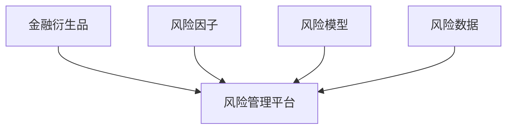
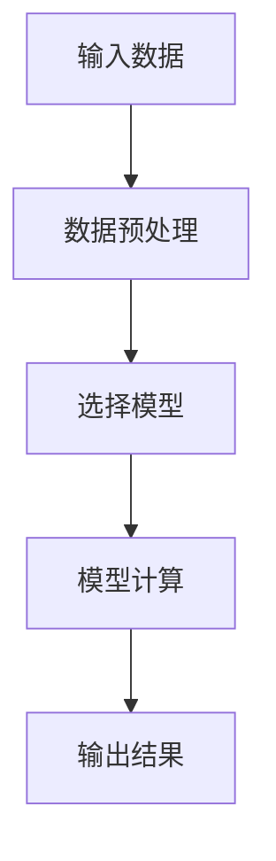
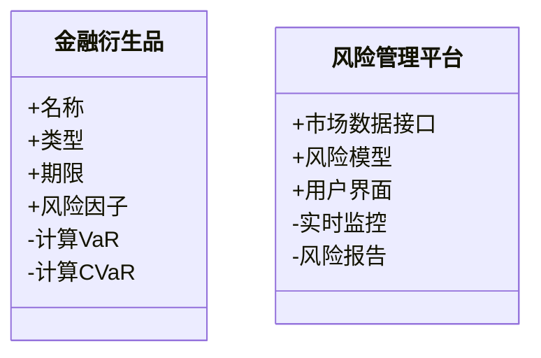

                 


---

# 《金融衍生品风险管理平台》

## 关键词：金融衍生品、风险管理、平台设计、算法模型、系统架构、Python实现

## 摘要：  
本文详细探讨了金融衍生品风险管理平台的设计与实现。从金融衍生品的基本概念出发，分析了风险管理的重要性和平台化管理的必要性。通过结合风险测量算法、系统架构设计和实际项目案例，深入剖析了如何构建一个高效、可靠的金融衍生品风险管理平台。文章内容涵盖背景介绍、核心概念、算法原理、系统设计、项目实战和最佳实践，为读者提供了一套完整的解决方案。

---

# 第一部分: 金融衍生品风险管理平台概述

## 第1章: 金融衍生品风险管理平台的背景与意义

### 1.1 金融衍生品的基本概念

#### 1.1.1 金融衍生品的定义  
金融衍生品（Financial Derivatives）是基于基础资产（如股票、债券、商品等）或市场指数的金融合约，其价值来源于基础资产的价格波动。常见的金融衍生品包括期货、期权、掉期和互换等。

#### 1.1.2 金融衍生品的主要类型  
1. **期货（Futures）**：约定在未来某一特定时间以预定价格购买或出售资产的合约。
2. **期权（Options）**：赋予买方在特定时间内以预定价格购买或出售资产的权利，但并非义务。
3. **掉期（Swaps）**：约定在未来某一时间交换资产或现金流的合约。
4. **互换（Forwards）**：类似于期货，但通常在场外市场交易，条款更为灵活。

#### 1.1.3 金融衍生品的风险特征  
金融衍生品的风险主要体现在价格波动、信用风险、流动性风险和操作风险等方面。由于其杠杆效应，风险可能迅速放大，对金融机构和市场稳定性构成威胁。

---

### 1.2 风险管理的重要性

#### 1.2.1 风险管理的基本概念  
风险管理是指识别、评估和应对可能影响组织目标的不确定性。在金融领域，风险管理尤为重要，因为它直接关系到资产的保值和机构的稳健运行。

#### 1.2.2 金融衍生品风险管理的特殊性  
金融衍生品的非线性收益特征和杠杆效应使其风险管理更具挑战性。例如，期权的风险管理需要考虑波动率、时间价值等因素，而期货则需要关注基差和流动性风险。

#### 1.2.3 风险管理在金融衍生品中的作用  
有效的风险管理能够帮助金融机构降低损失、提高资本效率，并增强市场信心。通过科学的风险管理，机构可以更好地应对市场波动，确保业务的可持续发展。

---

### 1.3 金融衍生品风险管理平台的必要性

#### 1.3.1 传统风险管理的局限性  
传统的风险管理方式通常依赖人工操作，存在效率低、覆盖面窄、实时性差等问题。特别是在复杂金融工具日益增多的背景下，传统方法难以满足现代风险管理的需求。

#### 1.3.2 平台化管理的优势  
金融衍生品风险管理平台能够实现风险数据的集中管理、实时监控和自动化处理，显著提高了风险管理的效率和准确性。通过平台化管理，机构可以更好地应对市场变化，优化资源配置。

#### 1.3.3 数字化风险管理的未来趋势  
随着大数据、人工智能和区块链等技术的快速发展，数字化风险管理正成为行业趋势。金融衍生品风险管理平台通过整合先进科技，能够提供更加智能化、个性化的风险管理解决方案。

---

### 1.4 本章小结  
本章从金融衍生品的基本概念出发，分析了风险管理的重要性和平台化管理的必要性。通过对比传统风险管理的局限性和平台化管理的优势，为后续的平台设计奠定了理论基础。

---

## 第2章: 金融衍生品风险管理平台的核心概念与联系

### 2.1 风险管理的核心原理

#### 2.1.1 风险识别、测量、监控与控制  
1. **风险识别**：通过数据分析和模型构建，识别潜在风险因素。
2. **风险测量**：利用数学模型量化风险程度，如VaR（风险价值）和CVaR（条件风险价值）。
3. **风险监控**：实时跟踪风险指标，及时发现异常情况。
4. **风险控制**：通过调整投资组合或对冲策略，降低风险敞口。

#### 2.1.2 风险管理的数学模型  
风险管理的核心是通过数学模型量化风险。常见的模型包括：

1. **VaR模型**：衡量在一定置信水平下可能的最大损失。
2. **CVaR模型**：衡量在VaR超过一定水平时的平均损失。
3. **蒙特卡洛模拟**：通过随机抽样模拟市场波动，评估风险敞口。

---

### 2.2 金融衍生品与风险管理平台的关系

#### 2.2.1 金融衍生品的复杂性与风险管理需求  
金融衍生品的非线性特征和杠杆效应使其风险管理需求更加复杂。例如，期权的风险管理需要考虑波动率、时间价值和Delta、Gamma等希腊值。

#### 2.2.2 平台如何满足风险管理需求  
金融衍生品风险管理平台通过整合实时市场数据、风险模型和对冲工具，为机构提供了一站式风险管理解决方案。平台能够快速计算风险指标，优化投资组合，并提供实时监控和预警功能。

---

### 2.3 核心概念属性对比

#### 2.3.1 表格形式的核心概念对比  

| 概念       | 定义                                                                 | 特性                     |
|------------|----------------------------------------------------------------------|--------------------------|
| 金融衍生品 | 以基础资产价格波动为价值来源的金融合约                               | 非线性、杠杆效应         |
| 风险管理   | 识别、评估和应对可能影响资产或机构目标的不确定性                     | 全面性、系统性           |
| 平台设计   | 集成多种技术工具，提供自动化风险管理解决方案                         | 集成性、实时性           |

---

#### 2.3.2 ER实体关系图的 Mermaid 流程图  



---

### 2.4 本章小结  
本章通过对比分析金融衍生品、风险管理和平臺设计的核心概念，明确了它们之间的关系和各自的特性。通过表格和ER图的形式，直观展示了平台设计的关键要素。

---

## 第3章: 金融衍生品风险管理平台的算法原理

### 3.1 风险管理的核心算法

#### 3.1.1 风险价值（VaR）模型  

**VaR的定义**：在给定的置信水平下，资产组合在一定时间内的最大可能损失。  
**公式**：  
$$ VaR = \text{quantile}(p) \text{ of the loss distribution} $$  
其中，$p$ 是置信水平，通常取95%或99%。

---

#### 3.1.2 穿透风险（CVaR）模型  

**CVaR的定义**：在VaR超过一定水平时的平均损失。  
**公式**：  
$$ CVaR = \frac{1}{1 - p} \int_{p}^{1} \text{quantile}(q) dq $$  
其中，$p$ 是置信水平。

---

#### 3.1.3 其他常用风险模型  

1. **蒙特卡洛模拟**：通过随机抽样模拟市场波动，评估风险敞口。  
2. **历史模拟法**：基于历史数据，计算资产组合的历史VaR。  
3. **情景分析法**：通过模拟极端市场情景，评估资产组合的潜在损失。

---

### 3.2 算法原理的 Mermaid 流程图  



---

### 3.3 算法实现的 Python 源代码  

```python
import numpy as np
import pandas as pd

def calculate_VaR(data, confidence_level):
    sorted_data = np.sort(data)
    var = np.percentile(sorted_data, confidence_level)
    return var

# 示例数据
data = np.random.normal(loc=0, scale=1, size=1000)
confidence_level = 95

# 计算VaR
var_result = calculate_VaR(data, confidence_level)
print(f"VaR at {confidence_level}% confidence level: {var_result}")
```

---

### 3.4 本章小结  
本章通过详细讲解VaR、CVaR和其他常用风险模型的原理和实现，为读者提供了风险管理算法的基础知识。通过Python代码示例，展示了如何将这些算法应用于实际场景。

---

## 第4章: 系统分析与架构设计

### 4.1 问题场景介绍  

金融衍生品风险管理平台需要解决以下问题：  
1. 如何实时监控金融衍生品的风险敞口？  
2. 如何快速计算风险指标（如VaR、CVaR）？  
3. 如何优化投资组合以降低风险？  

---

### 4.2 系统功能设计  

#### 4.2.1 领域模型的 Mermaid 类图  



---

### 4.3 系统架构设计  

#### 4.3.1 系统架构的 Mermaid 架构图  


---

### 4.4 系统接口设计  

#### 4.4.1 系统接口的 Mermaid 序列图  

```mermaid
sequenceDiagram
    用户 --> API网关: 请求风险报告
    API网关 --> 数据库: 获取市场数据
    API网关 --> 风险模型: 计算VaR
    风险模型 --> 计算引擎: 执行计算
    风险模型 <-- 返回结果
    API网关 <-- 返回结果
    用户 <-- 返回风险报告
```

---

### 4.5 本章小结  
本章通过系统分析和架构设计，明确了金融衍生品风险管理平台的功能需求和技术实现路径。通过类图、架构图和序列图的形式，直观展示了系统的整体结构和交互流程。

---

## 第5章: 项目实战

### 5.1 环境安装  

#### 5.1.1 Python 环境的安装与配置  
1. 安装Python 3.8及以上版本。  
2. 安装必要的库：numpy、pandas、scipy、matplotlib。

```bash
pip install numpy pandas scipy matplotlib
```

---

#### 5.1.2 数据源的获取  
可以从公开数据源（如Yahoo Finance）获取金融衍生品的市场数据。

---

### 5.2 系统核心实现源代码  

#### 5.2.1 风险管理模块的实现  

```python
import numpy as np
import pandas as pd

def calculate_VaR(data, confidence_level):
    sorted_data = np.sort(data)
    var = np.percentile(sorted_data, confidence_level)
    return var

def calculate_CVaR(data, confidence_level):
    sorted_data = np.sort(data)
    var = calculate_VaR(data, confidence_level)
    filtered_data = sorted_data[sorted_data >= var]
    cvar = np.mean(filtered_data)
    return cvar

# 示例数据
data = np.random.normal(loc=0, scale=1, size=1000)
confidence_level = 95

# 计算VaR和CVaR
var_result = calculate_VaR(data, confidence_level)
cvar_result = calculate_CVaR(data, confidence_level)

print(f"VaR at {confidence_level}% confidence level: {var_result}")
print(f"CVaR at {confidence_level}% confidence level: {cvar_result}")
```

---

#### 5.2.2 系统功能模块的实现  

```python
class RiskManagementSystem:
    def __init__(self, market_data):
        self.market_data = market_data
    
    def calculate_risk(self, confidence_level):
        # 计算VaR
        var = np.percentile(self.market_data, confidence_level)
        # 计算CVaR
        cvar = np.mean(self.market_data[self.market_data >= var])
        return var, cvar

# 示例使用
market_data = np.random.normal(loc=0, scale=1, size=1000)
rms = RiskManagementSystem(market_data)
var, cvar = rms.calculate_risk(95)
print(f"VaR: {var}, CVaR: {cvar}")
```

---

### 5.3 实际案例分析  

#### 5.3.1 案例背景  
假设我们有一个股票期权的投资组合，需要计算其在95%置信水平下的VaR和CVaR。

---

#### 5.3.2 数据准备与分析  
1. 数据来源：假设我们从Yahoo Finance获取了标的股票的历史收盘价。
2. 数据预处理：计算股票的收益率序列。
3. 风险计算：使用历史模拟法计算VaR和CVaR。

---

#### 5.3.3 计算结果与解读  
通过平台计算，我们得到VaR和CVaR的结果，从而可以更好地理解期权投资组合的风险敞口，并制定相应的对冲策略。

---

### 5.4 本章小结  
本章通过实际项目案例，展示了金融衍生品风险管理平台的实现过程。通过代码示例和案例分析，帮助读者更好地理解理论知识，并将其应用于实际场景。

---

## 第6章: 最佳实践与总结

### 6.1 小结  

金融衍生品风险管理平台的建设是一个复杂而重要的任务。通过平台化管理，机构可以更高效地识别、测量和控制风险，从而提高资产管理和风险控制的效率。

---

### 6.2 注意事项  

1. 数据的准确性和实时性是风险管理的核心，需要确保数据源的可靠性和系统运行的稳定性。  
2. 风险模型的选择需要结合实际情况，避免过度复杂化。  
3. 系统的安全性和稳定性是平台运行的关键，需要采取多层次的安全防护措施。  

---

### 6.3 拓展阅读  

1. 《金融风险管理》（作者：John C. Hull）  
2. 《Python金融计算》（作者：Yves Hilpisch）  
3. 《大数据时代的风险管理》（作者：李明）

---

## 作者：AI天才研究院 & 禅与计算机程序设计艺术

---

以上是《金融衍生品风险管理平台》的技术博客文章的完整目录和内容框架。

