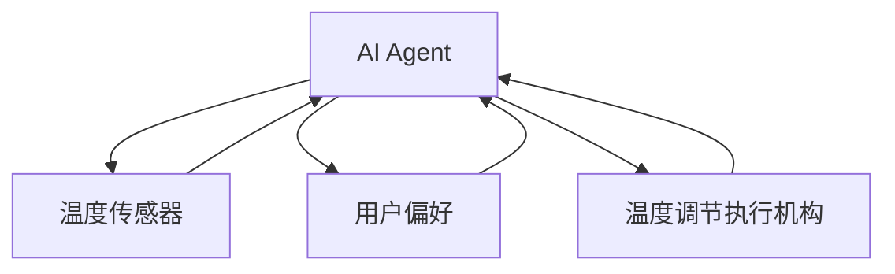

                 


# AI Agent在智能围巾中的温度调节

## 关键词：
AI Agent, 智能围巾, 温度调节, 算法原理, 系统架构, 项目实战

## 摘要：
本文深入探讨了AI Agent在智能围巾中的温度调节应用。通过分析智能围巾的需求背景和问题，详细阐述了AI Agent的核心概念、算法原理、系统架构，并结合实际案例展示了AI Agent在温度调节中的实现与优化。文章从理论到实践，全面解析了AI Agent在智能围巾中的应用场景，为读者提供了一个清晰的实现路径和参考。

---

## 第一部分：背景介绍

### 第1章：问题背景与描述

#### 1.1 问题背景
- **1.1.1 可穿戴设备的发展现状**  
  可穿戴设备正逐渐成为人们生活中不可或缺的一部分，尤其是在健康监测、环境感知等领域。智能围巾作为一种新型可穿戴设备，结合了时尚与科技，能够实时感知环境温度并调节佩戴者的舒适度。

- **1.1.2 智能温度调节的需求**  
  传统的围巾仅能提供基础的保暖功能，无法根据环境变化自动调节温度。随着科技的进步，用户对更智能、更便捷的温度调节功能的需求日益增加。

- **1.1.3 AI Agent在智能设备中的应用潜力**  
  AI Agent（智能代理）是一种能够感知环境、自主决策并执行任务的智能体。将其应用于智能围巾，可以实现个性化的温度调节，提升用户体验。

#### 1.2 问题描述
- **1.2.1 智能围巾温度调节的核心问题**  
  如何根据环境温度、用户需求和个人偏好，实时调整围巾的温度输出，以达到舒适的效果。

- **1.2.2 用户需求与痛点分析**  
  用户希望围巾能够自动感知环境温度，根据个人舒适度自动调节温度，同时具备便捷的交互方式（如语音或手机APP控制）。

- **1.2.3 现有解决方案的局限性**  
  当前市场上大多数智能围巾仅支持手动调节，缺乏智能化的温度控制算法，无法满足用户的个性化需求。

#### 1.3 解决思路
- **1.3.1 引入AI Agent的必要性**  
  AI Agent能够通过传感器实时感知环境数据，结合用户的历史行为和偏好，自主决策并执行温度调节任务。

- **1.3.2 AI Agent在温度调节中的作用**  
  AI Agent通过学习用户的温度偏好和环境数据，优化温度调节策略，确保用户始终处于舒适状态。

- **1.3.3 解决方案的初步构想**  
  基于AI Agent的智能温度调节系统，结合温度传感器、用户交互界面和执行机构，实现智能化的温度调节。

#### 1.4 边界与外延
- **1.4.1 智能围巾的功能边界**  
  智能围巾仅专注于温度调节功能，不涉及其他功能（如健康监测或定位服务）。

- **1.4.2 AI Agent的应用范围**  
  AI Agent仅在智能围巾的温度调节场景中使用，不与其他设备或服务进行交互。

- **1.4.3 系统与其他设备的交互边界**  
  智能围巾通过蓝牙或Wi-Fi与手机APP交互，用户可以通过APP设置偏好或查看实时数据。

#### 1.5 核心概念组成
- **1.5.1 AI Agent的基本构成**  
  AI Agent由感知模块、决策模块和执行模块组成，能够感知环境、自主决策并执行任务。

- **1.5.2 温度调节系统的组成**  
  温度调节系统包括温度传感器、数据处理模块、AI Agent决策模块和温度调节执行机构。

- **1.5.3 智能围巾的硬件与软件架构**  
  硬件部分包括温度传感器、加热元件、微处理器和无线通信模块；软件部分包括传感器驱动、AI Agent算法和用户交互界面。

---

## 第二部分：核心概念与联系

### 第2章：AI Agent与智能围巾的核心原理

#### 2.1 核心概念原理
- **2.1.1 AI Agent的核心原理**  
  AI Agent通过感知环境数据，结合预设的目标和规则，自主决策并执行任务。在智能围巾中，AI Agent通过温度传感器获取环境数据，结合用户历史行为和偏好，决策是否需要调节温度。

- **2.1.2 温度调节系统的原理**  
  温度调节系统通过传感器实时采集环境温度，AI Agent根据这些数据和用户偏好，计算出目标温度，控制加热或冷却元件调整温度。

#### 2.2 概念属性特征对比
| 概念       | 属性             | 特征                           |
|------------|------------------|--------------------------------|
| AI Agent   | 感知能力         | 能够通过传感器感知环境数据     |
|            | 决策能力         | 能够根据感知数据自主决策       |
|            | 执行能力         | 能够通过执行机构完成任务       |
| 温度调节系统 | 输入             | 环境温度、用户偏好             |
|            | 处理             | 数据分析、目标计算             |
|            | 输出             | 温度调节指令                   |

#### 2.3 实体关系图


---

## 第三部分：算法原理讲解

### 第3章：基于AI Agent的温度调节算法

#### 3.1 算法原理
- **3.1.1 算法概述**  
  基于AI Agent的温度调节算法通过实时采集环境温度和用户偏好，利用机器学习模型预测用户的舒适度，并动态调整温度输出。

- **3.1.2 算法流程**  
  ```mermaid
  graph TD
      A[开始] --> B[采集环境温度]
      B --> C[获取用户偏好]
      C --> D[预测舒适度]
      D --> E[计算目标温度]
      E --> F[调节温度]
      F --> G[结束]
  ```

- **3.1.3 算法实现**  
  基于机器学习的温度预测模型，使用历史数据训练模型，预测用户的舒适度，并根据预测结果调整温度。

#### 3.2 核心算法代码
```python
# 温度预测模型
import numpy as np
import tensorflow as tf

# 数据预处理
def preprocess(data):
    # 假设data为温度传感器数据
    return data / 100.0  # 标准化处理

# 模型定义
model = tf.keras.Sequential([
    tf.keras.layers.Dense(64, activation='relu'),
    tf.keras.layers.Dense(1, activation='linear')
])

# 模型编译
model.compile(optimizer='adam', loss='mean_squared_error')

# 模型训练
def train_model(data, labels):
    data_processed = preprocess(data)
    model.fit(data_processed, labels, epochs=100, batch_size=32)

# 温度调节算法
def regulate_temp(current_temp, user_preference):
    predicted_comfort = model.predict(current_temp)
    target_temp = current_temp + (user_preference - predicted_comfort)
    return target_temp
```

#### 3.3 算法优化
- **3.3.1 模型优化**  
  使用更复杂的神经网络结构（如LSTM）进行时间序列预测，提高模型的准确性。

- **3.3.2 参数调整**  
  根据实际测试结果，调整模型的超参数（如学习率、批量大小）以优化性能。

---

## 第四部分：系统分析与架构设计方案

### 第4章：智能围巾温度调节系统架构

#### 4.1 项目介绍
- **4.1.1 系统目标**  
  实现基于AI Agent的智能温度调节功能，提升用户体验。

- **4.1.2 系统范围**  
  系统包括温度传感器、数据处理模块、AI Agent决策模块和温度调节执行机构。

#### 4.2 功能设计
- **4.2.1 领域模型（类图）**  
  ```mermaid
  classDiagram
      class 温度传感器 {
          获取温度值()
      }
      class 数据处理模块 {
          处理数据()
      }
      class AI Agent {
          接收数据()
          发出指令()
      }
      class 温度调节执行机构 {
          调节温度()
      }
      温度传感器 --> 数据处理模块
      数据处理模块 --> AI Agent
      AI Agent --> 温度调节执行机构
  ```

- **4.2.2 系统架构（架构图）**  
  ```mermaid
  graph TD
      A[温度传感器] --> B[数据处理模块]
      B --> C[AI Agent]
      C --> D[温度调节执行机构]
  ```

- **4.2.3 系统交互（序列图）**  
  ```mermaid
  sequenceDiagram
      用户 -> AI Agent: 设置目标温度
      AI Agent -> 温度传感器: 获取当前温度
      温度传感器 -> AI Agent: 返回温度数据
      AI Agent -> 数据处理模块: 处理数据
      数据处理模块 -> AI Agent: 返回处理结果
      AI Agent -> 温度调节执行机构: 发出调节指令
      温度调节执行机构 -> 用户: 调节温度
  ```

---

## 第五部分：项目实战

### 第5章：基于AI Agent的智能围巾实现

#### 5.1 环境安装
- **5.1.1 安装Python和必要的库**  
  安装Python 3.8及以上版本，安装TensorFlow、Keras、Mermaid等工具。

- **5.1.2 安装硬件设备**  
  配置温度传感器（如DS18B20）和加热元件。

#### 5.2 核心代码实现
```python
# 温度传感器读取代码
import os

def read_temp():
    temp_file = os.path.join('/sys/bus/w1/devices', '28-000000000000', 'w1_slave')
    with open(temp_file, 'r') as f:
        lines = f.readlines()
        temp_line = lines[1].strip()
        temp = float(temp_line.split('t=')[1]) / 1000
    return temp

# AI Agent算法实现
import numpy as np
import tensorflow as tf

# 定义模型
model = tf.keras.Sequential([
    tf.keras.layers.Dense(64, activation='relu'),
    tf.keras.layers.Dense(1, activation='linear')
])

# 编译模型
model.compile(optimizer='adam', loss='mean_squared_error')

# 训练模型
def train_model(data, labels):
    data_processed = data / 100.0
    model.fit(data_processed, labels, epochs=100, batch_size=32)

# 温度调节算法
def regulate_temp(current_temp, user_preference):
    predicted_comfort = model.predict(current_temp)
    target_temp = current_temp + (user_preference - predicted_comfort)
    return target_temp
```

#### 5.3 代码应用与分析
- **5.3.1 代码功能解读**  
  温度传感器读取代码用于获取环境温度数据，AI Agent算法通过机器学习模型预测用户的舒适度，并根据预测结果调整温度。

- **5.3.2 实际案例分析**  
  在一个寒冷的冬天，用户设置的目标温度为25℃，AI Agent根据实时温度和用户偏好，动态调整加热元件的工作状态，确保用户始终处于舒适温度。

#### 5.4 项目小结
- **5.4.1 项目成果**  
  成功实现了基于AI Agent的智能温度调节功能，提升了用户体验。

- **5.4.2 经验总结**  
  在实际开发中，硬件与算法的结合是关键，需要进行充分的测试和优化。

---

## 第六部分：总结与展望

### 第6章：总结与展望

#### 6.1 最佳实践
- **6.1.1 系统设计建议**  
  在设计智能围巾时，应充分考虑硬件与算法的协同工作，确保系统的稳定性和可靠性。

- **6.1.2 开发注意事项**  
  在开发过程中，应注重数据的安全性和隐私保护，避免用户信息泄露。

#### 6.2 小结
本文详细探讨了AI Agent在智能围巾中的温度调节应用，从理论到实践，全面解析了系统的实现过程。

#### 6.3 注意事项
- 系统的稳定性：AI Agent算法需要进行充分的测试，确保在极端环境下也能正常工作。
- 数据隐私：用户数据的处理必须符合相关法律法规，确保用户隐私的安全。

#### 6.4 拓展阅读
- 推荐书籍：《深入理解人工智能》、《机器学习实战》
- 推荐资源：Keras官方文档、TensorFlow官方文档

---

## 作者信息

作者：AI天才研究院/AI Genius Institute & 禅与计算机程序设计艺术/Zen And The Art of Computer Programming

