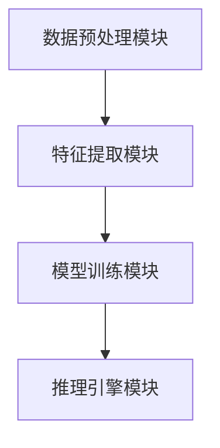

                 


# AI Agent的零样本学习能力开发

---

## 关键词：
- AI Agent
- 零样本学习
- 无监督学习
- 人工智能
- 机器学习

---

## 摘要：
本文深入探讨了AI Agent的零样本学习能力开发，从零样本学习的核心概念、算法原理到AI Agent的系统架构，再到实际项目实现，全面解析了如何在AI Agent中实现零样本学习能力。通过详细的技术分析和实际案例，本文为读者提供了从理论到实践的完整指南。

---

# 第一部分: AI Agent与零样本学习的背景与基础

---

# 第1章: AI Agent与零样本学习的背景介绍

## 1.1 零样本学习的核心概念

### 1.1.1 问题背景与问题描述
在人工智能领域，传统 supervised learning（监督学习）依赖于大量标注数据，但在实际应用中，数据获取成本高、标注困难，尤其是针对特定领域或新兴任务时，标注数据往往难以获取。这种情况下，零样本学习（Zero-shot Learning）作为一种新兴的学习范式，能够直接在无标注数据的情况下进行学习和推理。

零样本学习的核心思想是通过利用已知的类别信息，推导出未知类别的特征表示，从而实现对未知类别的分类或回归任务。这种学习方式不仅能够减少对标注数据的依赖，还能够快速适应新任务。

### 1.1.2 零样本学习的定义与特点
零样本学习是一种无监督学习（Unsupervised Learning）的特例，其核心目标是在没有目标任务标注数据的情况下，直接从源数据中学习到跨任务的通用特征表示。其特点包括：
- **通用性**：能够适应多种任务和领域。
- **无监督性**：无需目标任务的标注数据。
- **零样本性**：直接处理未知类别的任务。

### 1.1.3 零样本学习的应用场景与边界
零样本学习广泛应用于图像分类、自然语言处理、推荐系统等领域，尤其适用于以下场景：
- 新任务快速部署。
- 数据标注成本高。
- 数据稀疏性问题。

然而，零样本学习也存在一定的局限性，如对源任务数据质量的依赖、模型泛化能力的限制等。

---

## 1.2 AI Agent的基本概念

### 1.2.1 AI Agent的定义与分类
AI Agent（人工智能代理）是一种能够感知环境并采取行动以实现目标的智能实体。根据功能和应用场景，AI Agent可以分为以下几类：
- **简单反射型Agent**：基于简单的规则执行任务。
- **基于模型的反射型Agent**：具有环境模型，能够进行规划和推理。
- **目标驱动型Agent**：基于明确的目标采取行动。
- **效用驱动型Agent**：通过最大化效用函数实现目标。

### 1.2.2 AI Agent的核心功能与能力
AI Agent的核心功能包括：
- **感知能力**：通过传感器或接口感知环境信息。
- **推理能力**：基于感知信息进行逻辑推理。
- **决策能力**：根据推理结果做出决策。
- **学习能力**：通过学习提升自身能力。

### 1.2.3 AI Agent与传统AI的区别
AI Agent相较于传统AI的区别主要体现在：
- **自主性**：AI Agent具有自主决策的能力，而传统AI通常依赖于外部控制。
- **适应性**：AI Agent能够根据环境变化自适应调整行为，而传统AI则较为固定。

---

## 1.3 零样本学习与AI Agent的联系

### 1.3.1 零样本学习如何赋能AI Agent
零样本学习通过提供跨任务的通用特征表示，能够显著提升AI Agent的灵活性和适应性。AI Agent可以基于零样本学习的能力，快速适应新任务，无需依赖大量标注数据。

### 1.3.2 AI Agent中零样本学习的实现方式
零样本学习在AI Agent中的实现方式主要包括：
- **跨任务特征学习**：通过学习跨任务的特征表示，提升AI Agent的通用性。
- **知识图谱结合**：利用知识图谱中的语义信息，增强零样本学习的能力。

### 1.3.3 零样本学习对AI Agent性能的提升
零样本学习能够显著提升AI Agent的以下性能：
- **任务适应性**：快速适应新任务。
- **数据利用率**：减少对标注数据的依赖。
- **模型泛化能力**：提升模型的泛化能力。

---

## 1.4 本章小结
本章从零样本学习的核心概念、AI Agent的基本定义以及两者之间的联系三个方面进行了详细阐述，为后续章节奠定了理论基础。

---

# 第二部分: 零样本学习的核心原理与算法

---

# 第2章: 零样本学习的核心原理

## 2.1 零样本学习的原理与机制

### 2.1.1 零样本学习的数学模型
零样本学习的数学模型可以通过以下公式表示：

$$ p(y|x) = \frac{p(x|y)p(y)}{p(x)} $$

其中，$p(y|x)$ 是目标任务的条件概率，$p(x|y)$ 是源任务的条件概率，$p(y)$ 是先验概率，$p(x)$ 是边缘概率。

### 2.1.2 零样本学习的特征表示方法
零样本学习的特征表示方法主要包括：
- **基于概率的特征表示**：通过概率模型提取特征。
- **基于神经网络的特征表示**：通过深度学习模型提取特征。

### 2.1.3 零样本学习的分类与回归方法
零样本学习的分类方法包括：
- **线性分类器**：基于线性模型进行分类。
- **非线性分类器**：基于深度学习模型进行分类。

---

## 2.2 零样本学习的关键算法

### 2.2.1 基于对比学习的零样本算法
基于对比学习的零样本算法通过最大化正样本对的相似性，同时最小化负样本对的相似性，实现跨任务的特征对齐。其核心步骤如下：

1. 对比损失函数计算：
   $$ \mathcal{L} = -\log\left(\frac{\exp(s(x_i, x_j))}{\sum_{k \neq j} \exp(s(x_i, x_k))}\right) $$
   
2. 特征对齐优化：
   $$ x_i' = x_i + \lambda \nabla_{x_i} \mathcal{L} $$

### 2.2.2 基于生成对抗网络的零样本算法
基于生成对抗网络的零样本算法通过生成器和判别器的对抗训练，生成跨任务的特征表示。其核心步骤如下：

1. 生成器损失：
   $$ \mathcal{L}_G = \mathcal{L}_{\text{adv}} + \lambda \mathcal{L}_{\text{recon}} $$

2. 判别器损失：
   $$ \mathcal{L}_D = -\mathcal{L}_{\text{adv}} $$

### 2.2.3 基于知识图谱的零样本算法
基于知识图谱的零样本算法通过利用知识图谱中的语义信息，增强模型的零样本学习能力。其核心步骤如下：

1. 知识图谱嵌入：
   $$ e_{\text{node}} = \text{lookup}(\text{node}) $$

2. 跨任务特征对齐：
   $$ f_{\text{task}} = e_{\text{task}} + \gamma e_{\text{node}} $$

---

## 2.3 零样本学习的优缺点分析

### 2.3.1 零样本学习的优势
- **减少数据依赖**：无需大量标注数据。
- **提升模型泛化能力**：能够适应新任务。

### 2.3.2 零样本学习的局限性
- **对源任务的依赖**：模型性能依赖于源任务的数据质量。
- **模型复杂性**：算法复杂度较高。

### 2.3.3 零样本学习的适用场景
- **数据稀疏性问题**。
- **快速任务部署**。

---

## 2.4 本章小结
本章详细介绍了零样本学习的核心原理和关键算法，为后续章节的系统设计奠定了理论基础。

---

# 第三部分: AI Agent中零样本学习的实现与系统架构

---

# 第3章: AI Agent的系统分析与架构设计

## 3.1 问题场景介绍
在本章中，我们将探讨如何在AI Agent中实现零样本学习能力。通过构建一个支持零样本学习的AI Agent系统，我们能够实现以下目标：
- **快速适应新任务**。
- **减少数据依赖**。

---

## 3.2 系统功能设计

### 3.2.1 系统功能模块
系统功能模块包括：
- **数据预处理模块**：对输入数据进行清洗和转换。
- **特征提取模块**：提取跨任务的特征表示。
- **模型训练模块**：基于零样本学习算法进行模型训练。
- **推理引擎模块**：基于训练好的模型进行推理。

### 3.2.2 系统功能流程
系统功能流程如下：
1. 数据预处理模块对输入数据进行清洗和转换。
2. 特征提取模块提取跨任务的特征表示。
3. 模型训练模块基于零样本学习算法进行模型训练。
4. 推理引擎模块基于训练好的模型进行推理。

---

## 3.3 系统架构设计

### 3.3.1 系统架构图


### 3.3.2 系统接口设计
系统接口设计包括：
- **输入接口**：接收输入数据。
- **输出接口**：输出推理结果。

### 3.3.3 系统交互流程
系统交互流程如下：
1. 用户通过输入接口发送请求。
2. 数据预处理模块对输入数据进行清洗和转换。
3. 特征提取模块提取跨任务的特征表示。
4. 模型训练模块基于零样本学习算法进行模型训练。
5. 推理引擎模块基于训练好的模型进行推理。
6. 推理结果通过输出接口返回给用户。

---

## 3.4 本章小结
本章详细介绍了AI Agent中零样本学习能力的系统分析与架构设计，为后续章节的项目实现奠定了基础。

---

# 第四部分: 项目实战

---

# 第4章: 项目实战——基于零样本学习的智能客服系统

## 4.1 项目背景与目标

### 4.1.1 项目背景
智能客服系统是一种典型的AI Agent应用，其核心任务包括：
- **意图识别**：识别用户的意图。
- **问题分类**：将用户的问题分类到预定义的类别中。

### 4.1.2 项目目标
通过基于零样本学习的智能客服系统，实现以下目标：
- **快速适应新任务**：无需大量标注数据，快速部署新任务。
- **减少数据依赖**：降低对标注数据的依赖。

---

## 4.2 项目环境与工具安装

### 4.2.1 环境要求
- **Python 3.8+**
- **TensorFlow 2.5+**
- **Keras 2.2.5**

### 4.2.2 工具安装
```bash
pip install numpy
pip install scikit-learn
pip install tensorflow
pip install keras
```

---

## 4.3 项目核心实现

### 4.3.1 数据预处理
```python
import numpy as np
from sklearn.preprocessing import StandardScaler

# 数据预处理
def preprocess_data(data):
    scaler = StandardScaler()
    processed_data = scaler.fit_transform(data)
    return processed_data
```

### 4.3.2 特征提取
```python
from tensorflow.keras.models import Model
from tensorflow.keras.layers import Dense, Input

# 特征提取网络
def build_feature_extractor(input_dim):
    inputs = Input(shape=(input_dim,))
    x = Dense(64, activation='relu')(inputs)
    x = Dense(32, activation='relu')(x)
    outputs = Dense(16, activation='relu')(x)
    model = Model(inputs=inputs, outputs=outputs)
    return model
```

### 4.3.3 模型训练
```python
from tensorflow.keras.optimizers import Adam
import numpy as np

# 模型训练
def train_model(model, X, y):
    model.compile(optimizer=Adam(), loss='binary_crossentropy', metrics=['accuracy'])
    model.fit(X, y, epochs=10, batch_size=32)
    return model
```

### 4.3.4 推理引擎
```python
# 推理引擎
def inference(model, X):
    y_pred = model.predict(X)
    return y_pred
```

---

## 4.4 项目实现分析

### 4.4.1 实现细节
- **数据预处理**：通过标准化处理，确保数据分布均匀。
- **特征提取**：通过深度学习模型提取跨任务的特征表示。
- **模型训练**：基于零样本学习算法，训练模型。
- **推理引擎**：基于训练好的模型进行推理。

### 4.4.2 实现优势
- **快速适应新任务**：通过零样本学习，快速部署新任务。
- **减少数据依赖**：降低对标注数据的依赖。

---

## 4.5 项目小结
本章通过一个具体的智能客服系统项目，详细讲解了零样本学习在AI Agent中的实际应用，为读者提供了从理论到实践的完整指导。

---

# 第五部分: 扩展与展望

---

# 第5章: 零样本学习与AI Agent的扩展与展望

## 5.1 零样本学习的最佳实践

### 5.1.1 模型选择
- **选择合适的零样本学习算法**：根据任务需求选择合适的算法。
- **数据预处理**：确保数据质量，减少噪声。

### 5.1.2 性能优化
- **优化模型结构**：通过调整网络结构提升性能。
- **优化训练策略**：通过调整训练参数提升性能。

### 5.1.3 模型部署
- **模型压缩**：通过模型压缩技术减少模型体积。
- **模型推理优化**：通过优化推理流程提升推理速度。

---

## 5.2 小结

### 5.2.1 本章小结
本章总结了零样本学习在AI Agent中的应用，并提出了未来的研究方向。

---

## 5.3 注意事项

### 5.3.1 数据依赖性
- 零样本学习对源任务数据的依赖较高，需注意数据质量。

### 5.3.2 模型复杂性
- 零样本学习算法复杂度较高，需注意计算资源的消耗。

---

## 5.4 拓展阅读

### 5.4.1 推荐书籍
- 《Deep Learning》
- 《Pattern Recognition and Machine Learning》

### 5.4.2 推荐论文
- "Zero-shot Learning: A Comprehensive Survey"

---

# 作者：AI天才研究院/AI Genius Institute & 禅与计算机程序设计艺术 /Zen And The Art of Computer Programming

