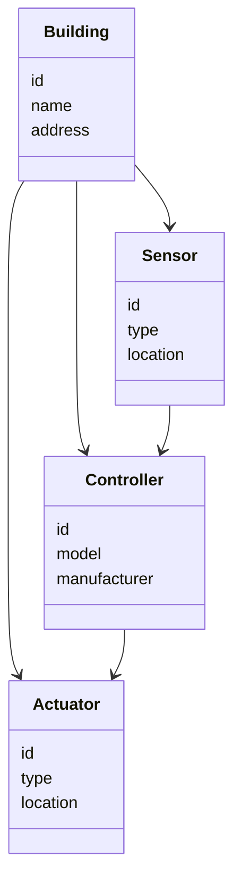
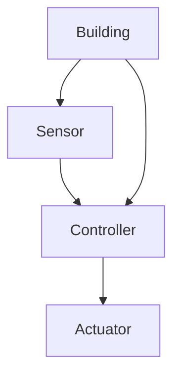
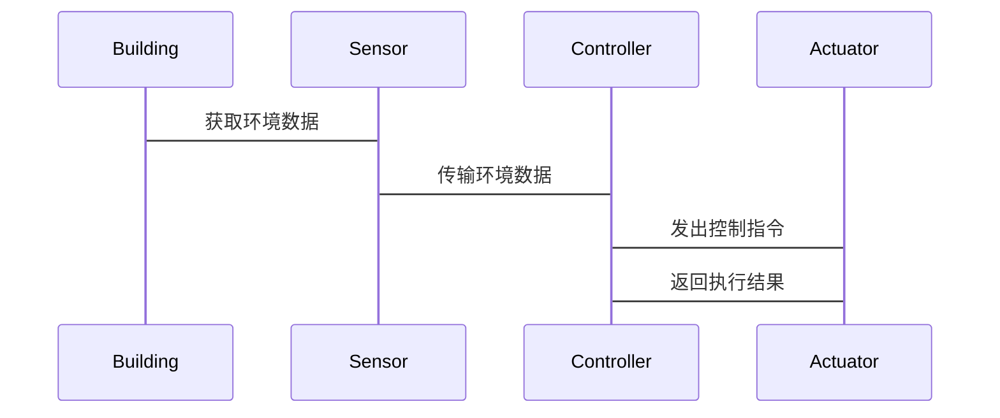

                 


# 价值投资中的智能建筑自适应照明系统分析

> 关键词：智能建筑，自适应照明系统，价值投资，能源管理，物联网技术

> 摘要：智能建筑自适应照明系统作为现代建筑智能化的重要组成部分，通过物联网技术和智能算法实现照明系统的智能化管理和能源优化。本文从智能建筑的基本概念出发，深入分析自适应照明系统的原理、算法、系统架构以及实际应用，结合价值投资的角度，探讨其在建筑节能和投资回报中的潜力。通过详细的技术分析和实际案例，本文为智能建筑自适应照明系统的应用提供了理论支持和实践指导。

---

## 第一章: 智能建筑与自适应照明系统背景介绍

### 1.1 智能建筑的基本概念

#### 1.1.1 智能建筑的定义与特点
智能建筑是指通过先进的技术手段，将建筑的各个子系统（如照明、空调、安防等）进行集成化管理，以实现能源节约、功能优化和用户体验提升的建筑类型。其特点包括：
- **智能化**：通过物联网、大数据和人工智能技术实现系统的智能控制。
- **节能性**：优化能源使用，降低运营成本。
- **灵活性**：能够根据需求动态调整系统参数。
- **安全性**：具备智能化的安全监控功能。

#### 1.1.2 智能建筑的发展历程
智能建筑的概念起源于20世纪70年代的能源危机，当时人们开始关注建筑的节能问题。随着技术的发展，智能建筑逐渐从单一的节能管理扩展到全方位的智能化管理，涵盖能源、环境、安全等多个方面。

#### 1.1.3 智能建筑与传统建筑的主要区别
与传统建筑相比，智能建筑的核心区别在于其智能化的管理系统。传统建筑通常依赖人工操作和固定设备，而智能建筑通过自动化技术实现系统的智能化管理。

### 1.2 自适应照明系统的概念与特点

#### 1.2.1 自适应照明系统的定义
自适应照明系统是一种能够根据环境条件和用户需求自动调节照明强度、色温和开关状态的智能照明系统。其核心在于通过传感器采集环境数据，并结合预设算法实现照明的动态优化。

#### 1.2.2 自适应照明系统的核心功能
自适应照明系统的主要功能包括：
- **环境感知**：通过光照传感器、温度传感器和人体感应器等设备采集环境数据。
- **智能调节**：根据采集的数据，通过算法计算出最优的照明方案。
- **用户交互**：提供用户界面，允许用户进行个性化设置和控制。

#### 1.2.3 自适应照明系统与传统照明系统的对比
与传统照明系统相比，自适应照明系统的显著优势在于其智能化和节能性。传统照明系统通常依赖人工控制，无法根据环境变化自动调整，而自适应照明系统能够实时感知环境并做出响应。

### 1.3 智能建筑与自适应照明系统的关联

#### 1.3.1 自适应照明系统在智能建筑中的应用场景
在智能建筑中，自适应照明系统主要应用于办公区域、公共空间和居住空间。例如，在办公区域，系统可以根据人员的活动情况自动调节照明亮度，以提高能效和舒适度。

#### 1.3.2 自适应照明系统对建筑能效的影响
通过自适应调节，自适应照明系统能够显著降低能源消耗。例如，在空闲时段，系统可以自动关闭或降低照明强度，从而节省能源。

#### 1.3.3 自适应照明系统对建筑价值的影响
自适应照明系统不仅能够降低运营成本，还能提升建筑的智能化水平和用户体验，从而增强建筑的市场竞争力和投资价值。

---

## 第二章: 智能建筑自适应照明系统的核心概念与联系

### 2.1 自适应照明系统的原理

#### 2.1.1 系统架构与组成
自适应照明系统通常由以下几部分组成：
- **传感器**：用于采集环境数据，如光照强度、温度、人员位置等。
- **控制器**：负责接收传感器数据，并根据预设算法计算出最优的照明方案。
- **执行器**：根据控制器的指令调整照明设备的参数，如亮度、色温等。

#### 2.1.2 照明控制算法的基本原理
自适应照明系统的控制算法通常基于时间序列预测模型或机器学习算法。例如，使用ARIMA模型对光照需求进行预测，或者利用随机森林算法对环境数据进行分类和回归分析。

#### 2.1.3 系统的输入输出关系
系统的输入包括环境数据和用户需求，输出则是照明设备的控制指令。例如，当传感器检测到室内人员离开，系统会自动关闭部分灯光以节省能源。

### 2.2 核心概念的属性特征对比

#### 2.2.1 照明系统的实时性与响应速度
自适应照明系统需要实时采集和处理数据，因此对系统的响应速度要求较高。通常，系统的响应时间需要在几秒内完成，以确保用户体验的流畅性。

#### 2.2.2 系统的可扩展性与兼容性
随着智能建筑规模的不断扩大，自适应照明系统需要具备良好的可扩展性和兼容性。例如，系统应能够支持多种类型的传感器和照明设备，并能够方便地扩展到更多的区域。

#### 2.2.3 系统的节能效果与成本效益
自适应照明系统的核心目标之一是实现节能。通过动态调节照明强度，系统可以显著降低能源消耗，从而实现成本效益的最大化。

### 2.3 ER实体关系图架构

```mermaid
erd
    title 自适应照明系统实体关系图
    building_refactored (id, name, address)
    sensor (id, type, location)
    controller (id, model, manufacturer)
    actuator (id, type, location)
    building_refactored --N:M--> sensor
    building_refactored --N:M--> controller
    building_refactored --N:M--> actuator
    sensor ---> controller
    controller ---> actuator
```

---

## 第三章: 自适应照明系统的算法原理讲解

### 3.1 算法原理概述

#### 3.1.1 算法选择与适用场景
在自适应照明系统中，常用的时间序列预测算法包括ARIMA和Prophet。这些算法适用于光照需求的预测场景，能够根据历史数据预测未来的照明需求。

#### 3.1.2 算法实现步骤
1. **数据采集**：从传感器获取环境数据。
2. **数据预处理**：对数据进行清洗和归一化处理。
3. **模型训练**：使用训练数据训练预测模型。
4. **模型预测**：根据当前数据预测未来的照明需求。
5. **系统控制**：根据预测结果调整照明设备的参数。

#### 3.1.3 算法优化与调优
为了提高预测精度，可以对模型进行优化，例如引入外部变量（如时间、天气等）或采用集成学习方法。

### 3.2 算法实现代码示例

```python
import pandas as pd
from sklearn.model_selection import train_test_split
from sklearn.linear_model import LinearRegression

# 数据加载与预处理
data = pd.read_csv('light_data.csv')
X = data[['time', 'temperature', 'occupancy']]
y = data['light_intensity']
X_train, X_test, y_train, y_test = train_test_split(X, y, test_size=0.2, random_state=42)

# 模型训练
model = LinearRegression()
model.fit(X_train, y_train)

# 模型预测
y_pred = model.predict(X_test)
```

### 3.3 数学模型与公式

#### 3.3.1 时间序列预测模型
时间序列预测模型通常使用ARIMA模型，其数学表达式为：
$$ ARIMA(p, d, q) $$
其中，p为自回归阶数，d为差分阶数，q为移动平均阶数。

#### 3.3.2 机器学习算法
在机器学习中，随机森林回归算法的数学表达式为：
$$ y = \sum_{i=1}^{n} (w_i \cdot x_i) + b $$

---

## 第四章: 智能建筑自适应照明系统的系统分析与架构设计

### 4.1 系统分析

#### 4.1.1 问题场景介绍
在智能建筑中，照明系统的能耗占总能耗的很大比例。通过自适应调节，可以显著降低照明系统的能耗。

#### 4.1.2 项目介绍
本项目旨在设计和实现一个自适应照明系统，通过物联网技术和智能算法实现照明系统的动态优化。

### 4.2 系统功能设计

#### 4.2.1 领域模型


#### 4.2.2 系统架构设计


#### 4.2.3 系统接口设计
系统接口主要包括传感器接口、控制器接口和用户界面。传感器接口用于与传感器设备通信，控制器接口用于与照明设备通信，用户界面用于与用户交互。

#### 4.2.4 系统交互设计


---

## 第五章: 项目实战

### 5.1 环境安装与配置

#### 5.1.1 系统环境要求
- 操作系统：Windows 10或更高版本，或Linux系统
- 开发工具：Python 3.8或更高版本，Jupyter Notebook
- 依赖库：pandas, scikit-learn, matplotlib

#### 5.1.2 安装依赖
```bash
pip install pandas scikit-learn matplotlib
```

### 5.2 系统核心功能实现

#### 5.2.1 照明控制算法实现
```python
import pandas as pd
from sklearn.linear_model import LinearRegression

# 数据加载与预处理
data = pd.read_csv('light_data.csv')
X = data[['time', 'temperature', 'occupancy']]
y = data['light_intensity']
X_train, X_test, y_train, y_test = train_test_split(X, y, test_size=0.2, random_state=42)

# 模型训练
model = LinearRegression()
model.fit(X_train, y_train)

# 模型预测
y_pred = model.predict(X_test)
```

#### 5.2.2 系统功能实现
```python
class LightingController:
    def __init__(self):
        self.sensors = []
        self actuators = []
    
    def add_sensor(self, sensor):
        self.sensors.append(sensor)
    
    def add_actuator(self, actuator):
        self.actuators.append(actuator)
    
    def update(self):
        for sensor in self.sensors:
            data = sensor.read_data()
            prediction = model.predict(data)
            for actuator in self.actuators:
                actuator.control(prediction)
```

### 5.3 实际案例分析

#### 5.3.1 案例背景
某办公楼采用自适应照明系统，通过传感器采集人员位置和环境光照强度，动态调节照明亮度。

#### 5.3.2 数据分析与优化
通过对系统的运行数据进行分析，发现系统在人员密集区域的响应速度较慢，可以通过优化算法提升响应速度。

---

## 第六章: 最佳实践、小结与注意事项

### 6.1 最佳实践

#### 6.1.1 系统设计建议
- 在设计系统时，应充分考虑系统的可扩展性和兼容性。
- 确保系统的实时性和响应速度，以提升用户体验。

#### 6.1.2 算法优化建议
- 根据实际需求选择合适的算法，避免过度复杂的模型。
- 定期更新模型，以适应环境的变化。

### 6.2 小结

本文从智能建筑的基本概念出发，深入分析了自适应照明系统的原理、算法、系统架构和实际应用。通过详细的技术分析和实际案例，本文为智能建筑自适应照明系统的应用提供了理论支持和实践指导。

### 6.3 注意事项

- 在实际应用中，应充分考虑系统的安全性和稳定性。
- 定期维护系统，确保设备的正常运行。

### 6.4 拓展阅读

- 建议进一步学习时间序列预测模型和机器学习算法，以提升系统的预测精度。
- 关注智能建筑领域的最新技术发展，了解更多的智能化管理方法。

---

# 作者：AI天才研究院/AI Genius Institute & 禅与计算机程序设计艺术 /Zen And The Art of Computer Programming

