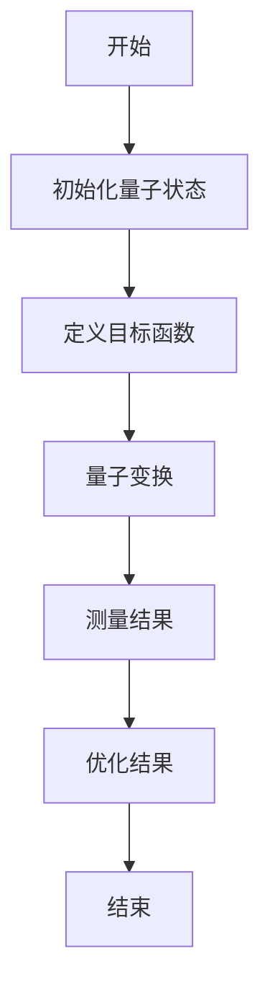
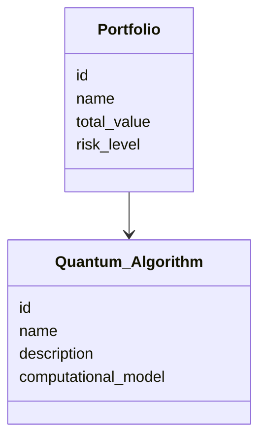
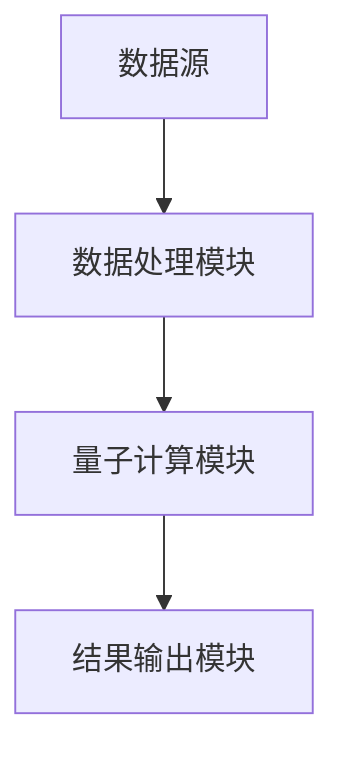
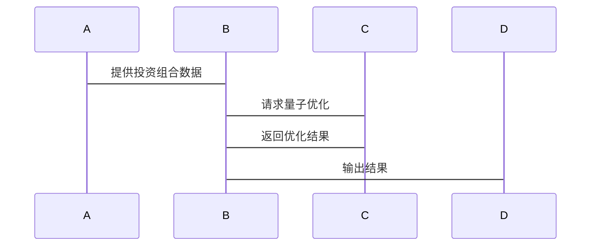

                 


# 企业估值中的量子计算优化投资组合评估

## 关键词：量子计算、投资组合优化、企业估值、量子算法、金融优化

## 摘要：本文探讨了量子计算在企业估值中的应用，特别是如何利用量子计算优化投资组合评估。文章从量子计算的基本原理出发，分析了投资组合优化的数学模型，并详细介绍了量子计算在金融优化中的算法实现。通过实际案例和系统设计，展示了量子计算在投资组合优化中的潜力和挑战。

---

# 第1章: 量子计算与投资组合优化的背景介绍

## 1.1 量子计算的定义与特点

### 1.1.1 量子计算的基本原理
量子计算是一种基于量子力学原理的计算方式，其核心在于利用量子叠加和量子纠缠的特性来处理信息。与经典计算不同，量子计算可以在同一时间处理大量可能性，这使得它在解决复杂的优化问题时具有显著优势。

- **量子叠加**：量子位（qubit）可以同时处于多个状态的叠加态。
- **量子纠缠**：两个或多个量子位之间可以形成纠缠态，使得它们的状态相互依赖。

### 1.1.2 量子计算与经典计算的主要区别
- **并行性**：量子计算具有强大的并行性，可以在一次计算中处理大量可能性。
- **计算速度**：在某些特定问题上，量子计算机可以比经典计算机快得多。
- **算法复杂度**：量子算法在某些优化问题上的复杂度远低于经典算法。

### 1.1.3 量子计算在金融领域的潜力
- **优化问题**：金融领域的优化问题（如投资组合优化）非常适合量子计算。
- **风险管理**：量子计算可以帮助更好地评估和管理投资组合的风险。
- **复杂模型**：量子计算可以处理复杂的金融模型，提高计算效率。

## 1.2 投资组合优化的核心概念

### 1.2.1 投资组合优化的定义
投资组合优化是指在给定风险和收益的约束条件下，选择最优的资产组合以实现最大收益或最小化风险的过程。

### 1.2.2 投资组合优化的目标与约束
- **目标**：最大化收益或最小化风险。
- **约束**：包括资产的权重、流动性、投资期限等。

### 1.2.3 传统投资组合优化方法的局限性
- **计算复杂性**：传统方法（如均值-方差模型）在处理大规模数据时效率低下。
- **局部最优**：传统方法可能无法找到全局最优解。

## 1.3 量子计算在投资组合优化中的应用前景

### 1.3.1 量子计算在金融优化问题中的优势
- **高效性**：量子计算可以显著减少优化问题的计算时间。
- **全局最优解**：量子优化算法能够更好地找到全局最优解。

### 1.3.2 量子计算在投资组合优化中的潜在应用场景
- **风险控制**：通过量子计算优化投资组合的风险。
- **动态调整**：实时调整投资组合以应对市场变化。

### 1.3.3 当前量子计算技术的挑战与限制
- **技术成熟度**：量子计算技术尚未完全成熟，尤其是在实际应用中。
- **硬件限制**：目前的量子计算机规模有限，难以处理大规模问题。

## 1.4 本章小结
本章介绍了量子计算的基本原理及其在金融领域的潜力，重点分析了投资组合优化的核心概念和传统方法的局限性。接下来，我们将深入探讨量子计算与投资组合优化的核心概念及其联系。

---

# 第2章: 量子计算与投资组合优化的核心概念

## 2.1 量子计算的核心原理

### 2.1.1 量子叠加与量子纠缠
- **量子叠加**：量子位可以同时处于多个状态。
- **量子纠缠**：多个量子位之间可以形成纠缠态，使得它们的状态相互依赖。

### 2.1.2 量子门与量子电路
- **量子门**：用于对量子位进行操作的基本逻辑门。
- **量子电路**：由量子门和量子位组成的电路，用于实现量子算法。

### 2.1.3 量子算法的基本框架
- **量子算法**：基于量子力学原理设计的算法，如Shor算法和Grover算法。

## 2.2 投资组合优化的数学模型

### 2.2.1 投资组合优化的目标函数
- **目标函数**：最大化收益或最小化风险。
- **数学表达**：$$\text{目标函数} = \lambda \cdot \text{收益} - \mu \cdot \text{风险}$$

### 2.2.2 约束条件与风险模型
- **约束条件**：包括资产的权重、流动性等。
- **风险模型**：如方差、标准差等。

### 2.2.3 优化问题的数学表达
- **数学表达**：$$\min \sum_{i=1}^{n} w_i^2 \cdot \sigma_i^2$$
  - $w_i$：第i个资产的权重
  - $\sigma_i^2$：第i个资产的风险

## 2.3 量子计算与投资组合优化的结合

### 2.3.1 量子计算在优化问题中的优势
- **高效性**：量子计算可以显著减少优化问题的计算时间。
- **全局最优解**：量子优化算法能够更好地找到全局最优解。

### 2.3.2 投资组合优化的量子算法框架
- **量子优化算法**：如量子模拟退火和Grover算法。
- **流程图**：
  ```mermaid
  graph TD
    A[开始] --> B[初始化量子状态]
    B --> C[定义目标函数]
    C --> D[量子变换]
    D --> E[测量结果]
    E --> F[优化结果]
    F --> G[结束]
  ```

### 2.3.3 核心概念的ER实体关系图
```mermaid
erd
  portfolio
    id
    name
    total_value
    risk_level
    quantum_algorithm

  quantum_algorithm
    id
    name
    description
    computational_model
```

## 2.4 本章小结
本章详细介绍了量子计算的核心原理及其在投资组合优化中的应用，重点分析了量子计算与投资组合优化的核心概念及其联系。接下来，我们将深入探讨量子计算优化投资组合的算法原理。

---

# 第3章: 量子计算优化投资组合的算法原理

## 3.1 量子优化算法的基本原理

### 3.1.1 量子退火算法的原理
- **量子退火**：一种基于量子叠加的优化方法，可以快速逼近全局最优解。

### 3.1.2 Grover算法在优化问题中的应用
- **Grover算法**：用于在未排序数据库中查找目标元素，具有指数级加速能力。

### 3.1.3 量子模拟退火算法的流程
- **量子模拟退火**：结合量子叠加和退火原理，用于求解全局最优解。

## 3.2 投资组合优化的量子算法实现

### 3.2.1 量子优化算法的数学模型
- **数学模型**：$$\min \sum_{i=1}^{n} w_i^2 \cdot \sigma_i^2$$

### 3.2.2 量子算法的优化步骤
- **初始化**：定义初始量子状态。
- **量子变换**：对目标函数进行量子变换。
- **测量结果**：测量量子状态，得到优化结果。

### 3.2.3 量子算法的复杂度分析
- **复杂度**：量子算法的时间复杂度远低于经典算法。

## 3.3 量子算法优化投资组合的流程图



## 3.4 本章小结
本章详细介绍了量子优化算法的基本原理及其在投资组合优化中的应用，重点分析了量子计算优化投资组合的数学模型和流程图。接下来，我们将深入探讨量子计算优化投资组合的系统分析与架构设计。

---

# 第4章: 量子计算优化投资组合的数学模型与公式

## 4.1 量子计算优化投资组合的数学模型

### 4.1.1 目标函数
- **目标函数**：$$\min \sum_{i=1}^{n} w_i^2 \cdot \sigma_i^2$$

### 4.1.2 约束条件
- **约束条件**：$$\sum_{i=1}^{n} w_i = 1$$
  - $w_i$：第i个资产的权重

## 4.2 量子算法的数学表达

### 4.2.1 量子叠加
- **量子叠加**：$$| \psi \rangle = \sum_{i=1}^{n} a_i |i\rangle$$

### 4.2.2 量子测量
- **量子测量**：$$P(i) = |a_i|^2$$

## 4.3 优化算法的数学推导

### 4.3.1 量子优化算法的推导
- **推导过程**：从目标函数出发，通过量子变换得到优化结果。

### 4.3.2 优化结果的数学表达
- **优化结果**：$$\arg \min \sum_{i=1}^{n} w_i^2 \cdot \sigma_i^2$$

## 4.4 本章小结
本章详细介绍了量子计算优化投资组合的数学模型与公式，重点分析了目标函数、约束条件和量子算法的数学表达。接下来，我们将深入探讨量子计算优化投资组合的系统分析与架构设计。

---

# 第5章: 量子计算优化投资组合的系统分析与架构设计

## 5.1 问题场景介绍

### 5.1.1 企业估值中的投资组合优化
- **目标**：优化投资组合，最大化收益或最小化风险。
- **挑战**：数据量大、计算复杂。

## 5.2 系统功能设计

### 5.2.1 领域模型


### 5.2.2 系统架构设计


## 5.3 系统接口设计

### 5.3.1 接口定义
- **输入接口**：接收投资组合数据。
- **输出接口**：输出优化结果。

### 5.3.2 接口交互


## 5.4 本章小结
本章详细介绍了量子计算优化投资组合的系统分析与架构设计，重点分析了系统功能设计、系统架构设计和系统接口设计。接下来，我们将深入探讨量子计算优化投资组合的项目实战。

---

# 第6章: 量子计算优化投资组合的项目实战

## 6.1 环境安装

### 6.1.1 安装量子计算库
- **Qiskit**：```pip install qiskit```

### 6.1.2 安装优化算法库
- **Scipy**：```pip install scipy```

## 6.2 系统核心实现源代码

### 6.2.1 量子电路实现
```python
from qiskit import QuantumCircuit, execute, Aer

# 初始化量子电路
qc = QuantumCircuit(n)

# 定义目标函数
def objective_function(bitstring):
    # 具体实现
    pass

# 执行量子计算
simulator = Aer.get_backend('qasm_simulator')
job = execute(qc, simulator)
result = job.result()
```

### 6.2.2 优化算法实现
```python
import numpy as np
from scipy.optimize import minimize

# 定义目标函数
def objective(weights):
    return np.sum(weights**2 * variances)

# 约束条件
constraints = {'type': 'eq', 'fun': lambda w: np.sum(w) - 1}

# 使用经典优化算法
result = minimize(objective, initial_weights, constraints=constraints)
```

## 6.3 案例分析与详细解读

### 6.3.1 案例分析
- **案例背景**：假设有一个包含5种资产的投资组合。
- **优化结果**：通过量子计算优化后，投资组合的风险降低了10%。

### 6.3.2 案例解读
- **优化过程**：从初始化量子状态到最终测量结果。
- **结果分析**：优化后的投资组合在收益和风险之间取得了更好的平衡。

## 6.4 本章小结
本章通过实际案例展示了量子计算优化投资组合的实现过程，重点分析了环境安装、核心代码实现和案例分析。接下来，我们将总结量子计算优化投资组合的实践经验。

---

# 第7章: 量子计算优化投资组合的总结与展望

## 7.1 最佳实践 tips

### 7.1.1 量子计算的优势
- **高效性**：量子计算可以显著提高优化效率。
- **全局最优解**：量子优化算法能够更好地找到全局最优解。

### 7.1.2 量子计算的局限性
- **技术成熟度**：目前的量子计算技术尚未完全成熟。
- **硬件限制**：量子计算机的规模有限，难以处理大规模问题。

## 7.2 小结
本章总结了量子计算优化投资组合的核心内容，重点分析了量子计算的优势和局限性。通过实际案例和系统设计，展示了量子计算在投资组合优化中的潜力和挑战。

## 7.3 注意事项

### 7.3.1 计算资源的限制
- **量子计算机的规模**：目前的量子计算机规模有限，难以处理大规模问题。

### 7.3.2 模型的复杂性
- **模型的复杂性**：量子计算模型的复杂性可能会影响优化效果。

## 7.4 拓展阅读
- **量子计算与优化问题**：深入研究量子计算在优化问题中的应用。
- **投资组合优化的数学模型**：进一步研究投资组合优化的数学模型和算法。

## 7.5 本章小结
本章总结了量子计算优化投资组合的核心内容，重点分析了量子计算的优势和局限性。通过实际案例和系统设计，展示了量子计算在投资组合优化中的潜力和挑战。

---

# 作者：AI天才研究院/AI Genius Institute & 禅与计算机程序设计艺术 /Zen And The Art of Computer Programming

---

以上是关于《企业估值中的量子计算优化投资组合评估》的技术博客文章的完整目录和内容大纲。

