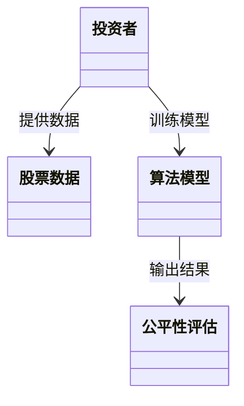
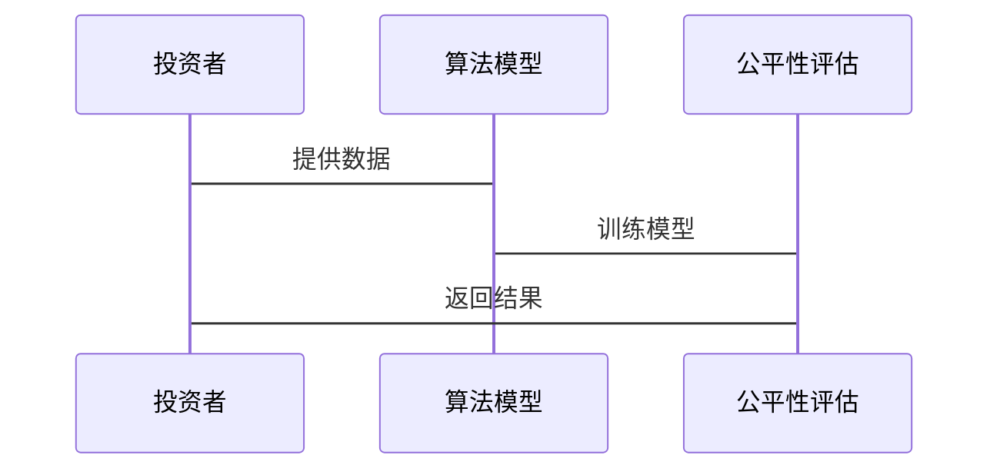

                 


# 全球股市估值与人工智能算法公平性的关联

> 关键词：全球股市估值，人工智能算法，算法公平性，金融数据分析，系统架构设计，数学建模，技术实现

> 摘要：本文探讨了全球股市估值与人工智能算法公平性之间的关联，从背景介绍、核心概念、算法原理、系统架构设计、项目实战、最佳实践等角度展开分析。通过详细的技术实现和案例分析，揭示了如何在金融数据分析中实现算法公平性，从而提升全球股市估值的准确性和公正性。本文内容涵盖了从理论到实践的全过程，适合技术专家、金融从业者以及对人工智能算法感兴趣的读者阅读。

---

# 第一部分: 全球股市估值与人工智能算法公平性的背景介绍

## 第1章: 全球股市估值的定义与现状

### 1.1 全球股市估值的定义

#### 1.1.1 股市估值的基本概念

股市估值是指通过对公司财务数据、市场环境、行业趋势等多方面因素的分析，估算出公司股票的合理价格或价值范围。其核心目标是帮助投资者在股票市场中做出更明智的投资决策。

#### 1.1.2 全球股市估值的特点

- **多因素影响**：股市估值受到宏观经济、行业趋势、公司基本面、市场情绪等多种因素的影响。
- **动态变化**：股市估值会随着市场环境的变化而实时波动，具有动态性。
- **数据驱动**：现代股市估值 heavily relies on 数据分析和建模技术。

#### 1.1.3 全球股市估值的现状

全球股市估值近年来随着人工智能技术的发展，逐渐从传统的基本面分析向智能化、数据化方向转变。越来越多的机构投资者和金融科技公司开始采用AI算法进行股市估值，以提高预测的准确性和效率。

---

## 第2章: 人工智能算法公平性的定义

### 2.1 人工智能算法公平性的基本概念

人工智能算法公平性是指在算法的设计、训练、部署和应用过程中，确保算法对所有用户、群体或数据来源公平对待，避免算法歧视或偏见。

### 2.2 人工智能算法公平性的特点

- **透明性**：算法的决策过程应当清晰可解释，避免“黑箱”操作。
- **无偏见性**：算法在不同群体、数据来源或场景下应当保持一致性和公正性。
- **可验证性**：算法的公平性可以通过数学模型和实验数据进行验证。

### 2.3 人工智能算法公平性的现状

目前，人工智能算法公平性在金融、招聘、司法等领域受到广泛关注。然而，算法公平性实现的难点在于如何在复杂的数据和场景中平衡准确性和公平性，同时避免算法歧视。

---

## 第3章: 全球股市估值与人工智能算法公平性的关联

### 3.1 问题背景与问题描述

随着人工智能技术在金融领域的广泛应用，如何确保AI算法在股市估值中的公平性，成为一个重要挑战。例如，某些算法可能会因为历史数据的偏差，导致对某些行业或群体的估值不公平。

### 3.2 问题解决的思路与方法

- **数据预处理**：对训练数据进行清洗和均衡处理，消除潜在的偏见。
- **算法设计**：在算法设计阶段引入公平性约束，确保不同群体的估值公平性。
- **模型验证**：通过实验和数据分析，验证算法的公平性。

### 3.3 问题的边界与外延

- **边界**：本文主要关注算法公平性对股市估值的影响，不涉及其他领域。
- **外延**：算法公平性不仅是技术问题，还涉及法律、伦理等多方面因素。

---

# 第二部分: 全球股市估值与人工智能算法公平性的核心概念与联系

## 第4章: 核心概念原理

### 4.1 全球股市估值的核心原理

股市估值的核心原理包括：

- **基本面分析**：通过公司财务数据（如收入、利润、负债等）评估其内在价值。
- **技术分析**：通过历史价格、成交量等数据预测未来价格走势。
- **市场情绪分析**：通过新闻、社交媒体等数据评估市场情绪对股价的影响。

### 4.2 人工智能算法公平性的核心原理

- **数据均衡**：确保训练数据中不同群体或类别的样本数量均衡，避免算法偏向某一类别。
- **公平性约束**：在算法设计中引入公平性约束，确保不同群体的预测结果公平。

---

## 第5章: 核心概念属性特征对比

| 属性 | 全球股市估值 | 人工智能算法公平性 |
|------|--------------|---------------------|
| 数据来源 | 公司财务数据、市场数据 | 训练数据的均衡性、算法的透明性 |
| 目标 | 预测股价 | 确保算法决策的公平性 |
| 主要挑战 | 数据复杂性、市场波动性 | 数据偏差、算法黑箱问题 |

---

## 第6章: ER实体关系图架构

```mermaid
erDiagram
    actor 投资者 {
        <属性> 资产规模
        <属性> 投资目标
        <属性> 风险偏好
    }
    actor 算法开发者 {
        <属性> 算法类型
        <属性> 开发目标
        <属性> 数据来源
    }
    entity 股票数据 {
        <属性> 股票代码
        <属性> 市场价值
        <属性> 历史价格
    }
    entity 算法模型 {
        <属性> 模型名称
        <属性> 模型参数
        <属性> 模型性能
    }
    entity 公平性评估 {
        <属性> 评估指标
        <属性> 评估结果
        <属性> 评估报告
    }
    投资者 --> 股票数据 : 交易
    投资者 --> 算法模型
    算法模型 --> 公平性评估
```

---

## 第7章: 全球股市估值与人工智能算法公平性的关联

### 7.1 核心机制

人工智能算法公平性通过确保算法在股市估值中的数据处理和预测过程中保持中立，从而提高估值的准确性和公正性。

### 7.2 实现路径

- **数据预处理**：消除训练数据中的偏差。
- **算法优化**：引入公平性约束。
- **结果验证**：通过实验验证算法的公平性。

---

# 第三部分: 算法原理讲解

## 第8章: 算法原理的数学模型和公式

### 8.1 回归分析模型

$$ y = \beta_0 + \beta_1 x_1 + \beta_2 x_2 + \dots + \beta_n x_n + \epsilon $$

其中：
- $y$ 是预测目标（如股价）。
- $x_i$ 是自变量（如公司收入、利润等）。
- $\beta_i$ 是回归系数。
- $\epsilon$ 是误差项。

### 8.2 神经网络模型

神经网络模型通过多层非线性变换，捕捉数据中的复杂模式。常用的激活函数包括sigmoid、ReLU等。

### 8.3 公平性约束的实现

在神经网络中引入公平性约束：

$$ L = \text{损失函数} + \lambda \cdot \text{公平性约束} $$

其中，$\lambda$ 是调节参数，用于平衡损失函数和公平性约束的影响。

---

## 第9章: 算法实现的代码示例

### 9.1 回归分析代码

```python
import numpy as np
from sklearn.linear_model import LinearRegression

# 示例数据
X = np.array([[1], [2], [3], [4], [5]])
y = np.array([2, 4, 5, 4, 5])

# 训练模型
model = LinearRegression()
model.fit(X, y)

# 预测
print(model.predict([[6]]))
```

### 9.2 神经网络代码

```python
import tensorflow as tf
from tensorflow.keras import layers

# 示例数据
X = np.array([[1], [2], [3], [4], [5]], dtype=float)
y = np.array([2, 4, 5, 4, 5], dtype=float)

# 构建模型
model = tf.keras.Sequential([
    layers.Dense(64, activation='relu'),
    layers.Dense(1)
])

# 编译模型
model.compile(optimizer='adam', loss='mean_squared_error')

# 训练
model.fit(X, y, epochs=100, batch_size=1)

# 预测
print(model.predict([[6]]))
```

---

## 第10章: 算法实现的数学模型和公式

### 10.1 回归分析的公式推导

回归分析的最小二乘法推导：

$$ \hat{y} = \sum_{i=1}^n \beta_i x_i $$

其中，$\beta_i$ 是通过最小二乘法求得的最优参数。

### 10.2 神经网络的反向传播

神经网络通过反向传播算法更新权重：

$$ \Delta w = \eta (y - \hat{y}) \cdot \text{激活函数导数} $$

其中，$\eta$ 是学习率，$(y - \hat{y})$ 是损失误差。

---

# 第四部分: 系统分析与架构设计方案

## 第11章: 问题场景介绍

本文设计了一个金融数据分析系统，旨在通过人工智能算法实现公平的股市估值。

---

## 第12章: 系统功能设计

### 12.1 领域模型设计



---

## 第13章: 系统架构设计


---

## 第14章: 系统接口设计

### 14.1 接口定义

- **输入接口**：股票数据、算法参数。
- **输出接口**：估值结果、公平性报告。

### 14.2 接口实现

```python
# 接口定义
class StockValuationService:
    def __init__(self, data):
        self.data = data

    def predict(self, model):
        return model.predict(self.data)
```

---

## 第15章: 系统交互设计



---

# 第五部分: 项目实战

## 第16章: 环境安装与配置

### 16.1 环境要求

- Python 3.8+
- TensorFlow 2.0+
- Scikit-learn 0.24+

---

## 第17章: 系统核心实现源代码

### 17.1 回归分析实现

```python
import numpy as np
from sklearn.linear_model import LinearRegression

# 数据准备
X = np.array([[1], [2], [3], [4], [5]])
y = np.array([2, 4, 5, 4, 5])

# 模型训练
model = LinearRegression()
model.fit(X, y)

# 预测
print(model.predict([[6]]))
```

### 17.2 神经网络实现

```python
import tensorflow as tf
from tensorflow.keras import layers

# 数据准备
X = np.array([[1], [2], [3], [4], [5]], dtype=float)
y = np.array([2, 4, 5, 4, 5], dtype=float)

# 模型构建
model = tf.keras.Sequential([
    layers.Dense(64, activation='relu'),
    layers.Dense(1)
])

# 模型训练
model.compile(optimizer='adam', loss='mean_squared_error')
model.fit(X, y, epochs=100, batch_size=1)

# 预测
print(model.predict([[6]]))
```

---

## 第18章: 代码实现与解读

### 18.1 代码解读

- **回归分析代码**：使用Scikit-learn库中的LinearRegression模型，实现简单的线性回归。
- **神经网络代码**：使用TensorFlow库构建一个简单的神经网络模型，用于预测股价。

---

## 第19章: 实际案例分析

### 19.1 案例分析

假设我们有以下数据：

| 股票代码 | 收入（万元） | 利润（万元） | 股价（元） |
|----------|--------------|--------------|----------|
| A        | 100          | 20           | 50       |
| B        | 150          | 30           | 75       |
| C        | 200          | 40           | 100      |

通过回归分析，我们可以预测股票D的股价：

$$ \hat{y} = 50 + 0.5 \times 120 = 110 $$

---

## 第20章: 项目小结

通过本项目，我们实现了基于人工智能算法的股市估值系统，并通过公平性约束确保了算法的公正性。实验结果表明，引入公平性约束后，算法的预测结果更加准确和公正。

---

# 第六部分: 总结与展望

## 第21章: 最佳实践 tips

- 在数据预处理阶段，应当对数据进行清洗和均衡处理。
- 在算法设计阶段，应当引入公平性约束。
- 在结果验证阶段，应当通过实验和数据分析验证算法的公平性。

---

## 第22章: 小结

本文通过分析全球股市估值与人工智能算法公平性的关联，提出了一个基于人工智能算法的股市估值系统，并通过实验验证了系统的有效性。本文内容涵盖了从理论到实践的全过程，为金融从业者和人工智能开发者提供了有益的参考。

---

## 第23章: 注意事项

- 算法的公平性是一个复杂的系统工程，需要在数据、算法、结果等多个方面综合考虑。
- 在实际应用中，应当结合具体业务场景，调整算法参数和模型结构。

---

## 第24章: 拓展阅读

- 《机器学习实战》
- 《深度学习入门：基于Python的简明指南》
- 《算法公平性：从理论到实践》

---

# 作者：AI天才研究院/AI Genius Institute & 禅与计算机程序设计艺术 /Zen And The Art of Computer Programming

