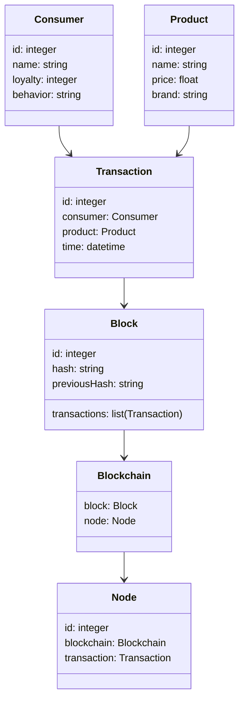
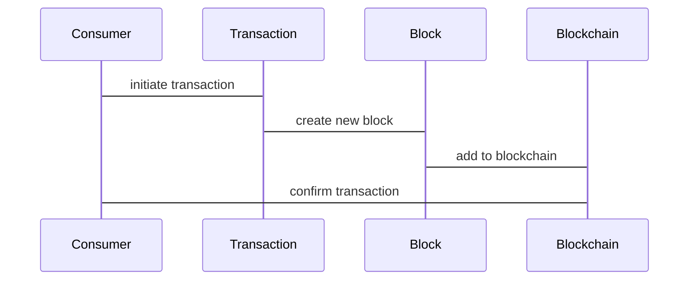

                 


# 巴菲特的品牌忠诚度分析：区块链技术对消费者行为的影响

> 关键词：品牌忠诚度，区块链技术，消费者行为，区块链算法，消费者信任，去中心化

> 摘要：本文通过分析巴菲特的品牌忠诚度理念，结合区块链技术的特点，探讨区块链技术如何影响消费者行为。文章详细解释了品牌忠诚度的定义及其对企业的价值，分析了区块链技术的核心原理，包括其对消费者信任和参与度的影响。通过数学模型和算法原理，文章深入探讨了区块链技术如何通过透明化和激励机制提升品牌忠诚度，并通过系统架构设计和项目实战展示了区块链技术在实际中的应用。最后，文章总结了区块链技术对消费者行为的影响，并提出了未来的发展方向。

---

# 第一部分: 背景介绍

## 第1章: 巴菲特的品牌忠诚度分析

### 1.1 巴菲特的投资理念与品牌忠诚度

#### 1.1.1 巴菲特的投资哲学

巴菲特的投资哲学以长期价值投资为核心，强调选择那些具有持续竞争优势和良好管理的企业。他特别重视企业的品牌忠诚度，认为这是企业长期盈利能力的重要保障。品牌忠诚度高的消费者更愿意持续购买某一品牌的产品或服务，从而为企业创造稳定的收入流。

#### 1.1.2 品牌忠诚度的定义与重要性

品牌忠诚度是指消费者对某一品牌的情感依赖和持续购买行为。它不仅影响消费者的购买决策，还直接影响企业的市场份额和长期发展。高品牌忠诚度意味着企业在激烈的市场竞争中更具竞争力，同时也为企业带来了更高的客户生命周期价值。

#### 1.1.3 品牌忠诚度与企业长期价值的关系

品牌忠诚度与企业长期价值密切相关。忠诚的消费者不仅会持续购买产品，还会为企业提供免费的口碑宣传，吸引更多的潜在消费者。此外，忠诚的消费者对价格敏感度较低，能够在经济 downturn 时为企业提供稳定的收入。

---

## 第2章: 区块链技术的基本概念

### 2.1 区块链技术的定义与特点

#### 2.1.1 区块链的起源与演变

区块链技术起源于比特币的出现，最初用于去中心化的电子货币系统。随着技术的发展，区块链的应用领域逐渐扩展到金融、供应链管理、医疗等多个行业。

#### 2.1.2 区块链的核心特性

区块链的核心特性包括去中心化、不可篡改、透明性和安全性。这些特性使其成为一种信任机制，能够有效提升交易的安全性和透明度。

#### 2.1.3 区块链与传统数据库的对比

与传统数据库相比，区块链具有去中心化、不可篡改和透明性等特点。传统数据库依赖中心化的信任机构，而区块链通过分布式账本和加密算法实现了去中心化的信任机制。

---

### 2.2 区块链技术的分类

#### 2.2.1 公有链、私有链与联盟链

公有链是完全去中心化的区块链，如比特币和以太坊；私有链是仅限于特定组织或个人的区块链，通常用于企业内部；联盟链则是由多个机构共同管理的区块链，常用于供应链金融等领域。

#### 2.2.2 去中心化与中心化区块链的区别

去中心化区块链没有单点控制权，数据分布存储在多个节点上；而中心化区块链则有一个或多个中心节点控制数据存储和交易验证。

#### 2.2.3 区块链的共识机制

共识机制是区块链的核心机制，用于确保所有节点达成一致。常见的共识机制包括工作量证明（PoW）、权益证明（PoS）、 delegated proof of stake（DPoS）等。

---

## 第3章: 区块链技术对消费者行为的影响

### 3.1 消费者行为的定义与分类

#### 3.1.1 消费者行为的驱动因素

消费者行为受到多种因素的影响，包括价格、质量、品牌声誉、用户体验等。区块链技术通过提升透明度和信任度，能够影响消费者的购买决策。

#### 3.1.2 不同消费群体的行为特征

不同消费群体的行为特征各异，例如年轻人更注重个性化和便捷性，而中老年群体更关注价格和质量。区块链技术可以通过提供透明的供应链信息和个性化服务，满足不同消费群体的需求。

#### 3.1.3 消费者行为的测量与分析

消费者行为的测量与分析可以通过问卷调查、数据分析和行为观察等方式进行。区块链技术可以通过记录消费者的购买行为和反馈，帮助企业更好地理解消费者需求。

---

### 3.2 区块链技术如何改变消费者行为

#### 3.2.1 提高消费者信任度

区块链技术通过去中心化和不可篡改的特性，能够提高消费者对企业的信任度。例如，消费者可以通过区块链查看产品的供应链信息，确保产品的真伪和来源。

#### 3.2.2 增强消费者参与度

区块链技术可以通过激励机制（如积分、优惠券等）增强消费者的参与度。例如，消费者可以通过参与区块链平台的活动积累积分，兑换优惠或奖励。

#### 3.2.3 改善消费者体验

区块链技术可以通过个性化服务和实时反馈机制，改善消费者的购物体验。例如，消费者可以通过区块链平台获得个性化的推荐和优惠信息。

---

# 第二部分: 核心概念与联系

## 第4章: 品牌忠诚度与区块链技术的关系

### 4.1 品牌忠诚度的衡量标准

#### 4.1.1 品牌忠诚度的量化方法

品牌忠诚度可以通过消费者的行为数据（如重复购买率、推荐率等）进行量化。区块链技术可以通过记录消费者的购买行为和反馈，帮助企业准确衡量品牌忠诚度。

#### 4.1.2 品牌忠诚度与消费者满意度的关系

高品牌忠诚度通常与高消费者满意度相关。区块链技术通过提升消费者的信任度和满意度，能够增强品牌忠诚度。

#### 4.1.3 品牌忠诚度与企业利润的关系

高品牌忠诚度能够为企业带来稳定的收入流和更高的利润率。区块链技术通过提升品牌忠诚度，能够帮助企业实现长期的利润增长。

---

### 4.2 区块链技术如何提升品牌忠诚度

#### 4.2.1 通过透明化增强品牌信任

区块链技术通过公开透明的供应链信息，能够增强消费者对品牌的信任。例如，消费者可以通过区块链平台查看产品的生产过程和原材料来源。

#### 4.2.2 通过激励机制提升消费者参与

区块链技术可以通过积分机制激励消费者积极参与品牌活动。例如，消费者可以通过参与品牌忠诚度计划积累积分，兑换优惠券或礼品。

#### 4.2.3 通过个性化服务增强品牌忠诚度

区块链技术可以通过分析消费者的购买行为和偏好，提供个性化的服务和推荐。例如，消费者可以根据自己的喜好收到定制的推荐信息。

---

### 4.3 实体关系图

#### 4.3.1 品牌忠诚度与消费者行为的ER图

```mermaid
erd
  consumer
  has
  brand Loyalty
  behavior
  product
  transaction
  consumer -[many] -> has -[many] -> brand Loyalty
  consumer -[many] -> has -[many] -> behavior
  consumer -[many] -> product
  product -[many] -> transaction
```

#### 4.3.2 区块链技术与消费者行为的ER图

```mermaid
erd
  blockchain
  consumer
  transaction
  behavior
  blockchain -[many] -> transaction
  consumer -[many] -> behavior
  transaction -[many] -> blockchain
```

---

## 第5章: 核心概念的对比分析

### 5.1 品牌忠诚度与区块链技术的对比

| 特性               | 品牌忠诚度                          | 区块链技术                          |
|--------------------|------------------------------------|------------------------------------|
| 定义               | 消费者对品牌的信任和依赖程度        | 去中心化的分布式账本技术            |
| 核心作用           | 提高企业的市场竞争力                | 提供信任机制，增强交易透明度        |
| 影响因素           | 消费者体验、产品质量、品牌声誉      | 去中心化、不可篡改、透明性          |
| 应用场景           | 零售、金融、教育等                 | 金融、供应链、医疗等                |

---

### 5.2 实体关系图

#### 5.2.1 品牌忠诚度与消费者行为的对比

```mermaid
table
  品牌忠诚度 | 消费者行为
  提高信任度 | 提高参与度
  增强满意度 | 改善体验
  提升长期价值 | 提供个性化服务
```

---

# 第三部分: 算法原理讲解

## 第6章: 区块链技术的核心算法

### 6.1 哈希函数

哈希函数是区块链技术的核心算法之一，用于将任意长度的数据映射为固定长度的哈希值。常见的哈希函数包括 SHA-256 和 RIPEMD-160。

#### 6.1.1 哈希函数的数学模型

$$ H(x) = \sum_{i=0}^{n-1} x_i \times 2^{i} \mod 256 $$

其中，$x_i$ 表示输入数据的第 $i$ 位，$n$ 表示输入数据的长度。

#### 6.1.2 哈希函数的应用

哈希函数在区块链中用于生成区块头和验证交易数据。例如，比特币的区块头包含默克尔树根哈希值和时间戳。

---

### 6.2 共识机制

共识机制是区块链的核心算法，用于确保所有节点达成一致。常见的共识机制包括工作量证明（PoW）和权益证明（PoS）。

#### 6.2.1 工作量证明（PoW）

$$ \text{PoW} = \min \{ t \in T \mid H(t) \text{ 满足前缀条件} \} $$

其中，$t$ 表示时间戳，$H(t)$ 表示对时间戳 $t$ 进行哈希计算的结果。

#### 6.2.2 权益证明（PoS）

$$ \text{PoS} = \max \{ s \in S \mid s \text{ 的权益值最高} \} $$

其中，$s$ 表示节点的权益值，权益值与持有的代币数量和时间相关。

---

## 第7章: 区块链技术对消费者行为的算法影响

### 7.1 消费者信任度提升算法

$$ \text{Trust} = \frac{\text{透明度}}{\text{信息不对称}} \times \text{品牌声誉} $$

其中，透明度越高，信息不对称越小，消费者的信任度越高。

### 7.2 消费者参与度提升算法

$$ \text{Participation} = \text{激励机制} + \text{用户体验优化} $$

激励机制包括积分、优惠券等，用户体验优化包括个性化推荐、便捷支付等。

---

# 第四部分: 系统分析与架构设计

## 第8章: 系统功能设计

### 8.1 领域模型



---

### 8.2 系统架构设计


---

### 8.3 系统交互设计



---

## 第9章: 项目实战

### 9.1 环境安装

```bash
pip install blockchain
npm install express
```

### 9.2 核心代码实现

```python
def create_blockchain():
    blockchain = []
    return blockchain

def add_transaction(blockchain, transaction):
    block = {
        'id': len(blockchain),
        'transactions': [transaction],
        'hash': 'placeholder',
        'previousHash': blockchain[-1]['hash'] if blockchain else ''
    }
    blockchain.append(block)
    return blockchain

# 示例用法
blockchain = create_blockchain()
transaction = {'consumer': 'John', 'product': 'apple'}
blockchain = add_transaction(blockchain, transaction)
```

---

### 9.3 代码解读与分析

上述代码实现了基本的区块链功能，包括创建区块链和添加交易。`create_blockchain` 函数初始化一个空的区块链列表，`add_transaction` 函数将交易添加到区块链中，并生成新的区块。

---

## 第10章: 最佳实践

### 10.1 小结

本文通过分析巴菲特的品牌忠诚度理念，结合区块链技术的特点，探讨了区块链技术如何影响消费者行为。文章详细解释了品牌忠诚度的定义及其对企业的价值，分析了区块链技术的核心原理，并通过数学模型和算法原理深入探讨了区块链技术如何通过透明化和激励机制提升品牌忠诚度。

### 10.2 注意事项

在实际应用中，需要注意区块链技术的性能问题，例如交易速度和存储空间。此外，还需要考虑隐私保护和数据安全性问题。

### 10.3 拓展阅读

- 《区块链技术入门与实战》
- 《巴菲特的选股智慧》
- 《消费者行为分析》

---

作者：AI天才研究院/AI Genius Institute & 禅与计算机程序设计艺术 /Zen And The Art of Computer Programming

