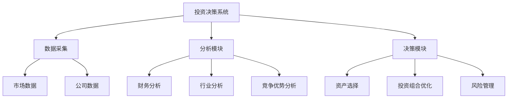

                 

# 巴菲特的投资哲学：简单但不容易

> 关键词：巴菲特，价值投资，长期持有，安全边际，内在价值

> 摘要：本文深入探讨了巴菲特的投资哲学，从价值投资的基本概念到具体的投资策略，再到数学模型的构建，最后通过实际案例分析，帮助读者全面理解巴菲特的投资理念。文章详细解释了价值投资的核心思想、安全边际的概念、长期持有的重要性，并通过苹果公司的投资案例，展示了如何在实际操作中应用这些理念。

---

# 第1章: 投资的基本概念

## 1.1 投资的基本定义

### 1.1.1 投资的定义与分类

投资是指将资金投入到某种资产或项目中，以期获得未来收益的行为。投资可以分为金融投资和实体投资两大类。金融投资包括股票、债券、基金等，实体投资则包括房地产、制造业等。本文主要关注金融投资领域，尤其是股票投资。

### 1.1.2 投资的基本原则

投资的基本原则包括分散投资、长期持有、价值导向等。分散投资可以降低风险，长期持有有助于复利效应的发挥，而价值导向则是找到具有内在价值的资产进行投资。

### 1.1.3 投资与投机的区别

投资注重资产的内在价值，基于基本面分析；而投机则注重市场的短期波动，基于市场情绪。巴菲特强调投资而非投机，认为长期来看，投资是更稳定和可靠的。

## 1.2 巴菲特的生平简介

### 1.2.1 巴菲特的成长经历

沃伦·巴菲特出生于1930年，从小就展现出对数字和投资的天赋。他在青少年时期开始接触股票投资，并在19岁时投资了一家纺织公司，获得了丰厚的回报。

### 1.2.2 巴菲特的事业历程

巴菲特在20世纪50年代开始管理合伙公司，逐步积累了巨额财富。他以合伙公司的形式吸引投资者，以自己的投资理念管理资金，并在1970年代收购了伯克希尔哈撒韦公司，将其转变为一个多元化的投资帝国。

### 1.2.3 巴菲特的投资理念形成过程

巴菲特的投资理念深受本杰明·格雷厄姆的影响，两人共同创立了价值投资的理论。巴菲特将格雷厄姆的理论与自己的实践相结合，形成了独特的投资哲学。

## 1.3 巴菲特投资哲学的核心思想

### 1.3.1 价值投资的定义

价值投资是一种基于资产内在价值的投资方法，强调以低于内在价值的价格买入优质资产，并长期持有。

### 1.3.2 巴菲特投资哲学的核心要素

- **内在价值**：资产在未来现金流的现值，是衡量资产价值的核心指标。
- **安全边际**：买入价格与内在价值之间的差距，提供了一个安全垫，降低投资风险。
- **长期持有**：通过长期持有优质资产，享受复利效应，实现财富的稳步增长。

### 1.3.3 巴菲特投资哲学的实践案例

巴菲特通过投资可口可乐、美国运通等公司，展示了价值投资的成功案例。他不仅关注公司的财务状况，还关注公司的竞争优势和管理团队。

## 1.4 本章小结

### 1.4.1 投资的基本概念总结

投资是通过购买资产以期获得未来收益的行为，分为金融投资和实体投资。投资与投机的区别在于，投资注重内在价值，而投机注重短期波动。

### 1.4.2 巴菲特投资哲学的核心思想总结

巴菲特的投资哲学以价值投资为核心，强调内在价值、安全边际和长期持有。通过长期持有优质资产，投资者可以实现财富的稳定增长。

---

# 第2章: 价值投资的核心理念

## 2.1 价值投资的定义与特点

### 2.1.1 价值投资的定义

价值投资是一种以低于内在价值的价格买入优质资产的投资策略。它强调对资产的深入研究和长期持有。

### 2.1.2 价值投资的核心特点

- **注重内在价值**：价值投资者关注资产的内在价值，而非市场的短期波动。
- **长期持有**：通过长期持有，价值投资者可以享受复利效应，实现财富的稳步增长。
- **安全边际**：买入价格低于内在价值，为投资提供安全垫。

### 2.1.3 价值投资与成长投资的区别

价值投资注重资产的内在价值，而成长投资注重资产的未来增长潜力。价值投资更关注安全边际，而成长投资更关注公司的成长性。

## 2.2 安全边际的概念与作用

### 2.2.1 安全边际的定义

安全边际是指买入价格与内在价值之间的差距。它为投资者提供了在市场波动中抵御风险的能力。

### 2.2.2 安全边际在投资中的作用

安全边际能够降低投资风险，使投资者在市场下跌时能够保持投资的稳定性。同时，安全边际也为投资者提供了获利的空间。

### 2.2.3 安全边际的计算方法

安全边际 = 内在价值 - 市场价格

例如，如果某资产的内在价值为100元，市场价格为80元，那么安全边际为20元。

## 2.3 长期投资的重要性

### 2.3.1 长期投资的定义

长期投资是指将资产持有较长时间，以期获得稳定的收益。它不同于短期投资，注重资产的长期表现。

### 2.3.2 长期投资的优势

长期投资能够避免短期市场的波动，降低交易成本，并充分利用复利效应，实现财富的稳步增长。

### 2.3.3 长期投资的风险与挑战

长期投资的风险主要来自于市场的波动和资产的质量。如果资产质量不佳，长期持有可能会带来损失。

## 2.4 巴菲特的选股标准

### 2.4.1 选股标准的核心要素

- **强大的竞争优势**：公司必须在行业中具有竞争优势，能够长期保持领先地位。
- **优秀的管理团队**：公司管理层必须诚实、有能力，并致力于股东的长期利益。
- **合理的财务状况**：公司财务健康，负债低，现金流稳定。

### 2.4.2 选股标准的实践应用

巴菲特通过分析公司的财务报表、竞争优势和管理团队，选择具有长期增长潜力的公司进行投资。

### 2.4.3 选股标准的优缺点分析

优点：能够筛选出优质资产，降低投资风险。缺点：选股标准较为严格，可能错失一些短期上涨的机会。

## 2.5 本章小结

### 2.5.1 价值投资的核心理念总结

价值投资强调内在价值、安全边际和长期持有。通过选择优质资产，投资者可以在市场波动中保持稳定收益。

### 2.5.2 安全边际与长期投资的重要性总结

安全边际为投资提供了风险缓冲，而长期投资则通过复利效应实现财富的稳步增长。两者结合，能够帮助投资者在长期中获得更好的回报。

---

# 第3章: 巴菲特的投资策略

## 3.1 股票分析的基本方法

### 3.1.1 财务报表分析

财务报表分析是价值投资的重要步骤。通过分析公司的资产负债表、利润表和现金流量表，可以了解公司的财务状况和盈利能力。

- **资产负债表**：反映公司的资产、负债和所有者权益。
- **利润表**：反映公司在一定时期内的收入和支出。
- **现金流量表**：反映公司现金的流入和流出情况。

### 3.1.2 行业分析

行业分析是了解公司所处环境的重要步骤。通过分析行业的发展趋势、竞争格局和市场容量，可以判断公司的竞争优势。

### 3.1.3 公司竞争优势分析

公司竞争优势包括成本优势、技术优势、品牌优势等。通过分析公司的竞争优势，可以判断其长期盈利能力。

## 3.2 股票估值的方法

### 3.2.1 市盈率法

市盈率（P/E）= 股价 / 每股收益

市盈率法通过比较市盈率与行业平均水平，判断股票的估值是否合理。

### 3.2.2 市净率法

市净率（P/B）= 股价 / 每股净资产

市净率法适用于银行、房地产等行业的估值，尤其是当公司净利润为负时。

### 3.2.3 现金流折现法

现金流折现法（DCF）通过将未来现金流折现，计算资产的内在价值。

公式：$$
\text{内在价值} = \sum_{t=1}^{n} \frac{\text{现金流}_t}{(1 + r)^t}
$$

其中，r是折现率，n是现金流的预测期限。

### 3.2.4 本益比与股息率分析

- **本益比（P/E）**：反映股价相对于每股收益的高低。
- **股息率**：反映公司派发的股息与股价的比率。

### 3.2.5 本章小结

股票估值需要综合运用多种方法，DCF模型是其中最重要的工具之一。通过结合市盈率、市净率等指标，可以更准确地判断股票的估值是否合理。

## 3.3 投资组合的构建

### 3.3.1 投资组合的概念

投资组合是指投资者持有的多种资产，以分散风险并提高收益。

### 3.3.2 投资组合的优化方法

- **分散投资**：通过投资不同类型的资产，降低投资风险。
- **资产配置**：根据市场情况调整资产配置，优化投资回报。

### 3.3.3 投资组合的风险管理

- **止损策略**：设定止损点，避免亏损过大。
- **定期调整**：根据市场变化和资产表现，定期调整投资组合。

## 3.4 巴菲特的投资策略总结

### 3.4.1 巴菲特投资策略的核心要素

- **选择优质资产**：投资具有强大竞争优势和良好财务状况的公司。
- **长期持有**：通过长期持有，享受复利效应。
- **安全边际**：买入价格低于内在价值，降低投资风险。

### 3.4.2 巴菲特投资策略的优缺点分析

优点：能够稳定获得长期收益，风险较低。缺点：需要深入研究公司，选择优质资产较为困难。

### 3.4.3 巴菲特投资策略的未来展望

随着市场的变化，价值投资的核心理念依然适用。投资者需要不断学习和适应市场的变化，以实现长期的投资目标。

## 3.5 本章小结

### 3.5.1 巴菲特投资策略的核心思想总结

巴菲特的投资策略以价值投资为核心，强调选择优质资产、长期持有和安全边际。通过这些策略，投资者可以在长期中获得稳定的收益。

### 3.5.2 投资策略的实践应用总结

投资者需要结合市场情况，灵活运用巴菲特的投资策略，选择优质资产，构建合理的投资组合，并通过长期持有实现财富的增长。

---

# 第4章: 巴菲特投资哲学的数学模型

## 4.1 投资回报的数学模型

### 4.1.1 投资回报的计算公式

投资回报 = （最终价值 - 初始价值）/ 初始价值 × 100%

例如，初始投资100元，最终价值150元，投资回报为50%。

### 4.1.2 投资回报的影响因素

- **初始投资**：投资的本金多少。
- **投资期限**：投资的时间长短。
- **投资收益**：投资期间的收益情况。

### 4.1.3 复利的数学模型

复利公式：$$
\text{最终价值} = \text{初始投资} × (1 + r)^n
$$

其中，r是年收益率，n是投资年数。

例如，初始投资100元，年收益率10%，投资10年，最终价值为328.90元。

### 4.1.4 内在价值的数学模型

内在价值公式：$$
\text{内在价值} = \sum_{t=1}^{n} \frac{\text{现金流}_t}{(1 + r)^t}
$$

其中，r是折现率，n是现金流的预测期限。

### 4.1.5 安全边际的数学模型

安全边际公式：$$
\text{安全边际} = \text{内在价值} - \text{市场价格}
$$

例如，内在价值为100元，市场价格为80元，安全边际为20元。

## 4.2 现金流折现法（DCF）的数学模型

### 4.2.1 DCF模型的公式

$$
\text{内在价值} = \frac{\text{现金流}_1}{(1 + r)} + \frac{\text{现金流}_2}{(1 + r)^2} + \cdots + \frac{\text{现金流}_n}{(1 + r)^n}
$$

其中，r是折现率，n是现金流的预测期限。

### 4.2.2 DCF模型的优缺点

优点：能够准确反映资产的内在价值。缺点：需要准确预测未来现金流，具有较高的不确定性。

### 4.2.3 DCF模型的应用案例

假设某公司未来5年的现金流分别为100、120、140、160、180万元，折现率为10%。

$$
\text{内在价值} = \frac{100}{1.1} + \frac{120}{1.1^2} + \frac{140}{1.1^3} + \frac{160}{1.1^4} + \frac{180}{1.1^5}
$$

计算结果约为400.01万元。

## 4.3 本章小结

### 4.3.1 投资回报的数学模型总结

投资回报的计算公式和复利模型是理解投资回报的重要工具。通过这些公式，投资者可以更好地理解投资的长期收益。

### 4.3.2 DCF模型的数学模型总结

现金流折现法是评估资产内在价值的重要工具。通过准确预测未来现金流，投资者可以更好地判断资产的估值是否合理。

---

# 第5章: 巴菲特投资哲学的系统分析

## 5.1 系统架构设计

### 5.1.1 系统架构图

### 5.1.2 系统功能模块

- **数据采集**：收集市场数据和公司数据。
- **分析模块**：包括财务分析、行业分析和竞争优势分析。
- **决策模块**：包括资产选择、投资组合优化和风险管理。

### 5.1.3 系统交互流程

1. 数据采集模块收集市场数据和公司数据。
2. 分析模块对数据进行分析，生成分析结果。
3. 决策模块根据分析结果，制定投资策略。

### 5.1.4 系统架构的优势

- **模块化设计**：各模块独立，便于维护和升级。
- **高效性**：通过模块化设计，提高了系统的运行效率。
- **可扩展性**：可以根据需要添加新的模块。

## 5.2 系统接口设计

### 5.2.1 系统接口描述

- **数据采集接口**：从数据库或外部API获取市场数据和公司数据。
- **分析模块接口**：调用财务分析、行业分析和竞争优势分析模块。
- **决策模块接口**：根据分析结果，生成投资策略。

### 5.2.2 接口交互流程

1. 数据采集模块调用数据接口，获取数据。
2. 分析模块调用分析接口，生成分析结果。
3. 决策模块调用决策接口，制定投资策略。

### 5.2.3 接口设计的优缺点

优点：提高了系统的灵活性和可扩展性。缺点：接口设计复杂，需要较高的开发成本。

## 5.3 系统实现

### 5.3.1 系统实现步骤

1. 确定系统需求，设计系统架构。
2. 开发数据采集模块，实现数据的采集和存储。
3. 开发分析模块，实现财务分析、行业分析和竞争优势分析。
4. 开发决策模块，实现资产选择、投资组合优化和风险管理。
5. 测试系统，优化性能。

### 5.3.2 系统实现的挑战

- **数据获取**：需要可靠的市场数据和公司数据。
- **算法实现**：需要高效准确的分析算法。
- **系统维护**：需要定期更新和优化系统。

## 5.4 本章小结

### 5.4.1 系统架构设计总结

通过模块化设计，系统能够高效地进行投资决策。数据采集、分析和决策模块的分离，提高了系统的灵活性和可扩展性。

### 5.4.2 系统实现的挑战总结

系统的实现需要克服数据获取、算法实现和系统维护等多重挑战。只有在这些方面都做好，才能实现高效的系统运行。

---

# 第6章: 项目实战——苹果公司的投资分析

## 6.1 项目背景

### 6.1.1 苹果公司简介

苹果公司是全球领先的科技公司，主要生产和销售iPhone、Mac、iPad等产品，并提供相关服务。

### 6.1.2 项目目标

通过巴菲特的投资哲学，分析苹果公司的投资价值，制定投资策略。

## 6.2 项目实施

### 6.2.1 数据采集

收集苹果公司的财务数据、行业数据和公司数据。

### 6.2.2 数据分析

1. 财务分析：分析苹果公司的盈利能力、资产负债情况和现金流情况。
2. 行业分析：分析科技行业的竞争格局和市场趋势。
3. 竞争优势分析：分析苹果公司的品牌优势、技术优势和市场地位。

### 6.2.3 投资决策

1. 计算苹果公司的内在价值：使用DCF模型进行估值。
2. 确定安全边际：比较市场价格与内在价值，判断买入价格是否合理。
3. 制定投资策略：根据分析结果，制定长期持有的投资策略。

## 6.3 项目结果

### 6.3.1 苹果公司的内在价值

假设苹果公司的未来现金流预测如下：

| 年份 | 现金流（亿美元） |
|------|------------------|
| 2024 | 100              |
| 2025 | 120              |
| 2026 | 140              |
| 2027 | 160              |
| 2028 | 180              |

折现率为10%，计算内在价值：

$$
\text{内在价值} = \frac{100}{1.1} + \frac{120}{1.1^2} + \frac{140}{1.1^3} + \frac{160}{1.1^4} + \frac{180}{1.1^5}
$$

计算结果约为400亿美元。

### 6.3.2 安全边际

假设苹果公司当前股价为100美元，内在价值为150美元，安全边际为50美元。

### 6.3.3 投资策略

根据分析结果，苹果公司具有强大的竞争优势和良好的财务状况，内在价值高于市场价格，具有较高的安全边际。因此，建议以当前价格买入苹果股票，并长期持有。

## 6.4 本章小结

### 6.4.1 项目背景总结

苹果公司作为全球领先的科技公司，具有强大的竞争优势和良好的财务状况，是价值投资的理想标的。

### 6.4.2 项目实施总结

通过分析苹果公司的财务数据、行业数据和公司数据，计算其内在价值，并制定长期持有的投资策略。

### 6.4.3 项目结果总结

苹果公司具有较高的投资价值，建议以当前价格买入，并长期持有，享受其未来的增长潜力。

---

# 第7章: 巴菲特投资哲学的最佳实践

## 7.1 小结

### 7.1.1 本章内容回顾

本文从巴菲特的投资哲学出发，详细介绍了价值投资的核心理念、数学模型和系统分析，并通过苹果公司的投资案例，展示了如何在实际操作中应用这些理念。

### 7.1.2 本章重点总结

- 价值投资的核心思想：内在价值、安全边际和长期持有。
- DCF模型的应用：评估资产的内在价值。
- 投资决策系统：模块化设计，高效运行。

## 7.2 注意事项

### 7.2.1 投资风险提示

- 市场波动风险：股票价格受市场情绪影响，可能波动较大。
- 财务风险：公司财务状况恶化可能影响投资收益。
- 经济周期风险：经济波动可能影响资产价值。

### 7.2.2 投资策略调整

- 定期调整投资组合，以适应市场变化。
- 根据公司情况，及时调整买入价格和卖出策略。

### 7.2.3 投资心态管理

- 长期投资需要耐心和信心，避免短期波动的影响。
- 保持理性，避免贪婪和恐惧。

## 7.3 拓展阅读

### 7.3.1 推荐书籍

- 《巴菲特的智慧》
- 《价值投资入门》
- 《投资学基础》

### 7.3.2 推荐网站

- 网站：[Morningstar](https://www.morningstar.com)
- 网站：[Seeking Alpha](https://www.seekingalpha.com)

## 7.4 本章小结

### 7.4.1 本章内容总结

本文通过详细分析巴菲特的投资哲学，帮助读者理解价值投资的核心思想，并通过实际案例展示了如何在实际操作中应用这些理念。

### 7.4.2 未来展望

随着市场的变化，价值投资的核心理念依然适用。投资者需要不断学习和适应市场的变化，以实现长期的投资目标。

---

# 作者：AI天才研究院/AI Genius Institute & 禅与计算机程序设计艺术 /Zen And The Art of Computer Programming

